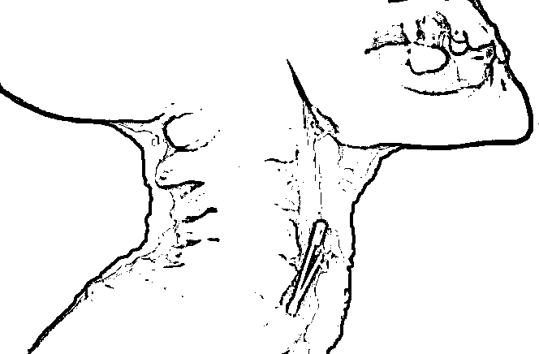
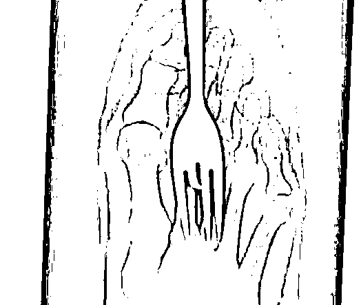

# 把 50cm“仙女管”塞进身体的女孩，到底是减肥还是自虐？

> 原文：[`mp.weixin.qq.com/s?__biz=MzIyMDYwMTk0Mw==&mid=2247546173&idx=1&sn=36cac80a3bf7e10e71d9b3f728639d7e&chksm=97cbfe05a0bc771361bce33b732f24ca8bde940d8aabd1d4af5f02c6470c716a32e9f76db0ae&scene=27#wechat_redirect`](http://mp.weixin.qq.com/s?__biz=MzIyMDYwMTk0Mw==&mid=2247546173&idx=1&sn=36cac80a3bf7e10e71d9b3f728639d7e&chksm=97cbfe05a0bc771361bce33b732f24ca8bde940d8aabd1d4af5f02c6470c716a32e9f76db0ae&scene=27#wechat_redirect)

最近一条有关于**“记者卧底仙女管销售群”**的消息登上了微博热搜，

很多人都一脸懵比？

仙女管 是什么仙女？

吃的还是玩的？

是化妆品还是护肤品？

而点开热搜之后，就更加让网友迷惑了。 

这一根根的管子，是什么东西？ 

为什么叫 **仙女管？而不是仙男管？**

要说“取名字”，某宝商家说第二，没人管说第一。 

为了规避违禁词，不知道从什么时候开始，他们就把这种用来“催吐”的管子称之为了 **仙女管。**

因为买家几乎全都是女孩，

**为了保持体形或是减肥**，便买来这种管子**催吐**。 

还有些商家取名为“兔兔管”

在说“仙女管”是如何使用，如何才能让人吐之前，先和大家科普一个知道了没什么用的知识点。

在美国，有一个叫做 **“美国消费者安全协会” **的机构，他们是专门管理消费者的一些人身安全，意外伤害的，简称**CPSC**。

他们有一套自己的检测系统，专门检测消费者因消费品产生的伤害。

他们每年都会公布在这一年之中，所有的伤害种类。比如因火灾、汽车交通事故、食品、玩具等产生的人身安全事故。

而其中有一项安全事故，被命名为“**入侵伤害**”。

**“入侵伤害”有很多种，正常的比如你吃鱼，鱼刺卡到了嗓子，这都算是入侵伤害。**

又或者一不小心，你吞掉了一个曲别针....

又或者使用餐具时，你的脚被叉子戳穿了...

但据统计，偏偏发生率最高的往往是一些非**正常**的入侵伤害，“残害”着全球的少年少女。

就比如这种........

这张图片大家应该并不会陌生，早前曾火爆网络。 

说是某地急诊来了位病人，直肠中塞进了“异物”，**但医生万万也不曾想到，异物居然是个灯泡。**

现在的年轻人想象力丰富，所做出的事情也是着实让人猜不透。

有些人为了满足自己的欲望，追逐刺激，不断向体内塞入各种让人大跌眼镜的东西，身体可谓是成了魔术师的百宝箱。 

只要你活的久，甚至可以在人体内发现巴斯光年。

这些非正常的“入侵伤害”，着实有点让官方头疼，这到底算不算入侵伤害.....？

说是伤害吧，可还是本人自愿的；

说不是伤害吧，但气氛烘托到这了，确实是入体了，也都进了医院。

由于这种非正常“入侵伤害”每年都呈递增的趋势，**甚至大大超过了正常的“入侵伤害”**，后来**“**CPSC**” **不得不把这种非正常的伤害也纳入了“入侵伤害”的队列中。 

但这个“仙女管”并不是用来“下体入侵”伤害的哈，而是嘴。 

之前和大家说过，尸哥以前饮食不规律，经常暴饮暴食，最后导致吃点东西胃就特别的涨，如果不催吐出来就会一直难受。

久而久之，根本都不用催了，只要吃的稍多一点，弯下腰就能吐出来。

2020 年下半年去检查了下，结果检查出了**胃炎，**胃**溃疡，反流性食管炎**。

其中这个**反流性食管炎**就是因为经常呕吐，食物反向流动，带着胃里的盐酸、胃蛋白酶、胆盐等物质伤食了管粘膜。

所以说，催吐伤害身体那是百分之一万的事情。

可就是有那么一个群体，明知道催吐伤身，依旧反其道而行通过催吐来达到他们减肥的目的。

他们认为，**“如果把吃的东西吐出来，那什么都没有吸收，就不会胖了。****”**

所以越来越多的女孩，开始加入了催吐大军。

而其中有一种催吐方式，如今居然发展成为了一条产业链。

为了能更好的达到催吐的目的，**有些商家生产出了一种叫“仙女管”的催吐辅助工具。**

名字乍一听起来似乎很美好，可了解到使用过程后就让人浑身不舒服。 

“仙女管”的使用方法野蛮且粗暴，

就是直接**把管子插进食道里，最终的目的是想插进胃中。**

可大部分人谁受得了这个啊？

尸哥做胃镜也是在全麻的状态下才下的镜，我可受不了活生生的把管子通过食道再插进胃里一顿搅和。

大部分使用“仙女管”的人，在刚插到喉咙的地方忍不住干呕就吐了出来。

**禁止效仿！！！**

如果你的食道能适应这种“仙女管”的话，商家还会指导你将管子的一端接上水管，另一端插进胃里。 

声称只有这样，才能把刚吃进去的食物全部催吐出来.....

上刑也不过如此了吧？

可在商家的描述中，这样做非但一点伤害没有， 

而且如果你的身体一旦适应，甚至连一点难受的感觉都不会出现。

轻轻松松就变瘦变美.....

真的是“良心”商家啊，为了利益满嘴胡言！

就是这样连蒙带骗，仅此这一个商家不到一个月就卖出了 200+的“仙女管”。 

累计评价更是上千条，说明至少卖出去了 1723 条管子，没评价或来不及评价的还不知道有多少。

用“仙女管”来催吐真的一点伤害都不会有吗？ 

当然都是扯淡的，不然尸哥是怎么患上反流性食管炎的.....

随着胃酸的反流，首先是伤害食道，然后就是会腐蚀人的牙齿，致使牙缝变大甚至把牙齿腐蚀掉。

长期催吐还会使身体的电解质失衡，代谢失调，从而导致身体发**麻发抖，脸变大甚至昏厥**。

在开篇的催吐吧中，催吐大军们称自己为“兔子”。

**“你是 sd 还是用 g”？**

**“我可以 zr”。**

这种外人看起来就像是火星文一样的缩写，在催吐吧中随处可见。

这是兔子们发明的“暗语”，用以抵制 **“外来入侵者”** 对他们过多的了解和窥探。

**流行在该群体中的三种催吐方式为 sd、g 和 zr：**

即手动（sd）--用手扣喉引发恶心呕吐反应；

用管子（g）--用胃管对食物进行导流；

自然（zr）--不需要借助外力食物就可以自然流出（不知不觉，尸哥已经达到 zr 的境界了）

此类贴吧共有**5 万多人关注！******500 多万**的帖子，共同话题只有一个：**怎么把吃进去的东西吐出来……****

****这里有教“兔子”们具体催吐方法的：****

****将食指戳进喉头；****

****边按肚子，边用手去拨小舌；****

******一般人选择食物的标准是好不好吃，而他们的标准是好不好吐**。****

********

****由于手背和牙齿长期摩擦，留下这种疤痕，是他们辨认彼此的专属标记。****

********

****催吐次数多了，喉咙敏感度下降，需要更大的刺激才能吐出来，这时就需要把整个拳头塞进嘴里才能刺激到喉咙。搜索关注“不惑先生”，一个让你睡不着觉的公众号。****

****有些人甚至连拳头刺激也吐不出来了，就会去购买那种“仙女管”，**把 50 厘米，大拇指粗细的管子插进胃里**。****

******去某宝搜“催吐”，无数店家在卖这种管子，看得人不由得胃部一抽。******

********

****从买家评论里也有不少人表示，自己催吐成功。****

********

****看着这些孩子炫耀自己催吐的效果如何如何好，真是替他们捏了把汗。**** 

****如果不是朋友及时提醒，尸哥也不知道我这吃多了就吐这个毛病，会慢慢的让身体垮掉。**** 

******很多人在网上写出了自己在催吐后身体出现了不适，想到就一阵后怕的经历。******

******比如拿东西都拿不起来，上楼都费劲******

************

******会昏倒******

************

******头晕目眩，身体无力，不听使唤。******

************

******急性肠胃炎******

************

******出血******

************

******有人曝光自己**使用无良商家卖的管以后，导致食道刮伤撕裂**。******

************

******在网上有一名“兔子”就说道，******

********进了这个坑的人，就希望别人不要进了。****但是他们却容易对此产生依赖性，难以戒掉这个习惯。********

**********一个催吐十一年后女生发帖说，自己几乎所有牙齿都坏掉了。**********

****************

********呕吐会带走大量的水分，破坏体内的电解质平衡，引发低血钾，轻则心律不齐，**严重的话还有可能猝死**。********

****************

********在催吐吧你可以看到，经常有人说自己催吐后出现了**手抖，呼吸困难**的状况。******** 

****************

********记得之前看到过一个新闻，女子有厌食症再加上过度追求瘦，变得只有 36 斤，催吐吐到牙齿都被胃酸腐蚀没了，几次休克濒临死亡。********

****************

********在休克被送到医院之前，她觉得自己没有病，不配合治疗，36 斤的体重在别人眼里是骷髅，可是她自己看来却挺好。********

****************

********北京大学第六医院的张大荣主任医师还曾表示：**在所有精神类疾病中，进食障碍死亡率最高，其中厌食症死亡率高达 5%-15%。**********

********是的，死亡， 也会如影随形。********

********如今社会的风气，胖成为了某种原罪，一胖就是丑，瘦下来就是脱胎换骨。********

****************

********18 岁到 20 多岁明明是女性一生中最花样的年华，但却被审美眼光折磨着，美好的青春就这么在减肥、反弹、再减肥中消失殆尽了。********

****************

********为了让自己变好看去减肥并没有错。********

********可是为了瘦，为了达到别人眼中的好看，不惜以自己的健康为代价，真的值得吗？********

**********这不是减肥，这是对自己的伤害。**********

********减肥方式千万种，为什么要选择最极端的那种呢？毕竟人生没有回头路可以走，健康也是。********

********爱美之心人皆有之，希望所有对自己身材不自信的女生，能勇敢接纳自己的不完美。********

********最后，还是希望这篇文章能够给大家带来些警示。********

********没有尝试过催吐的人，**不要因为图好玩或者好奇从而想要尝试，更不要抱着想轻松减肥的心态来实践，通过伤害身体来走捷径的话，身体最终也会“回敬”给你。**********

****************

********正在催吐的朋友，希望可以终止这种行为，然后去医院检查一下身体，看看在这催吐期间，对身体器官造成没造成影响。******** 

**********请大家一定要善待自己！**********

******来源：不惑先生******************

******欢迎关注灰产圈社群服务号******

************************

******← 向右滑动与灰产圈互动交流 →******

************