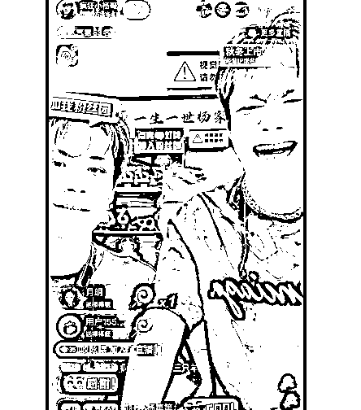
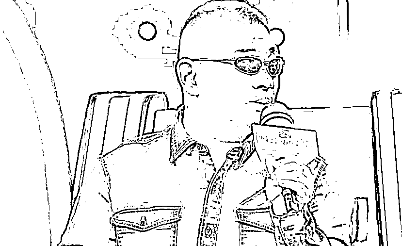
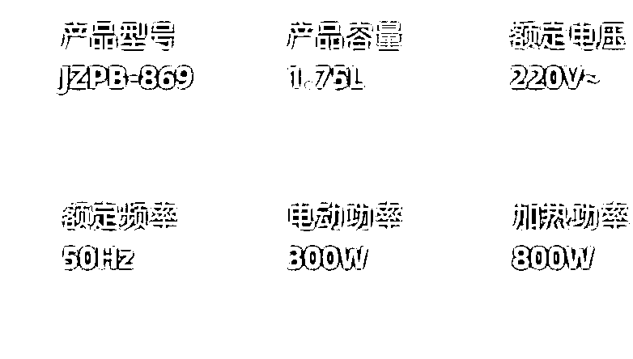
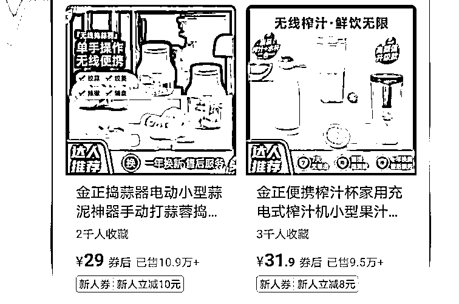
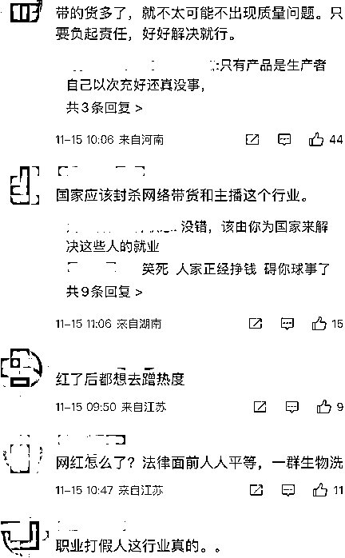
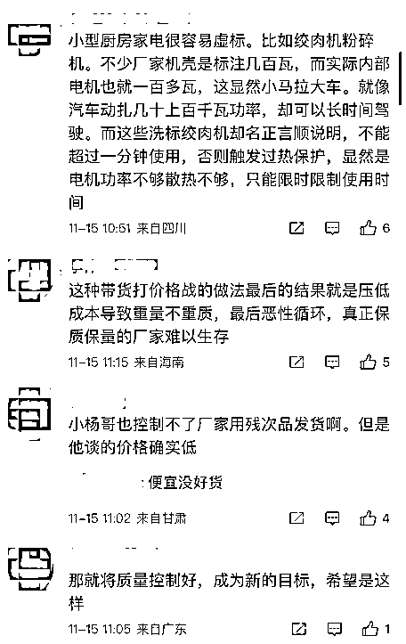
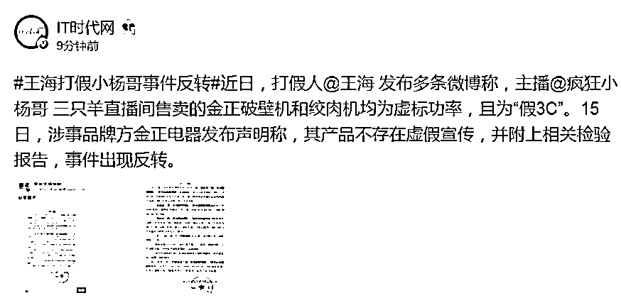

# 疯狂小杨哥遭王海打假事件迎来反转，品牌方突然发布声明

> 原文：[`mp.weixin.qq.com/s?__biz=MzIyMDYwMTk0Mw==&mid=2247546173&idx=2&sn=58104246b49e90ced35c5e7e5289f426&chksm=97cbfe05a0bc77131373c0fa26cd6f8dfb27434cbc9f0de1b481d1e76c19ac7e728d2bcc2935&scene=27#wechat_redirect`](http://mp.weixin.qq.com/s?__biz=MzIyMDYwMTk0Mw==&mid=2247546173&idx=2&sn=58104246b49e90ced35c5e7e5289f426&chksm=97cbfe05a0bc77131373c0fa26cd6f8dfb27434cbc9f0de1b481d1e76c19ac7e728d2bcc2935&scene=27#wechat_redirect)

抖音上粉丝数破亿，最近还斥资 1 亿元买楼的网红“疯狂小杨哥”，已经火遍全网。

**几近疯狂的暴力测试带货，加上超低“骨折价”与各式各样的赠品，一上架就被一抢而空。这些画面，不仅可以在直播中看到，更可以从各种小杨哥“分身式”切片视频看到。**

所谓直播切片，即是通过对网红直播片段进行二次剪辑上传到平台，进行带货。第三方数据显示，目前已有 2000 多人获得小杨哥直播切片授权，且小杨哥通过直播切片的分成收益，每月在 1600 万左右。

今年 9 月，苏州网友安安在某个宣称获得小杨哥授权的切片抖音号中购买了一个 70 元的无线蓝牙耳机，到手后发现，实物品牌与直播切片中宣传的品牌并不相符，品质也很一般。

“耳机延迟严重电流声明显，音质也不是那么好，我当时就退掉了。后来才发现这个账号根本没获得授权，卖的都是三无产品。”安安直言道。

**近日，又有博主发布了一则视频，质疑小杨哥带货的“云南本草”除螨喷雾是智商税，毫无效用。职业打假人王海在 11 月 13 日转发了该视频并表示，想维权的可以联系其助理进行报备。**

据抖音账号“疯狂小卖部（三只羊授权）”发布的视频内容，小杨哥在销售“云南本草”除螨喷雾时表示，该喷雾做过实验，在显微镜下面看螨虫，只要一喷该喷雾，螨虫就死了。

而该博主从小杨哥直播间购买了相关产品，并放出显微镜下除螨喷雾喷螨虫的情况。在其视频中，喷雾喷了两下后，螨虫依然在活动。他认为，这款除螨喷雾基本就没什么作用。

小杨哥团队授权账号链接的除螨喷雾店铺“YX 益鑫百货”客服称，此款产品有检测报告，“有效除螨 99%。”

“YX 益鑫百货”客服给出的检验报告首页显示，检验样品为“除螨喷剂”，委托单位为“青岛众祥环保科技有限公司”，检验项目为灭螨实验，检测结果为灭螨率 100%。

有记者询问其检验样品是否为“云南本草”除螨喷雾，该客服表示委托单位是厂家，“我们检测报告都有……不相信就不要买。”当被问到若产品无效如何赔偿时，该客服表示，有问题可以让购买的顾客联系他们。

**另外，11 月 13 日，知名打假人王海发布视频表示，小杨哥直播间售卖的金正破壁机和绞肉机均为虚标功率。其中，破壁机标注功率为 300W，实际仅为 105W，而绞肉机标注功率 300W，实际功率只有 120W。**

对于王海的打假，疯狂小杨哥目前暂未回应，但王海视频中出现的“金正小家电旗舰店”已将该产品下架。

针对被质疑虚假宣传一事，记者联系到店铺客服，对方表示，公司的产品均符合国家强制 3C 认证标准。电机标注的输出功率是指电机单独空载的功率，在整台产品中电机只是其中的一个配件，电机功率与产品整机的额定功率是不同概念。

客服解释称：“产品的额定功率是指由电机、齿轮箱、变速箱、切割刀片等在使用过程中的整体功率。该整体功率系由电机提供动力通过变速箱带动刀片而产生的功率。在产品运转过程中，电机的功率必然会因为受到阻力的增大而导致功率增大。因此，产品的额定功率会大于电机的输出功率。”

当被问到为何下架时，对方表示暂时无货，后续会恢复正常。

根据《中华人民共和国消费者权益保护法》第五十五条，经营者提供商品或者服务有欺诈行为的，应当按照消费者的要求增加赔偿其受到的损失，增加赔偿的金额为消费者购买商品的价款或者接受服务的费用的三倍；增加赔偿的金额不足五百元的，为五百元。

**从王海在视频中标注的信息显示可以看到，这款产品售价为 399 元，售出的数量为 6.8 万。假设按照退一赔三的标准来算，那么将赔付的总金额将高达一个亿。**

如若真的存在虚假宣传，主播和商家分别需要承担怎样的责任？需退一赔三是主播赔还是商家赔？

河南成务律师事务所合伙人律师戚谦表示，主播带货的产品存在虚假宣传的，主播和商家应承担行政处罚和民事赔偿等责任，履行退货或更换货物的义务；构成犯罪的，应依法追究刑事责任。对于情节严重的，商家可能被吊销营业执照。

至于主播是否担责的问题，律师称，主播是代言人的，需要与商家对买方损失承担连带赔偿责任。如果只是主播虚假宣传，应由主播向购物者赔偿；如果是主播和商家共同虚假宣传，双方应当共同赔偿购物者的损失。

对此，有网友称：“带货真的需要严格把控啊”“我经常在直播间买东西，突然觉得很容易踩雷”“主播带货，选品应该再认真一些”“卖的产品与实物不符就很过分”。

近段时间，打假事件持续发酵，不过，就在今天，该事件似乎迎来了反转。

**据最新消息，15 日，涉事品牌方金正电器发布声明称，其产品不存在虚假宣传，并附上相关检验报告，事件出现反转。**

来源：新行情 作者：张小磊

欢迎关注灰产圈社群服务号

← 向右滑动与灰产圈互动交流 →

