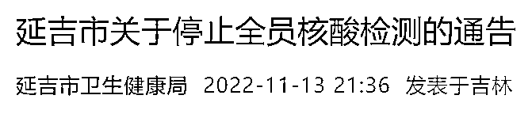
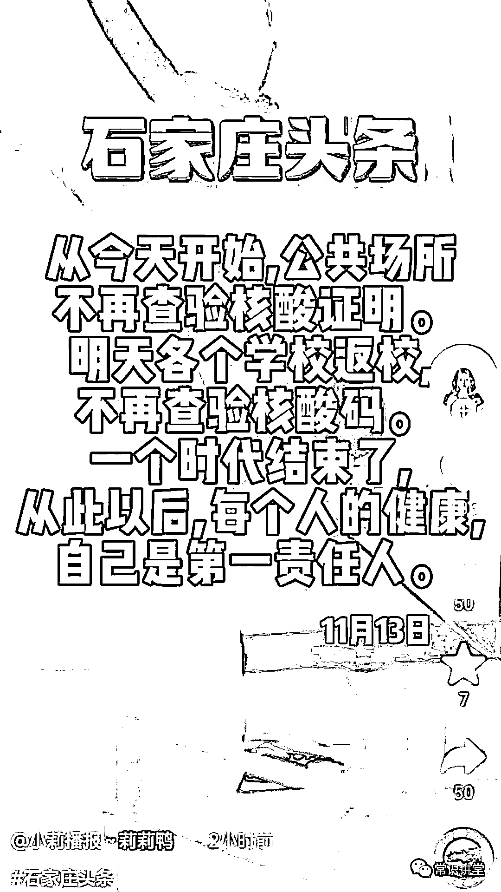

# 全国多地宣布取消全员核酸检测，石家庄全面解封，乘车不再查核酸

> 原文：[`mp.weixin.qq.com/s?__biz=MzIyMDYwMTk0Mw==&mid=2247546173&idx=3&sn=1974cbe4e522923b34356cbd06715084&chksm=97cbfe05a0bc7713c0765b8a95b4b7a7a86fb58e416d4cda98a88f15e13c8bb2832ec4bf010c&scene=27#wechat_redirect`](http://mp.weixin.qq.com/s?__biz=MzIyMDYwMTk0Mw==&mid=2247546173&idx=3&sn=1974cbe4e522923b34356cbd06715084&chksm=97cbfe05a0bc7713c0765b8a95b4b7a7a86fb58e416d4cda98a88f15e13c8bb2832ec4bf010c&scene=27#wechat_redirect)

上周五（11 月 11 日）中午，国务院联防联控机制公布了进一步优化防控工作的二十条措施。其中提到：

严格按照第九版防控方案确定的范围对风险岗位、重点人员开展核酸检测，**不得扩大核酸检测范围。****一般不按行政区域开展全员核酸检测**，只在感染来源和传播链条不清、社区传播时间较长等底数不清时开展。制定规范核酸检测的具体实施办法，重申和细化有关要求，纠正“一天两检”、“一天三检”等不科学做法。

据不完全统计，截至 11 月 14 日，**海南省三亚市、陕西省镇坪县、福建省福州市、江西省广昌县、安徽省太湖县、广东中山坦洲镇、吉林省延吉市、安徽省合肥市、吉林省长白山保护开发区、吉林通化山城镇**等多地都已积极调整，宣布取消区域全员核酸检测。

**海南三亚**

“20 条”发布当天，上周五（11 日）近 19 时，海南省三亚市防控工作指挥部发布“关于做好常态化核酸检测的通告（通告 2022 年第 230 号）”：为贯彻落实最新防控政策，**市防控指挥部（通告 2022 年第 228 号）不再执行。****2022 年 11 月 12 日按常态化开展核酸检测工作**，市民游客自行安排好时间，就近采样。

就在当天（11 日）中午近 12 时，三亚曾发布“市防控指挥部（通告 2022 年第 228 号），通知要求辖区内的全体居民、游客于 12 日（周六）到核酸采样点采样，对于未按要求参加核酸采样的人员，将被赋黄码。对拒不配合、无故不参加核酸检测，造成传播扩散的人员，将依法从严追究责任。

**陕西镇坪县**

上周六（12 日）凌晨，陕西省安康市镇坪县发布通告：**取消原定于 12 日开展的县城区第十六轮全员核酸检测。**

**福建福州**

上周六（12 日）下午，福建福州召开新闻发布会，通报防控最新情况。会上通报：当地调整区域核酸检测安排。鉴于仓山区尚未实现社会面清零，根据有关规定，11 月 12 日至 15 日上午 6:00—12:00，**仓山区每日开展区域核酸检测；鼓楼区、台江区、晋安区、闽侯县、高新区不再进行区域全员核酸检测**，但继续对重点人员按规定频次落实“应检尽检”“适时抽检”，鼓励广大市民“愿检尽检”。

13 日，福州召开新闻发布会宣布：国务院联防联控机制下发 20 条新措施后，该市迅速组织专家分析研判，加快做好原中高风险区调整、解除工作，截至 13 日下午 3 点，有 38 个高风险区降为低风险区，200 个中风险区取消。

**江西广昌县**

上周六（12 日）22 时许，江西抚州市广昌县防控应急指挥部办公室发布“关于取消区域核酸检测的通告”：鉴于该县 11 月 8 日-10 日三天区域核酸检测结果均为阴性，根据上级最新相关文件精神，经专家组综合研判，县防控应急指挥部决定**取消 11 月 13 日-14 日的区域核酸检测工作**。

**安徽太湖县**

根据安徽省安庆市太湖县政府网站 13 日消息，太湖县新冠防控应急指挥部办公室 11 月 11 日发出通知表示：**该县停止县域全员核酸检测工作**。

就在上周三（9 日），太湖县曾发布通告称：根据省、市防控应急指挥部相关会议要求，经研究决定，自 2022 年 11 月 10 日起，继续在全县范围内开展县域全员核酸检测工作。太湖县域范围内所有居民(包括本地常住人口、暂住人口、流动人口等)。按照三天一轮的频次开展全员核酸检测，第一轮检测时间从 11 月 10 日开始。

**广东中山坦洲镇**

13 日 18 时许，广东中山市坦洲镇新冠肺炎防控指挥部办公室发布通告：根据中山市防控指挥部的统一部署，坦洲镇**每周一次的轮动核酸检测停止**，便民核酸采样点正常开放。

**吉林延吉**

13 日 21 时许，吉林省延边朝鲜族自治州延吉市防控工作领导小组办公室发布“关于停止全员核酸检测的通告”：**延吉市于 11 月 14 日起停止全员核酸检测工作。**

****

****安徽合肥****

**14 日凌晨 0 时许，安徽合肥发布“进一步优化防控服务回复”时表示：**

**一直以来，合肥市防控都因时因势调整核酸检测频次，之前有 5 天一次、2 天一次、1 天一次等。目前，合肥全市进入常态化防控阶段，**原则上暂不再按行政区域开展全员核酸检测**，只在感染来源和传播链条不清、社区传播时间较长等底数不清时开展。**

****优化校园核酸检测频次**，大中小学（含中职院校）和托幼机构一般情况下每人每周动态轮检一次，重点人群核酸检测相关要求根据形势，由属地进行动态优化调整。**

****

****吉林长白山****

**14 日中午 13 时许，吉林长白山保护开发区防控工作领导小组办公室发布“关于停止全员核酸检测的通告”：**长白山保护开发区于 11 月 14 日起停止全员核酸检测工作**。如有变化另行通知。**

****

# ****吉林通化山城镇****

# **14 日近 16 时，吉林省通化市梅河口市山城镇发布“关于暂停常态化全员核酸检测”的通知：即日起，**该镇暂停常态化全员核酸检测工作**。**

****

**以下截图来自各媒体报道，以及网友反馈：**

**** **

来源：第一财经、大众日报、新黄河客户端、顶端新闻、常识讲堂** ****

**欢迎关注灰产圈社群服务号**

********

**← 向右滑动与灰产圈互动交流 →**

****