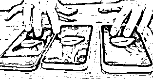
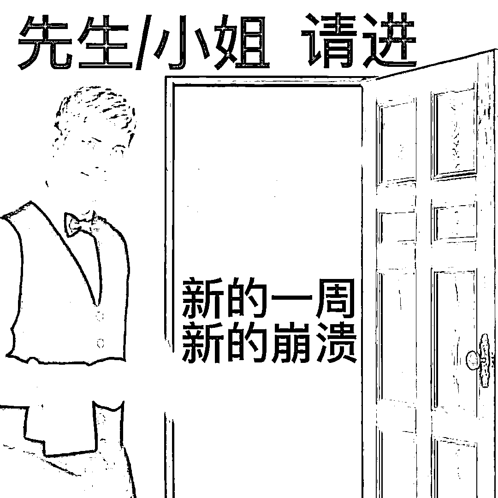

# 当代人的精神稳定器！电子木鱼爆火，每天敲一敲，功德+1！

> 原文：[`mp.weixin.qq.com/s?__biz=MzIyMDYwMTk0Mw==&mid=2247546173&idx=4&sn=be0d46cd87580533e8ce147f1f2db3a0&chksm=97cbfe05a0bc7713f0bcee2c72cb116b53b69d8ad10537bc0325f78622c6e4dfe3fab935f837&scene=27#wechat_redirect`](http://mp.weixin.qq.com/s?__biz=MzIyMDYwMTk0Mw==&mid=2247546173&idx=4&sn=be0d46cd87580533e8ce147f1f2db3a0&chksm=97cbfe05a0bc7713f0bcee2c72cb116b53b69d8ad10537bc0325f78622c6e4dfe3fab935f837&scene=27#wechat_redirect)

就问现在有谁还没敲过**电子木鱼？**

最近某天早上开晨会，公司三个同事不约而同敲起了木鱼。

脊梁看的满头问号：急需一键查询我司员工精神状况。 

同事反而吐槽我不懂行，这可是**当代精神稳定器**啊！！

烦心事特别多的时候，多敲几个也可以哈。

**敲电子木鱼，见数码佛祖。**

**取赛博真经，成机甲金身。**

平常发点疯怎么啦，马上就去敲电子木鱼赎罪，阿弥陀佛。

是这样的，敲敲木鱼功德+1，不仅可以去看地狱笑话，还可以为后面辱骂世界的一天积累功德。 

脊梁本来不理解，但尝试敲了敲电子木鱼，顿时感觉精神好多了。

好奇搜了一圈，差点没笑死，当下好流行电子修功德啊。

敲电子木鱼，我佛渡我，阿弥陀佛。

电子修行已经这么普及了吗：不仅有电子木鱼，还有**电子烧香。** 

炫酷的**电子念佛机**，氛围拉满。

**电子佛珠**竟然也有？？？

手机和平板，一个敲电子木鱼，一个烧电子香，再加一个配乐，齐活。

有的网友觉得，光敲电子木鱼是不是有点不尊重佛祖？

没事啊，也可以线上木鱼+线下电子钵双重修行，电子和实体的完美结合。

还有的网友很实际：不要积攒功德，我直接积攒存款！！

哈哈哈哈哈哈哈哈哈哈哈这真的不是私服外挂吗？？ 

没事的孩子，佛祖见多识广，不会跟你斤斤计较的。

实在担心的话，扣 1 佛祖原谅你，还会跟你一起积攒存款。 

说起电子木鱼的起源，要追溯到 2021 年。

当时某日本网友无意中看到了一个后面带有 USB 接口的木鱼制品，于是突发奇想研发出了一个木鱼外观的诵经提词器。

只要连上电脑接口，用棒槌敲打木鱼，屏幕就会自动显示出诵经用的经文。

后来，国内有位 up 主看到了日本网友做的电子木鱼，自己也开始照着做一个玩。

其他 up 主也受到启发，进一步改良电子木鱼。

最后逐步演变成现在流行的电子木鱼 app。

当你精神状态不好的时候，请拿出电子木鱼敲一敲，减少烦恼，增加功德。

来源：脊梁 in 上海 SH

欢迎关注灰产圈社群服务号

← 向右滑动与灰产圈互动交流 →

