# “家人们开窑了，原价 1299 现价 69！”

> 原文：[`mp.weixin.qq.com/s?__biz=MzIyMDYwMTk0Mw==&mid=2247546173&idx=6&sn=a913643d886309f957c0dc257126a1a8&chksm=97cbfe05a0bc77130217098be45d49973449c199a693f7ddfac97f7cf3510c6d157f3e7076d5&scene=27#wechat_redirect`](http://mp.weixin.qq.com/s?__biz=MzIyMDYwMTk0Mw==&mid=2247546173&idx=6&sn=a913643d886309f957c0dc257126a1a8&chksm=97cbfe05a0bc77130217098be45d49973449c199a693f7ddfac97f7cf3510c6d157f3e7076d5&scene=27#wechat_redirect)

**“开窑了，开窑了！”** 

**“看直播间的老铁们运气怎么样，只要有一点残次的我们都给砸掉哈”**

主播说着，捧出一摞尚未“开封”的匣体，据说内部装着刚“出炉”的建盏。

随后主播打开匣体，有瑕疵的建盏被几锤敲碎扔在一边。接着，第二只、第三只、第四只……

主播表示，“不是精品的，全是废品。”

随着主播手起锤落，一只只建盏被砸成碎片。

网友们纷纷在评论区心疼直呼——“别砸！给我！”。

等到终于出来一个十分完美的建盏时，直播间的老铁们再也憋不住了，不禁激情下单，“捡漏精品”。

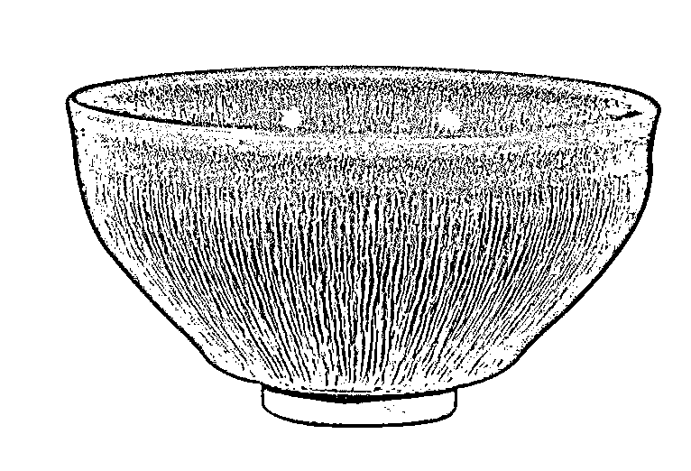

更何况，不要 998！甚至不要 99.8，才 69 块钱一个，下单的网友心想这波怎么也不亏呀。

几天后，建盏快递到了，下单的老铁们打开后傻眼了，这玩意根本就不是直播间里那么回事，**建盏色泽一般，连花纹都是歪的，做工更谈不上精致。**

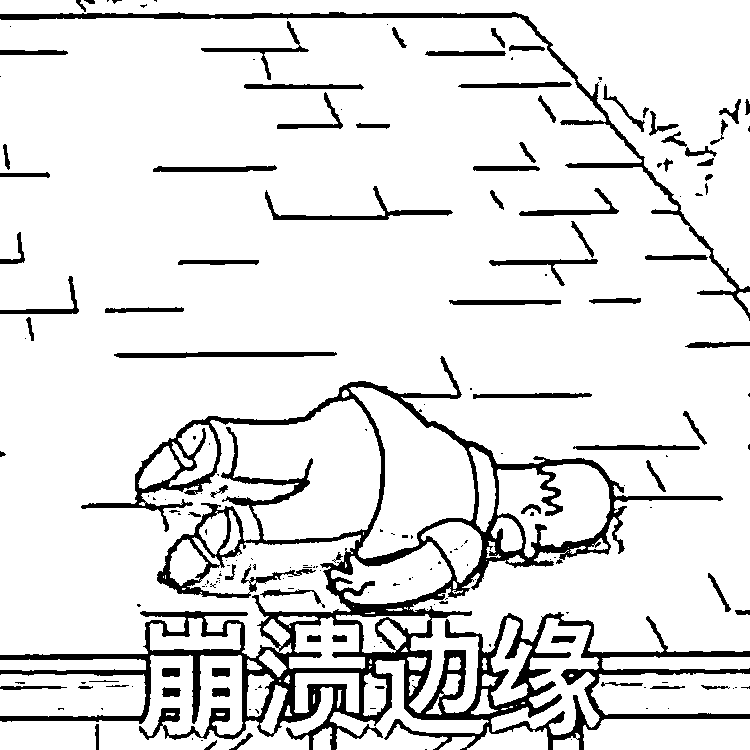

大家好，我是你们的小珊。

上述故事就是粉丝在后台跟我吐槽的一件郁闷事。

粉丝拜托小珊一定要揭露这种骗局套路，让世间少一些怨种。

于是小珊连夜查阅资料，发现这种建盏直播套路跟咱们之前盘点的玉石直播套路很相似。没看过的安友可移步文章看详情→（[*醒醒吧，翡翠和韭菜，一个颜色*](http://mp.weixin.qq.com/s?__biz=MzIyMDYwMTk0Mw==&mid=2247544328&idx=5&sn=152845eef7115897c8be7dde794f0b7e&chksm=97cbe530a0bc6c26a0be2a30198290c49c9ae61725ef4200503c9b5995e7f5fab1a4f06a2c58&scene=21#wechat_redirect)）

再说点让这位粉丝更郁闷的，小珊上网一搜，同样的东西，某些电商平台只要几块、十几块钱。

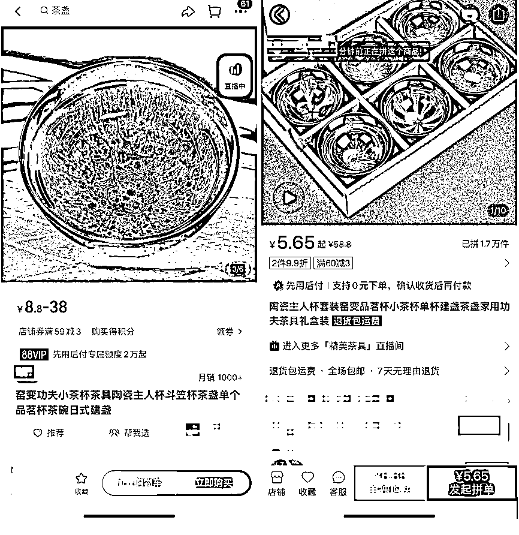

甚至，有资料表示，直播间那些砸掉的盏，基本上都是以每个 6 毛钱左右的价格批发而来。

可以说是是“冬日冰点价”了。

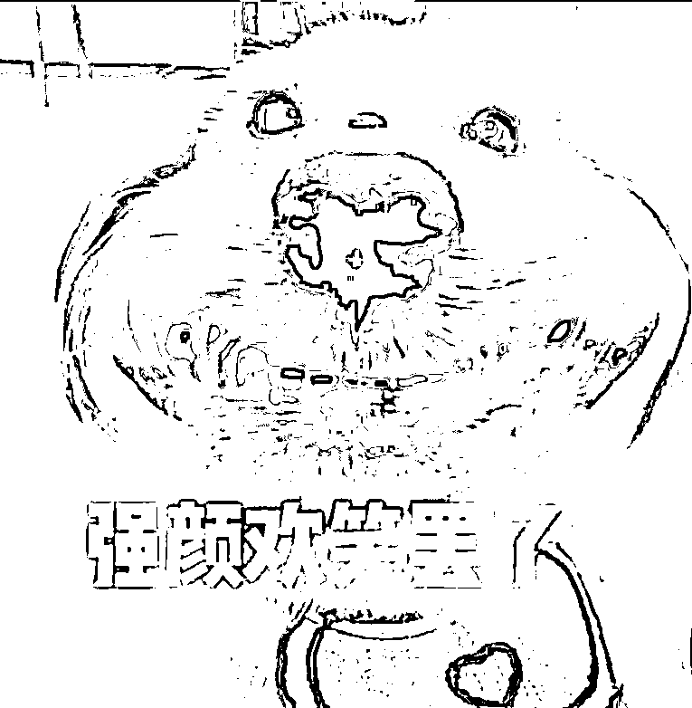

这里小珊先给大家普及一下什么是**“建盏”**。

建盏是一种黑瓷的代表性瓷器，创烧于唐代，因产自福建建窑而得名。

建盏以窑变著称于世，有着“入窑一色，出彩万千”的说法，并且由于无法掌控窑变的结果，导致建盏的成品率低，精品建盏更是珍贵稀有。

咱们再来说建盏直播套路，一般是这样的。

通常你点开直播，就会看到他们假装从自家窑内拿出一摞层层嵌套的烧盏匣钵。 

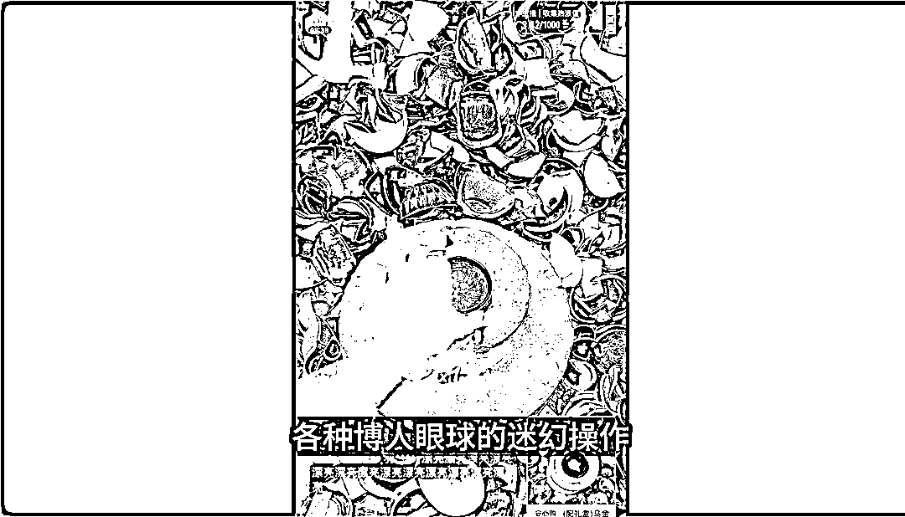

接着还不等你看清楚这盏的样子，**主播手起锤落，盏也变成碎瓷片。**

接下来连开几个也是一顿砸。理由不外乎就是这个有瑕疵，那个太普通，这样的剧情一般上演三四次后，接着看下去就能等到精品。

此时一旁的气氛烘托组就会看准时机把直播推向高潮，直播间终于有人按耐不住开始询问价格，于是主播开始故弄玄虚，把价格飙得很高，比如飙到一千多块钱，后面再告诉直播间的观众只需要几百块甚至几十块就可以买到。

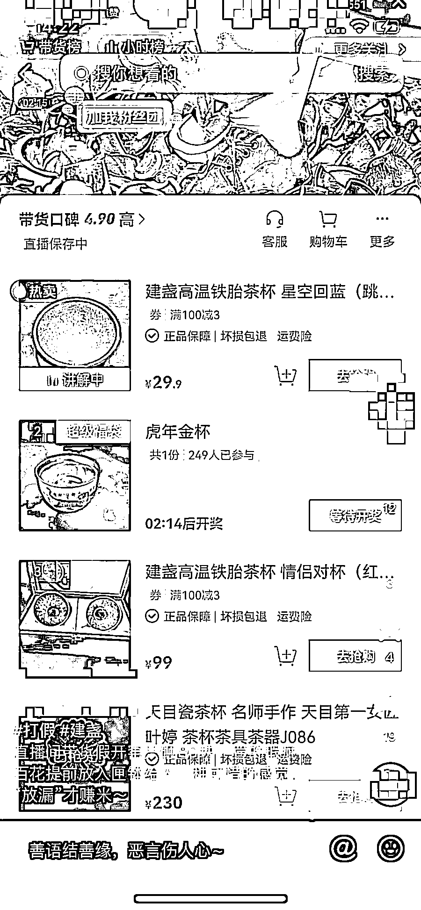

一顿操作下来，你说心动不心动！

冤大头们于是激情下单，买下这些所谓的“精品”。

<mpvideosnap class="js_uneditable custom_select_card channels_iframe videosnap_video_iframe" data-pluginname="videosnap" data-id="export/UzFfAgtgekIEAQAAAAAA7IEMK9N9dgAAAAstQy6ubaLX4KHWvLEZgBPElqNsATQNHMyCzNPgMItGmznnE2cX9wScLCkmq2i0" data-url="https://findermp.video.qq.com/251/20350/stodownload?encfilekey=Cvvj5Ix3eexKX1zo1IZZBrQomawdVfSQSzIWra3XwBomDD34pu3eb1cta6ibDh1JNNZtvuib45UJeXWmkVibSpJXlKBJiaVsFCA1uHov78nVDXwbiaia1icQNnSh4FxqSgich9xLRyZNmB7oWxw4ofY2CCcVkGM5Oh4RlQcZVmbMAICvvtk&amp;adaptivelytrans=0&amp;bizid=1023&amp;dotrans=0&amp;hy=SZ&amp;idx=1&amp;m=a67a5d0675b9010692ce954ee1555769&amp;token=AxricY7RBHdUYvsvYjuKK7MCzXfoxCRkgnQgHafchXh3dHmB4V8GX1zfha6rEaLPUTAcNJRUribiao" data-headimgurl="http://wx.qlogo.cn/finderhead/Q3auHgzwzM5CReJY1drCJLzBSIkkm44qViaCtyJ7AofzLUIJcia08Kdw/0" data-username="v2_060000231003b20faec8c6eb8a1fc5d5c602eb37b077a001744ec07d757e236480322e87a30d@finder" data-nickname="高新区华哥" data-desc="实地潜入揭秘“建盏”直播骗局" data-nonceid="8970535074476495069" data-type="video" data-authiconurl="" data-width="1920" data-height="1080"></mpvideosnap>

主播哐哐哐砸掉那些瑕疵品的成本，最终还是会从消费者那里讨回来。

总体来说，直播卖建盏的底层逻辑，就是卖货的人找到了低价供货渠道，主播砸盏吸引流量，水军评论区烘托气氛。

在某直播平台以关键词“建盏”搜索，相关用户数量达上千人，其中顶流主播的粉丝量达八十万，一晚上的销售额就能轻松达到几十万。

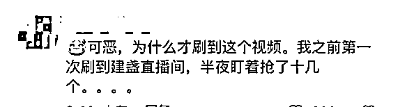

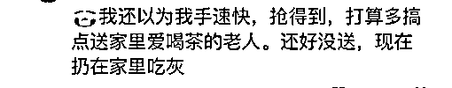

当然也有网友人间清醒，对这种建盏直播不感冒。

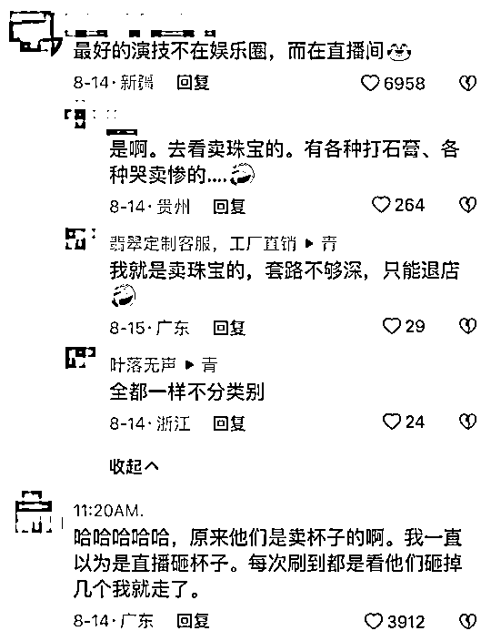

其实，抛开营销套路，有很多点还是可以看出它们点建盏并不是来自建窑。

建窑交通不便，**窑需要几天出一次，而直播是天天都在卖货**，成本和供应速度上对卖家来说都比较不便。

有网友分析，目前网络上兜售的建盏绝大部分都是工业品，赚的是流水线工业品卖出手工艺品价格的这部分认知。

而直播，赚的则是你永远不知道这种流水线产品的成本价格底线在哪里。

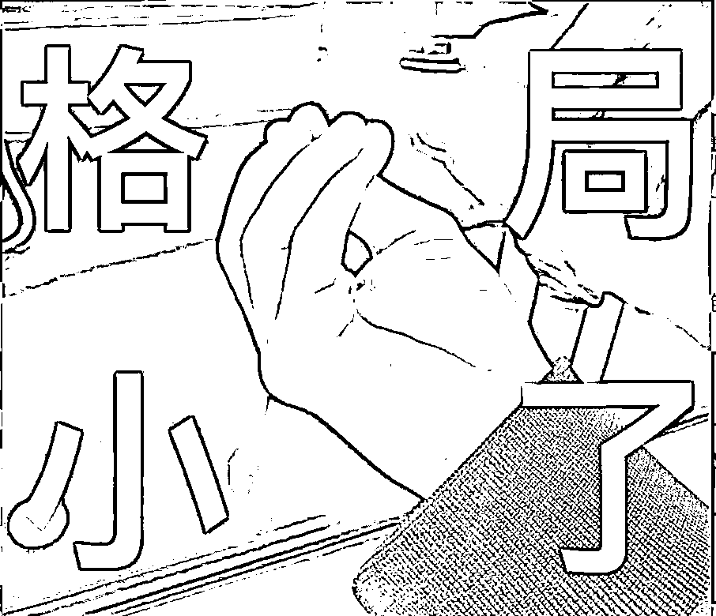

所以，**为什么继开翡翠、开玉石这种直播营销骗局之后，还是会有人前仆后继地上当？**

小珊觉得，这就是商家利用了人们喜欢**“以小搏大”、“贪便宜”**的特性。

**一千买不到的东西，一百可以买到。**

**一百买到的东西，有 80%的可能价值一万。**

你会不会心动，会不会赌一把，再加上一点饥饿营销，主播的促销表演，消费者很容易就激情下单购买了。

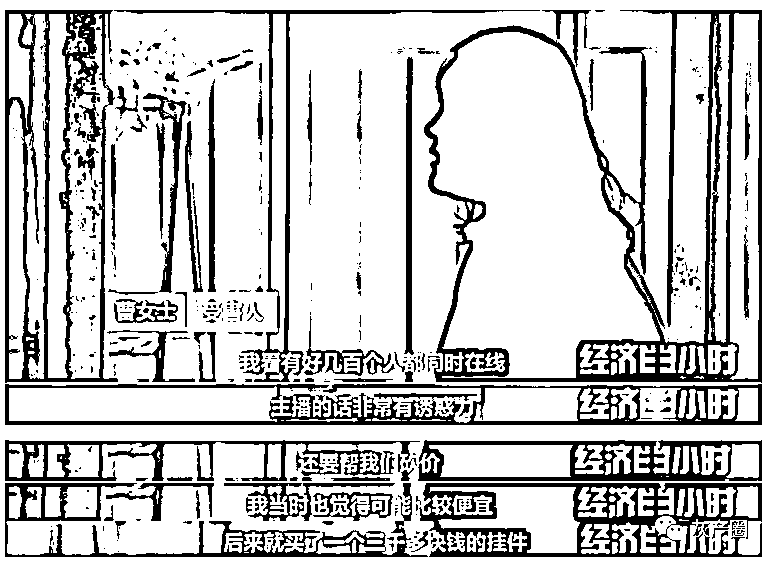

△图源网络

目前，那些在直播间下单买到残次品的消费者对建盏已经有一种不好的认知了。

建盏能发展至今实属不易，只希望这样一个有历史文化底蕴的产业，不要因为不良商家的逐利寒了消费者的心。 

也希望安友们擦亮眼睛，**不在这种充满表演和套路的直播间冲动消费，价格决定品质，一定要守住自己的钱袋子。**

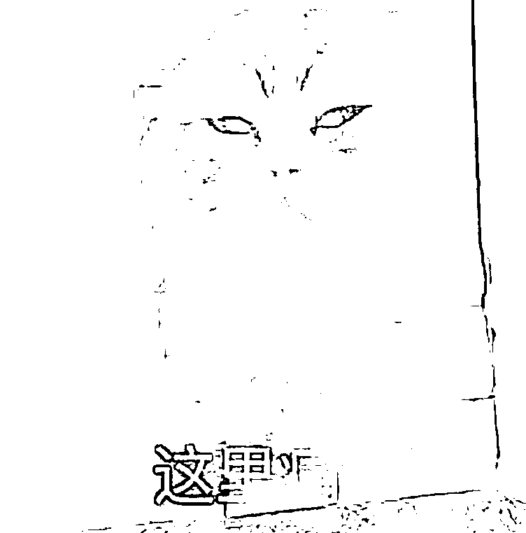

来源：微信珊瑚安全

欢迎关注灰产圈社群服务号

← 向右滑动与灰产圈互动交流 →

