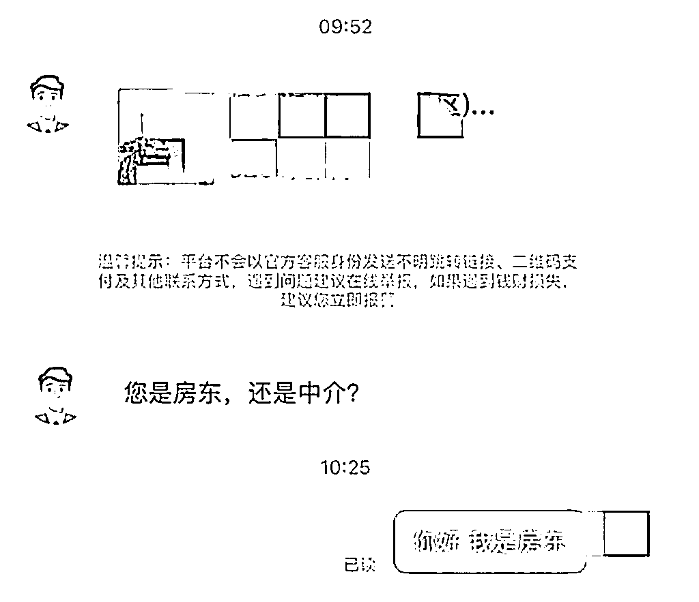
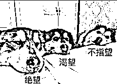
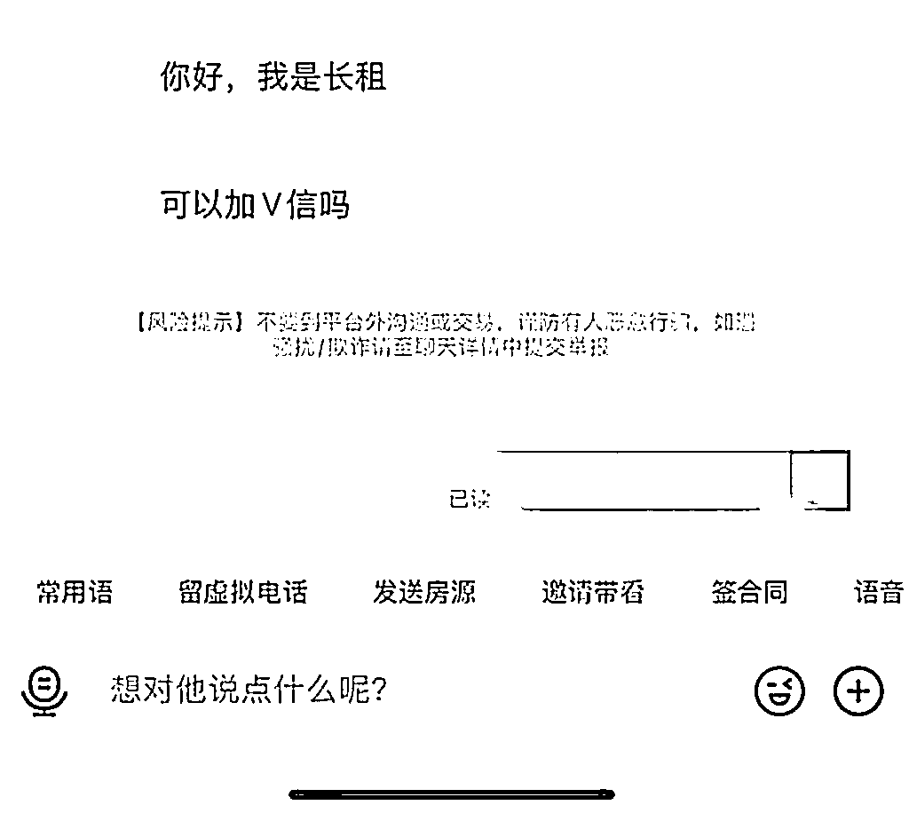
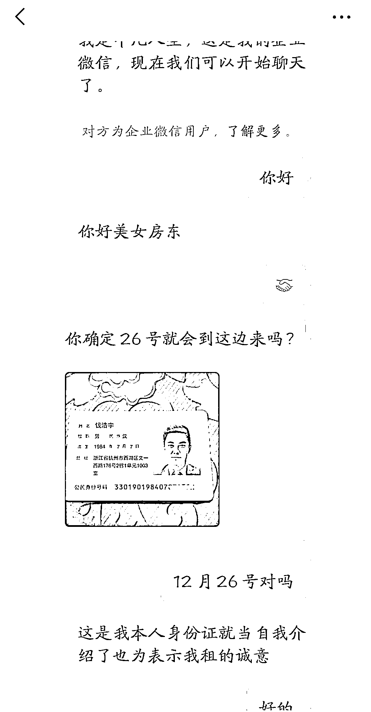
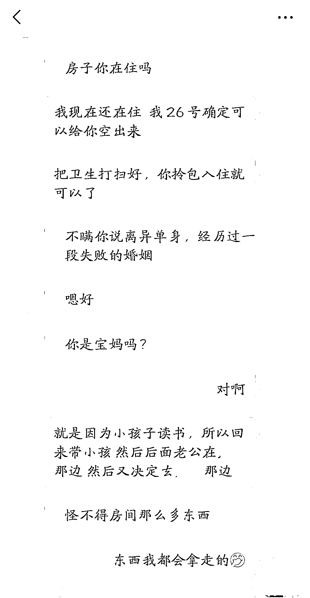
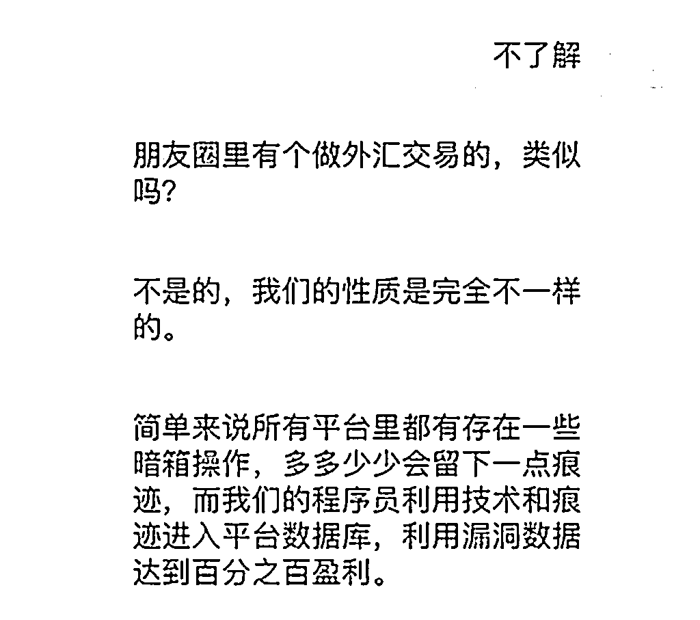
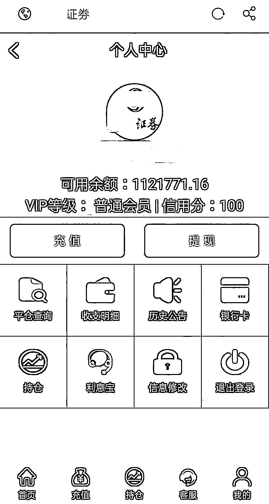
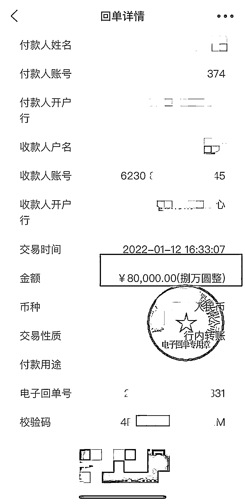

# 有房子要出租吗？“网络招租”房东被骗 490 万！

> 原文：[`mp.weixin.qq.com/s?__biz=MzIyMDYwMTk0Mw==&mid=2247546173&idx=7&sn=f4e8bb97e6f44e86189f9c9b03949e1f&chksm=97cbfe05a0bc77133452b5c2fd824e66fd2526da52ded744b01e1b359cea54b243dd24cbf2c3&scene=27#wechat_redirect`](http://mp.weixin.qq.com/s?__biz=MzIyMDYwMTk0Mw==&mid=2247546173&idx=7&sn=f4e8bb97e6f44e86189f9c9b03949e1f&chksm=97cbfe05a0bc77133452b5c2fd824e66fd2526da52ded744b01e1b359cea54b243dd24cbf2c3&scene=27#wechat_redirect)

**0****1**

**完美租客**

林女士家住山西太原市

计划将一套闲置住房出租

便在多个租房平台上发布了房源信息

由于地段不错

房子挂出去没几天便有不少租客咨询

虽然询价的人很多

但林女士却并没有草率出租

一方面是由于房子闲置已久

出租不急于一时

另一方面也是因为询价者不少

还价者也颇多

至于那些出价爽快的租客

要么是有特殊要求

要么就是租期太短

总之都不合林女士的心意

直到半个月后

「完美租客」终于出现了

这位租客先在平台上联系林女士

之后表示自己想要长租（三年以上）

希望能添加林女士的联系方式详谈 

租期长对于房东诱惑可太大了

所以林女士很爽快地留下了联系方式

这个租客很另类 

一上来没有问房子的情况

而是先发来自己的身份证件

林女士是个谨慎人

见对方直接大大方方地发身份证

内心就多了几分信任

初步确立信任之后

便是正常的关于房子信息沟通

这个过程中对方始终表现出

「完美租客」的形象

（身份信息为骗子盗用）

工作体面--**证券公司高管**

干净整洁--请阿姨搞定

租期问题--三年起步 

房租问题--绝不讨价还价

**无论林女士想要什么**

**对方都能完全符合**

**甚至还表现得更好**

两三天接触下来

林女士实在挑不出任何毛病

就等着签合同成就一段美好租客关系

然后奇怪的就来了

正常房东和租客之间

聊聊房租、水电、物业

撑死再聊个房价变化

股市发展、国际局势

然而这位租客却没来由地

和林女士聊起了**人生经历和婚姻状况…**

（尴尬的转折）

但是林女士当时并未多想

难得出现一个如此完美的租客

别说是跟我聊婚姻

就算是跟我聊数学我也能聊啊

知道得越多

林女士就自认为对对方了解越深

进而也就越发信任对方

殊不知这正是猎手一早布置下的陷阱

**02**

**金融猎杀**

经过长时间的接触

林女士和租客之间很微妙

尽管两人从没见过面

但双方都自认为十分了解对方

这天租客照常给林女士发消息

但内容不再是家长里短

而是告诉林女士一些了不得的东西

他发现了证券交易的漏洞

在特定时间进行特殊操作

就能稳定升值

他赶紧把这个好消息告诉林女士 

林女士听得云里雾里

只知道对方有一个稳赚的路子

 

又过了几天

租客突然发了一条特别急的消息过来

大概意思是说他今天有些事无法操作

想请林女士替他操作 

之后便发来链接和自己的账号密码 

林女士想着操作也不难

就用对方的账号密码操作了一遍

**结果果然涨了 5%左右**

**短短十几分钟就赚了好几万元**

这下林女士按捺不住了

主动询问对方是如何做到的

自己能不能做到？

林女士开始跟着“朋友”一起投资

在不到一个月的时间里

向骗子**转账 50 余次**

**金额共计 504 万元**

尽管期间提现了 12 万元

**但依然损失了****490 万元**

（像这样的转账有 50 多笔）

复盘这起骗局 

房东和“租客”天生就有

聊天、商讨的必要

不像一个陌生人突然加你

想要和你聊婚姻工作

还需要前期大把的时间带入话题

一上来就能和“高净值”房东聊话题

这条路子果断被骗子盯上

被骗的受害人不在少数

**反诈君想说**

骗局不是一成不变的

今天他们将目标放在租房房东身上

明天也有可能放在其他群体之上

面对日新月异的新型骗局

所有人都应该提高警惕

来源：黑白呸，南通反诈，天下有诈

欢迎关注灰产圈社群服务号

← 向右滑动与灰产圈互动交流 →

