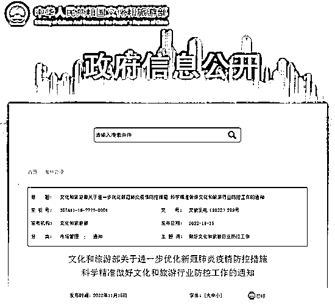

# 张文宏发声

> 原文：[`mp.weixin.qq.com/s?__biz=MzIyMDYwMTk0Mw==&mid=2247546232&idx=1&sn=035abc1e4d45d40cf62109aa2e1612af&chksm=97cbfe40a0bc775684d49045ccfd6b1c943d68fff0b09d78c5433347da105d27df11b2237ff8&scene=27#wechat_redirect`](http://mp.weixin.qq.com/s?__biz=MzIyMDYwMTk0Mw==&mid=2247546232&idx=1&sn=035abc1e4d45d40cf62109aa2e1612af&chksm=97cbfe40a0bc775684d49045ccfd6b1c943d68fff0b09d78c5433347da105d27df11b2237ff8&scene=27#wechat_redirect)

**关注备用号，谨防失联！**

**01**

张文宏终于发声了！

11 月 14 日，在 2022 年上海国际生物医药产业周会议开幕式上，针对疫情他说：

“我们内心非常清楚，**最终走出疫情看的肯定是科技**，但现在生物医药所做的这些贡献是不是已经提供了充足的支撑？我们**相信中国是有能力来支撑我们整个抗疫，走出疫情。**”

印象中，已经很久没有听到张文宏的发声了。

上次他被媒体关注，已经是很长一段时间之前的事儿了。

因为他“与病毒和谐共处”的论断，被不少人骂成“投降主义”，遭到了包括大人物在内的很多人强烈批评和反对。

随着时间的推移，实践的经验积累，现在回头看看张文宏的判断，不知道当时那些批评的人会作何感想呢？

当然，时也势也！

我无意于评判批评者和被批评者孰对孰错。

但当时他有一句话，我一直深深地赞同：

**抗疫不是目的，老百姓的安定才是目的！**

**02**

《易经》里面有句话：

易，穷则变，变则通，通则久。

意思是说： 

当事物发展到某种程度的时候，就要想到要加以变化，以求通达。

也就是说，人们在处于困境到一定程度的时候，就会设法改变现状以求发展。

不得不佩服古人的智慧。 

用这个卦辞来看当前的疫情防控形势变化，也有一定的启迪。

经过三年的苦战，天下苦疫情久矣！ 

在这漫长的三年时间里，困境一直在，但一些重要的矛盾条件却也在悄然发生着重要变化。

**一方面，病毒自身在不断弱化。**

张伯礼院士说：

“从病毒进化规律推测，新冠病毒趋于稳定、毒力趋弱的概率大。”

我相信张院士的判断是基于事实和科学依据的。

不妨看看最近广州在疫情方面的的数据。

作为常住人口超过 2000 万的超级大都市，自 10 月 22 日以来，广州累计报告新增感染者 33166 例，无一重症或危重症。

不仅是广州，10 月下旬以来，福州、重庆等地出现的本土疫情同样是由传播力更强、传播速度更快的奥密克戎变异株 BA.5.2 进化分支所引起的。

但在日增新冠感染者数量出现较大波动的同时，感染者症状均较轻。

整体上，跟三年前新冠病毒恐怖的重病率和致死率相比，这种变化是重大的。 

**另一方面，通过提高全民疫苗接种率，对病毒侵害的抵御能力得到大大增强。** 

根据国家卫健委的统计数据：

我国疫苗全程接种率为 89.7%，加强免疫接种率为 71.7%。

老年人方面，60 岁以上至少 1 剂次疫苗接种率为 89.6%，全程接种率为 84.7%，加强免疫接种率为 67.3%。

全国累计接种 344120.5 万剂次！

这些数字的背后，蕴含的是未来打赢这场战疫的重要条件。

**03**

必然的变化和调整，必须适时而行。

“二十条”之后，全国各地也都在不断调整政策，落实疫情防控新规定。 

石家庄打响了第一枪，在防疫政策上大步进行了调整，取消免费核酸检测、不再查验核酸证明，课堂复课，工厂复工； 

河南洛阳出台新政，除重点单位外，取消查验 48 小时核酸检测阴性证明；

上海不再按行政区域开展全员核酸检测； 

海南三亚在“二十条”发布当天，旋即取消了原定于当天的“核酸检测”工作部署；

新政发布之后，广州更是立即有序解除 5094 名本地密切接触者和 7252 名入境人员，解除 16527 名次密接隔离者；

安徽合肥，曾经怒斥不良核酸检测机构的合肥市委书记虞爱华，在合肥市第 116 次疫情防控工作会议上说：

**婚宴应办尽办，这是新人的大事，也是全市的喜事，倡导婚事新办、喜事简办，不搞大操大办，响应“光盘行动”，把喜事办得更喜庆。**

****

…… 

变化，正在进行中。 

天下人苦疫情久已，也苦不能正常工作、学习和生活的日子。 

房贷车贷的压力，各种匪夷所思的篓子；

眼睁睁流逝的光阴，错过的春花秋月，夏荷冬雪……

人们都回念疫情前，那种平平常常普普通通的日子。 

**疫情三年，人心思变。**

所以，“二十条”新政之后，文旅部发布《关于进一步优化新冠肺炎疫情防控措施科学精准做好文化和旅游行业防控工作的通知》。

明确要求跨省旅游取消“熔断机制”，经营活动不再与风险区实施联动管理；

跨省游客凭 48 小时内核酸检测阴性证明乘坐跨省交通工具；

加大层层加码问题整治力度等。

…… 

**话音未落，搜索跟团旅游的人数暴涨 600%。**

**04**

**黎明前的黑暗，最难将息。**

尽管目前疫情防控形势压力还很大，社会新增还在增加，但要相信国家对疫情防控形势整体的把控和研判。 

从目前的情况来看，国外很多国家对待新冠疫情都已经采取了躺平策略，这势必会对中国疫情防控产生很大压力。 

未来，随着科学技术的进步，国内群体免疫防控的加强，这种压应该会逐渐减小。

但也要在客观上认识到，要想彻底铲除病毒，做到社会上不出现一例病例的可能性，现在看来基本不太可能。

因此，我们应对疫情的方式也是时候做出必要的调整。

**再借用一下张文宏的发声：**

******疫情不会终止，但我们都盼望过上正常生活。******

******** ****最后，改变不是“放开”，更不是躺平。******疫情防控压力还有，新增病例也还会有。****接下来，借用石家庄公开信中有一句话：******每个人都是将自己健康的第一责任人！******那么，怎样做好这个“第一责任人”呢？****我们的目标也非常明确：******能不被感染就不被感染，能少被感染就少被感染。******1.疫苗。****2.常备药。****3.戴口罩。**

****共历寒冬，守望春天！****

**作者：擎苍太守，在下刘三刀**

****

**欢迎关注灰产圈社群服务号**

********

**← 向右滑动与灰产圈互动交流 →**

****