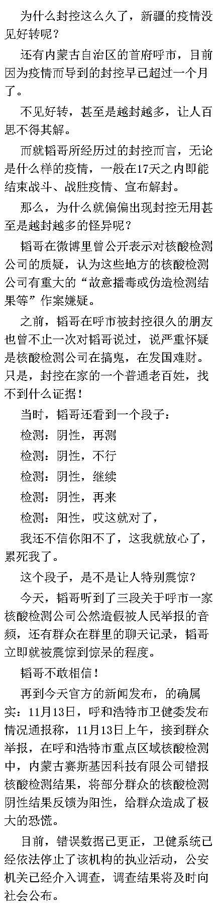
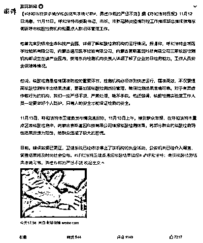
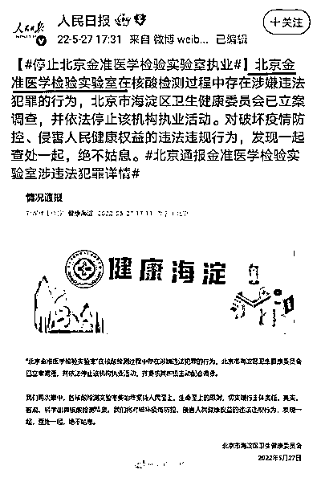

# 越封越多的原因找到了，果然有核酸检测公司在搞鬼！

> 原文：[`mp.weixin.qq.com/s?__biz=MzIyMDYwMTk0Mw==&mid=2247546232&idx=2&sn=30fa3be4ebe4a0753135f4d20b201d8d&chksm=97cbfe40a0bc7756177a1c5784e3169440210fe509d0eca891549b0d28f3377b3af60b728276&scene=27#wechat_redirect`](http://mp.weixin.qq.com/s?__biz=MzIyMDYwMTk0Mw==&mid=2247546232&idx=2&sn=30fa3be4ebe4a0753135f4d20b201d8d&chksm=97cbfe40a0bc7756177a1c5784e3169440210fe509d0eca891549b0d28f3377b3af60b728276&scene=27#wechat_redirect)

**关注备用号，谨防失联！**

新疆疫情防控多久了？很久很久了！

网上有新疆网友发布的窗外的风景与汽车，说原地不动的汽车过了两个季节。

如果按这个博主的爆料，那么这个赛斯公司就是在有意制造大规模的感染与扩散，就是想发国难财。

昨天下午 5 时 58 分，澎湃新闻发布的 11 月 11 日的新闻，让人觉得意味深长。报道中提及“呼和浩特金域医学检验所有限公司、内蒙古谱尼医学检验有限公司、内蒙古赛斯基因科技有限公司三家核酸检测机构都设立在该产业园内”。

而昨天的最新消息，是说“自治区疫情防控指挥部下沉到呼和浩特市统一指挥、统一调度，动用全区的人力、财力、物力，采取一切能采取的措施，尽快扭转局面。根据工作需要，抽调机关干部支援抗疫，干部下去后既当指挥员又当战斗员。呼和浩特市各级干部要听从命令，服从指挥。”

也就是说，这是呼市被内蒙古自治区直接接管的节奏啊！

韬哥为什么会对长期封控而无效果的地方怀疑是核酸检测公司在作鬼呢？当然是因为这种伤天害理、祸害国家的罪恶，已经多次上演了。下面，韬哥为大家盘点一下。

第一起：今年 2 月，郑州金域临床检验中心有限公司故意传播病毒被查，区域负责人被警方刑事拘留。 

第二起：4 月，合肥和合医学检验实验室，合肥诺为尔医学检验实验室故意出具假阳性报告，却仅被停止合作。

第三起：5 月初，上海中科润达核酸检测在同一小区同一天测出 13 个假阳性。

第四起：5 月 21 日，北京“朴石医学检验实验室”因涉嫌妨害传染病防治罪被北京警方立案侦查，并对实验室实际控制人周某某（男，38 岁）、法定代表人武某某（男，37 岁）等 6 人依法采取刑事强制措施。

第五起：5 月 27 日，北京金准医学检验实验室“在核酸检测过程中存在涉嫌违法犯罪”、“破坏疫情防控、侵害人民健康”，被北京海淀区卫生健康委员会立案调查，停止执法活动。

第六起：9 月 24 日，石家庄和合医学检验实验室检出阳性却故意隐瞒不报造成疫情扩散，因涉嫌犯罪被石家庄警方立案侦查。

第七起：11 月 10 日，昆明寰基医学检验所在核酸检测采样过程中“弄虚作假，出具虚假报告”，昆明市卫健委对该所立案调查。

内蒙古赛斯基因科技有限公司，这已经是至少第 8 起了！

这里，韬哥想起身边的很多朋友曾说过的话，说希望国家能早日把核酸检测全部收归政府，不能再放给第三方，特别是不能放给资本。

因为，“如果把下雨的权利交给卖伞的人，那么我们永远不可能再有晴天”。

认真反思这 8 起在核酸检测中造假以图大发国难财的第三方机构，除了是个人所有，就是资本。

来源：韬闻  作者：闻韬

欢迎关注灰产圈社群服务号

← 向右滑动与灰产圈互动交流 →

