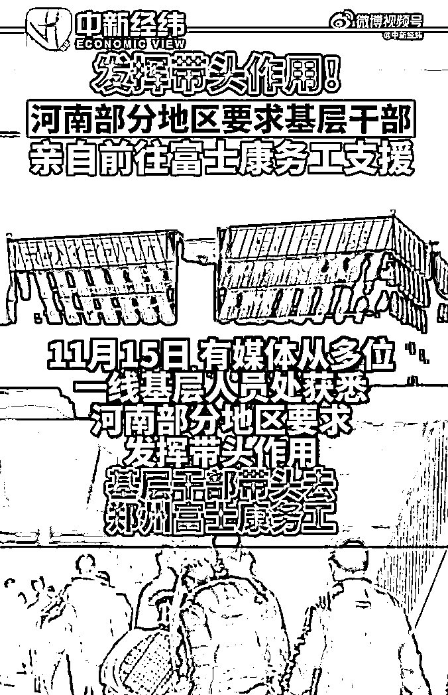
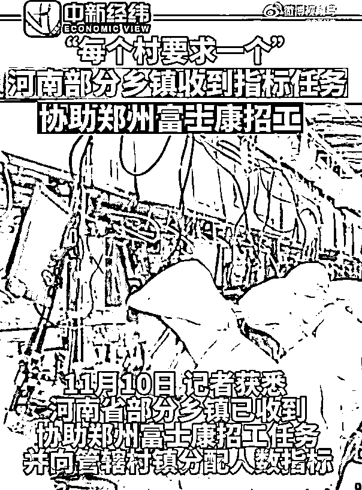
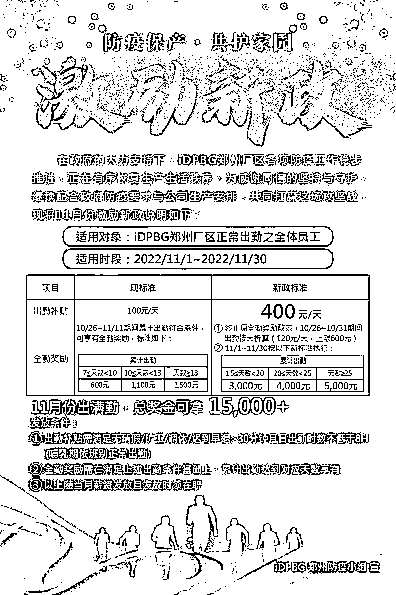
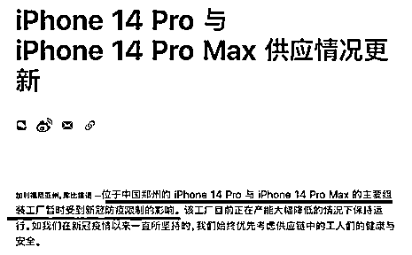
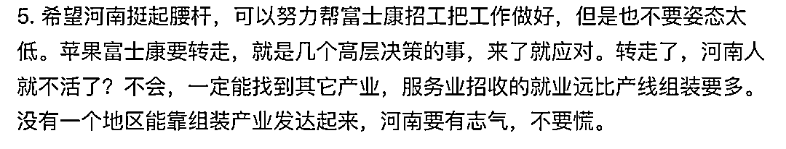
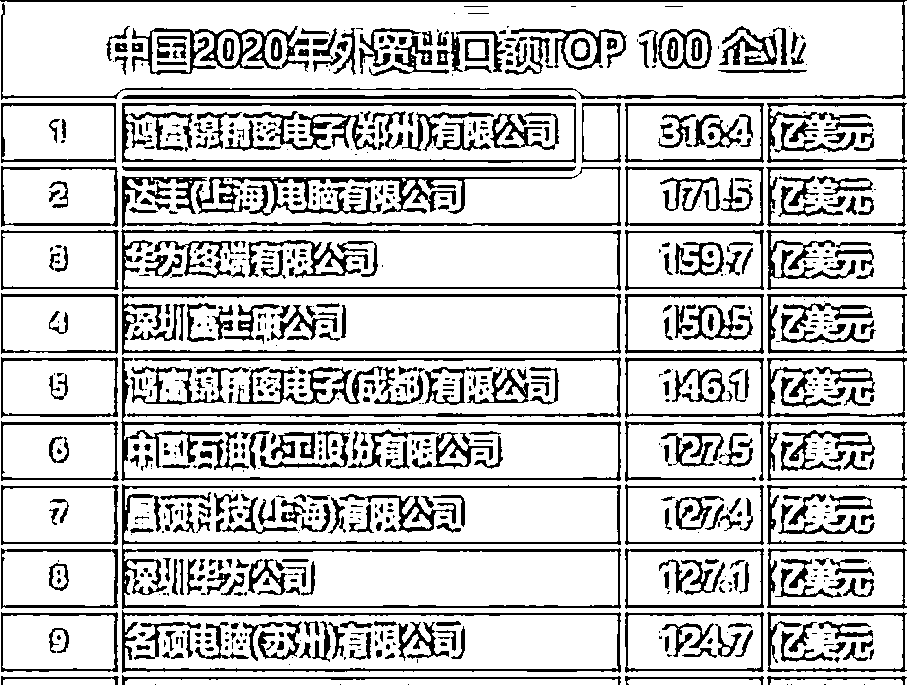
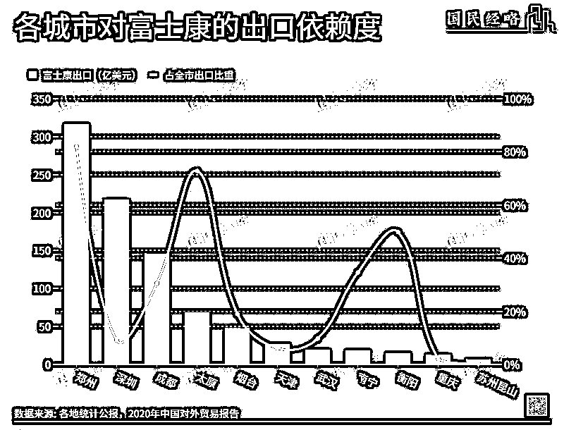
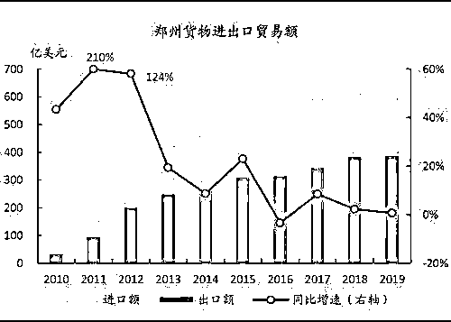
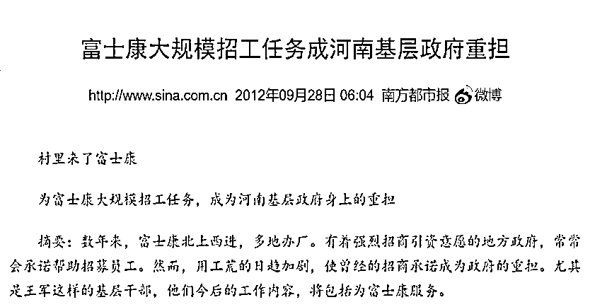
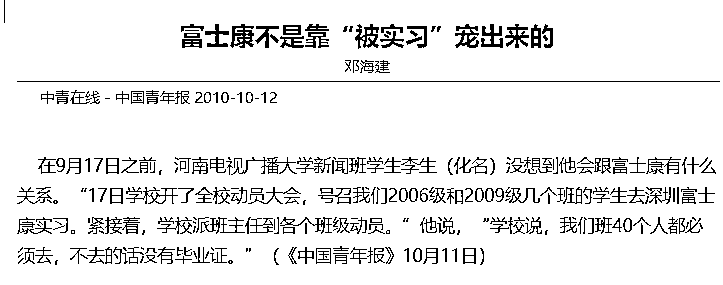

# 支援富士康，郑州有多猛？

> 原文：[`mp.weixin.qq.com/s?__biz=MzIyMDYwMTk0Mw==&mid=2247546232&idx=3&sn=d077f2049556fadbbc104424757687a9&chksm=97cbfe40a0bc7756d8f8f7a263545f4572fadb5d2b0b4ef119ef11b45b692bb5f9015770c249&scene=27#wechat_redirect`](http://mp.weixin.qq.com/s?__biz=MzIyMDYwMTk0Mw==&mid=2247546232&idx=3&sn=d077f2049556fadbbc104424757687a9&chksm=97cbfe40a0bc7756d8f8f7a263545f4572fadb5d2b0b4ef119ef11b45b692bb5f9015770c249&scene=27#wechat_redirect)

**关注备用号，谨防失联！**

郑州富士康又站上了风口浪尖。

有媒体报道，河南部分地区要求基层干部去富士康务工，务工期限 1 到 6 个月不等。

后台有朋友留言，他差点被叫去。

十几个“哈”并列在一起，不知道是一种什么心情。

富士康在河南招工的新闻，也不是第一次登顶热搜了。

一周以前，河南一些乡镇就收到了协助郑州富士康招工任务。

有人匿名接受采访，说自己那“目前每个村要求一个。” 

两条新闻连在一起，可以看出自从 10 月底的那次事件后，富士康现在人手有多么短缺。

都说没有什么事是不能用加钱来解决的，如果有，就多加几次。

当时富士康就呼吁员工留在厂里自我隔离，只要留下不上班一天也给 300 块。

如果是老员工返厂，重新入职后一次性给 500 元。

要是还能干活，一天补贴 400。

这样算下来，一个普通的工人，一个月的满勤奖金就能拿 1 万 5，加上基本工资，破 2 万都不是问题。

重赏之下的确招了不少新员工，已经来了 3 万多人。

可现在富士康至少还有 7 万的人员缺口。

（来源：中国慈善家杂志）

为啥富士康现在急需这么多人？

苹果最新发售的 iPhone14，可不是凭空变出来的，大部分都要靠郑州富士康来生产。

11 月 6 日苹果发布了一条声明，因为郑州富士康产能大幅降低，iPhone 14 出货量估计大概八成是不能达到预期了。

如果这批货完不成，那么很有可能未来人家就把订单交给别人了。

订单一旦流出去，郑州富士康想要再拿回来，恐怕就有亿点难度。

所以这批货物对郑州，乃至整个河南出口的重要性是不言而喻的。

当然，我也看到不少人说，订单转走了，河南人就不活了？

还有朋友认为富士康是低端加工，少了不疼不痒，自然有人顶上。

说的简单，做起来难啊。

这两年，郑州经历了 720 特大洪水、烂尾楼的危机、村镇银行的风波，冲击不可谓不小。

而郑州经济极其重要的出口，富士康是最大头。

2019 年郑州进出口总额 4130 亿元，富士康占了 82%，同时也占了河南总进出口额的 65%。

2020 年，它依旧占了河南出口的半壁江山。

而今年的占比只多不少，特别是当下，像富士康这样能挣钱的企业太少了。

当年为了让富士康来这里设厂，河南和郑州省市两级合力，开出了 15 亿美元建厂补贴的筹码，同时还承诺投产后前五年免企业税和增值税，后五年减半。

也就是说，富士康开始全额交税，是从这两年才开始的。

但河南和郑州一点都没亏。

2010 年，富士康正式在郑州建厂投产，郑州的出口贸易额仅 2 年就翻了 5 倍，从 34.56 亿美元暴涨至 202 亿美元。

2011 年，郑州电子信息产业总体规模不到 200 亿元，到了 2021 年已经逼近 5000 亿元。

以及最重要的就业问题。

在 2010 年以前，河南省农村劳动力大部分都到珠三角或长三角打工，而富士康设厂后，一年内就有 24 万人从省外转移到河南省内。

富士康背后，还有许多关联配套企业，是一整个庞大的产业链。

再算上周边的服务业，至少解决了几百万的就业岗位，这些人在河南消费在河南纳税，河南从财政到整体经济都从中受益。

不过很有趣的是，在富士康最开始在郑州设厂的两年，招人并不顺利。

为了给富士康招够工，当时河南上下都在想办法。

比如内黄县就接到任务是招工 1000 人，县领导亲自挂帅，进行了一场“全民总动员”。

有些地方完不成，不得不花钱雇人去参加富士康的体检。

而河南上百所职业技术学校都被动员了起来，南下深圳富士康实习。

学校表示：“要在这群实习的学生中，培养出未来郑州富士康的骨干。”

虽然学校都强调了“自愿”，但很快就有学生称，他们要整班整班地去富士康工厂，一个都不能少。

回到这次富士康招工的争议，富贵我觉着，按照客观的经济规律，劳动力供应紧张，会导致工资的上涨。

对于普通工人来说，这时候是要求提高收入最好的契机。

富士康现在的待遇还找不到人，也可能是待遇还不够。

市场经济，就应该是市场说了算。

最后，说一点我个人的不成熟见解。

看大伙争论来争论去，有人坚持认为河南不能没有富士康，有人则一口咬定说富士康离不开河南。

这其中的逻辑很有意思，要么是没了 A，B 就要倒闭，要么是没了 B，A 就要饿肚子。

可能在二极管的眼里，世界上只有一种父子叙事，如果我不是他的爹，那他就得是我爹，一头一定要压倒另一头。

但正常人既不缺儿子也不缺爹，大家一起做生意，只是因为这样对彼此都有利而已。

> 新闻来源
> 
> 《留守在富士康的员工：不怕病毒，只怕管理不到位 | 深度聚焦》北青深一度
> 
> 《郑州富士康：大逃离之后》中国慈善家杂志
> 
> 《郑州富士康全力招募新员工 工作人员称排队人数已达 3 万》天目新闻

来源：新闻哥

欢迎关注灰产圈社群服务号

← 向右滑动与灰产圈互动交流 →

