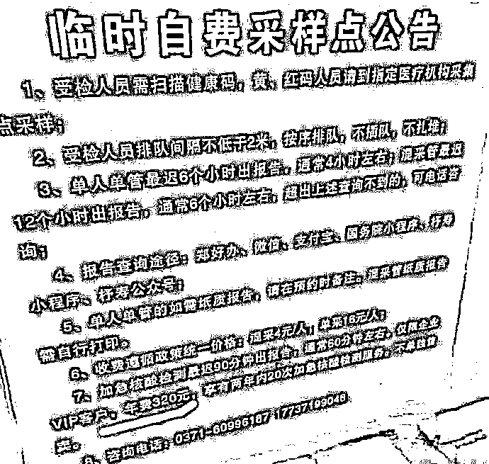
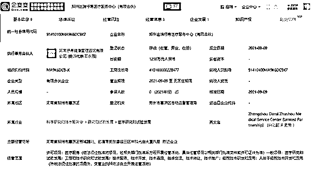
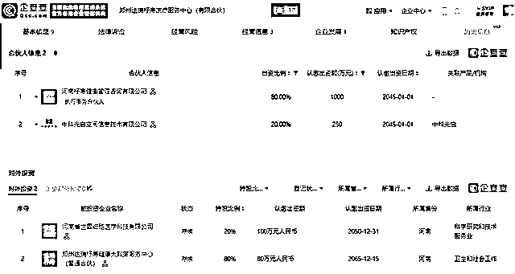

# 郑州一核酸检测点推出 VIP 服务，年费 320 元，官方回应

> 原文：[`mp.weixin.qq.com/s?__biz=MzIyMDYwMTk0Mw==&mid=2247546232&idx=4&sn=8b9960898da00e04dc7cd318f9691d3a&chksm=97cbfe40a0bc7756a4f4e6cde5d1d23e753880c64996307d1fccc6abc308d3e5d2b375906fc4&scene=27#wechat_redirect`](http://mp.weixin.qq.com/s?__biz=MzIyMDYwMTk0Mw==&mid=2247546232&idx=4&sn=8b9960898da00e04dc7cd318f9691d3a&chksm=97cbfe40a0bc7756a4f4e6cde5d1d23e753880c64996307d1fccc6abc308d3e5d2b375906fc4&scene=27#wechat_redirect)

**关注备用号，谨防失联！**<mpvideosnap class="js_uneditable custom_select_card channels_iframe videosnap_video_iframe" data-pluginname="videosnap" data-id="export/UzFfAgtgekIEAQAAAAAAqbMY3zKPXAAAAAstQy6ubaLX4KHWvLEZgBPEqqEwRUJ5LPqBzNPgMIsPAUqVYkIP3097oWIRAU4D" data-url="https://findermp.video.qq.com/251/20304/stodownload?encfilekey=rjD5jyTuFrIpZ2ibE8T7YmwgiahniaXswqzKQs5fmib9qtEpQu6vnx0aLRJSZDGL20ia7iapUJoAgpRXxe8RH2CN9h2RX5bw9LrRDJsKePvZ5jSvplA2Qys1mH5Q&amp;adaptivelytrans=0&amp;bizid=1023&amp;dotrans=0&amp;hy=SH&amp;idx=1&amp;m=&amp;scene=0&amp;token=x5Y29zUxcibDC7oiaLD0IdAbVQQaNJyuTSY0g0LSne8USGfzWEiaJffqPdclH6uGevgNkL0UK3JSibg" data-headimgurl="http://wx.qlogo.cn/finderhead/6EBRYqdQ5j8YgvRoHjKsC42qQHJFJHGecicdDnOBYvBw/0" data-username="v2_060000231003b20faec8c6ea811bc0d7c605e537b0772bc3e953bf8e402c662b4c7ee27a0f9a@finder" data-nickname="华夏时报" data-desc="据网友爆料，近日，河南郑州惠济区一临时自费采样点贴出公告，公告表示：加急核酸检测最迟 90 分钟可出报告，但仅限企业 vip 客户，年费为 320 元，并享有两年内 20 次加急核酸检测服务，不单独售卖。另据该核酸检测点电话接线工作人员表示，公告展示内容属实。#郑州一核酸采样点推出 VIP 服务" data-nonceid="17099950730492606889" data-type="video" data-authiconurl="https://dldir1v6.qq.com/weixin/checkresupdate/icons_filled_channels_authentication_enterprise_a2658032368245639e666fb11533a600.png" data-width="1080" data-height="1920"></mpvideosnap>

据网友爆料，近日，河南郑州惠济区一临时自费采样点贴出公告，公告表示：加急核酸检测最迟 90 分钟可出报告，但仅限企业 vip 客户，年费为 320 元，并享有两年内 20 次加急核酸检测服务，不单独售卖。

随后，据新黄河记者报道称，拨通该核酸检测点电话，接电的工作人员表示，该检测点位于郑州市惠济区月湖南路附近，公告展示内容属实，且目前郑州只此一处可以提供公告展示内容的核酸检测点。随后，记者询问该检测点是否为私人检测机构，接电工作人员表示“这个你不需要了解，你要做就做，不做的话也不需要了解那么多”。

而郑州市惠济区卫健委，就该核酸检测点可以办理 vip 等作出询问，接电工作人员称“应该是属于个人行为，不属于政府行为。”

企查查 APP 显示，涉事核酸点为郑州达瑞杼寿医学检验实验室，关联企业郑州达瑞杼寿医疗服务中心（有限合伙）成立于 2021 年 9 月 9 日，出资额 1250 万元人民币，经营范围包括医疗服务；医学研究和试验发展等，参保人数为 0，河南杼寿健康管理咨询有限公司为执行事务合伙人，出资比例 80%，中科光启空间信息技术有限公司出资比例 20%。郑州达瑞杼寿医疗服务中心（有限合伙）还对外投资了河南省世霖细胞医学科技有限公司、郑州达瑞杼寿健康大数据服务中心（普通合伙）。

来源：华夏时报，新黄河客户端，企查查 app

欢迎关注灰产圈社群服务号

← 向右滑动与灰产圈互动交流 →

