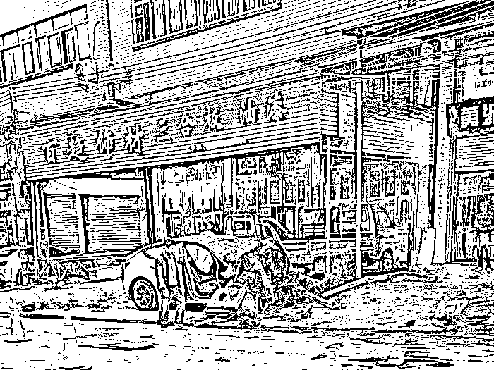
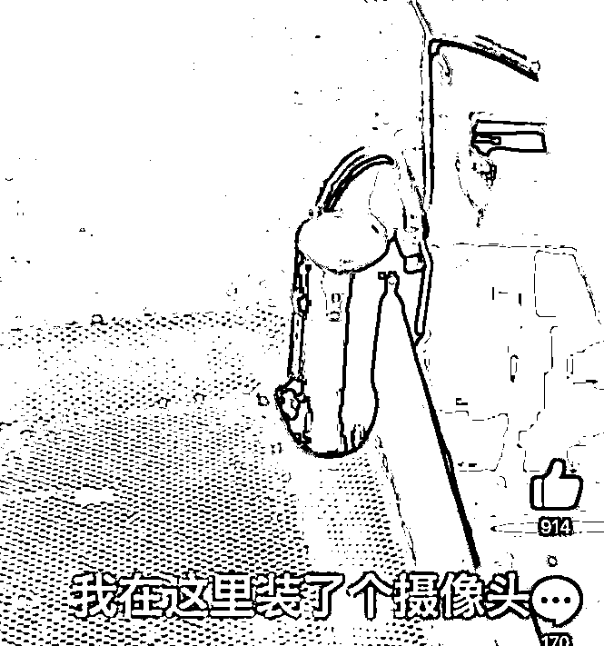
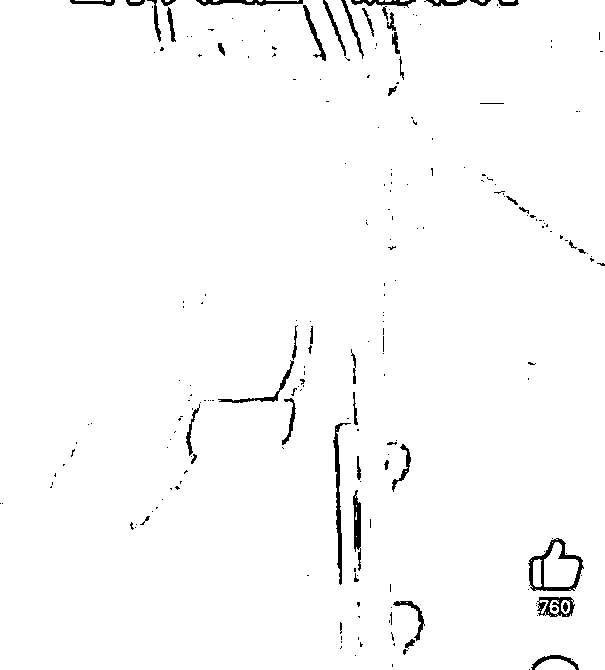
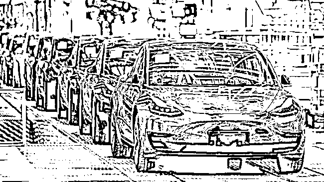

# 特斯拉“失控”事件又有新进展；女车主给特斯拉刹车踏板安装记录仪

> 原文：[`mp.weixin.qq.com/s?__biz=MzIyMDYwMTk0Mw==&mid=2247546232&idx=5&sn=0e0d6145126769fde405baf3ce23e183&chksm=97cbfe40a0bc7756e7a5369b1f2143f8eb382d2260e27c41728eba18e2fb640f3597c04e4088&scene=27#wechat_redirect`](http://mp.weixin.qq.com/s?__biz=MzIyMDYwMTk0Mw==&mid=2247546232&idx=5&sn=0e0d6145126769fde405baf3ce23e183&chksm=97cbfe40a0bc7756e7a5369b1f2143f8eb382d2260e27c41728eba18e2fb640f3597c04e4088&scene=27#wechat_redirect)

**关注备用号，谨防失联！**

日前，广东潮州饶平县一男子称驾驶特斯拉 Model Y 准备停车时，**车辆突然失控高速狂奔 2 公里**，接连撞上两辆摩托车和两辆自行车，造成 2 死 3 伤的严重后果。

图片来源：詹丘比社交媒体

据经济观察网 11 月 15 日援引接近事故车主的人士报道称，目前来自上海的鉴定机构已到达潮州，交警通知今天（16 日）早上去交警队做现场鉴定。据其目前掌握的信息，交警今天（16 日）会拿到特斯拉提交的行车数据。

此外，特斯拉相关人士做出回应，称正在等待检测结果。**特斯拉正全力配合警方**，要是 EDR 的数一出来，所有的行车数据都在里面，就可以清晰地还原当时事故的现场。

针对该事件，特斯拉官方此前回应称：后台数据反映，车辆电门被长期深度踩下，并一度保持 100%；**全程没有踩下刹车的动作**；行驶期间驾驶员四次短暂按下 P 档按钮，又快速松开，同时制动灯也快速点亮并熄灭。

而自称潮州涉事车主亲属、微博名为詹丘比的人士则在社交平台发文称，根据相关视频，证明车主一直在踩刹车，不过失控中车子出现混乱故障，在其他时间干扰或关断了刹车灯电路。同时，对于特斯拉的回应，詹丘比发文质疑：“那把后台数据给车主了吗？”“数据显示无刹车动作等于现实中无刹车动作？还是调取了车内摄像头显示无刹车动作？”

此外，根据大河报报道，车主詹先生表示，“事故中自己从来没有踩过油门，**脚一直都在踩刹车**。”

IT 之家了解到，此前新京报贝壳财经记者致电多家汽车检测机构。不少机构表示，可以为车辆进行硬件方面的检测，但如果是软件或系统存在问题，以机构现有技术，不能保障检测出来。还有的机构表示，此前曾为小鹏做过相关鉴定，报价为 8 万元。

“特斯拉有自己的品牌保护，对隐私数据设置了限制，外界是读取不出来的。”一车一检的服务人员向记者表示，要检测特斯拉是否真的出现刹车失灵比较困难。不过也有机构表示，如果特斯拉愿意提供完整的行车数据，包括制动踏板开度、电机扭矩等，公司可以对此进行分析，并出具报告。

关于特斯拉出现刹车失灵的类似事故已经出现过多起，虽然到现在仍然没有任何证据表明特斯拉的刹车确实有问题，但还是有车主非常担心，**怕出现类似事故特斯拉方面不承认问题。**

IT 之家了解到，近日一名广东女车主在自己新买的特斯拉驾驶室底部，**安装了可拍摄刹车位置的迷你摄像头**。摄像头被安装在了前排座椅的底部，是一款行车记录仪，正对着油门和刹车踏板，可以清晰地记录脚当时踩了哪个踏板，同时，手机还可以随时查看监控。

该车主表示，“刚买的车就降价，还来个刹车失灵，我在这里装了个摄像头，到时候你们帮我来作证。”而在第二条视频中，该车主还表示，并没有乱改线路，自己信任特斯拉，**但是信任是不值钱的**。

特斯拉电动车不仅在国内事故连连，在自家大本营美国也卷入了多起致命车祸。

美国国家公路交通安全管理局 (NHTSA) 网站周二公布的数据显示，特斯拉公司对该机构表示，在截至 10 月 15 日的一个月里，公司又报告了两起 Model 3 致命车祸事故，**这些车祸涉及特斯拉的先进辅助驾驶系统**。

“NHTSA 已经审查了这些事故，并且正在进行适当的跟进。NHTSA 在执法过程中使用了许多数据源。”NHTSA 表示。今年 6 月，NHTSA 开始公布由汽车制造商提供的与辅助驾驶系统有关的车祸报告数据，例如特斯拉的自动辅助驾驶系统 (Autopilot)。

在 2021 年 7 月以来报告的 18 起与驾驶辅助系统有关的致命车祸中，几乎所有都与特斯拉汽车有关。自 2016 年以来，NHTSA 已经对涉及特斯拉汽车的事故展开了 38 次特别调查，这些事故**涉嫌使用 Autopilot**。在与特斯拉相关的车祸调查中，共有 19 人死亡。

来源：IT 时报

欢迎关注灰产圈社群服务号

← 向右滑动与灰产圈互动交流 →

