# 孩子被催打疫苗：我终于从旁观者变成了局中人

> 原文：[`mp.weixin.qq.com/s?__biz=MzIyMDYwMTk0Mw==&mid=2247546232&idx=6&sn=660578ee8d00e5d75defea5434e98271&chksm=97cbfe40a0bc775609012b86ca15d3ab83b3e243dce15a1436cb636ed34848327fa6ae98332f&scene=27#wechat_redirect`](http://mp.weixin.qq.com/s?__biz=MzIyMDYwMTk0Mw==&mid=2247546232&idx=6&sn=660578ee8d00e5d75defea5434e98271&chksm=97cbfe40a0bc775609012b86ca15d3ab83b3e243dce15a1436cb636ed34848327fa6ae98332f&scene=27#wechat_redirect)

**关注备用号，谨防失联！**

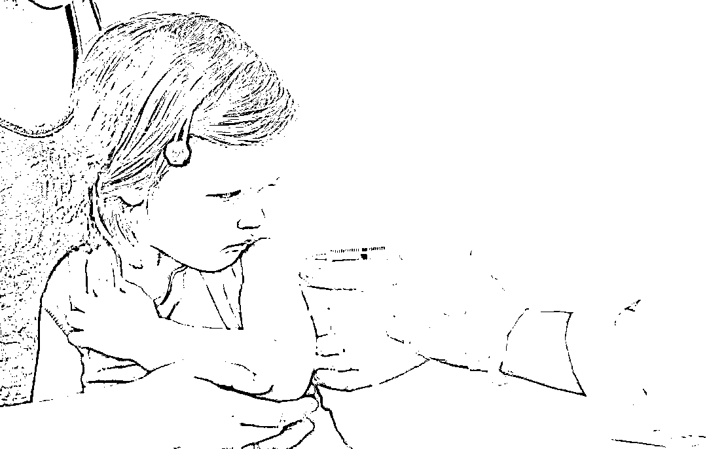

**一**

昨天到幼儿园接孩子的时候，老师特意追出来跟我说，赶紧安排给孩子打疫苗，其他的孩子都打了，早打晚打反正都得打的。

心头一紧。该来的还是来了。

不，不该来的还是来了。

此前，在不少微信群里，见过家长们关于给孩子打疫苗的讨论。当然支持反对的都有。其时，我尚是一个旁观者。但很快，随着老师的一句“早打晚打都得打的”，它就如此真切地落到我头上了——这是一个隐喻，很多事情，我们以为是旁观者，看人下棋，其实已不知不觉裹挟其中。

我决定找个时间跟老师谈谈，表明一下我的态度。

我的态度很简单，也很明确：由于孩子体弱多病，本学期就因病请假多次，因此，慎重起见，我暂时不会让孩子接种这个疫苗。

顺便说一下，这个老师人很好，这所幼儿园也很不错，他们只是奉命行事，但在这件事上，希望彼此有更多理解与体谅。

是的，我知道很多人接种了，它大体上是安全的，但是，根据孩子的实际情况，我不愿意让她冒这个险。再低的意外概率，摊到具体个人身上，就是百分百的难以承受之重。我要阻止这种概率发生。

也许，你会嘲笑我多虑了，但，多虑也是一种权利。

或者说，对一个父亲而言，多虑也是一种献给孩子的责任与爱。

人同此心。

**二**

但是，从我们看到的一些现实情况来看，不容乐观。

今天，读到了一篇叫《孩子不打疫苗被赶出学校，膨胀的权力太可怕！》的公号文章，不寒而栗。

文章说，有的地方，要求没打疫苗的每 48 小时提交一次核酸检测报告，否则不许进学校；还有的地方，干脆把其他疫苗都停了，家长带孩子去接种别的疫苗时，必须先打过这个疫苗。

这是网上的抱怨声。

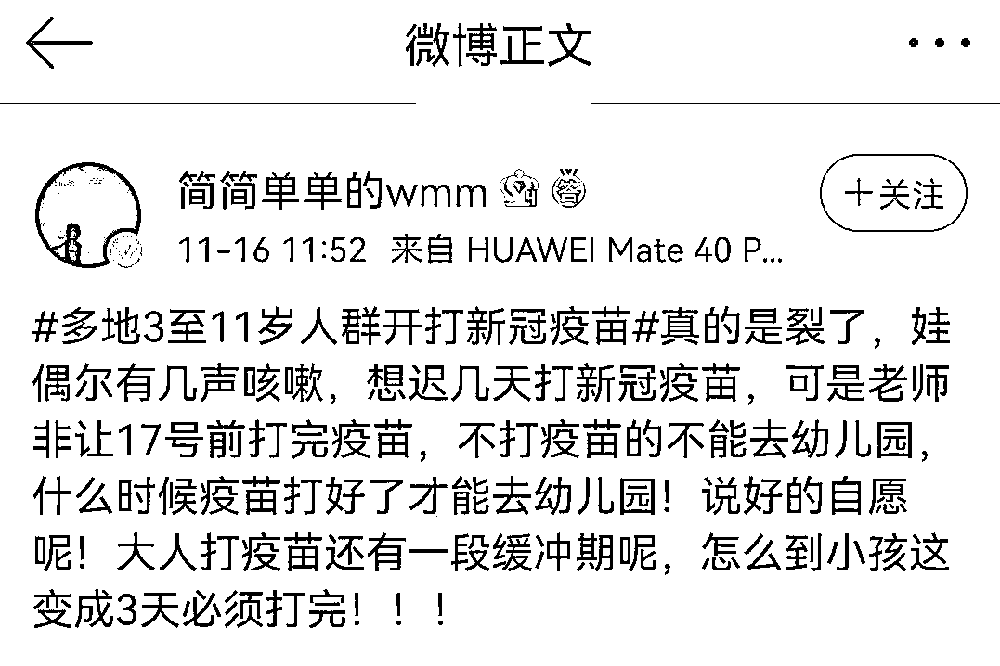

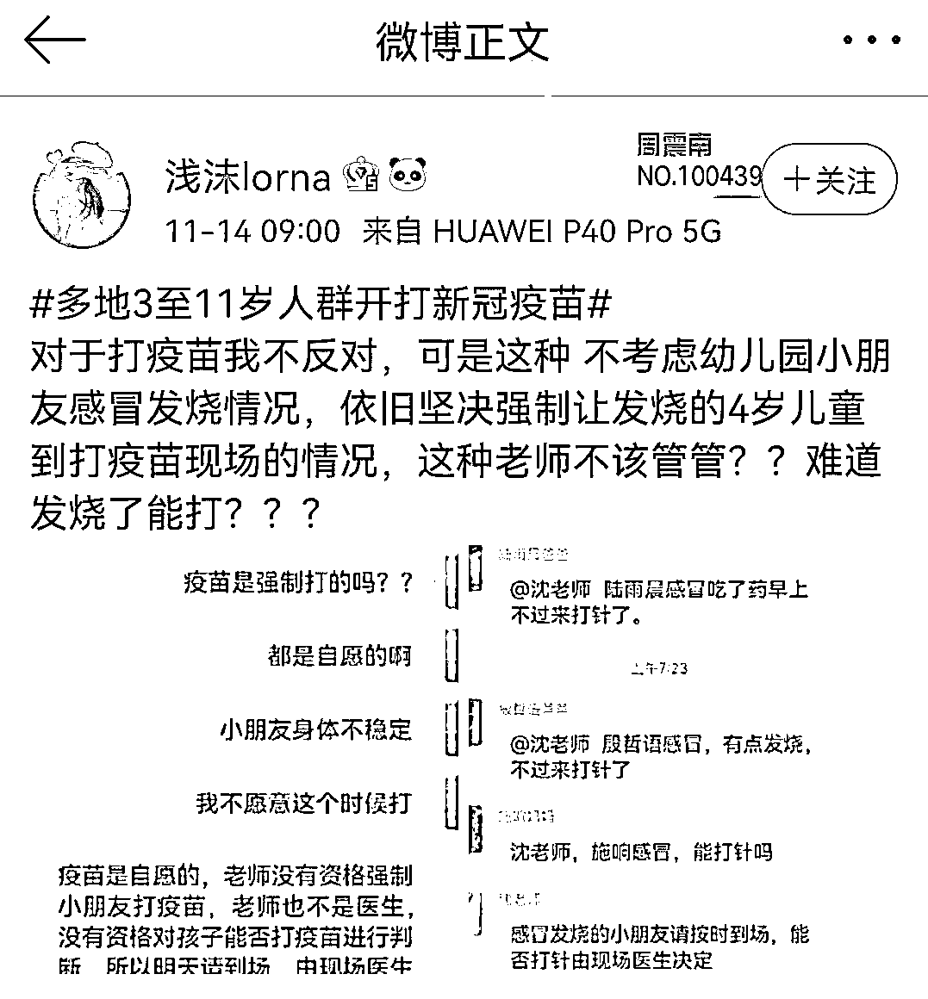

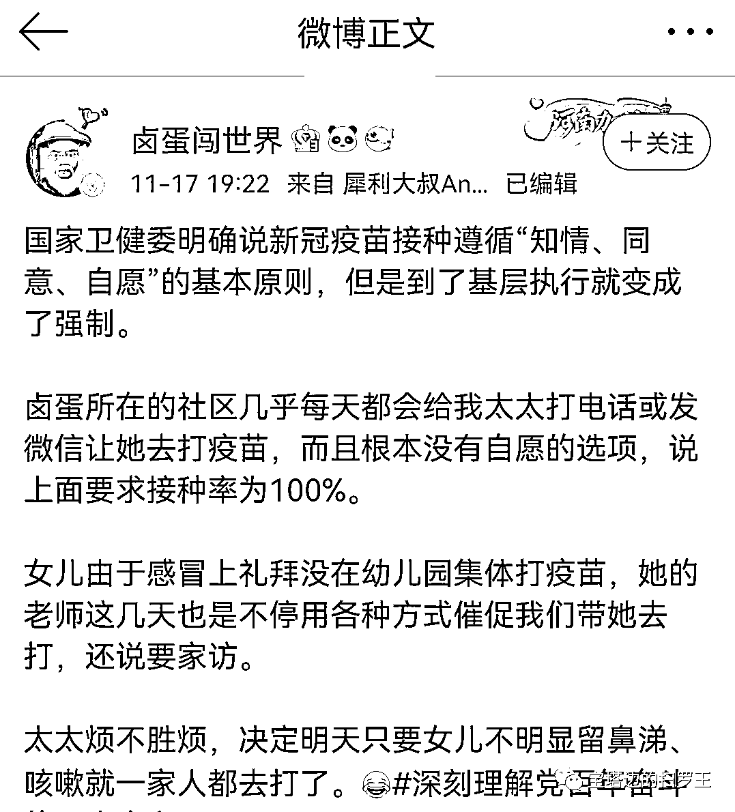

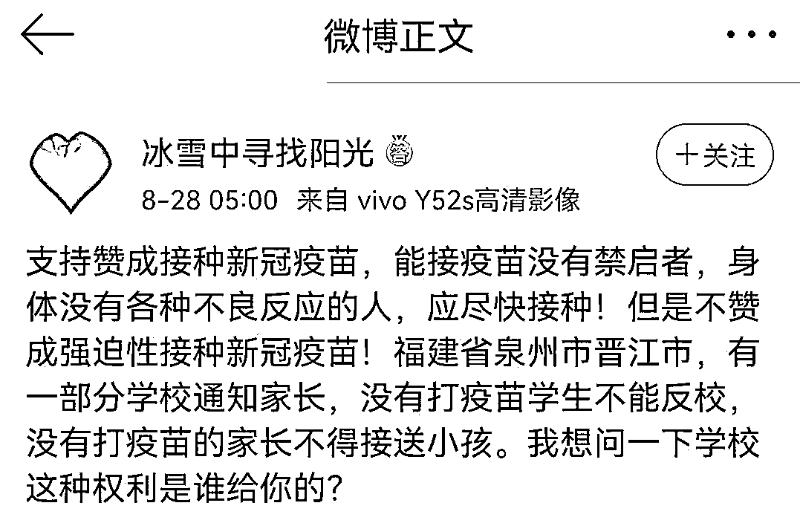

有人的孩子以前得过川崎病，这是免疫系统的一种罕见病，她担心打了疫苗之后会有隐患，便向学校解释，希望能不给孩子接种。可是，学校不买账，非让她出具医生开的不能打疫苗的证明，但因为孩子已经算治愈了，医生不敢开这个证明。

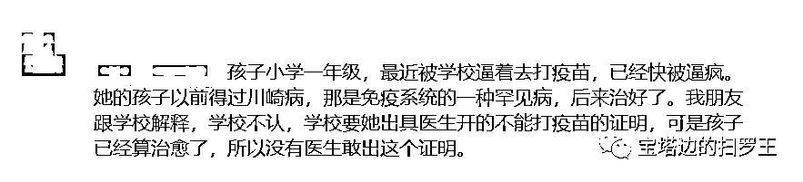

有人爆料，他的孩子所在幼儿园对接种和没接种的孩子进行区别对待，老师对接种的孩子采取奖励小红花、零食、电影票等方式来鼓励，而对没有接种的孩子则施以冷眼，甚至冷嘲热讽，迫使孩子回家向家长吵闹，倒逼家长答应接种。

更有甚者，将没有接种的孩子，直接赶出了幼儿园。 

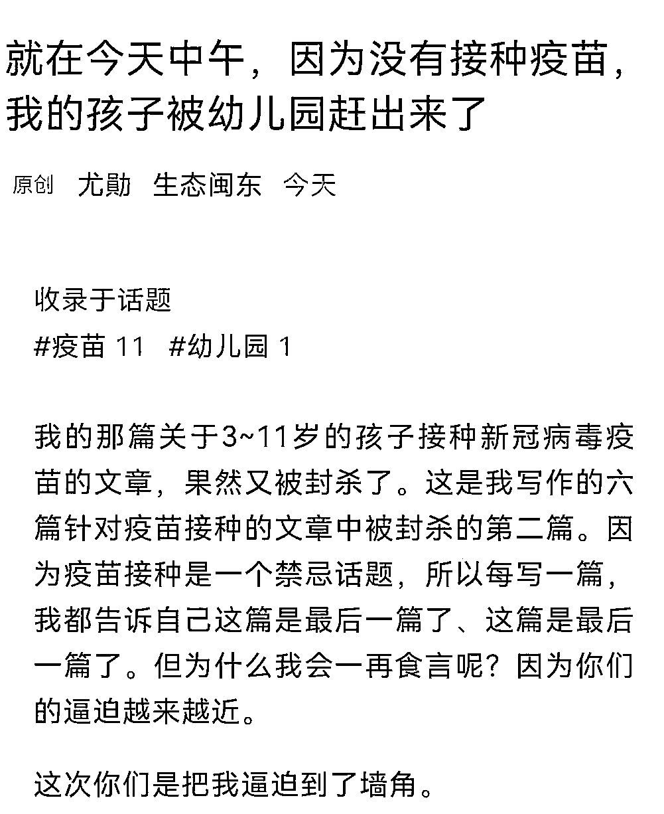

写到这里，我已出离愤怒。

什么是教育？我们就不用说“是一棵树摇动另一棵树、一朵云推动另一朵云”这样的泛滥抒情了，但起码，对一个人最基本的尊重、对自尊心最基本的照顾，应当有吧？有没有想到，如此粗暴对待，对孩子是一种怎样的伤害，可能会在孩子心中留下永远的阴影？

这是另一种病毒。

一个人的心但凡还能沸腾，就不能接受这样的羞辱。

这种情况下，网传这位老师的做法，就显得尤其难能可贵——

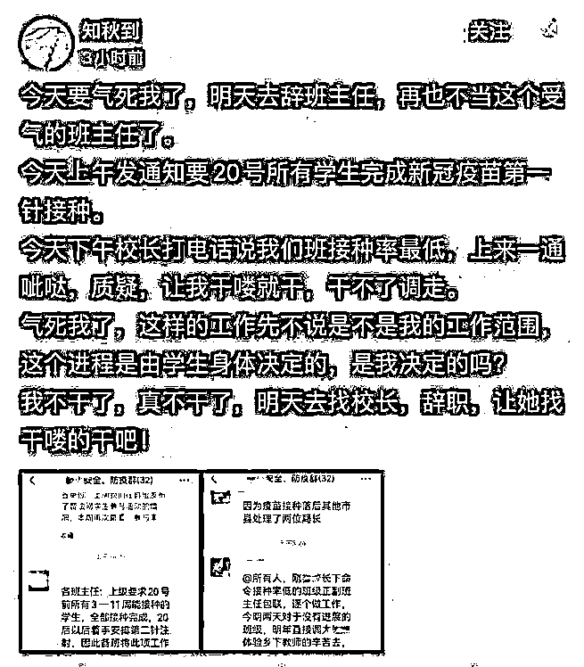

当然，我们不能以她为道德标尺去衡量她的同行。毕竟，每个人都有养家糊口之重任，都有软肋，面对考核排名乃至工资资金之现实羁绊，不是谁都有轻易辞职的底气。

我希望的只是，权力不要层层加码，不要一刀切，不要使政策在实施过程中走样变形。

**三**

就在 2021 年 8 月 27 日，在教育部举行的新闻发布会上，教育部体育卫生与艺术教育司司长王登峰表示，有个别地方把学生是否注射疫苗，甚至学生家长是否接种疫苗，来作为能否返校的条件，这是违反接种疫苗需要遵循的知情、同意、自愿的原则的。

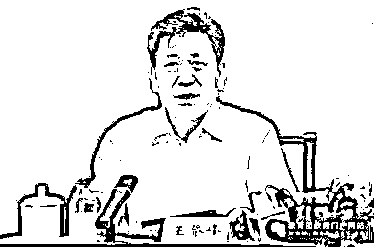

王司长还进一步强调，学校不得把是否接种新冠肺炎疫苗当作学生开学进校的条件，这是依法从严实施疫情防控的一个具体体现。

言犹在耳。可是，为什么还是有人将它当成耳边风？

“知情、同意、自愿”的防护盔甲，在一些人那里成了纸糊的道具，甚至空气。

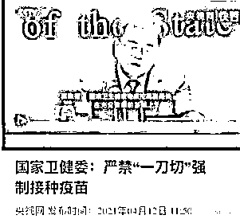

现在，我想到的一个问题是，如果接下来，我的孩子所在的幼儿园也采取各种“软强迫”，我该怎么办?会一步步走向妥协吗?

至少到目前为止，我还是保持谨慎乐观。毕竟，各种匪夷所思的强迫接种事件大都发生在经济不甚发达的内地，发达地区还是表现得相对务实与宽容，比如，浙江不把接种疫苗作为学生开学返校的强制性条件；今年 8 月，广东卫健委印发专家共识，称存在疫苗成分过敏等情形未成年人需暂缓接种疫苗，更是收获网络上的一片赞扬声。　

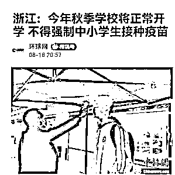

希望这样的务实与宽容，不至于在接下来的日子里‘沦陷“。

希望我作为一个父亲的这一点合法坚守，能被成全。

来源：爱品茶社，喻言亭阁

欢迎关注灰产圈社群服务号

← 向右滑动与灰产圈互动交流 →

