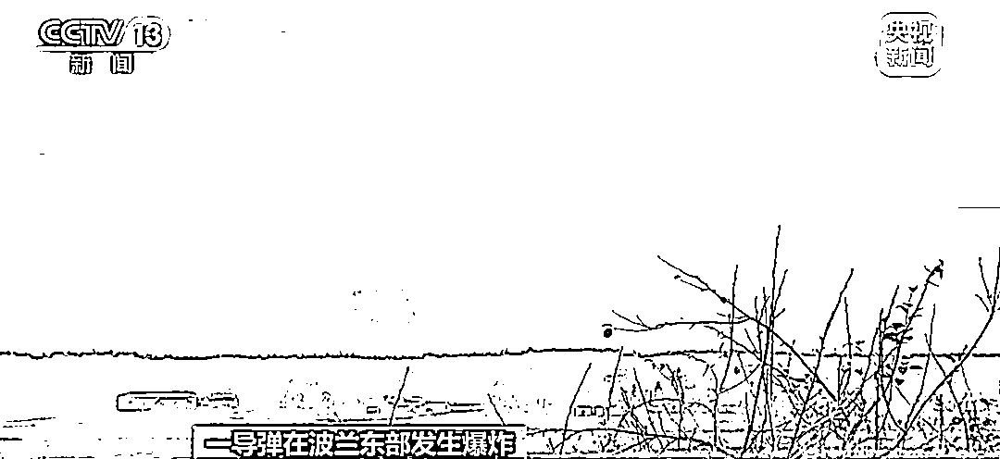
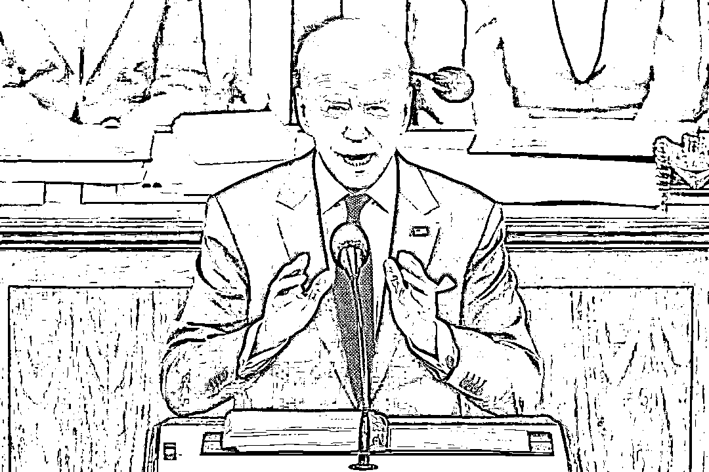
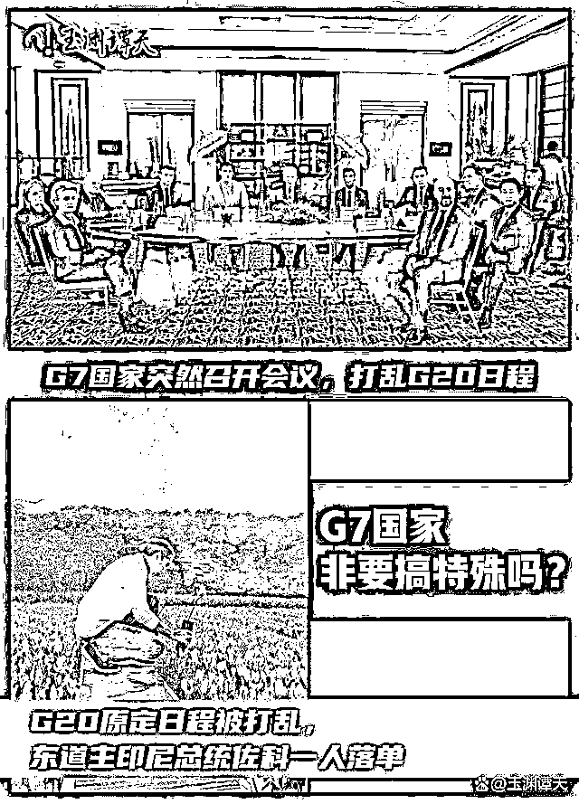
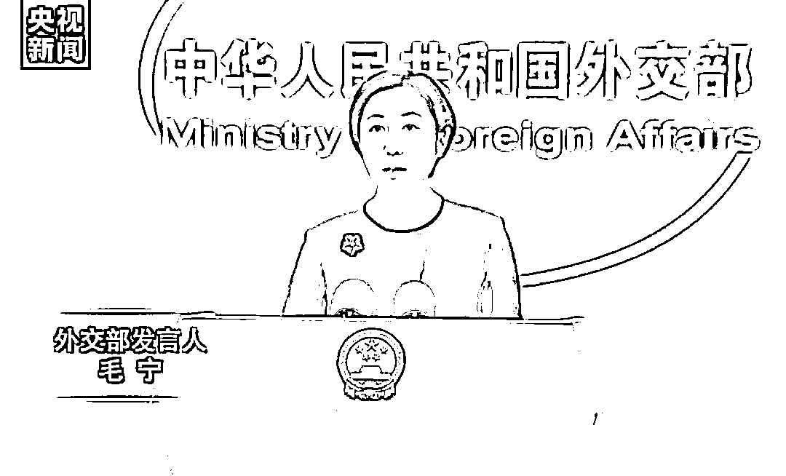

# 炸波兰的导弹是谁的？俄方：残骸属于乌方！拜登证实：就是乌克兰的

> 原文：[`mp.weixin.qq.com/s?__biz=MzIyMDYwMTk0Mw==&mid=2247546232&idx=7&sn=e13c092eea4e7b4e4e200bc7fc885736&chksm=97cbfe40a0bc77567c16bf1f8af3fb456f0c301c2d26c5b9ceb749b8bc5e47e85266aec27df6&scene=27#wechat_redirect`](http://mp.weixin.qq.com/s?__biz=MzIyMDYwMTk0Mw==&mid=2247546232&idx=7&sn=e13c092eea4e7b4e4e200bc7fc885736&chksm=97cbfe40a0bc77567c16bf1f8af3fb456f0c301c2d26c5b9ceb749b8bc5e47e85266aec27df6&scene=27#wechat_redirect)

**关注备用号，谨防失联！**

据央视新闻，波兰外交部 16 日表示，当地时间 15 日下午，**一枚俄罗斯制造的导弹在波兰东部边境发生爆炸，造成两名波兰公民死亡**。受此影响，**波兰部分军事单位已提高了战备等级**。

当地时间 16 日，俄新社援引美联社来自美国官员的消息说，初步调查显示，**落入波兰境内的导弹系乌克兰军队发射，用于拦截一俄罗斯导弹**。

此前，乌外交部长库列巴**否认坠入波兰的导弹是乌克兰防空系统发射，称这是“阴谋论”**。

据路透社当地时间 16 日援引消息人士的话报道，美国总统拜登对七国集团和北约盟友表示，**波兰东部边境的爆炸是由乌克兰防空导弹造成的**。拜登稍早之前曾表示，**落在波兰的导弹不太可能是从俄罗斯发射的**。

当地时间 16 日，北约秘书长斯托尔滕贝格在布鲁塞尔表示，北约方面正在调查发生在波兰的爆炸事件，尚未得出最终结论。他表示，没有迹象表明该爆炸事件是蓄意攻击行为，初步分析认为，**爆炸事件是由乌防空导弹造成**。

**乌方：俄罗斯在宣扬阴谋论**

**波兰召见俄驻波大使**

据法新社报道，波兰总统杜达 16 日表示，没有“明确证据”表明是哪一方发射的导弹在波兰境内爆炸并造成 2 人死亡。

杜达还表示，调查仍在进行中，导弹很可能是俄制。而当天早些时候，波兰外交部发言人称在东部边境爆炸的导弹为俄制，波兰外长拉乌已就此召见俄罗斯驻波兰大使。

当地时间 16 日，波兰政府发言人米勒在社交媒体上表示，波总理莫拉维茨基与乌克兰总理什梅加尔进行了电话会谈。

米勒表示，乌总理称，**俄罗斯 15 日对乌克兰领土发动了大规模导弹袭击，俄方使用了约 80 枚导弹，其中许多导弹击中了与波兰接壤的乌克兰边境地区**。

米勒稍早前在社交媒体表示，16 日上午，莫拉维茨基还与欧盟委员会主席冯德莱恩和荷兰首相吕特进行了会谈。

当地时间 16 日，波兰外交部发言人武卡什·亚希纳介绍了 15 日夜间召见俄罗斯驻波兰大使安德烈耶夫的情况。亚希纳称，**波兰外交部长拉乌已经向俄大使递交了外交照会**，外交照会陈述了有关爆炸事件的情况，并表达了波兰当局对事件的看法。

据环球网，当地时间 15 日晚，乌克兰总统泽连斯基在事发后立即**指责莫斯科“故意攻击波兰”**。他说，这是“莫斯科军事侵略的重大升级”，并警告“俄罗斯的恐怖行动进一步发展只是时间早晚的问题”。

法新社消息，乌克兰外交部长库列巴当地时间 15 日深夜发文称，有关“乌克兰导弹落在波兰”的指控是一种“阴谋论”。库列巴在推特上发文指责俄方称，“**俄罗斯现在在宣扬一种阴谋论，称落入波兰领土的是一枚乌克兰防空导弹**。这不是真相。任何人都不应该相信俄罗斯的宣传或放大其信息。”

**俄方：残骸是乌 S-300 导弹的部分**

据央视新闻，俄罗斯国防部 15 日则发表声明称，波兰媒体及官方有关疑似俄罗斯导弹落入波境内居民区的言论是企图引发局势升级的挑衅。**俄方未对乌克兰与波兰边境地区进行打击**。波兰媒体展示的武器装备碎片与俄方导弹无任何关系。

当地时间 16 日，俄罗斯国防部表示，1**5 日晚间公布的在波兰发现的导弹残骸是乌克兰 S-300 导弹的部分**。

环球网报道，据俄罗斯卫星通讯社此前报道，俄罗斯军事专家阿列克谢•列昂科夫稍早前对卫星社称，落入波兰普舍沃杜夫村的有可能是乌克兰 S-300 防空导弹系统的导弹，而不是俄罗斯巡航导弹。 

列昂科夫说，“非正常启动的乌克兰 S-300 系统防空导弹可能飞进波兰领土。我们以前见过这样的例子，包括乌克兰用防空导弹击中己方（居民）住房。”列昂科夫还称，俄罗斯巡航导弹是高精度武器，是在对敌电子战和防空系统强力对抗条件下使用，不可能让其偏离航向。

**拜登：是乌克兰防空导弹**

据央视新闻，当地时间 16 日，俄新社援引美联社来自美国官员的消息说，初步调查显示，**落入波兰境内的导弹系乌克兰军队发射，用于拦截一俄罗斯导弹**。

据路透社当地时间 16 日援引消息人士的话报道，美国总统拜登对七国集团和北约盟友表示，**波兰东部边境的爆炸是由乌克兰防空导弹造成的**。

图片来源：视觉中国-VCG111371436204

拜登稍早之前曾表示，**落在波兰的导弹不太可能是从俄罗斯发射的**。

此前五角大楼新闻发言人帕特里克·莱德准将在例行记者会上表示：“当涉及到我们的安全承诺和北约宪章第五条时，我们已经明确表示，我们将保卫北约的每一寸领土。”**波兰是北约成员国。按照北约宪章，对一个成员国的攻击将被视为对北约所有成员国的攻击**。

当地时间 16 日，土耳其总统埃尔多安在 G20 峰会后的记者会上表示，关于有导弹坠入波兰境内一事，**需要尊重俄罗斯方面的声明**。埃尔多安说：“俄罗斯说‘这与我们无关’对我们来说很重要。”他表示，调查是必不可少的。

据路透社 11 月 16 日报道，埃尔多安在印尼巴厘岛举行的二十国集团（G20）峰会的新闻发布会上表示，“**俄罗斯说这与他们无关，（美国总统）****拜登也说这些导弹不是俄罗斯发射的，这表明这与俄罗斯无关**。”

埃尔多安还表示，各方需要对此次袭击情况进行调查，他将在返回土耳其后与俄罗斯总统普京进行交谈。

**G7 讨论导弹打乱 G20 议程**

据玉渊潭天，G20 主办方印尼最不想看到的事还是发生了，G7 国家在 G20 会议期间又搞起了“特殊”，让大会议程为“小圈子”里的事儿让步。

事情是这样的：按照原定日程，11 月 16 日也就是周三上午，G20 大会本来安排了相关会议议程和配套活动，结果，周三上午 9 点半到 10 点，**拜登和 G7 国家和欧盟的相关领导人，还带着一些其他官员突然去开了另一场紧急会议**。很多媒体的报道都印证了，**因为这场紧急会议，干扰了 G20 的原定议程**。

G7 在讨论什么呢？是波兰境内出现了一枚导弹爆炸导致了两人死亡，讨论安全问题本来无可厚非，但是否要考虑一下场合？再者，G7 开会的目的真的是关心波兰人民的生命安全吗？想必不是，大家也都心知肚明。但讨论了半天，最后也没有得出他们想要的结论。虚张声势抢占了话题，耽误了大会议程。

本次 G20 峰会，主办国印尼千方百计想把会议议题引导到全球经济问题，会议大主题始终强调的就是两个字“复苏”，这不仅是发展中国家面临的问题，更是发达国家自身的问题。结果呢，G7 国家对眼前的议程和需要付诸艰苦努力的问题视而不见，不去想全球现在对高通胀、高债务风险到底因谁而起，一起去想解决方案。相反，却把阵营对抗和意识形态对立凌驾于大会之上，居高临下，指指点点。**G7 国家就这么爱搞特殊吗？**

此事发生之后，作为东道主的印尼总统佐科在表示：**G20 是经济论坛、金融论坛、外交论坛，而不是政治论坛，所以还是请大家谈谈经济吧**。

**外交部：**

**保持冷静克制，避免局势升级**

据央视新闻，中国外交部今天（16 日）举行例行记者会。

对于发生在波兰的导弹爆炸事件，外交部发言人毛宁表示，我们注意到有关报道。当前形势下，**所有相关方均应保持冷静克制，避免局势升级**。中方在乌克兰问题上的立场是一贯和明确的，开展对话谈判，和平解决危机是当务之急。

来源：每日经济新闻综合自央视新闻、环球网、玉渊潭天

欢迎关注灰产圈社群服务号

← 向右滑动与灰产圈互动交流 →

