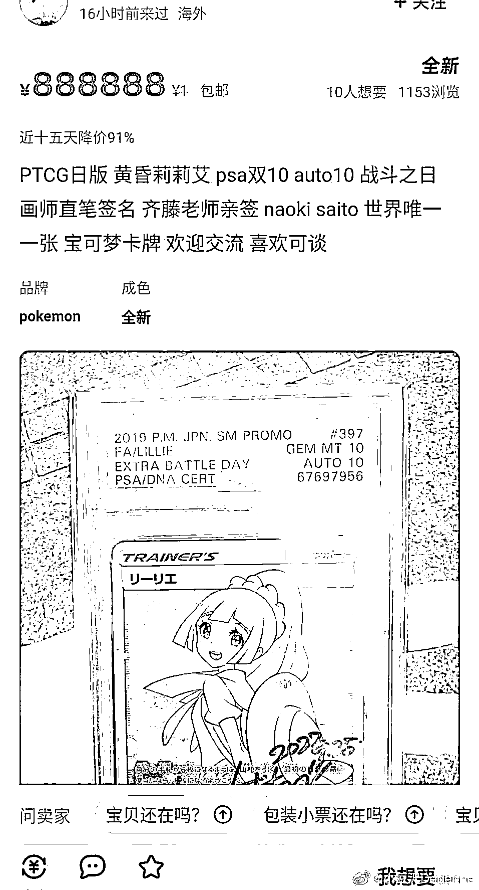

# 中日热议！前脚说一生珍藏，后脚就以 1598 万日元天价倒卖宝可梦画师签名珍贵卡…

> 原文：[`mp.weixin.qq.com/s?__biz=MzIyMDYwMTk0Mw==&mid=2247546288&idx=2&sn=3bf0a7bd393b192c264f7f371003b5c3&chksm=97cbfe88a0bc779e3810d6c358e24152e58a433c6336f020fa2cd6201f32ec428cd93593a1cd&scene=27#wechat_redirect`](http://mp.weixin.qq.com/s?__biz=MzIyMDYwMTk0Mw==&mid=2247546288&idx=2&sn=3bf0a7bd393b192c264f7f371003b5c3&chksm=97cbfe88a0bc779e3810d6c358e24152e58a433c6336f020fa2cd6201f32ec428cd93593a1cd&scene=27#wechat_redirect)

最近日本宝可梦卡牌圈有一桩**天价倒卖事件，**引发中日网友热议。

今年 9 月 25 日的 MEGAMI 绘画展上，宝可梦卡牌画师「斋藤直葵」老师为一位昵称为 AKIRA 的中国粉丝的“黄昏莉莉艾”宝可梦卡签名。

而且是 to 签。

10 月 19 日，AKIRA 推特上表示：**“我会一生珍藏”。** 

但仅仅一个月后，11 月 13 日就有网友发现这张卡以**1598 万日元（约合 81 万 RMB）**的价格出现在了专卖店中。 

这张卡牌上签有 AKIRA 的名字，日期是 2022 年 9 月 25 日，很明显就是当初 AKIRA 说要一生珍藏的卡。

另外国内海鲜市场也有上架这张卡的，店家说 1500 万日币起出，这么看来似乎是同一张卡片？？

啊这……前脚说一生珍藏，后脚 2 个月不到就转卖啊……AKIRA 的一生只有 2 个月？

很难不怀疑 AKIRA 最初的动机。

此事引发广泛讨论后，日本网友发现 AKIRA 的推特账号早已注销。 

这件天价倒卖事件热议到后来，就连画师斋藤本人也受到波及，日本那边似乎有人认为这是斋藤和黄牛合谋的炒价格获利。 

画师斋藤则表示完全没想到被人利用，现在他就连出门都犹豫踌躇：“本以为 to 签签了你的名字就不会被倒卖。” 

最后还表示：以后应该再也无法给人签名了，AKIRA 我可是记住你的样貌了。

目前，画师斋藤还知道有人利用他不懂中文名这点，让他在卡牌上签**角色的中文名字**然后倒卖了

正常情况的 to 签，画师会写下玩家本人的名字，表示对他的祝福，而签角色名的话，也就代表：将来无论转给谁来玩或者收藏，卡牌都不会“掉份”（可能还会升值）

国内海鲜市场上，有店家上架了这几张画师签名的宝可梦卡牌。

这张图里有 3 张卡签的是中文名。 

日推上现在把这件事定性成有组织有预谋的行为。

画师斋藤：“呜哇，我就说感觉这个作为名字很奇怪，原来是角色名啊……” 

“我一点都没想过怀疑他们，被骗了好丢脸😭”
“今后不管是签名还是不签名，我都要想想对策了。”

有网友晒出了疑似当事人 AKIRA 的发言：

**“是 我说了收藏 那价格到了我不卖我是 sb 吗？”**

**“一张卡赚几十万换谁谁不卖。”**

疑似 AKIRA 出 30 万（应该是日币）悬赏曝光他的人。

……

给圈外网友稍微讲下啥是 PTCG，为啥一张签名卡能卖这么贵？

PTCG 是宝可梦集换式卡牌游戏，AKIRA 这张黄昏莉莉艾本身就非常贵，价格大约为 45 万 RMB，再加上评分机构 10 分，画师 to 签，自然就变更贵了，暴涨到了 80 万+RMB。

换句话说，宝可梦卡牌天价倒卖这件事的性质，可以大致理解为：**回应粉丝的喜爱所以无偿赠予的礼物，结果被当****成商品天价转手卖掉了。** 

听说类似的行为已经形成产业链……搜了下，没有 80 万 RMB 那么夸张，但五位数也够高价的了。

高价倒卖产业链风生水起，但对于画师来说，“一生珍藏”这句话，原本充满感动，现在却变得超级刺耳，说句心理阴影也不为过……

来源：脊梁 in 上海 SH

欢迎关注灰产圈社群服务号

← 向右滑动与灰产圈互动交流 →

