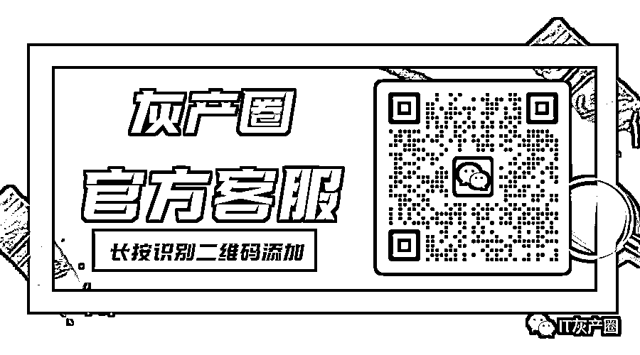

# 如果“正能量”能救郑州，不如先救救那个孩子

> 原文：[`mp.weixin.qq.com/s?__biz=MzIyMDYwMTk0Mw==&mid=2247546288&idx=3&sn=564bc86f86e11e9917c471b6d96c268e&chksm=97cbfe88a0bc779e3beff3177f9c83a9a8a0ed796cbc9cf9abb72a3ae184d2b9f66f5ab85ac0&scene=27#wechat_redirect`](http://mp.weixin.qq.com/s?__biz=MzIyMDYwMTk0Mw==&mid=2247546288&idx=3&sn=564bc86f86e11e9917c471b6d96c268e&chksm=97cbfe88a0bc779e3beff3177f9c83a9a8a0ed796cbc9cf9abb72a3ae184d2b9f66f5ab85ac0&scene=27#wechat_redirect)

*十年前，郑州郑州，天天挖沟。* 

*十年后，郑州郑州，天天热搜。*

*而且这次，一天俩热搜。*

*听说，河北躺平了，听说，洛阳放开了，*

*看到，郑州，高风险，又多了……*

此前，笔者一篇“郑州的一天，信息两太大”，已在某种力量（或许是某些恶人的举报）下 404 了，而这几天，属于郑州人难以承受的信息量，又何曾停过？

其实，连续几日，在朋友的劝导下，我已尽力不想再去关注任何负面的信息，已经尽力去看到，这座城市逐渐恢复往日的迹象和希望，已经尽力去找到“新冠已成常态”，大家做好与病毒长期共存的心态，更是已经逼迫自己尽力去投入到个人的生活和工作中。

我可以不在乎，20 条后没有中风险了，**所以高风险越来越多**；我可以接受，每日新增的数据越来越多是因为要**“去库存”**；我也能理解，小区的某些楼栋，**封了又解，解了又封；**我甚至能够接受，辛苦给大家做核酸的大白们**手法越来越“简单”**，但有些事，着实让人忍不了，更无法拿眼下所谓的**“战绩”、“成果”去继续自我安慰**，继续做个两耳不闻窗外事的糊涂人。

**可笑的事，可悲的事，**就这样一件接一件。

可笑的事，核酸小屋一个接着一个消失了，也该郑州这座城倒霉，恰好这时关于收费核酸小屋的照片传出，**“年费”的概念，很难不让人浮想联翩。**坦言，这件事相关部门也第一时间做了说明，与官方无关，只是某些地方、某些企业的个人行为，冷静的看，这个罪名过度的安到“郑州”的头上，着实有些情绪大于一切了。但这背后真正引出的，或许是某些强大的利益驱使面前，有些人，着急了，**甚至那双无形的大手，有点过于招摇了。**

**核酸是不是一门生意？**其实，老百姓们甚至都懒得探讨了。但这门生意，在全民水深火热之时，那些挣得盆满钵满的人，请克制下！

当然，让人感到可悲，痛心，愤怒的，还是那个 4 个月的生命，就在这样一场混战中，永远离开了人世。很难想象，无力的父母，中间做了多少努力、求助，多少歇斯底里，又是在怎样的绝望与恐惧中，眼睁睁看着自己的宝贝，永远醒不过来。这其中的几点疑问和最后的追责，不要再有任何试图瞒天过海稀里糊涂的理由，更不要试着让时间去抹平一切，因为这样的伤害对一家人是永远的，对多数只能围观愤慨的人而言，同样不能草草了事。

冷静的看遍了各种信息和当事人陈述，百思不得其解——

*为什么，4 个月的孩子，家里有人仅仅是密接，一定要到隔离地？*

*为什么，打了多少遍 120，几个小时甚至无人过问？不是重症就能解释吗？*

*为什么，最后会把孩子送到登封？路途的 2 个小时，车上没有急救措施？*

*为什么，到了登封依旧迎来的是漠视，冷落，最终直到凌晨才去施救？*

*特殊时期，医务人员不够，各种信息繁杂，无法甄别……*

我相信，这样莫大的“罪名”不可以简单粗暴的盖到任何一个 120 和医护人员你的头上，我们更不想奢求，那个曾经接过孩子父母电话的对接人，他能用多么热情的服务去对待，**但这里的问题，到底出在了哪？**究竟是哪个环节的漠视与阻碍，酿成了最终的悲剧？

先不聊什么人权，先谈谈如今的防疫政策下，**人们从发现确诊或密接，到被集中隔离，这中间信息的反馈到底有没有一个及时畅通的渠道，从隔离点、方舱、酒店等，到疾控中心，再到医护资源，这其中有多少人经过系统的培训，又有多少人只是拿自己的身家性命在硬撑。**我深知，每一个“大白”的辛苦，但或许在类似紧急情况出现的时候，太多人爱莫能助，因为就连他们自己都不知道，到底该去找谁？又该去寻求谁的帮助？

如果，新冠的等级可以用**“是否为重症”来判断，**

那么，一个孩子或者一个普通人的**突发疾病又该遵循怎样的原则呢？**

标准不清晰，信息不通畅，人员不专业，再加上不排除某些人的习惯性冷漠（或许有人会觉得，不就是小孩生个病嘛）这样的一环又一环，终究错过了抢救孩子的最佳时间。

孩子走了，悲痛留给了家人，愤怒充斥着整个城市。希望有关部门的调查，能有个真实的结果，不要一次又一次的再去触碰郑州人的底线了！这场战役，**从一开始，就没有人、也没有力气喊加油了，**不是我们对自己、对这座城市没信心，不包容，而是整夜整夜难以入眠的、身心疲惫的郑州人，几乎没有听到任何一个好消息，唯一的一点信念，基本都来自身边那些足够乐观的朋友：听他们说，已经陆续复工了；听他们说，已经正在恢复了；看他们拍的航拍，车水马龙回来了……

可我想说，如果这场“战役”，**需要用那么多无辜的鲜血甚至是生命换来，就算有一天真的迎来了所谓的“胜利”，我们又有什么值得庆祝和开心的呢？**如果新冠，是一种不断自我裂变升级的顽疾，而这个社会和某些体制之下的顽疾，是不是注定也要与我们长期共存呢？**如果所有人都拿“正能量”去安慰自己，宽慰身边人，类似的悲剧，会不会再次上演呢？**

**我们自己给自己的“正能量”救不了这座城，更救不回那个孩子。**

不想说那个孩子的名字，更希望各位不要传播孩子的任何照片，打了马赛克的也不要。或许，是这肮脏的人世间，不配拥有小天使，孩子，走好！

**世界，像是一场巨大的阴谋，我们束手无策。**

文字，或是我们唯一的出口，审核者，请善良！

来源：喻言亭阁 

欢迎关注灰产圈社群服务号

← 向右滑动与灰产圈互动交流 →

