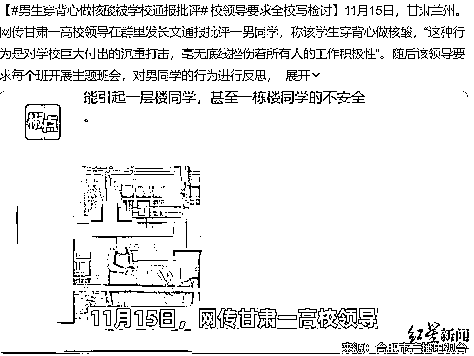
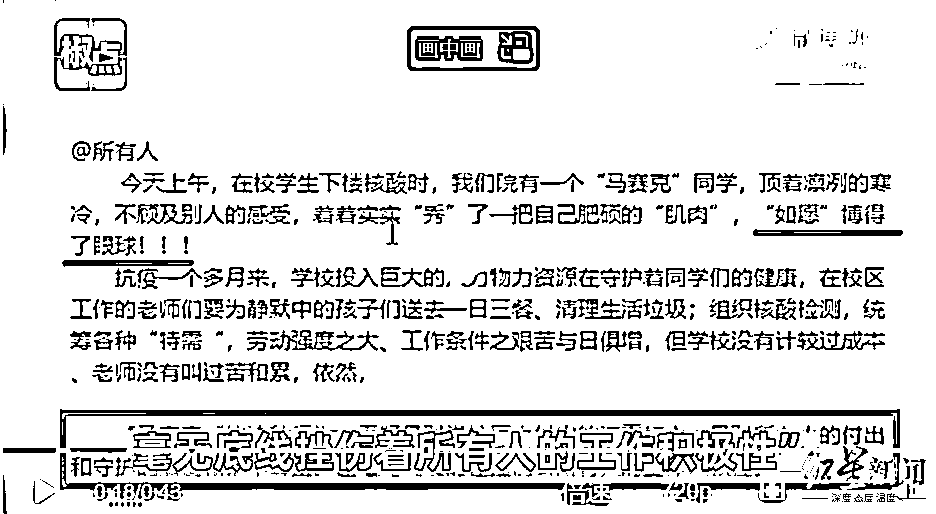

# 男生穿背心做核酸被全校通报批评！学校负责人：天冷，这是对自己健康不负责

> 原文：[`mp.weixin.qq.com/s?__biz=MzIyMDYwMTk0Mw==&mid=2247546288&idx=4&sn=28cc9f3b4888a95adc8e627d9d50737a&chksm=97cbfe88a0bc779e36d8b603f8f7df446ab5fbeabd8dc66dfac9c3fe4357191d145ffbb9abd6&scene=27#wechat_redirect`](http://mp.weixin.qq.com/s?__biz=MzIyMDYwMTk0Mw==&mid=2247546288&idx=4&sn=28cc9f3b4888a95adc8e627d9d50737a&chksm=97cbfe88a0bc779e36d8b603f8f7df446ab5fbeabd8dc66dfac9c3fe4357191d145ffbb9abd6&scene=27#wechat_redirect)

11 月 17 日，#男生穿背心做核酸被学校通报批评#冲上热搜。

据报道，11 月 15 日，网传甘肃一高校领导在群里发长文通报批评一男同学，称该学生穿背心做核酸，“这种行为是对学校巨大付出的沉重打击，毫无底线挫伤着所有人的工作积极性”。随后该领导要求每个班开展主题班会，对男同学的行为进行反思，并要求所有学生写检讨。

[`v.qq.com/iframe/preview.html?width=500&height=375&auto=0&vid=p33634k67o1`](https://v.qq.com/iframe/preview.html?width=500&height=375&auto=0&vid=p33634k67o1)

此事也引发网友讨论，有网友表示不解，“穿背心有什么错？”

网传内容截图

17 日上午，事发高校甘肃农业大学校负责人电话中独家回应红星新闻记者称，已注意到相关舆情，“老师出发点是好的，但是在用词上可能不太妥当。”他称，不会因为该学生穿背心，就要求其他同学写检讨，“也希望学生们能够将自己的身体健康问题，真正重视起来。”

该负责人称，学校内此前出现阳性病例，全校师生为了确保学生身体，已经奋战一个月。“做核酸那天是早上 8 点左右，气温就在 0℃左右，他穿的那么少，是不是有可能感冒？你想如果一个学生发生了感冒，身体比较弱，就有可能中招，肯定学院里面的领导就也着急，是不是就劝，以后再不要发生这样的问题。”

网传内容截图

该负责人语重心长地说，由于学生宿舍内人员密度大，一旦有人确诊阳性，将对其他学生带来极大影响，“又在高校里面，一发生问题你就要去隔离，所有的学生这时候影响就特别大了。”

该负责人同时强调，希望学生们能够将自己的身体健康问题，真正重视起来。他称，不会因为该学生穿背心，要求其他同学写检讨，“一个学生有问题了，让所有的学生去写那样的检讨，这绝对不可能的，对吧？”

来源 ：红星新闻    

欢迎关注灰产圈社群服务号

← 向右滑动与灰产圈互动交流 →

