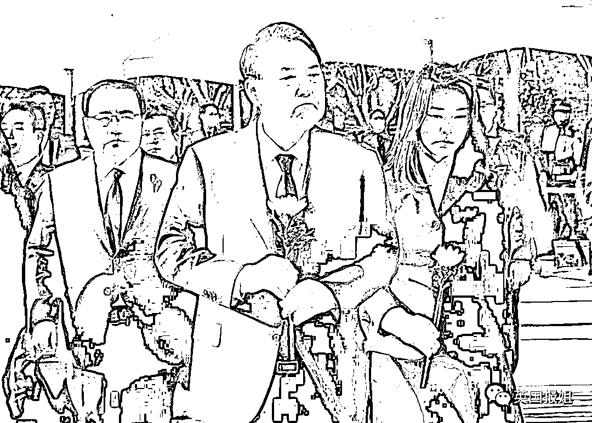

# 韩梨泰院惨案后续太诡异！负责警察“畏罪自杀”，被指销毁证据、故意延迟出警……

> 原文：[`mp.weixin.qq.com/s?__biz=MzIyMDYwMTk0Mw==&mid=2247546312&idx=1&sn=119fce125be1f392cb3b13a09bdcb8c6&chksm=97cbfef0a0bc77e6f13fc2b5581762d0453e5d5e7c4bf7ce740714cd80da735db5469b1a7eec&scene=27#wechat_redirect`](http://mp.weixin.qq.com/s?__biz=MzIyMDYwMTk0Mw==&mid=2247546312&idx=1&sn=119fce125be1f392cb3b13a09bdcb8c6&chksm=97cbfef0a0bc77e6f13fc2b5581762d0453e5d5e7c4bf7ce740714cd80da735db5469b1a7eec&scene=27#wechat_redirect)

10 月 29 日，万圣节庆祝之夜，韩国首尔龙山区的梨泰院发生了惨烈的踩踏事故。

截止到目前，**这起踩踏事故遇难者人数已经上升到 158 人**。196 名伤者中已有 186 人出院，但仍有重伤者尚未脱离生命危险。

而这件事情的后续，更是越来越离奇，甚至连负责调查此事的警察都在家“自杀身亡”，简直就像是韩剧之中的情节……

 **点击图片查看**

来源：英国报姐

欢迎关注灰产圈社群服务号

← 向右滑动与灰产圈互动交流 →

