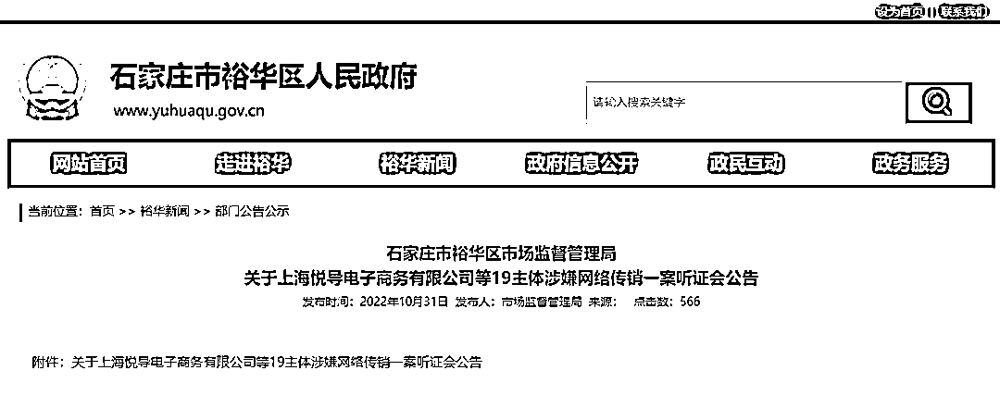
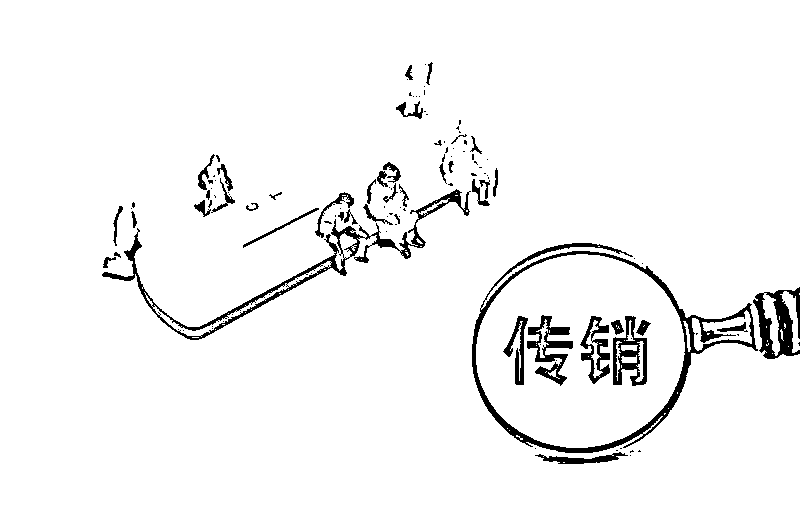

# 明星张庭夫妇等涉传销听证会已结束！关于传销，你还需要知道哪些细节？

> 原文：[`mp.weixin.qq.com/s?__biz=MzIyMDYwMTk0Mw==&mid=2247546312&idx=5&sn=ddbcf46b772e7e3bbfa3aecc2edc66a3&chksm=97cbfef0a0bc77e69d003d5f2d50d2d66e5fd79bbf8979462674361d7f78280c9bfbdb40222a&scene=27#wechat_redirect`](http://mp.weixin.qq.com/s?__biz=MzIyMDYwMTk0Mw==&mid=2247546312&idx=5&sn=ddbcf46b772e7e3bbfa3aecc2edc66a3&chksm=97cbfef0a0bc77e69d003d5f2d50d2d66e5fd79bbf8979462674361d7f78280c9bfbdb40222a&scene=27#wechat_redirect)

据媒体报道，演员张庭夫妇、陶虹等 19 主体涉嫌网络传销案听证会已于 11 月 7 日晚间结束。

该案件听证会历时 4 天，受到社会各界持续关注。据了解，石家庄裕华区市场监管局的办案人员在听证会上出示了相关证据，“TST 庭秘密”的约 30 名代理律师主要从管辖权、鉴定机构等方面陈述了意见。

尽管**目前听证会尚未公布结果，**但此事无疑又将传销的话题重新拉回了公众视野。

抛开个案，

**关于传销，**

**还有一些细节值得关注。**

****从法律上说，何为传销？**** 

****传销是怎么出现的？****

****在当今互联网时代，****

****传销又发生了哪些变化？****

****新型传销有何特点？****

****怎样识别？****

****又该如何应对？****

**为此，**

**法报君特别邀请**

**北京师范大学法学院副教授印波**

**为大家逐一讲解。**

****

****问：什么是传销？****

******印波：****从法律上解释，传销是指组织者或者经营者对被发展人员以其直接或者间接发展的人员数量，或者以销售业绩为依据计算和给付报酬，或者要求被发展人员以交纳一定费用为条件取得加入资格等方式牟取非法利益，扰乱经济秩序，影响社会稳定的行为。******

******传销是违法的。根据刑法第 224 条的相关规定，组织、领导以推销商品、提供服务等经营活动为名，要求参加者以缴纳费用或者购买商品、服务等方式获得加入资格，并按照一定顺序组成层级，直接或者间接以发展人员的数量作为计酬或者返利依据，引诱、胁迫参加者继续发展他人参加，骗取财物，扰乱经济社会秩序的传销活动的，就构成组织、领导传销活动罪。******

********问：传销是怎么出现的？********

**********印波：**传销和直销都是无店铺交易的衍生模式。这种商业模式始于 20 世纪三四十年代，由美国纽崔莱公司（后并入安利公司）首先启用。********

******当时的纽崔莱公司研发了诸多营养品和保健品，但由于人们并没有使用这些新型商品的习惯，为打开市场，纽崔莱公司想到了通过人际关系口耳相传的方式来经营，并设计一定的分享模式，让推荐人从被推荐人身上获取一定提成，使消费者同时成为经销商。这种模式很快赢得了市场，并被迅速扩张。但在这之后，这种商业模式由于其独具的裂变效应被一些不法分子用于金融骗局中。******

******这种新营销模式进入我国后，由于当时我国市场经济发展尚不成熟，对于这种新营销模式监管还不到位，人们的判断能力相对较弱，于是一些人利用多层次直销的模式经营道具商品，或者搞纯粹的资本运作，将其演变为金字塔式传销。******

********问：传销都有哪些类型？********

**********印波：**《禁止传销条例》第七条规定了传销的三种法定类型：********

******（一）组织者或者经营者通过发展人员，要求被发展人员发展其他人员加入，对发展的人员以其直接或者间接滚动发展的人员数量为依据计算和给付报酬（包括物质奖励和其他经济利益，下同），牟取非法利益的； ******

******（二）组织者或者经营者通过发展人员，要求被发展人员交纳费用或者以认购商品等方式变相交纳费用，取得加入或者发展其他人员加入的资格，牟取非法利益的； ******

******（三）组织者或者经营者通过发展人员，要求被发展人员发展其他人员加入，形成上下线关系，并以下线的销售业绩为依据计算和给付上线报酬，牟取非法利益的。******

********我们可以总结为“拉人头”“收取入门费”和“团队计酬”。**“拉人头”“收取入门费”+“骗取财物”=传销诈骗，很可能构成组织、领导传销活动罪。如果仅仅是“团队计酬”，则应当被行政处罚，不构成组织、领导传销活动罪。******

********问：新型传销都有哪些特点？********

**********印波：**第一，在性质上新型传销采取了一定的创新形式和形态。譬如互联网、区块链、元宇宙等等新形态都可能成为新型传销的“包装”，比如近几年出现的一些以电商、微商等名义开展的新型传销行为。********

******第二，在组织结构上，传销组织有很多层，呈金字塔结构。传销必然是人传人、人拉人的，如果画成结构图，则必然是金字塔形状或者整体上是金字塔形状的，其结果是将大量底层的资金上抽，最终集中于金字塔顶端的少部分人。******

******第三，在销售产品方面，传销活动中，由于其从业人员本身所贩卖的就是一种投资行为，所以产品在传销过程中只是一个可流通的道具，有的传销活动中甚至没有产品。******

******第四，在传销活动中，组织者的收入来源是入门费、培训费、资料费或强行购买产品费用等，组织者利用后来的参加者交纳费用支付先前的参加者的报酬以维持运作，是非法的。******

******第五，产品的售后服务不同。传销从一开始就只是把商品当作一种赚钱的工具，无法提供售后服务，有的组织者还会尽可能地逃避责任。******

********问：如何识别传销？********

**********印波：**通俗来讲：一是**有没有推荐、层级关系，**如果有，则很可能是传销；********

******二是**有没有实体商品或者服务，**如果不存在商品，或者系虚拟商品，则很可能是传销；******

******三是如果存在商品，但是**商品没有或很少为终端消费者真正消费、使用，造成大量资源浪费，**则商品可能是传销道具；******

******四是**判断商品是否物有所值，**如果商品售价违背市场价值规律，与自身综合成本之间产生巨大价差，远高于同类型商品售价，则商品容易沦为人际累计的掩饰，则很可能是诈骗型传销；******

******五是**判断经营过程是以销售商品还是以兜售盈利模式为主导。**如果是一味兜售盈利模式，以教唆如何牟利，宣扬“躺着挣钱”为主，遮蔽商品销售，则可能是传销；******

******六是**判断有无合适退出机制和退换货制度。**如果加入后需不断囤货，基于各种条件无法退出或退换货，则商品可能仍旧是虚置的，本质上仍为传销。******

********问：传销都要面临哪些法律责任？********

**********印波：**根据我国《直销管理条例》和《禁止传销条例》的规定，如果从事直销行为，应当依法登记；如果没有经过登记批准，则由市场监督管理部门作出行政处罚。如果系传销行为，则可以根据《禁止传销条例》予以处罚。为了打击传销犯罪行为，我国刑法修正案（七）中增加了对传销犯罪的规定，除了严格依照非法经营罪追究犯罪嫌疑人和被告人的刑事责任之外，应当依法对直接责任人员和首要分子严加惩处。********

******同时，在传销活动中，如果有绑架、非法拘禁、虐待、伤害等行为的，要数罪并罚。******

********问：发现自己“被传销”了怎么办？********

**********印波：**市场监管部门和公安机关是接受相关举报和投诉的主要部门，具体负责在各自的职责范围内查处非法传销行为。如发现自己被骗参与传销活动后，要注意收集证据。包括汇款账号、汇款凭证、交费收据、介绍人及更高级上线人员的姓名、电话，传销活动的详细地点等相关证据线索，并及时拨打市场监管部门“12315”热线电话或公安部门“110”报警电话举报求助。********

********问：怎样防范传销？********

********印波：**对企业来说，应注重依法经营，以防陷入传销旋涡，要改变交钱就能成为代理商的传销弊病，设置真正意义上的、规范的准入资格；对个体来说，要注意学习了解相关法律法规，掌握识别传销的基本知识，树立勤劳致富、传销违法、拒绝传销的防范意识。******

******来源：法治日报，巴蜀反诈******

************

******欢迎关注灰产圈社群服务号******

************************

******← 向右滑动与灰产圈互动交流 →******

************