# 某大学新生把隔离早餐扔垃圾桶，发文称“狗都不吃”？家长身份曝光惹争议

> 原文：[`mp.weixin.qq.com/s?__biz=MzIyMDYwMTk0Mw==&mid=2247546358&idx=1&sn=91c9ac8110ec0f696a00f498a4c7206b&chksm=97cbfecea0bc77d89f78c2659d49408a43ce1d1f5083f540c12aef27afa83fb24d327cc16863&scene=27#wechat_redirect`](http://mp.weixin.qq.com/s?__biz=MzIyMDYwMTk0Mw==&mid=2247546358&idx=1&sn=91c9ac8110ec0f696a00f498a4c7206b&chksm=97cbfecea0bc77d89f78c2659d49408a43ce1d1f5083f540c12aef27afa83fb24d327cc16863&scene=27#wechat_redirect)

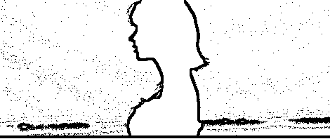

大学生这个词听起来，就是很有教养，高素质的人。

但也许也不是所有的大学生都是那么有素质有教养吧！

毕竟“林子大了，什么鸟都有。”

粮食作为人们的必需品，自然也应该知道粮食是多么的珍贵，节约粮食一直也是我国的传统美德。

可就在河南有一名女学生，就因为早餐不是自己所满意的，就将早餐直接丢进了垃圾桶，还配文“只配待在垃圾桶里“。

这一言论一发出，就引起了轩然大波。

01

因为疫情的原因，很多学生上课都成了问题。

大多数的学校都还处于停课的状态，而各别高校采用的是全封闭式管理。

封闭式管理的主要原因是因为学生们都是来自各个地方，如果贸然停课回去，有不小的感染风险。

但没停课，但也不代表就是正常上课。

疫情比较严峻的情况下， 高校采取的是宿舍隔离的方法上网课。

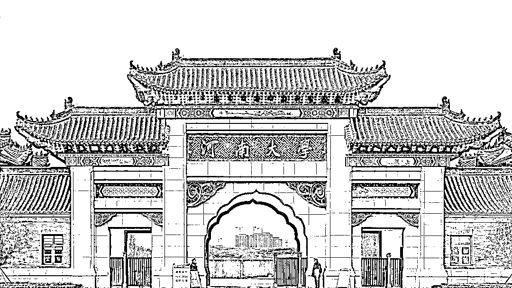

河南大学为了学校师生的人身安全，安排师生在宿舍进行有规律的学习和生活， 

**为保障师生的衣食住行，早餐都是由****食堂准备好后，学校的老师统一给学生进行发放。**

正常来说学生们都应该感谢老师们的辛勤付出。

但偏偏就出现了这么一个“例外”，一位女生把老师送来的隔离餐丢弃在垃圾桶，

**还配图发朋友圈，**** 这玩意连狗都嫌弃。**

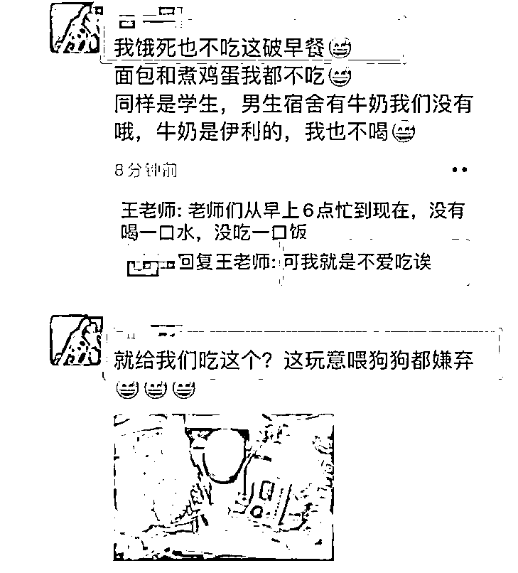

虽然面包牛奶鸡蛋，不是什么很精致的早餐，但在疫情期间有这样的早餐可以说是非常不错了。

可这位女生却丝毫不觉得，在朋友圈发文表示：

**“这种东西只配待在垃圾桶里，而不是人的肠胃”**

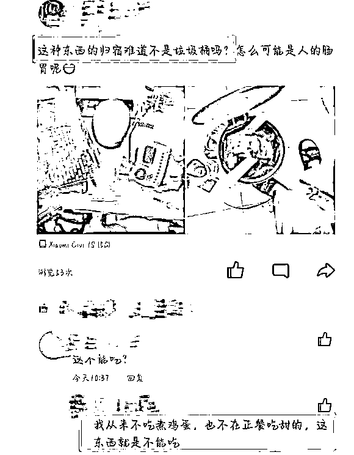

女生发了一条朋友圈未能解气，连着发了好多条表达自己的不快，

与此同时，我们也可以从下方老师的回复中得知，老师们从早上六点开始，一直都没有吃饭。

面对老师的提醒，该女生不思悔改，反而变本加厉，表示自己就是不爱吃。

不久后，该学生再次更新状态，将面包与牛奶扔进宿舍垃圾桶，配文“扔了，拜拜了您嘞。”

并在该状态下再次表示：“早餐弄成这个样子就已经是对食材的侮辱了，是逼着我浪费。”

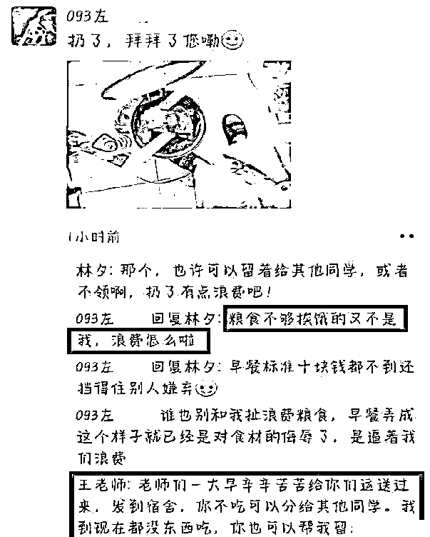

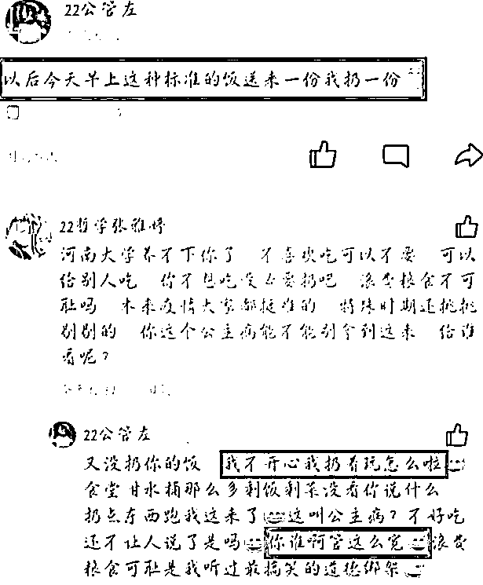

面对老师和其他学生的好言相劝，

这个女生不但没有因此而感到惭愧，反而乘胜追击又更新了自己的内心想法，

并且，她还声称，日后按这样的标准送来一份我就扔掉一份。

摆出一副无所谓的状态，就好像是没有人能拿她怎样一般，

真不知道这位女生有多高贵，难道说她是富二代，天生公主命？有网友爆料了她的家境，网友议论：这女孩被惯坏了。

02

现在进行封闭式管理的大学并不是只有河南大学，

接受封闭管理的学生也不是只有一个，

学校会尽可能地对学生作出妥善合理的安排，学生也能够理解现在的情况，

**但是这女大学生扔掉免费隔离餐的行径着实让人气愤。**

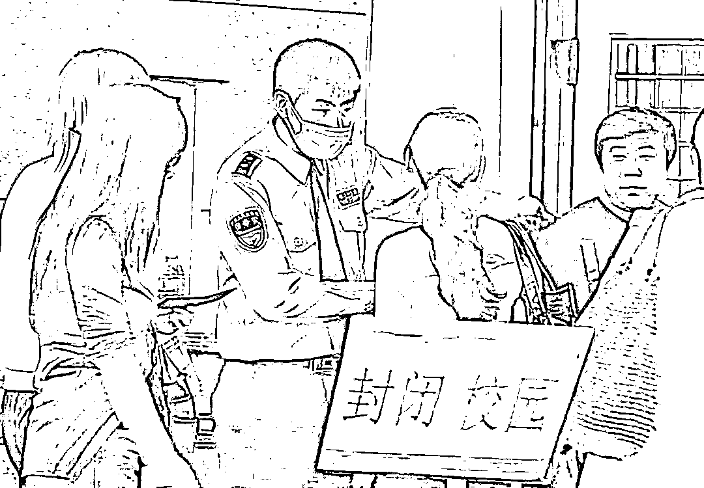

这种浪费粮食还理所应当的言论，不但引起全校师生的众怒，

**更是扩散出了学校内部，引发大量网友的口诛笔伐。**

有网友说应该让她去农村体验一年怎么种地，让她知道粮食从地里长出来是多么的不容易。

**还有些网友直言要求学校对此事严肃处理，不能助长这样的风气，**

食物不喜欢可以不领，专门领上之后扔掉明显是道德水平的严重缺失。

此次事情发生之后，女生的同学说女生曾公开表示自己的就业目标是考公，

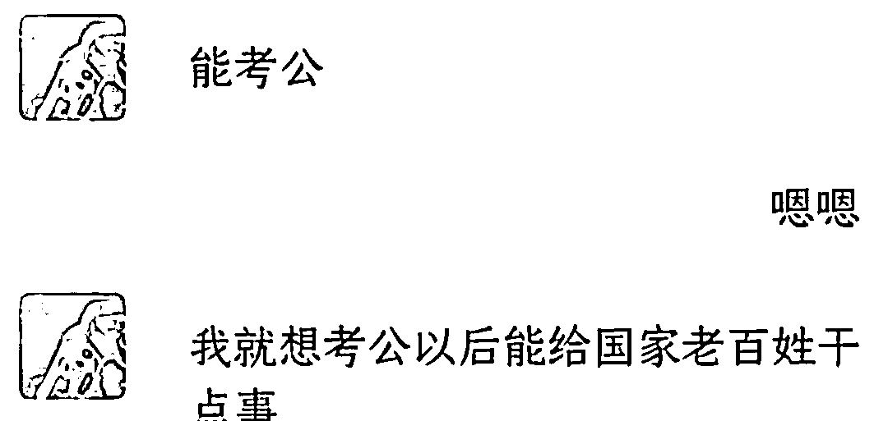

要身体力行地问国家老百姓干点事，可是这样的行为哪里是像能为国家和老百姓做事的样子的，

**“不开心就扔着玩”的脾气老百姓是指望不上的。**

如今社会生活变好了，00 后的生活大概率都不差，

**正如这位“小仙女”有父母源源不断的钱供应就嚣张惯了。**

也不想一想现在有父母罩着，以后会不会经历社会的毒打呢？

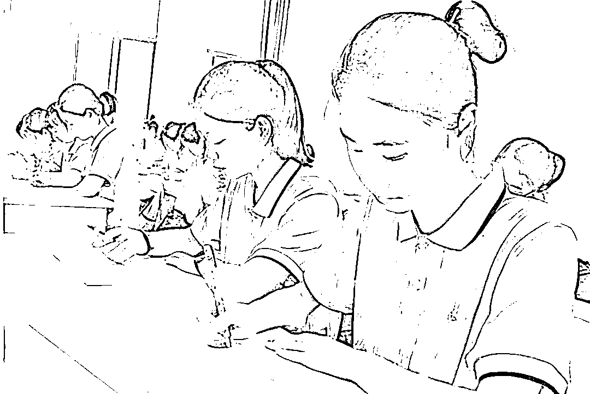

**据同学爆料她父母都是在体制内工作，看她的做派，**

她家里一定有吃不完的山珍海味，穿不完的昂贵国际品牌服饰，

用不尽的昂贵国际品牌包包，花不尽的美金欧元。

03

一直到当天下午，眼见事情越闹越大，引起了一定的舆论。

该女生才发表了检讨声明，然而众网友看后纷纷认为，这份阴阳怪气的检讨让人看了极度不舒服。

**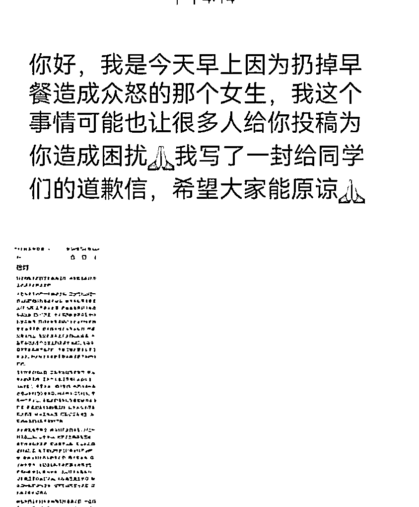**

 有网友说，“还要当志愿者，吓死我了。” 还有网友吐槽，“这要是道歉的话，我就真成文盲了。

检讨中言语阴阳怪气，明嘲暗讽，并没有向公众道歉，

**基本都在为自己的不理智行为找理由开脱，并没有看出这名女生多大的悔意。**

**而是给被扔掉的食物道起了歉。**

对此，网友也是表示：“行啊，只要食物不开口说原谅你，你就接着道歉吧。”

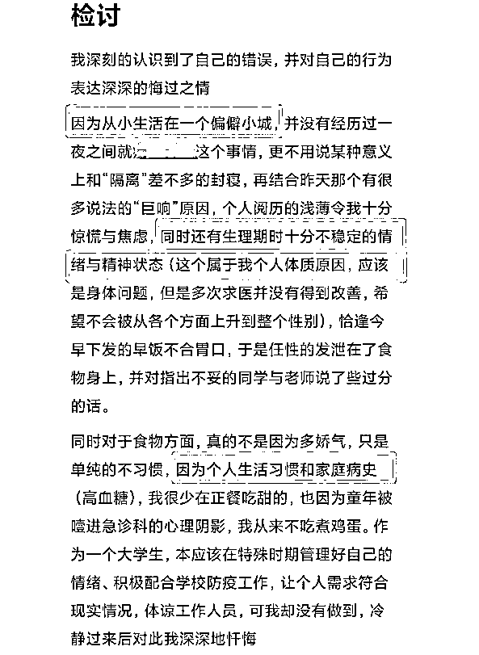

虽然在道歉中表明了自己的不吃面包和鸡蛋的原因，

**是因为身体不适导致，但是这并不是她扔掉食物的借口，**

不爱吃面包、鸡蛋都能理解，可以不领，也可以跟学校协调，或者留给别的同学，没必要这样糟蹋粮食，还发到网上炫耀。

 何况学校还有别的老师、学生没吃到，实在不必如此。

这不仅是在浪费粮食，更是对不起辛苦准备的食堂阿姨和老师们。

**然后这名女生又甩锅给网络暴力，说自己只是私下发发牢骚，**

却不承认自己作为一个大学生，在那么多老师同学都能看到的社交账号上，

发表这些三观不正的内容，难道意识不到发这些东西会引发什么后果么？

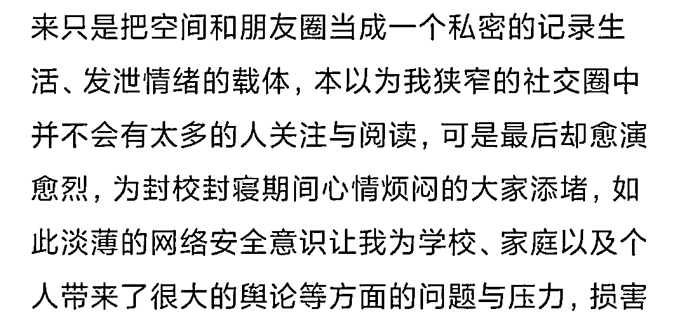

写到后面，这名女生干脆就不装了，

**直接阴阳怪气暗讽这些食物不够档次、给猫吃都不配，**

合着人家老师为你们学生忙前忙后，自己人都顾不上吃的饭，

**结果在这女生眼里还不如喂小动物的口粮？**

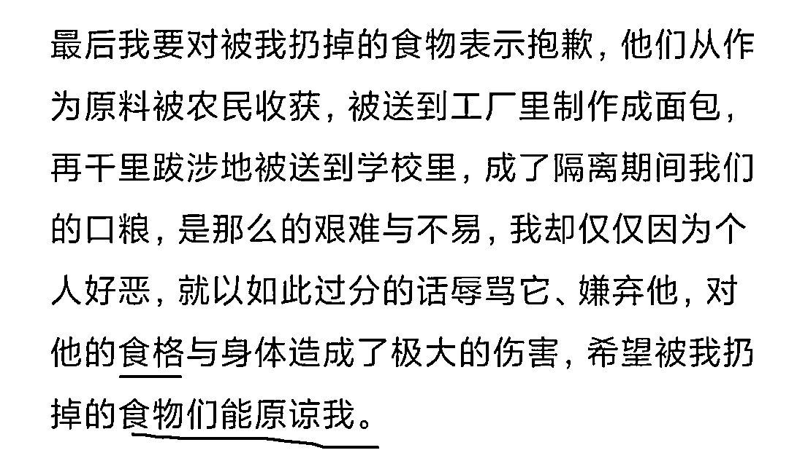

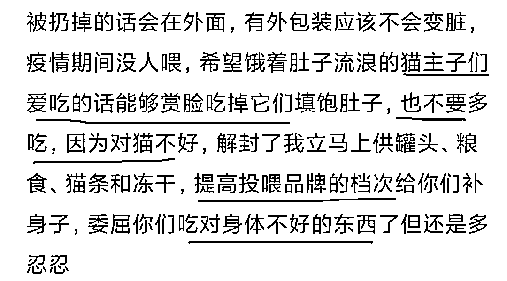

女生看似是在做了检讨，但实际上并没有认识到自己的错误，

**只不过是迫于压力不能不做出表示，在字里行间都能看出女生的不情不愿，**

拿一份检讨糊弄大家，但是大家的眼睛是雪亮的，大家对此并不买账。

**河南大学也对该名女生的不当言论进行了通报批评，**

希望她能意识到错误，改过自新。

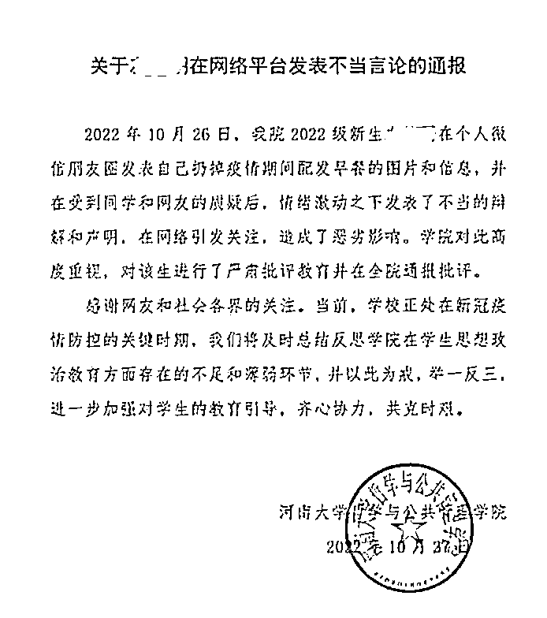

果真是应了网友的那句话，还是不能让有的人吃太饱了。大家引以为戒吧！

04

现在大学的校园封闭对于大学生来说其实是一种锻炼，在这样的疫情影响下，很多物资供给不足，导致大学生的生活水平确实是在一定程度上有所降低。

但所谓“吃得苦中苦方为人上人”，这么一点磨难就不能承受，那么未来也不会有什么好的发展。

**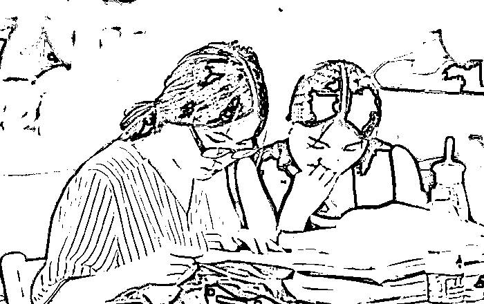**

**大学是学生学习的地方，不是享乐的地方。**

大学生要清楚自己的责任，不要本末倒置，学习能够提升一个人的学识和见识，更能提升一个人的格局和视野，只有不断的丰富自己才能站在更高的位置上看问题。

大多数学生都是接受过高等教育的人，看待问题要客观、理性，对待事情要保持清醒，不能仅凭自己的“意愿”行事，最后影响的只会是自己。

还有最重要的一点是要懂得感恩和珍惜。

感恩老师的辛勤付出和珍惜劳动人民的劳动成果。

作为学校也应该加强对学生的思想教育以及行为规范，

每个人都要为自己的行为买单，“不是不报时候未到”，那个“惩罚”会在将来的路上等着你。

来源：幸福小酒馆

欢迎关注灰产圈社群服务号

← 向右滑动与灰产圈互动交流 →

