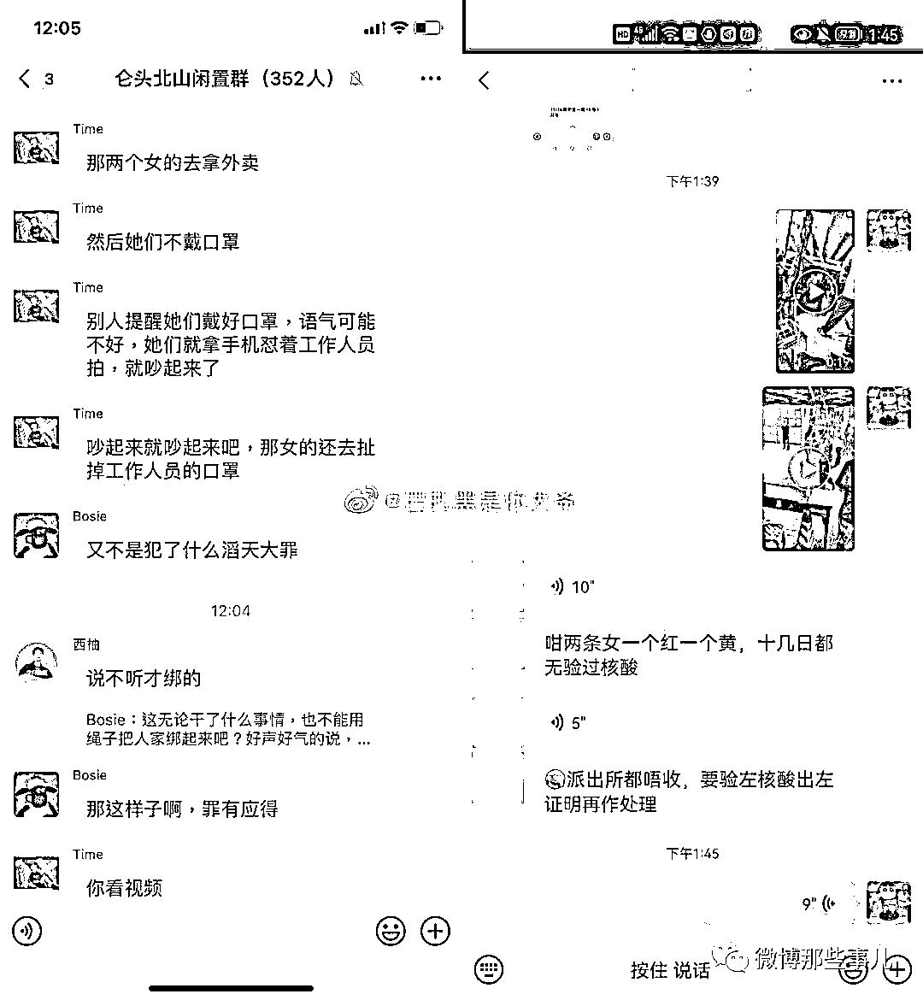
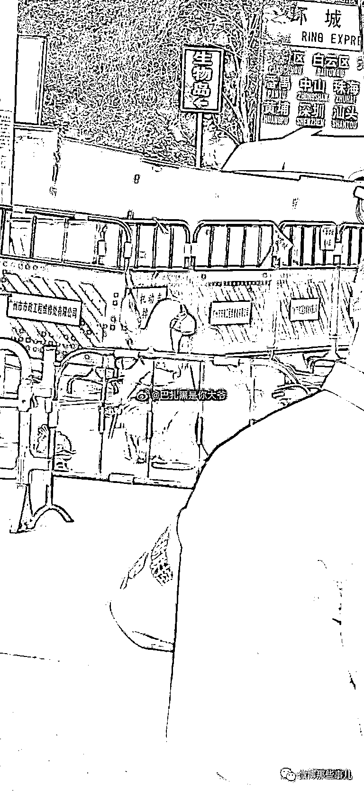
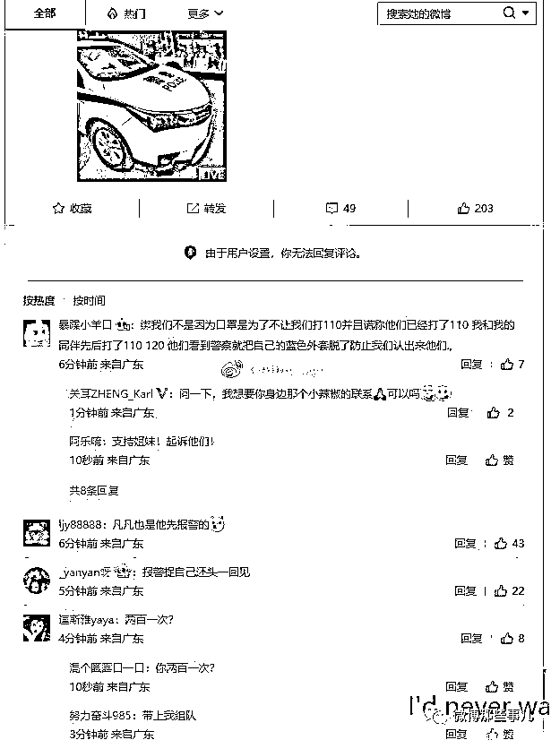
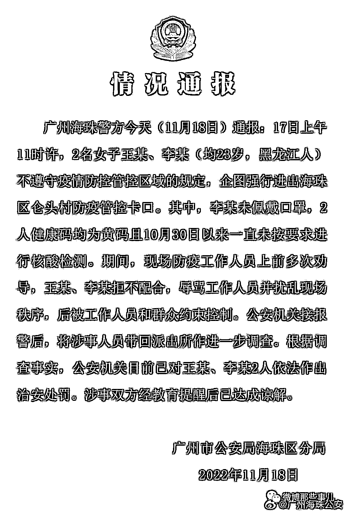

# 两黄码美女疑未戴口罩被反绑跪地，警方：不配合防疫，被工作人员和群众约束控制

> 原文：[`mp.weixin.qq.com/s?__biz=MzIyMDYwMTk0Mw==&mid=2247546358&idx=3&sn=dfa8ca7ab23fb87a2fc3644788c5d1bd&chksm=97cbfecea0bc77d876e73b35f59294b708d1d8948c51e857077bc258a2bbae17c830c4aa3554&scene=27#wechat_redirect`](http://mp.weixin.qq.com/s?__biz=MzIyMDYwMTk0Mw==&mid=2247546358&idx=3&sn=dfa8ca7ab23fb87a2fc3644788c5d1bd&chksm=97cbfecea0bc77d876e73b35f59294b708d1d8948c51e857077bc258a2bbae17c830c4aa3554&scene=27#wechat_redirect)

2022 年 11 月 18 日，一段“女子疑未戴口罩被反绑跪地”的视频在网络上疯狂传播，引发了全网的热议。

[`v.qq.com/iframe/preview.html?width=500&height=375&auto=0&vid=x336320hlna`](https://v.qq.com/iframe/preview.html?width=500&height=375&auto=0&vid=x336320hlna)

从网友分享的视频画面可以看出，事发地疑似为广州海珠区仑头村，当时有两名人员与现场的防疫人员发生了言语冲突，在冲突的过程中，身穿黑衣的女子被一名男子摔倒在地，然后被多人反绑住手脚，而另外一名女子也未能幸免，被反绑后跪倒在地。

[`v.qq.com/iframe/preview.html?width=500&height=375&auto=0&vid=m3363esvbdd`](https://v.qq.com/iframe/preview.html?width=500&height=375&auto=0&vid=m3363esvbdd)

网传的事情经过：

最后还是给她带上了口罩

网传涉事女子的回应：

最终，此事迎来了警方的正式通报： 

广州海珠警方通报：17 日上午 11 时许，2 名女子王某、李某（均 23 岁，黑龙江人）不遵守疫情防控管控区域的规定，企图强行进出海珠区仑头村防疫管控卡口。

来源：微博那些事儿

欢迎关注灰产圈社群服务号

← 向右滑动与灰产圈互动交流 →

