# 聊城一阳性感染者白天救狗，晚上卖狗

> 原文：[`mp.weixin.qq.com/s?__biz=MzIyMDYwMTk0Mw==&mid=2247546358&idx=4&sn=378e4357ad1fc7d24b77ff4f38f942e0&chksm=97cbfecea0bc77d853659965ecf67a42e831098d1008e0014100c29cb23ee61245e46eb53d7a&scene=27#wechat_redirect`](http://mp.weixin.qq.com/s?__biz=MzIyMDYwMTk0Mw==&mid=2247546358&idx=4&sn=378e4357ad1fc7d24b77ff4f38f942e0&chksm=97cbfecea0bc77d853659965ecf67a42e831098d1008e0014100c29cb23ee61245e46eb53d7a&scene=27#wechat_redirect)

近日，山东聊城，

一份寻找阳性感染者

轨迹重叠人员的内容

引起社会关注，

官方公布的流调轨迹显示，

**该阳性患者上午或下午**

**去聊城市流浪狗救助点，**

**然后晚上出现在狗市，**

**摆摊卖狗。**

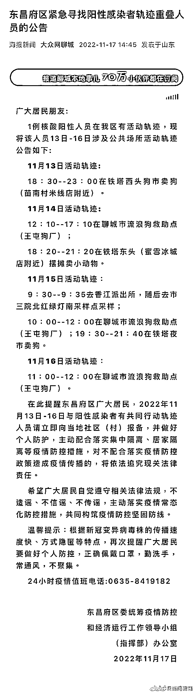

（来源：海报新闻）

轨迹公布后，

立刻引发社会广泛关注，

有人质疑，

这会不会是**“假救狗，真牟利”？**

**也有人认为，** 

****卖狗，又不是卖狗肉，****

**给流浪动物再次找个家，**

****没什么不好。****

****救助站？繁殖场？****

****轨迹中的“聊城市流浪狗救助点”**** 

****后面还标注了“王屯狗厂”。**** 

****记者搜索发现，**** 

****根据当地媒体此前的报道，****

****聊城市王屯村确有一处流浪狗救助站，****

****负责人曾表示，****

******市民捡到或警方捕捉到流浪狗，******

******甚至是宠物狗主人无法饲养的，******

******都可以送到救助站来“寄养”，******

******并不收取任何费用。******

****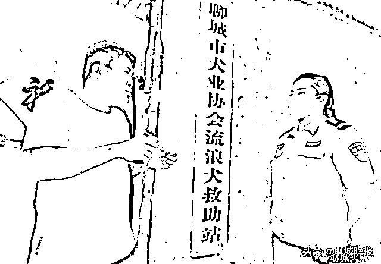****

****日常运营的费用从何而来？**** 

****负责人表示，****

******救助站没有固定的经费来源，******

****照顾这些流浪犬的费用，****

****多是协会想办法筹集来的，****

****再加上社会爱心人士的捐助，****

****救助站勉强可以运转。****

****根据《聊城市养犬管理条例》，****

****被收容的犬只，**** 

****可在规定时间内开放领养，****

******超过一定期限无人领养的，****** 

******由犬只收容救助场所依法处理，******

****处理细则并未在条例中说明。**** 

****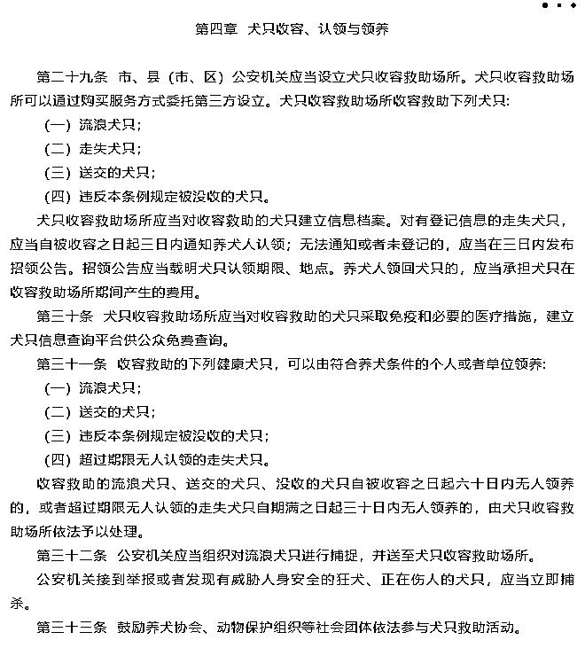****

****11 月 19 日，****

****有网友发文称，****

****该阳性人员到访的流浪动物救助站****

******“实际上是一个繁殖场，******

******与流浪狗救助并无关系。”******

****同时，****

****有网友猜测，**** 

****这就是一起**“伪救助”**事件，****

****有人假装领养流浪狗，**** 

****免费带走犬只后，****

****再拿到狗市上卖掉，****

****以此**“无本牟利”。******

******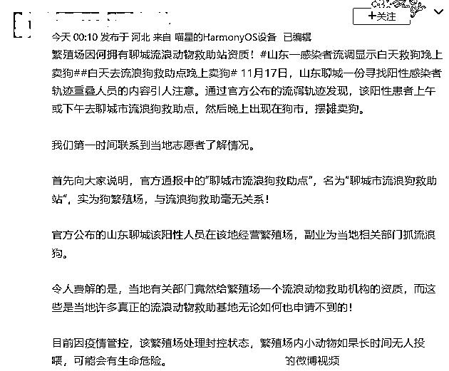******

******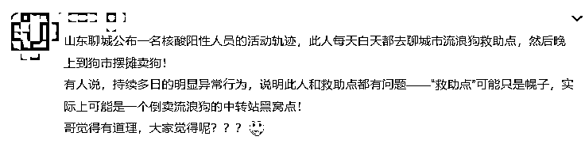******

******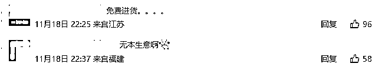******

******同时，也有网友猜测，****** 

******这会不会是******

********处理收容超时犬只的一种方式？********

****另外，**** 

****流浪动物收容、救助开展艰难，**** 

******救助站在收入微薄的情况下，****** 

******把流浪动物卖掉，****** 

******也无可厚非。******

****一方面可以妥善安置犬只，****

****另一方面，****

****也为救助站“回点血”，****

****“不能叫人总是为爱发电吧？”****

****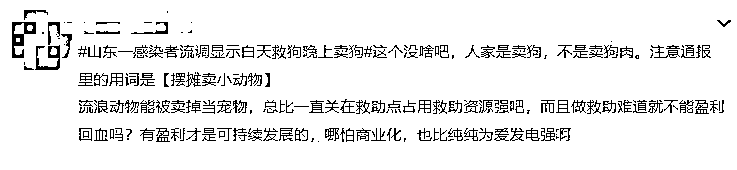****

****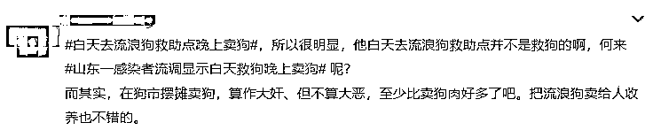****

****该阳性人员是“领养人”****

****还是救助站的“工作人员”？****

****其到访的“狗厂”，****

****是“繁殖场”还是犬协救助站？****

****截至发稿，**** 

******当地尚未公布事件调查细节。******

****但关于流浪动物收容救助的话题，**** 

****再次掀起了热议。****

******流浪救助体系有待完善******

******怜爱弱小是人类本能，******

******流浪动物能激起人们的怜悯，******

******许多人都会出于好心，****** 

********照顾或投喂**流浪的猫狗，******

******也有许多爱心人士自发地救助流浪动物，******

******建立的**民间救助基地，********

********遍布全国。********

********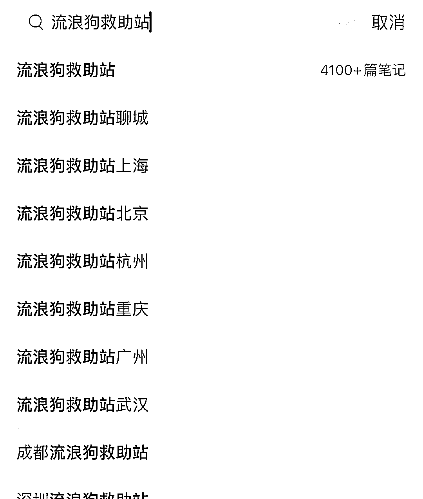********

********然而，********

********由于弃养等不文明养宠行为的出现，********

**********城市流浪动物越来越多，**********

********导致救助的难度日益增大。********

******在这样的背景下，******

******不少民间救助机构举步维艰。******

******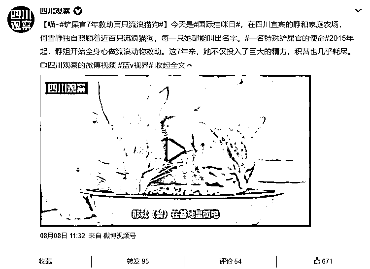******

******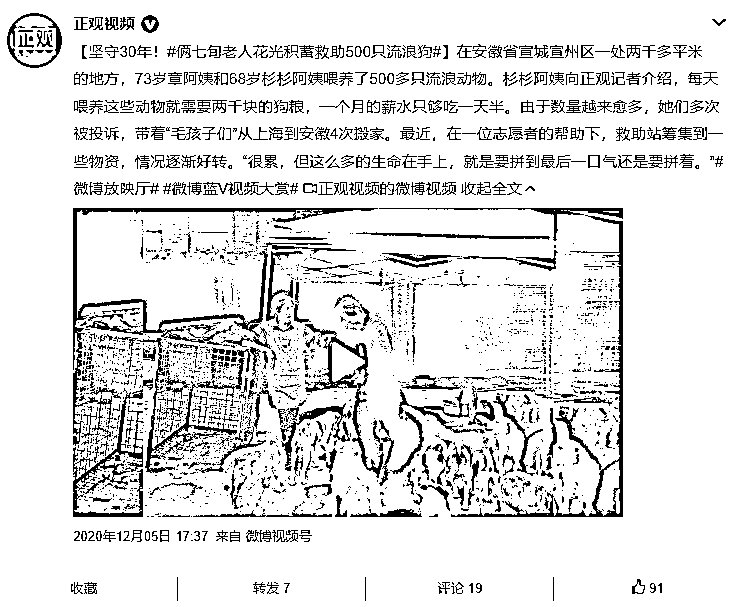******

******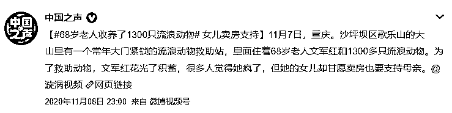******

******许多热心人看到流浪动物，****** 

******自己无力参与救助时，****** 

********便会在网上发布相关信息，********

********呼吁“动物救助机构”来“救救它们”。********

******而不断接到救助、收容流浪动物的请求，******

******是摆在一些民间动物救助基地******

******以及相关公益组织面前的难题。****** 

******此前，******

******湖北省武汉市小动物保护协会******

******会长杜帆曾告诉记者，******

******他们收留的动物数量已达到饱和，******

******再收留就会“出问题”。******

********没有哪个救助站，******** 

********能够做到有多少收多少，********

******杜帆无奈地表示，******

******对于那些“来者不拒”的救助组织，****** 

******反而要提高警惕。******

******他还表示，****** 

******真正专心搞救助的组织和机构，******

******没时间去拍摄精致的视频，****** 

********互联网上，********

********不乏有人通过编故事“卖惨”，********

********骗取爱心人士的“捐助”。********

******记者搜索发现，****** 

******此前便有媒体曝光过，******

******某博主**疑似****利用“流浪狗救助”的噱头，******** 

**********骗取打赏金额。**********

******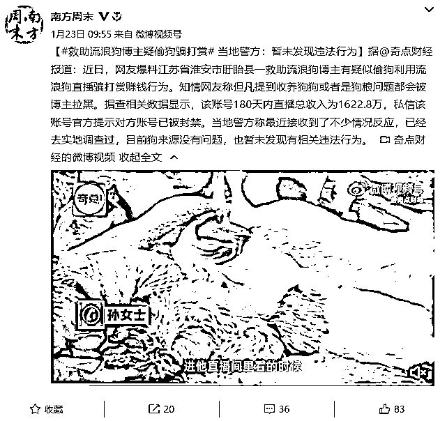******

******民间一直有**“领养代替购买”**的呼吁，****** 

******但实际上，******

******“领养难”也是流浪动物面临的一大痛点。****** 

******不少网友表示，******

******自己有心收养流浪猫狗，******

******但一些救助机构或救助人******

********开出的领养条件，********

********实在让人无法接受。********

******又是要上门回访，******

******又是让留下身份证复印件，****** 

********过多牵涉个人隐私，********

********让人望而却步。******** 

******另外，****** 

******流浪猫狗的性格难以确定、年纪较大，******

******没有幼年时期可爱、“好养”，******

******这也是他们顾虑的一部分。******

******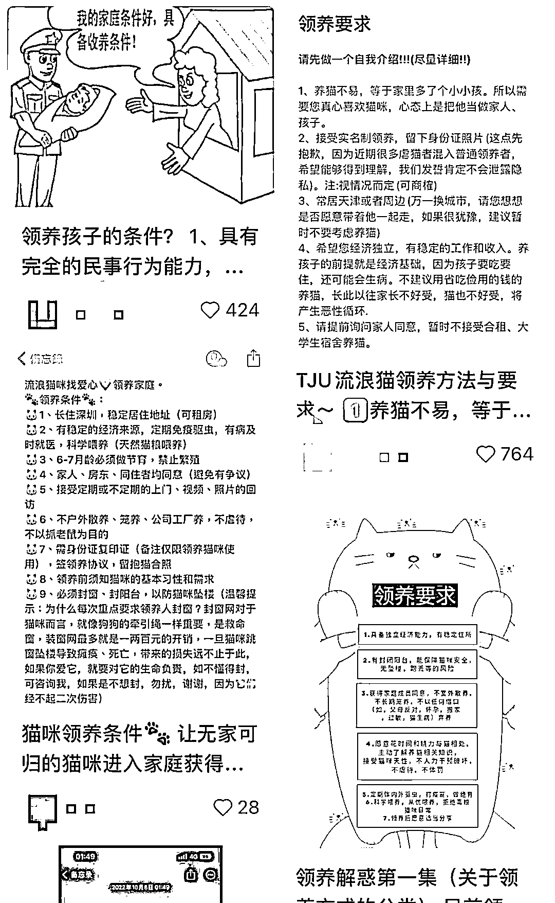******

******而对此，****** 

******也有救助人表示，****** 

******开出这样严苛的领养要求，******

********是为了避免自己好不容易救下的动物********

********被别有用心的人轻易带走。********

******该严还是该松？******

******双方争执不下，******

******还在网络上发酵出了一场场“骂战”。****** 

********要救助，更需要管理******** 

********专家认为，******** 

**********流浪猫狗源源不断地产生，**********

**********是因为源头没有控制好，**********

********一方面是来源于普通养宠人的**弃养，**********

**********另一方面，**********

**********一些“繁殖作坊”**********

**********繁育出不合要求、品相不佳的宠物后，**********

************将其丢弃，************

********也成了流浪动物的一部分。******** 

**********如果不控制好源头，********** 

**********光靠救助是救不过来的。**********

********流浪动物的问题，********

********不仅在于影响市容市貌，********

********伤人、毁坏财物的事件，********

********近年来屡屡发生。********

****************

****************

********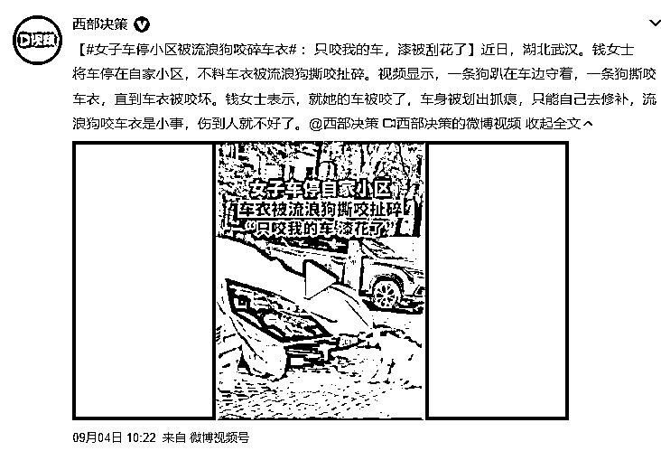********

********有人苦流浪动物久矣，********

********前段时间，还出现了********

**********公共场所“投毒”对付流浪动物的事件：**********

********[数十只猫狗死亡，有人故意投毒？警方已介入](http://mp.weixin.qq.com/s?__biz=MjM5NzI1MTY0MQ==&mid=2655008598&idx=1&sn=92273f3720bfc8397021f1eacdbbf747&chksm=bd6848008a1fc116480e192dd2994dc5f9b5e47ac591698f07bb6328abb5efd35e9e8765a69f&scene=21#wechat_redirect)******** 

********为了应对流浪动物问题，********

********许多地区也出台了**相关管理条例，**********

**********或开展**“文明养犬”专项整治行动，************

********清理流浪动物、设置救助站、********

********规范养宠行为等。********

**********对于投喂流浪动物的行为，**********

********法律也给出了一定约束，******** 

******前段时间，****** 

******陕西西安阎良区人民法院******

******在审理一起流浪狗咬人案件时，******

******也认定该流浪狗的长期投喂人，******

******需要对此事负一定责任。******

******对于流浪动物，******

********保护之外更需管理，********

******建设动物文明，******

********还需要全社会共同的努力。********

******流浪动物的收养与救助，****** 

******你怎么看？******

******评论区分享你的看法↓↓↓******

******来源：中国新闻周刊、法治日报、海报新闻、聊城晚报、聊城市东昌府区新区街道办事处、南方周末，央视网综合，宾曰语云******

************

******欢迎关注灰产圈社群服务号******

************************

******← 向右滑动与灰产圈互动交流 →******

************