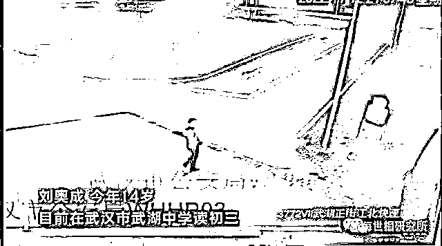
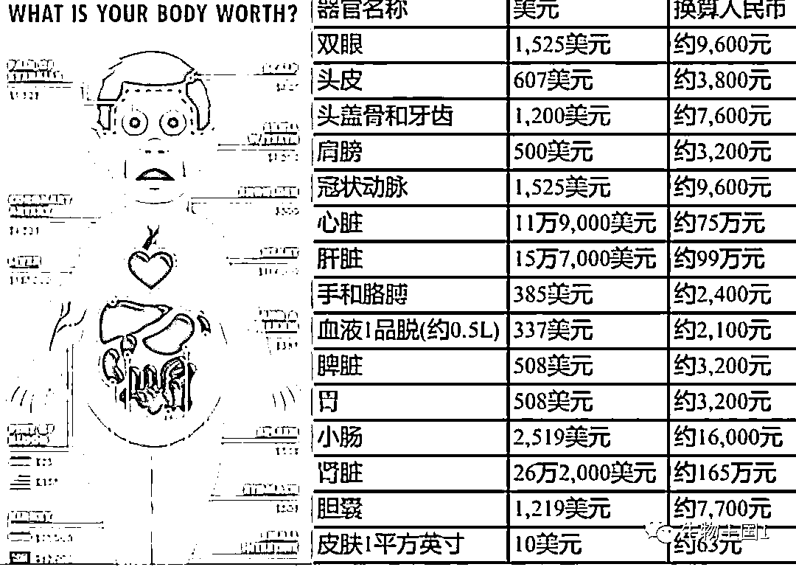
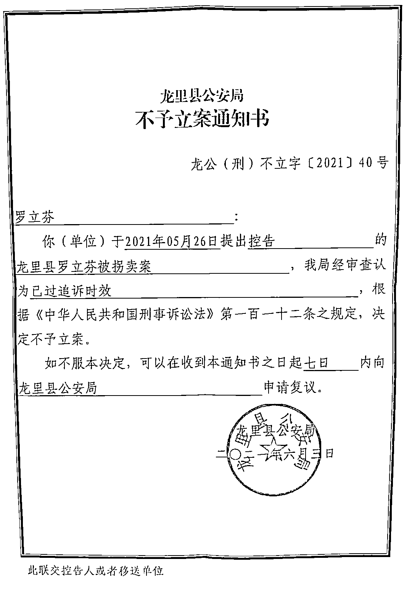

# 一个孩子失踪，只是当事家庭的悲剧；一群孩子失踪呢？

> 原文：[`mp.weixin.qq.com/s?__biz=MzIyMDYwMTk0Mw==&mid=2247546358&idx=5&sn=f19fca3e4bd197867e0b25b66222716b&chksm=97cbfecea0bc77d893f840616c70e3c2c7b7c33fb09ae6f8354ff8debe45bf514b0f115290d4&scene=27#wechat_redirect`](http://mp.weixin.qq.com/s?__biz=MzIyMDYwMTk0Mw==&mid=2247546358&idx=5&sn=f19fca3e4bd197867e0b25b66222716b&chksm=97cbfecea0bc77d893f840616c70e3c2c7b7c33fb09ae6f8354ff8debe45bf514b0f115290d4&scene=27#wechat_redirect)

**一**

昨天看到了一篇关于“江西上饶 15 岁男孩胡鑫宇在学校离奇失踪，已经一个月过去仍然没有任何消息”的文章，今天一早起来，发现了更多青少年失踪的新闻，不由心头一紧。

最新一则冲上热搜的消息是，武汉 14 岁男孩出门扔垃圾后失踪，已经 6 天杳无信息。

根据网传的消息， 2022 年 11 月 12 日晚 8 点半左右，家住武汉市黄陂区武湖正街光明路的 14 岁男孩小刘在出门扔垃圾之后，便再也没有回来，随后家人报警。

警方立即展开调查，前往事发地点并调取了附近的监控视频。小刘最后出现在监控中是在晚上 9 点多，地点是武湖正街江边篮球场小道，随后就消失不见，其他的摄像头便再也没有小刘的踪迹。

李女士回忆，最近孩子一直在家上网课，并没有发现孩子有什么异常，孩子的情绪一直很稳定，也没有与家人发生矛盾冲突。而且当晚，孩子出门的时候，并没有随身携带身份证以及钱包，所以不可能是有计划地离家出走。

那么，会去哪里了呢？

想想，一个好好的人，刚刚还一切如常地和你在一起，转眼就从这个世界悄无声息地蒸发。仿佛被一个看不见的黑洞吞噬。没有什么，比这更能证明世界的诡异与凶险了。

更令人后背发凉的是，最近一段时间以来，类似的青少年离奇失踪事件似乎多了起来。

10 月 23 日，广东广州区番禺区大石街道大兴村一 17 岁女孩离家失踪；10 月 31 日，江西赣州章贡区金星村一名 12 岁女孩失联；10 月 31 日，河南信阳市固始县北二环路一 13 岁女孩失联；

11 月 2 日，陕西咸阳市秦都区安虹路秦宝小区附近一 17 岁男孩失联；11 月 4 日，吉林 18 岁女生失踪；11 月 5 日，广东汕头市金平区中山路附近一 15 岁男孩失踪；11 月 5 日，广东茂名市化州市一 15 岁女孩失踪；11 月 7 日，贵州毕节市纳雍县文昌街道 12 岁女孩失联；11 月 15 日，四川南充高坪区育才街江东华府小区一 17 岁高二学生失踪……

我的一个乡友群里，也有人贴出了近期发生在老家的多起青少年失踪通报。

这也使我倾向于相信，并非青少年失踪现象陡然增加，而是它其实一直存在，只不过，当一起引发广泛关注的事件出现后，同类事件才更容易进入公众视野，正如徐州某女事件发生后，全国各地关于女性失踪的报道密集增加了。

**二**

现在所有人最大的疑问是，这些孩子究竟去了哪里？多起失踪案之间到底有没有关联？那么多监控摄像头，为何不是遇到死角，就是恰好坏了？

当然，考虑到正是叛逆的年龄，这些失踪的孩子中，不排除有离家出走的可能，也许过段时间就被找回或者自行回家了。但从过往的报道看，确实有些孩子是数年乃至数十年不见踪影，有些父母离世前也未能再见孩子一眼。

一个孩子失踪，对当事家庭来说是一桩悲剧，旁人可能在感慨、同情一番后很快忘却。但是，一群孩子失踪，却不能不令人产生危机感，产生各种恐怖联想——这样的一粒灰，下次会不会也猝不及防地落到自己头上？

很多人在网上看过一些令人毛骨悚然的失踪传闻。我印象深刻的一则传闻是，有人和女友出去游玩，女友突然不知所踪。多年后，他到东南亚某国旅游，其中一个项目是观看马戏团表演。猛然间，他发现了令他一辈子也难以忘记的一幕，一个参与表演的四肢全无的女人是他的女友，因为女友身上有他熟悉的胎记。

这样的传闻真实性待考，但我们有足够理由相信，这个世界上，确实存在远超常人想象的暗黑角落。

具体到最近失踪的这些孩子而言，他们的年龄在 12 岁到 17 岁不等，正是花样年华。这个年龄段的孩子有什么共性？从这个通道入手，也许我们可以找到关于答案的模糊光亮。

几年前媒体有报道，网络上出现了一种针对青少年的名为“蓝鲸”的自杀游戏，它像瘟疫一样，已经藉由社交网络从俄罗斯传到世界上的其他许多国家，包括英国、阿根廷、墨西哥，甚至中国。

“蓝鲸”游戏的参与者多为 10-17 岁的青少年。他们会被配置给一名“导师”，进群后，每天都要跟着这名“导师”做任务，包括凌晨 4:20 起床看恐怖片，静脉切割，半夜爬到屋顶，用剃刀在手上雕鲸鱼等。当病态的游戏进行到第 50 天，幕后“导师”就会命令玩家自杀。

我不是说最近这些失踪孩子是玩上了“蓝鲸”自杀游戏，我的意思是，他们有没有可能进入了某个群，受网络上某个神秘命令的欺骗而出走？

**三**

而另一种猜测则太过惊悚，以至于我不敢将它写出来。

我只能写出我个人的感受——不知为什么，一些原本很正常的正能量新闻，如某中部城市儿童医院同时进行了三台心脏移植手术、分秒必争，为生命接力，某航空公司地面服务部成功保障两例“无陪”活体器官运输，从交接器官运输箱到实现顺利登机，总用时仅仅 13 分钟……读着这样的新闻，因为摆脱不了某种联想——尽管也许这种联想是子虚乌有，我还是从中读出了一种挡不住的阴森感。

如果你不知道自己有多值钱，黑市会告诉你。美国一家网站公布了黑市人体器官交易的价格图，肾脏以 26.2 万美元位列第一，而肝脏和心脏分别以 15.7 万和 11.9 万紧随其后。根据这张图上的标价，如果将一个人的器官按照最高价格售卖，一个人的价格在 43400 万美元左右，折合成人民币在 3 亿上下。

接着说两件事。

其一，刚刚读到澎湃新闻于今天，也就是 11 月 19 日推出的一篇报道《“买主威胁我，再给家里寄信，就打掉我肚子里的孩子，把我转卖掉”》，讲的是贵州乡下姑娘汪祥慧在 1989 年被拐卖到河北，并被改名罗立芬，30 多年后终于返乡的故事。

整个报道中，最触动我的一个细节是，当汪祥慧希望追究当年“人贩子”的责任时，当地公安部门认为此案已超过二十年的追诉时效，故作出不立案决定。

龙里县公安局送达给汪祥慧（罗立芬）的《不予立案通知书》。受访者 供图 

其二，2020 年媒体报道，为进一步规范人体器官移植，国家卫健委对《人体器官移植条例》进行了修订，任何组织或者个人不得摘取未满 18 周岁公民的活体器官用于移植，构成犯罪的，依法追究刑事责任。

而《中华人民共和国刑法》234 条规定，组织他人出卖人体器官的，处五年以下有期徒刑，并处罚金；情节严重的，处五年以上有期徒刑，并处罚金或者没收财产。

我想说的是，起码，惩治手段应当体现应有的力道，比如，对“人贩子”应当终生追责，而不是设立一个二十年的追诉时效？组织他人出卖人体器官是重罪，不能五年以下起步，毕竟，有人掏了个鸟窝都被判了十年，我们的身体器官，怎么看也比鸟窝珍贵吧。

否则，我们拿什么阻止悲剧一再发生，拿什么避免它有一天降临到自己头上？

来源：世相研究所

欢迎关注灰产圈社群服务号

← 向右滑动与灰产圈互动交流 →

