# 足协杯爆冷？中超豪门北京国安队被甘肃县级队 7：5 淘汰

> 原文：[`mp.weixin.qq.com/s?__biz=MzIyMDYwMTk0Mw==&mid=2247546358&idx=6&sn=373e212aaa793c6f0d2e8e4ec03a7784&chksm=97cbfecea0bc77d89bf22a6c8aa525ceaaa1ed7b493b39c023d08eaf018737b32745574de0bf&scene=27#wechat_redirect`](http://mp.weixin.qq.com/s?__biz=MzIyMDYwMTk0Mw==&mid=2247546358&idx=6&sn=373e212aaa793c6f0d2e8e4ec03a7784&chksm=97cbfecea0bc77d89bf22a6c8aa525ceaaa1ed7b493b39c023d08eaf018737b32745574de0bf&scene=27#wechat_redirect)

对中国足球，相信大部分球迷

都是又爱又恨了

今天又看到了个足坛大新闻 

**北京国安被甘肃县级队淘汰**

一时间网友又骂声一片了

是过度自信还是没吃海参？？

这是对草根足球的激励

还是对职业足球的…

**国安输给县级队**

2022 赛季足协杯赛 32 进 16 

第二比赛日的一场比赛中

开场第 5 分钟，杜泽鑫任意球破门

中超豪门北京国安队 1︰0

但整个上半场泾川文汇的反击更具威胁

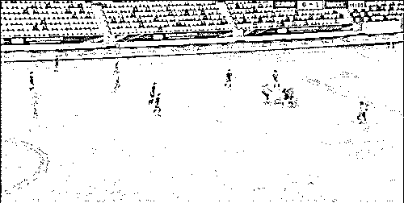

下半场第 50 分钟

泾川文汇门将因飞踹动作出击犯规被判罚点球

北京国安球员曹永竞主罚点球命中并取得领先 

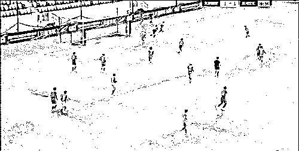

第 70 分钟，北京国安防守松懈

刘建新推射破门帮助泾川文汇

将比分顽强扳成 2︰2 平

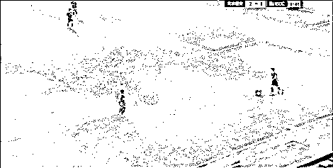

90 分钟战罢双方不分胜负，比赛进入点球大战

双方前 3 轮均主罚命中

第四轮，北京国安金泰延主罚将球射偏

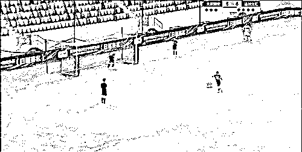

在点球大战中 3:5 不敌对手

最终以 5:7 的比分被淘汰出局

无缘足协杯 16 强

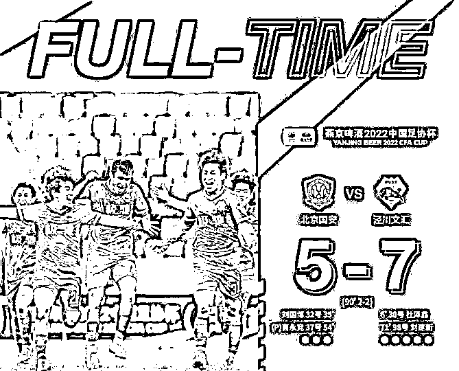

1 比 0 可以说是轻敌

都 7 比 5 了，那就纯粹的…

**前锋是卖牛肉面的**

**后卫卖水果的？**

甘肃队赢了之后

网上还有各种消息满天飞

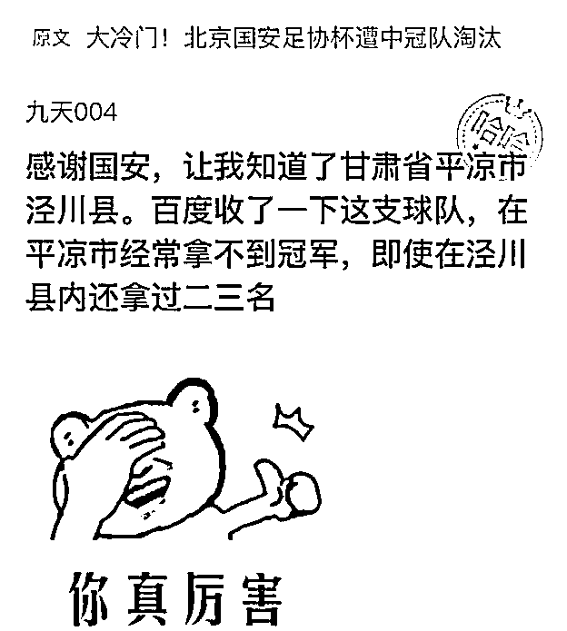

说前锋是卖牛肉面的

后卫卖水果的，进球的是高三学生

守门员是体育老师

教练说相声的 

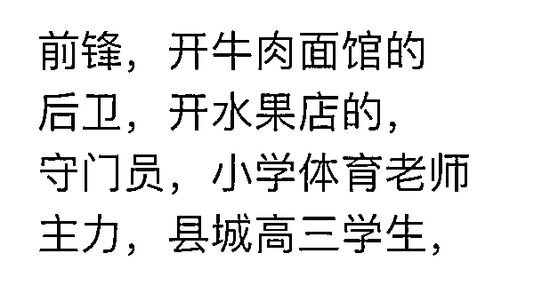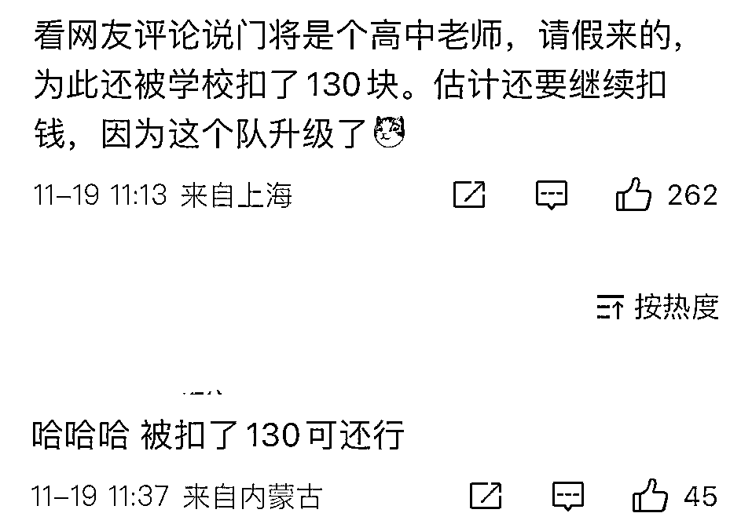

泾川文汇是楼下卖文具的

赞助了 5000 块

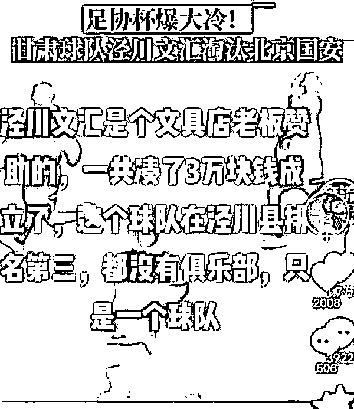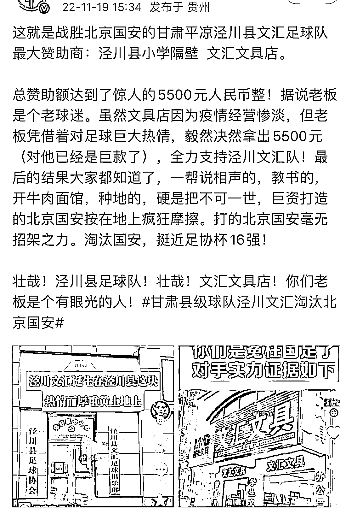

但这，就只能忽悠下看热闹的吧

个么这县级足球队

到底是什么来头呢？

**业余足球队，也有半职业球员**

县级球队是真的

不过，网上传的背后是文具店是假的

但也没高大上到哪里去

赞助商是泾川文汇教育科技培训学校

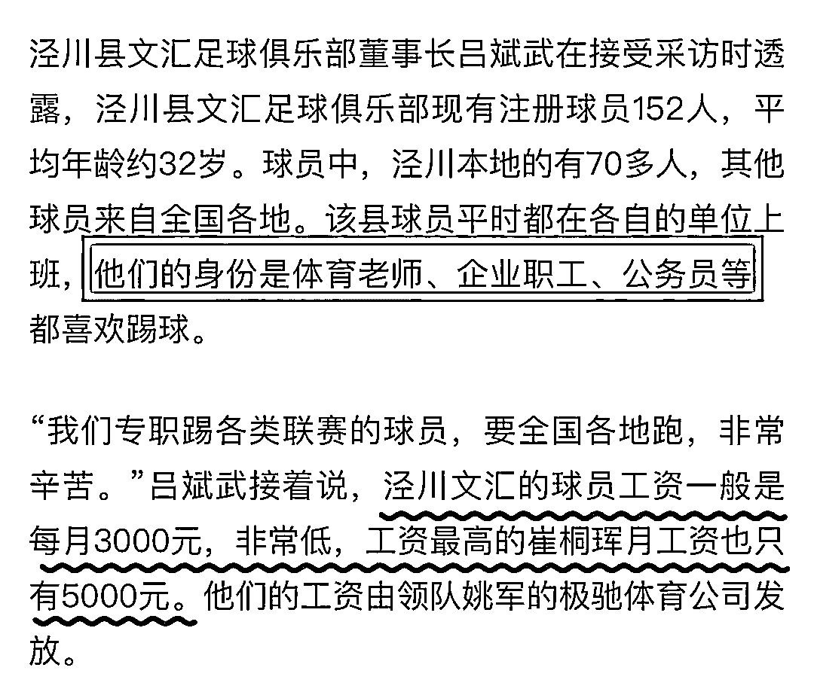

这些踢不上球的半职业球员

不干点别的也是会饿死的

不过这些球员中，工资最高的也就 5000 块

更别谈平时吃海参啥了

说门将 31 岁接触足球是假的

实际上门将有过很多年的足球经历

一直在各个青年队里当守门员教练

现在的职业也是文汇俱乐部的守门员教练

还有中甲中乙退下来的

踢不上球的球员凑的一支职业队

本来是广西的，挂靠在甘肃

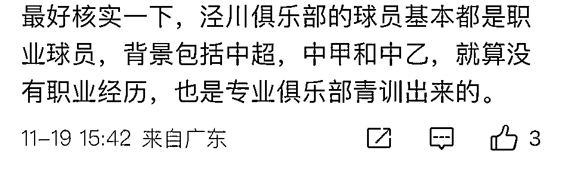

而这支来自甘肃的中冠俱乐部

正式挂牌成立仅 1 年零 3 个月
前身是一家由业余体校发起的业余足球俱乐部

——泾川 744300 足球俱乐部

这个俱乐部成立于 2013 年

成员不过是**当地 30 多名业余足球爱好者**

**是名副其实的业余足球队**

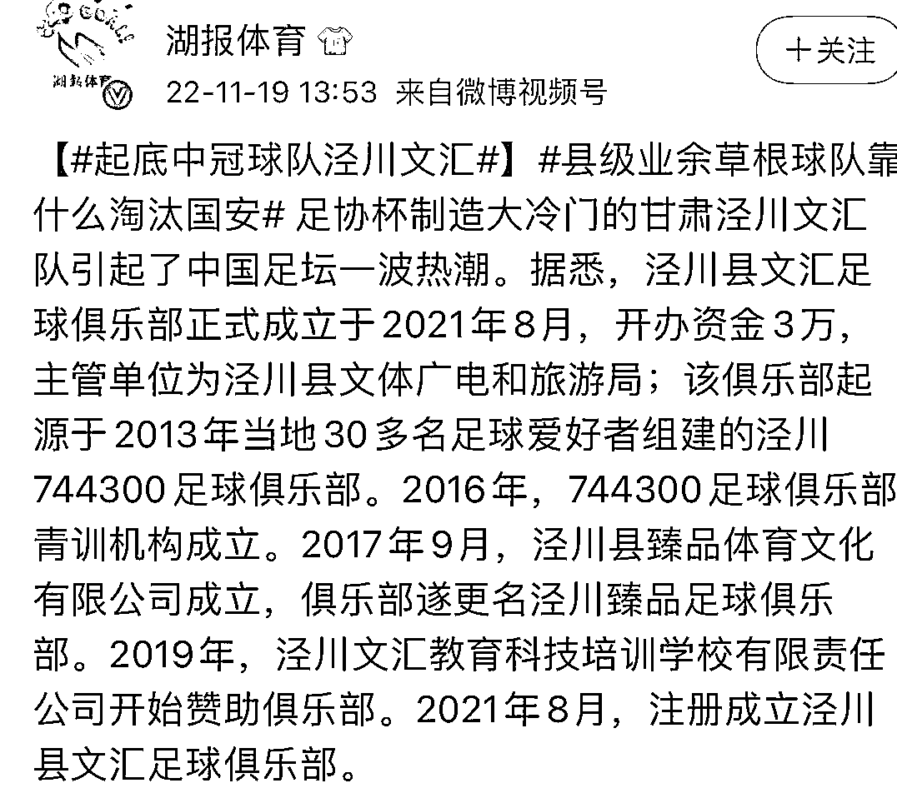

当然也不必为黑而黑

这支泾川队是广西极驰的马甲队

上场的全是专业球员

借用甘肃的名额去打比赛

球队虽然有业余球员，但这次都没上

忽然想起网上那句

关于甘肃的段子

“甘肃不大，创造神话”

而甘肃县级队领队

回应淘汰北京国安说

一是团结，二是思想统一，三是敢拼

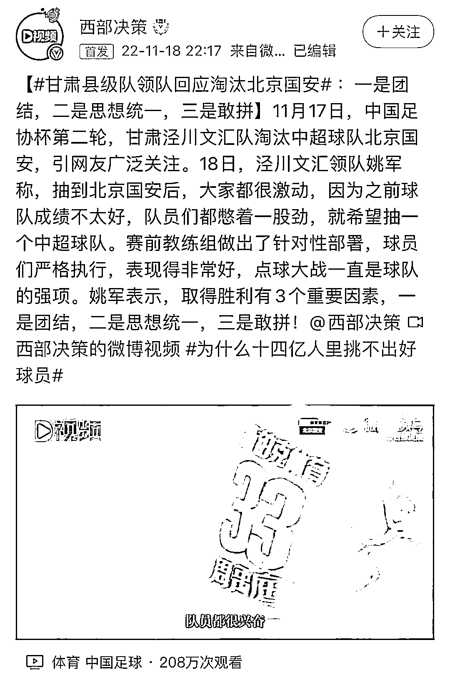

取得胜利有 3 个重要因素 

一是团结，二是思想统一，三是敢拼！

男足，听到了吗？？

这么看来，国足的差距

不是中超和中甲中乙

而是薪资啊！

而卡塔尔世界杯也要开幕了

有中国铁建承建的卢塞尔体育场

中国电建建造的光伏电站

中国制造的 1500 辆新能源客车…

可以说，中国除了男足没有去以外

其他都去了呢

来源：上海全知道

欢迎关注灰产圈社群服务号

← 向右滑动与灰产圈互动交流 →

