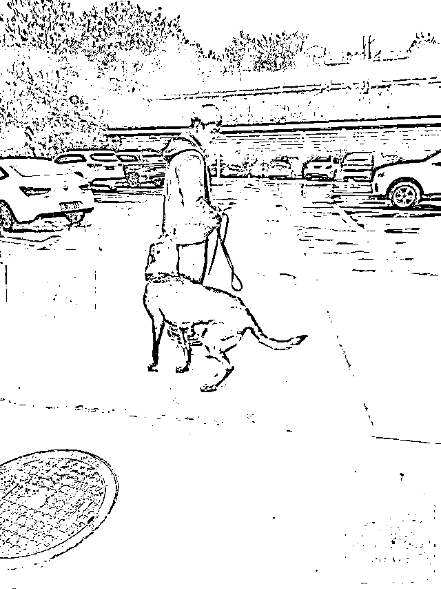
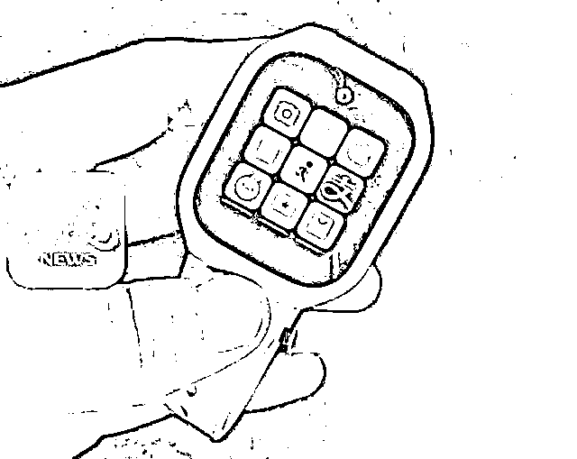

# 15 岁高中生失联事件提级调查！民间团体搜救犬校内发现 3 处可疑点

> 原文：[`mp.weixin.qq.com/s?__biz=MzIyMDYwMTk0Mw==&mid=2247546400&idx=2&sn=2a01d4e1b512525d99994e551eb09471&chksm=97cbfd18a0bc740ef2baf9e562387058361d006275081974824e2dc637d3b25fe45901e1c5f1&scene=27#wechat_redirect`](http://mp.weixin.qq.com/s?__biz=MzIyMDYwMTk0Mw==&mid=2247546400&idx=2&sn=2a01d4e1b512525d99994e551eb09471&chksm=97cbfd18a0bc740ef2baf9e562387058361d006275081974824e2dc637d3b25fe45901e1c5f1&scene=27#wechat_redirect)

11 月 18 日，江西省上饶市铅山县中雨转小雨下了一整天，而针对致远中学失联高一学生胡鑫宇的搜寻工作却没有停歇。[（此前报道：15 岁高中生在去教学楼路上离奇“消失”！抽干校内湖水化粪池也没找到）](http://mp.weixin.qq.com/s?__biz=Mjk0MDY5NjMyMA==&mid=2649798971&idx=1&sn=0da0aa8553b98ebd793d0a0750cd8aba&chksm=9f7c9954a80b10428a6c086f848575ade54320208bad004dac9f4eb1f7a3c2f00aab53509ad0&scene=21#wechat_redirect)

记者在事发现场了解到，**胡鑫宇的亲属从云南找来的搜救犬，在学校宿舍楼、围墙处发现三处可疑点。**致远中学在胡鑫宇宿舍通往教学楼的小山坡处，增设了照明灯和监控设备。

目前，上饶市公安局已经对胡鑫宇失联事件做提级管理，抽调辖区派出所民警组成专项调查组，对事件进行调查。随着搜寻工作的继续，距离事件真相水落石出也越来越近。

**亲属：搜救犬在学校宿舍和围墙处发现三处可疑点**

据了解，11 月 14 日，胡鑫宇的亲属从云南找来一支携带搜救犬的民间团体，该团体一行 4 人，带了两只犬，一只为搜寻犬，另一只为搜尸犬。11 月 15 开始，一直到 11 月 17 日，该团体带着两只搜救犬一直在致远中学的外围进行搜救。11 月 18 日，经过铅山当地警方和致远中学的同意，胡鑫宇表姐夫周先生带领搜救人员和两只搜救犬，前往胡鑫宇可能出现的地方进行找寻。

胡鑫宇亲属从云南找来的搜救犬。

其中一只搜救犬在胡鑫宇所住宿舍楼的二楼和学校的两处围墙处发出报警信号，而另一只搜救犬则没有反应。“我现在只有百分之五十的把握，如果两个犬都报警，那基本可以百分之九十九确定。”该团体负责人陈师傅表示，胡鑫宇出事地点仍有待进一步确认。

**学校：小山坡监控盲区已安装照明和监控等设备**

11 月 18 日上午，记者前往胡鑫宇失联事件当中疑点最多的小山坡监控盲区，该处小山坡看似树林茂密，实则为建有石凳、石桌和凉亭的学习角，因为爬坡下坡的缘故，从胡鑫宇的宿舍通往教学楼并不会节省太多的路程和时间。

记者在走访时发现，除一条明显的石板路通向教学楼外，还有一条隐藏树林间的小路通向学校围墙，而围墙外面则是一座面积较大的金鸡山，正是这座小山在 18 日早些时候被排除胡鑫宇藏身可能。

记者还注意到，该处围墙最矮处也有将近两米，如果不借助外力，学生很难轻易翻墙出去。同时，原本的监控盲区，目前也都已经重新安装照明灯、监控和铁刺围栏。

**警方：市局调查组进驻铅山县展开调查**

11 月 18 日傍晚，正在致远中学高中部宿舍楼调查取证的一名民警告诉记者，**目前，胡鑫宇失联事件已被提级管理，由上饶市公安局从下辖多个派出所抽调警力，统一调配，组成事件专项调查组。**

11 月 18 日，专项调查组民警已经对致远中学进行摸排走访，先后询问胡鑫宇的老师、同学等。11 月 18 日下午，调查组网安支队民警将胡鑫宇父母的手机和胡鑫宇留在宿舍的电话手表拿去调查，试图通过读取网络数据来寻找蛛丝马迹。

胡鑫宇留在宿舍的电话手表。

民警在对胡鑫宇的父母询问相关情况时，得知学校存在三处事关胡鑫宇失联的可疑之处，随即安排专项调查组的刑侦队员、法医和胡鑫宇家属前往现场查看，先后通过拍照取证、试剂检测和仪器扫描等先进的科学技术手段进行查验，相关数据还有待做进一步的技术分析。

目前，事件仍在进一步调查当中。

来源：大皖新闻，潇湘晨报

欢迎关注灰产圈社群服务号

← 向右滑动与灰产圈互动交流 →

