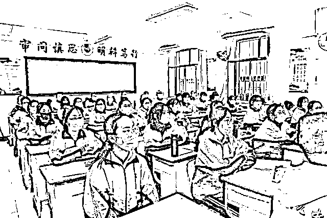
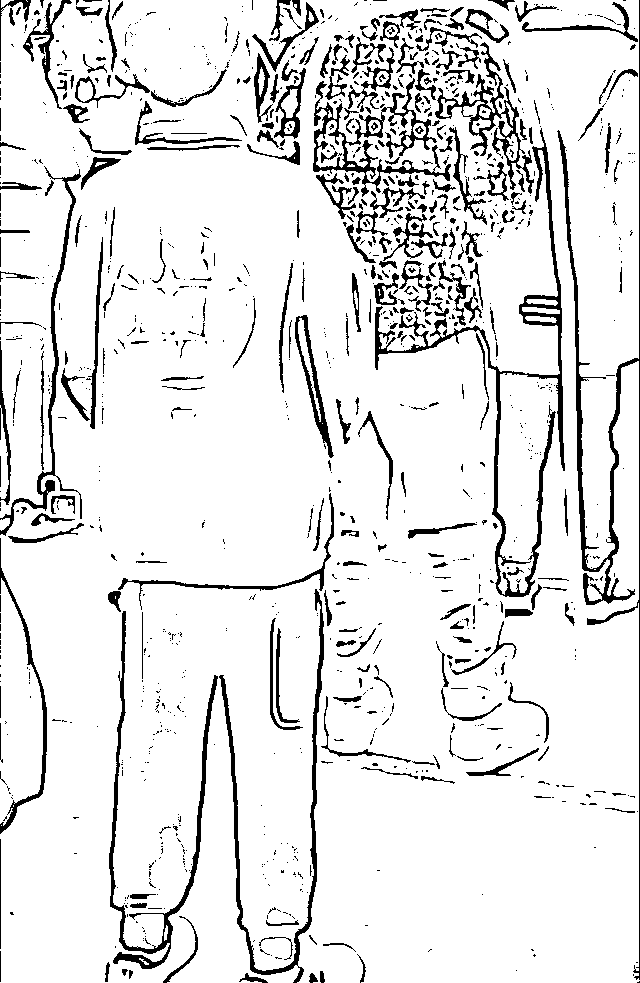
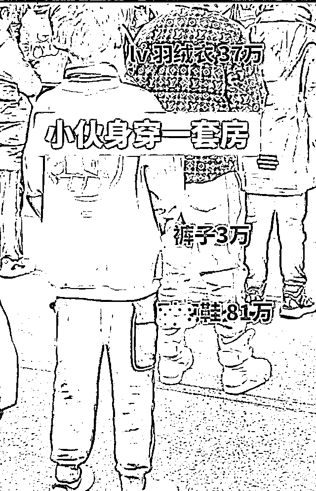
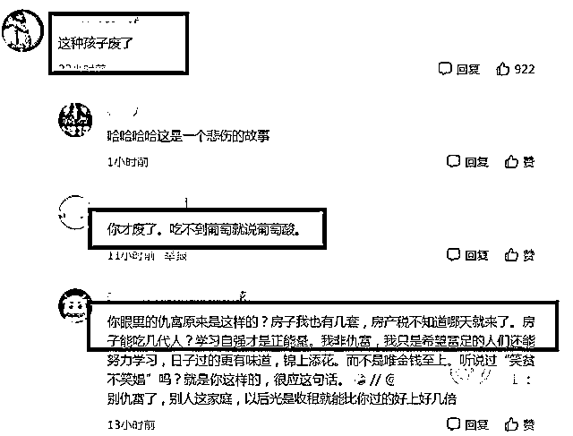
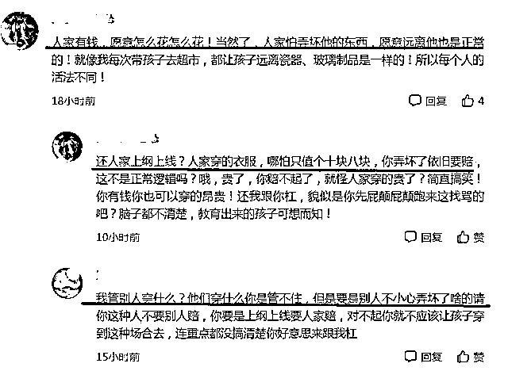

# 上海 14 岁中学生身穿“一套房”，全身价值上百万！遭网友嘲讽……

> 原文：[`mp.weixin.qq.com/s?__biz=MzIyMDYwMTk0Mw==&mid=2247546400&idx=3&sn=244277c31179dad3daaa5e7c1c71d03a&chksm=97cbfd18a0bc740ed704c1bf38ec9eedcafc64d5aee1723e8a03e62cf647596460c4a14ca424&scene=27#wechat_redirect`](http://mp.weixin.qq.com/s?__biz=MzIyMDYwMTk0Mw==&mid=2247546400&idx=3&sn=244277c31179dad3daaa5e7c1c71d03a&chksm=97cbfd18a0bc740ed704c1bf38ec9eedcafc64d5aee1723e8a03e62cf647596460c4a14ca424&scene=27#wechat_redirect)

中学生是国家的未来，学校是培育祖国未来人才的摇篮。学校虽然是一方净土，但是难以摆脱社会大环境的影响。随着经济的飞速发展，人们的消费观念也发生了巨大的变化。

现在的学生，正处于人格发展的重要时期，不过这个时期的学生也是不稳定的，他们很容易受到外界大环境的影响。在人生的十字路口，社会的攀比之风就容易导致学生出现虚荣心理。

**现在学生的价值观物质化太严重，攀比成风，不管是大学生还是中学生，都会出现攀比的心理。**

有网友无意间就拍到了一个男生，这名男生就是一个普通的中学生，本来就是非常普通的一张照片，却被细心的网友发现了其中的“不普通”。

> 明明是一名普普通通的 14 岁中学生，竟然穿着上万元的外套，一双鞋更是高达 81 万！

你以为这是小说情节吗？错了，这是上海某中学的在校学生，“百万土豪装”瞬间吸睛无数，网友酸了：果然贫穷限制了我的想象力。

### 上海 14 岁中学生穿“一套房”上学，全身价值上百万，遭网友嘲讽！

**01**

我们都知道，一般中学生都是身穿统一校服，就是为了避免盲目攀比，影响学习。

你能想象一个年仅 14 岁的中学生，全身价值上百万吗？反正我被震惊到了，有钱人的世界我们不懂。

据知情人士透露，**这位中学生的裤子大约有 3 万块钱左右；外套是某奢侈品牌，保守估计大概有 37 万；更让人震惊的是他脚上那双鞋，是某款品牌的全球限量版，竟然高达 81 万！**

合计一下，**这位中学生全身上下价值上百万，在一些小城市约等于一套房的价格，难怪网友都说他是穿了“一套房”在身上**，百万土豪装真是闪瞎了我们的眼睛。

很多网友表示，要是学校突然出现这样一位土豪，**估计都不敢让孩子和人家玩，万一磕着碰着，赔都赔不起。**原来中学也可以“卧虎藏龙”，是我们普通人见识短浅了。不过，这位同学的一身“华服”除了招来短暂羡慕，貌似大家并不太认可，评论区反倒是一片冷嘲热讽。

**02**

大部分家长认为这位中学生未免有点太“过火”，想不明白为何家长要让孩子这么招摇过市，只是一名初中生罢了，完全没必要穿“天价”服装，对自己、对他人都不好。 

中学阶段正是培养孩子价值观的关键时期，你给他穿了一身价值上百万的服装，**恐怕慢慢会养成“奢靡浪费”的习惯，这并不利于孩子正确三观的培养。**

而且孩子在学校这么“特立独行”，也不利于和其他同学维持良好关系，很多人也许会慢慢疏远“土豪同学”，影响孩子正常学习。

还可能会引起不必要的攀比之风，扰乱学校风气，干扰正常教学进度，就有点本末倒置。就算家里有矿，也要学会低调行事，这么招摇，迟早要自食恶果。

也有网友立即反驳回去：总不能有钱的孩子就不能去学校了，不管是便宜也好还是贵，这都是根据父母的经济实力来决定的。

**条件好的家庭自然可以为孩子购买贵的衣服，条件不好的家庭也没有必要进行攀比，作为学生家长，还是不要有仇富的心理，应该多关注学生学习。**

**03** 

> **学生家庭条件千差万别，难道非得要求有钱人家孩子衣衫褴褛才是“朴素”吗？**

虽然大家对这身价值“一套房”的衣服议论纷纷，但是对于学生本身，可能根本就没有意识到这身衣服的价值，而家长可能也仅仅是为了让学生可以在寒冬里穿得舒服而已。

但这件事的确是给很多家长提了醒，让各位家长可以重新审视，什么是大家一直挂在嘴边的“富养”？富养就是尽家长的能力，给学生提供最好的物质生活吗？

**其实真正的“富养”不能仅仅停留在物质层面，更应该体现在对学生精神层面的教育上。**

所谓授人以鱼不如授人以渔，给予子女财富，不如给予子女创造财富的能力，不管穿着多少钱的衣服，**重要的还是要看家长的教育理念，大家完全不必因为一身衣服上纲上线。**

所谓的“富养”不一定是只有家庭条件好的家庭才可以做到，任何家庭，只要在学生成长的道路上，给予学生正确的引导，精神财富会是学生未来人生道路上最宝贵的财富。

虽然校服经常被学生们吐槽“太丑”，但校服的确可以给学生带来很多积极影响。

无论是网友嘲讽，还是为其“开脱”，这些都是个人之见，皆可尊重。

**在校生还是应该遵循一些基本的“规则”，身穿百万豪服，旁人自然无权干涉，但是也要考虑到学校场合。让学生不会因此产生攀比之心，建立正确的三观。**

学生阶段干净、整洁即可，不用过度追求名牌、价格，这样反而让容易造成攀比之风，不利于和谐校园关系，也不利于培养正确的价值观。

每个人都应该适应自己不同阶段的社会角色，学生时代就应该有学生的样子。当然在中小学阶段，家长还是起到主导作用，所以更应该以身作则，为孩子树立好榜样。

一套价值上百万的土豪服炸出一堆“仇富”网友，有人羡慕嫉妒，有人嘲讽不屑。

有钱人的自我选择我们无权干涉，但**学生时代还是应该保持最基本的淳朴之心。不要盲目追求一些身外之物的攀比**，这才是家长应该教给孩子的道理，**健康人格好过百万华服。**

来源：路探社，世相研究所

欢迎关注灰产圈社群服务号

← 向右滑动与灰产圈互动交流 →

