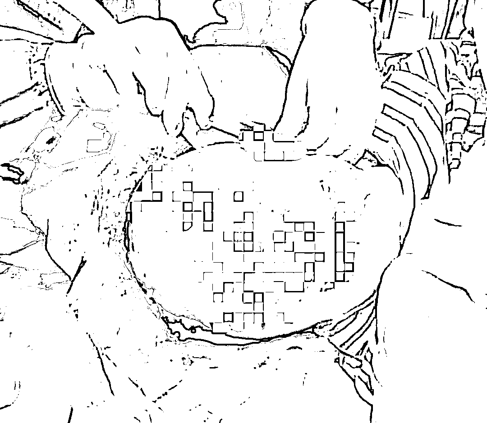
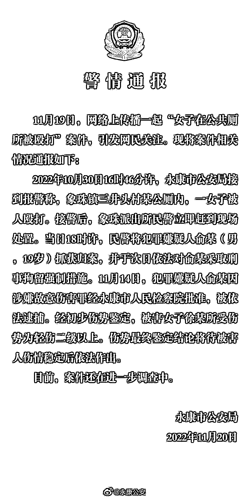
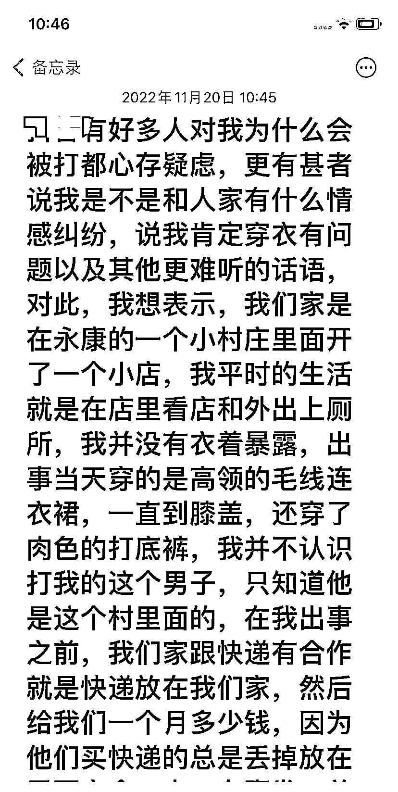
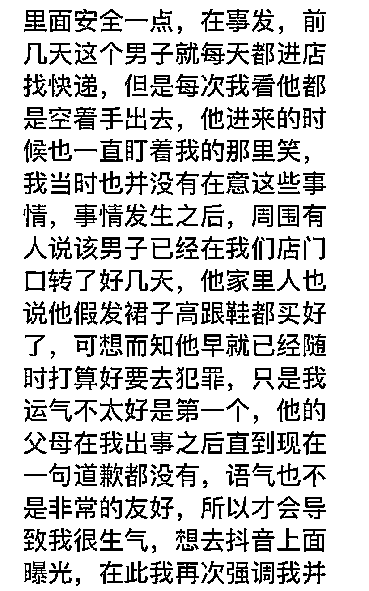
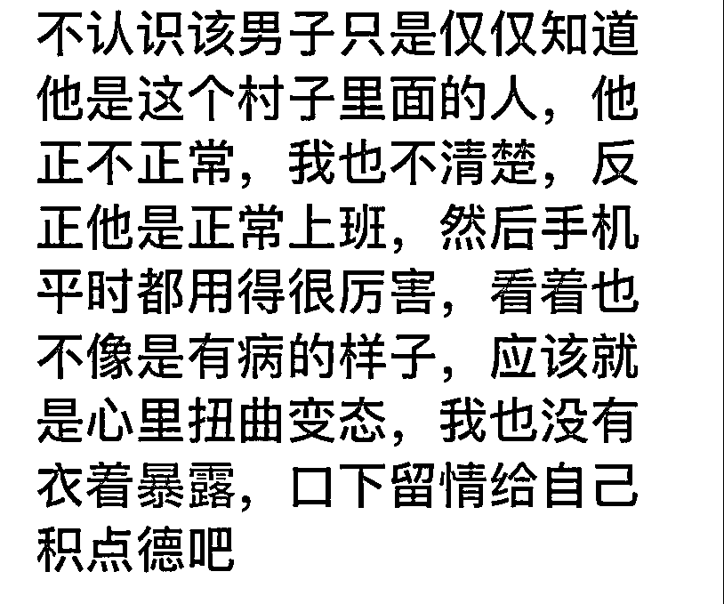

# 在公厕被殴打女子最新发声：不认识涉事男子……

> 原文：[`mp.weixin.qq.com/s?__biz=MzIyMDYwMTk0Mw==&mid=2247546400&idx=4&sn=5fe25a56b64f0a14d303d8016da848ce&chksm=97cbfd18a0bc740efab8232da72bd00cc9a20045037f4d7d3d14a02eb4c050340c2d72a47a83&scene=27#wechat_redirect`](http://mp.weixin.qq.com/s?__biz=MzIyMDYwMTk0Mw==&mid=2247546400&idx=4&sn=5fe25a56b64f0a14d303d8016da848ce&chksm=97cbfd18a0bc740efab8232da72bd00cc9a20045037f4d7d3d14a02eb4c050340c2d72a47a83&scene=27#wechat_redirect)

11 月 20 日，浙江金华永康市“一女子在公共厕所被殴打”事件中，被打女子疑似通过短视频平台发声称，事发时没有衣着暴露，事发前不认识涉事男子，希望网友口下留情。当天中午，潇湘晨报（报料微信：xxcbbaoliao）记者从该短视频账号主人朋友处确认，该短视频账号主人确实是被打女子。

此前，网传永康市“一女子在公共厕所被殴打”，网传图片显示，该女子被打前面容姣好，被打后，脸部已明显浮肿，且有多处伤，因治疗一头长发也已被剪掉。11 月 20 日，永康市公安局发布通报称，事发当日，已将犯罪嫌疑人俞某（男，19 岁）抓获归案，并于次日对其采取刑事拘留强制措施。经初步伤势鉴定，被害女子徐某所受伤势为轻伤二级以上。

**被打女子 20 日所发声明全文如下：**

有好多人对我为什么会被打都心存疑虑，更有甚者说我是不是和人家有什么情感纠纷，说我肯定穿衣有问题以及其他更难听的话语，对此，我想表示，我们家是在永康的一个小村庄里面开了一个小店，我平时的生活就是在店里看店和外出上厕所，我并没有衣着暴露，出事当天穿的是高领的毛线连衣裙，一直到膝盖，还穿了肉色的打底裤，我并不认识打我的这个男子，只知道他是这个村里面的，在我出事之前，我们家跟快递有合作就是快递放在我们家，然后给我们一个月多少钱，因为他们买快递的总是丢掉放在里面安全一点，在事发前几天，这个男子就每天都进店找快递，但是每次我看他都是空着手出去，他进来的时候也一直盯着我在那里笑，我当时也并没有在意这些事情，事情发生之后，周围有人说该男子已经在我们店门口转了好几天，他家里人也说他假发裙子高跟鞋都买好了，可想而知他早就已经随时打算好要去犯罪，只是我运气不太好是第一个，他的父母在我出事之后直到现在一句道歉都没有，语气也不是非常的友好，所以才会导致我很生气，想去曝光，在此我再次强调我并不认识该男子只是仅仅知道他是这个村子里面的人，他正不正常，我也不清楚，反正他是正常上班，然后手机平时都用得很厉害，看着也不像是有病的样子，应该就是心里扭曲变态，我也没有衣着暴露，口下留情给自己积点德吧。

11 月 20 日，潇湘晨报记者就此事私信该女子，截至发稿前，未获回复。

来源：潇湘晨报综合报道

欢迎关注灰产圈社群服务号

← 向右滑动与灰产圈互动交流 →

