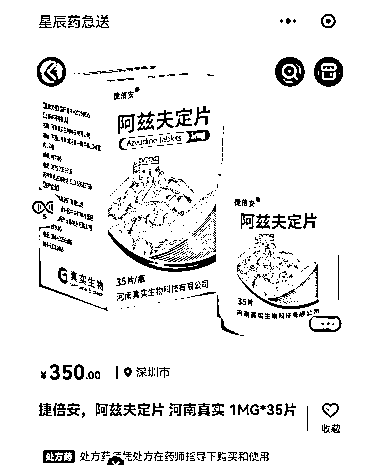
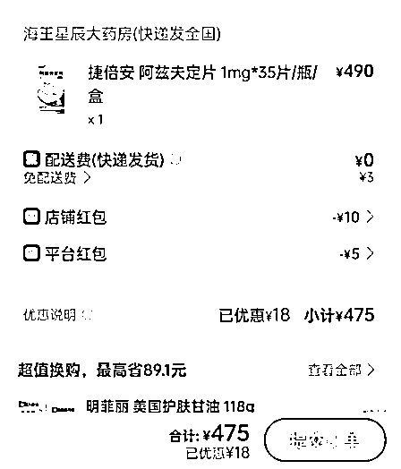
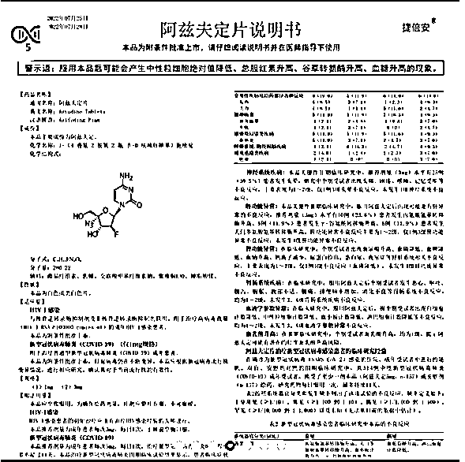

# 口服新冠药阿兹夫定已在多平台下架 专家：绝对不是给全民吃的药，囤药无意义！

> 原文：[`mp.weixin.qq.com/s?__biz=MzIyMDYwMTk0Mw==&mid=2247546400&idx=6&sn=be5d9ed46678916133a021df2b27c0b9&chksm=97cbfd18a0bc740e29e2a8e4ef60956b648aa775e60dcc3520eaee16cecab9339e9b1efc9f26&scene=27#wechat_redirect`](http://mp.weixin.qq.com/s?__biz=MzIyMDYwMTk0Mw==&mid=2247546400&idx=6&sn=be5d9ed46678916133a021df2b27c0b9&chksm=97cbfd18a0bc740e29e2a8e4ef60956b648aa775e60dcc3520eaee16cecab9339e9b1efc9f26&scene=27#wechat_redirect)

11 月 18 日，有消息指，新冠口服药阿兹夫定片正式零售。

11 月 19 日早晨，在“饿了么”、“美团”等平台可以看见阿兹夫定片在售。据海王星辰急送小程序报价，阿兹夫定片每瓶卖到 350 元，每瓶 35 片。

有用户晒出，已成功下单。然而，上架不足 24 小时，该药已经下架处理。

**企业回应：即刻下架处理** 

**“我们要求海王星辰即刻下架处理。”**

针对首个国产新冠口服药阿兹夫定片在海王星辰部分药店正式线上开售，河南真实生物常务副总经理刘勇告诉人民日报健康客户端记者，**售卖阿兹夫定片是药店个例行为。**

阿兹夫定片虽然是我国首个国产新冠口服药，用于治疗普通型新型冠状病毒肺炎成年患者。但它同时也是我国获批的治疗艾滋病的药物。

刘勇表示，**此次海王星辰在线上售卖，其实为抗艾滋病适应症的药品。**

阿兹夫定片规格分为 1 毫克与 3 毫克两种规格，两个规格都是用于治疗艾滋病的规格，其中，仅 1 毫克规格，有条件获批用于治疗普通型新型冠状病毒肺炎成年患者。

刘勇介绍，两种适应症的药品是有严格区分的。新冠药物必须按照国家防疫政策执行，在联防联控统筹协调下进行保供工作。

对此，河南真实生物已第一时间召开会议，并与海王星辰进行沟通，要求对新冠口服药即刻做出下架处理。中午 11 点 50 分，健康时报记者致电海王星辰深圳多家线下店铺询问，其工作人员表示，**这几天，打电话买阿兹夫定的人很多，目前线下店铺没有阿兹夫定药物。**

“上架药物主要是满足深圳这边出入境人员的用药需求，昨天（11 月 18 日）在官网线上上架，可预订购买。”另一家海王星辰官方药店工作人员表示，具体情况，线下门店并未收到通知，可以时不时关注下线上店铺，看是否又重新上架。截至 11 点 50，**海王星辰线上阿兹夫定片已经下架。**

**专家提醒：网上销售不合适，囤药更没必要**

随着优化二十条政策的出台，取消境外航班熔断指令，有出入境需求的群体对新冠口服药表现出强大的需求。刘勇介绍，此次海王星辰初衷是为了满足深圳地区一些往来香港和出境人员的需求，**并不适应大规模人群线上购买。**

另据第一财经报道，有新冠治疗临床专家表示：“阿兹夫定是一个处方药，而且是紧急授权批准的，应遵循治疗指南，不适合自己服用，在网上销售也不合适。”

上述专家还强调，新冠药主要应该给高龄老人和其他有严重基础疾病风险的脆弱人群来备用，**绝对不是给全民吃的药，囤药更没必要。**

**部分平台也已下架**

据中新经纬报道，目前美团买药平台、“海王星辰药急送”微信小程序已无法搜索出阿兹夫定相关结果。

中新经纬以患者身份向平台互联网医生询问，莲藕健康互联网医院内科主治医师史洪英回应称，新型冠状病毒肺炎为甲型传染病，不适合在互联网进行复诊，无法在互联网医院进行开方，需要到实体医院就诊。

**已纳入新冠诊疗方案**

根据阿兹夫定片说明书介绍，该药规格分为 1 毫克与 3 毫克两种规格，仅 1 毫克规格用于治疗普通型新型冠状病毒肺炎（COVID-19）成年患者。该药为附条件批准上市，目前病毒仍在不断变异，该药应根据新冠病毒流行株变异情况，进行相应研究，确认其对于当前流行株的有效性。

新型冠状病毒肺炎（COVID-19）的推荐剂量为成年患者每次 5 毫克，每日 1 次。治疗新型冠状病毒肺炎时，疗程至多不超过 14 天。

国家卫健委和国家中医药局曾于 8 月 9 日联合发布《关于将阿兹夫定片纳入新型冠状病毒肺炎诊疗方案的通知》，将该药纳入《新型冠状病毒肺炎诊疗方案（第九版）》，用于治疗普通型新型冠状病毒肺炎（COVID-19）成年患者。

11 月 11 日，国务院联防联控机制发布《关于进一步优化新冠肺炎疫情防控措施科学精准做好防控工作的通知》，也明确指出，要加快新冠肺炎治疗相关药物储备，做好供应储备，满足患者用药需求，尤其是重症高风险和老年患者治疗需求。

**已通过医保目录形式审查**

9 月 17 日，国家医保局正式公布《2022 年国家基本医疗保险、工伤保险和生育保险药品目录调整通过形式审查的申报药品名单》，共 343 种药品正式通过形式审查，其中包括阿兹夫定片。

国家医保局表示，在新冠疫情防控常态化的背景下，从 2020 年第一次实行医保药品目录企业自主申报制起，国家医保局就对新冠肺炎治疗药品给予高度重视，将“纳入《新型冠状病毒肺炎诊疗方案》的药品”作为申报条件之一，一批新冠治疗用药已被纳入医保药品目录。本次申报过程中，对于已申报且通过形式审查的新冠肺炎治疗药品，将按程序开展后续工作，争取以合理价格正式纳入到医保目录。

**“国产新冠口服药”竞技火热**

**多家药企迈入临床三期**

11 月 17 日，众生药业 (002317.SZ)开盘即一度涨停。

自 9 月 22 日，在一则投资者集体接待日活动中披露新冠口服药 RAY1216 片在海南开展临床研究的消息之后，公司股价持续走高，**不到两个月内（9 月 22 日—11 月 17 日）上涨约 190%。**

众生药业的强劲走势，与新冠口服药超出预期的研发进展有关。

此前的 11 月 16 日，众生药业公告称，控股子公司广东众生睿创生物科技有限公司(简称“众生睿创”)在研的一类创新药物 RAY1216 片，用于治疗轻型和普通型新冠感染患者的随机、双盲、安慰剂对照 III 期临床研究，已完成首例受试者入组，意味着其全面启动 III 期临床。

值得一提的是，RAY1216 与辉瑞已上市的新冠口服药 Paxlovid，同属于 3CL 蛋白酶抑制剂的技术路线。而目前，Paxlovid 已晋升为全球销售规模最大的口服新冠药物，这也使得类似产品备受瞩目。

不过，在资金持续涌入之下，**众生药业的动态市盈率目前已达 92 倍。**众生药业也发出风险提示，“RAY1216 项目的临床试验进度、审评和审批的结果以及未来产品市场竞争格局都具有一定的不确定性。”

21 世纪经济报道记者采访了解到，在如火如荼的国内新冠口服药研发赛道中，众生药业的竞争对手并不少。其中，君实生物（688180.SH/01877.HK）、先声药业（2096.HK）都身处第一梯队，其新冠口服药均已进入临床 III 期阶段。

**中药股沾上新冠口服药概念**

值得一提的是，作为治疗新冠用药，RAY1216 被纳入国家药监局的特别审批程序，在完成Ⅰ期临床研究之后，直接进入了 III 期临床研究。

对此，11 月 17 日，众生药业证券部人士也提到，“该药并没有进行二期临床”，至于三期临床何时能完成，其则表示“目前不清楚”。

“一款新药从研发到临床，再到获批上市，环环相扣，即便走快速审批通道，中间也有很多不确定因素。”一位药企人士向 21 世纪经济报道记者分析，

尽管新药研发有较大的不确定性，但有机构仍对众生药业寄予厚望。

华鑫证券出具研报预计，RAY1216 于 2023 年 Q1 将完成 III 临床受试者入组，并认为“RAY1216 具备成为最佳新冠口服药物的潜力，预计 RAY1216 片上市定价低于 1000 元 1 疗程，并有望成为国家和地方主要的储备用药”。

不过，也有医药行业人士认为，“众生药业此轮表现，叠加国内疫情防控常态化的大趋势，**也不排除有市场炒作的成分”**。

从业务结构来看，众生药业目前仍以中成药为核心业务基础，核心产品为复方血栓通胶囊。2022 年半年报显示，众生药业的中成药销售占营收比重高达 64.33%。

而众生药业也在公告中称，RAY1216 片 III 期临床研究完成首例受试者入组，对公司的财务状况、经营业绩不构成重大影响。公司预计该项目短期内对公司财务状况、经营业绩不会产生重大影响。

**多家药企同台竞技**

尽管众生药业的 RAY1216 进入临床 III 期，但对比同行进度，其实并不算领先。

继今年 7 月，真实生物的阿兹夫定片附条件获批上市，成为中国上市的首款国产新冠口服药物之后，君实生物、先声药业等上市药企在研的新冠口服药都已进入临床 III 期。

此外，开拓药业（09939.HK）的新冠口服药已完成治疗轻中症新冠患者 III 期全球多中心临床试验，竞争可谓异常激烈。

10 月 30 日、11 月 2 日，君实生物在接受国盛证券、富国基金等多家机构调研时提到，正全力推进新冠口服药 VV116 临床研究。此外，君实生物在调研中指出，VV116 已于国内完成一项 III 期研究，正处于多项国际多中心的 III 期临床研究阶段。

而在港股上市的创新药企先声药业（2096.HK）的新冠小分子口服药 3CL 蛋白酶抑制剂 SIM0417，也已进入 III 期临床。

此外，开拓药业（09939.HK）也在推进新冠口服药在中国市场的商业化落地。目前，开拓药业的普克鲁胺已完成治疗轻中症新冠患者 III 期全球多中心临床试验，该药物已在多个发展中国家取得紧急使用授权（EUA）。不过，在中国市场，开拓药业能否凭借今年 4 月披露的 III 期临床数据获批，仍然是个未知数。

与此同时，科兴制药（688136.SH）、歌礼制药（1672.HK）、广生堂（300436.SZ）均有新冠口服药进入临床试验阶段。

对于药企前赴后继地申报新冠口服药，有医药行业人士坦言，“新冠病毒不断变异，会影响国产新冠口服药后续临床和申报进度。而已上市药物的效果和逐渐增加的研发难度，都会影响市场对药企的估值”。

来 源：21 世纪经济报道（记者：朱艺艺）、人民日报健康客户端、中新经纬、第一财经 转自：正商参略

欢迎关注灰产圈社群服务号

← 向右滑动与灰产圈互动交流 →

