# 中国足球县大队申请出战世界杯

> 原文：[`mp.weixin.qq.com/s?__biz=MzIyMDYwMTk0Mw==&mid=2247546454&idx=1&sn=44ce888d2edc47c8f0207f5b9acfd010&chksm=97cbfd6ea0bc74781f379356e599ae1b7cb1b06d4f2709eb6a5b1fd21281feb3bd6a08ffabdd&scene=27#wechat_redirect`](http://mp.weixin.qq.com/s?__biz=MzIyMDYwMTk0Mw==&mid=2247546454&idx=1&sn=44ce888d2edc47c8f0207f5b9acfd010&chksm=97cbfd6ea0bc74781f379356e599ae1b7cb1b06d4f2709eb6a5b1fd21281feb3bd6a08ffabdd&scene=27#wechat_redirect)

短视频里说的好，甘肃不大，创造神话。

去年看到这句土话富贵我只会苦笑，现在听到，我肃然起敬。

在上周的 2022 中国足协杯第二轮比赛中，中超巨舰北京国安主场对阵泾川文汇。

踢了个 5 比 7，被淘汰了。

你没看错，输的是北京国安。

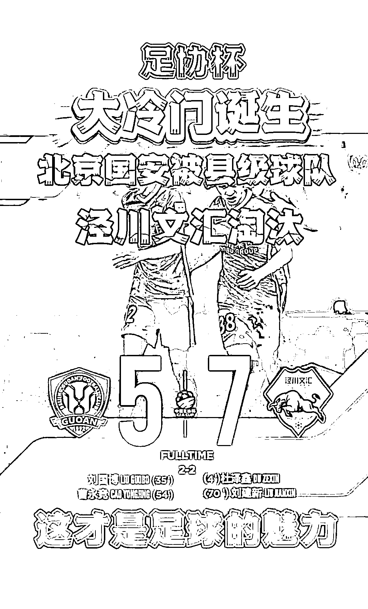

泾川文汇，甘肃省平凉市泾川县的文汇队。

虽然专业人士可以说文汇进 7 球难掩颓势，国安进 5 球尽显风采。

但这在我们这帮外人看来，就好比法拉利和共享单车飙车，赢了咱也不露脸啊。

还输了。

泾川文汇队，注定是一匹载入中国足球史册的黑马。

网友高呼这是县大队全歼精锐整编团，索马里海盗开着舢板掀翻英国航母。

有人不服，明明是东汉末年，群雄并起，董卓上洛，西凉称霸！

毕竟名不经传的甘肃泾川县可大有来头，大家都知道崆峒山上崆峒派吧，当年金毛狮王谢逊的七伤拳可就是在这里学的。

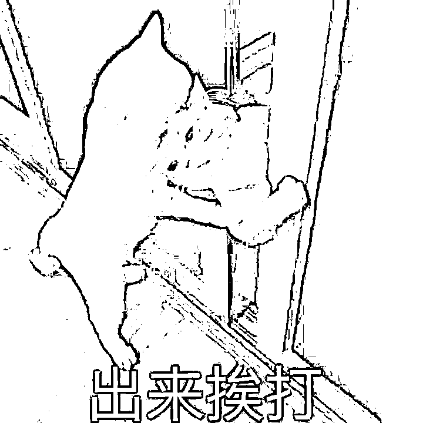

泾川县就在崆峒山脚下，县城人口高达 22 万，人才遍地。

不光有崆峒派，这里更是西王母，即王母娘娘的降身地。

桀桀桀桀桀，崆峒派的传承+王母娘娘的护佑，泾川文汇队的实力恐怖如斯，此子断不能留。

不过传的最神乎其神的，还是下面这个——

我告诉你啊，泾川文汇的队员们个个都是身兼数职的天纵奇才，前锋开牛肉面馆的，后卫卖水果的，进球的小伙子是高三学生，守门员是他的体育老师，请假比赛被扣了 130 块钱，幸好参赛有 200 块的补助。

比完赛不少队员要去送外卖补贴家用，唯一一点经费是文汇文具店赞助的 5000 块。

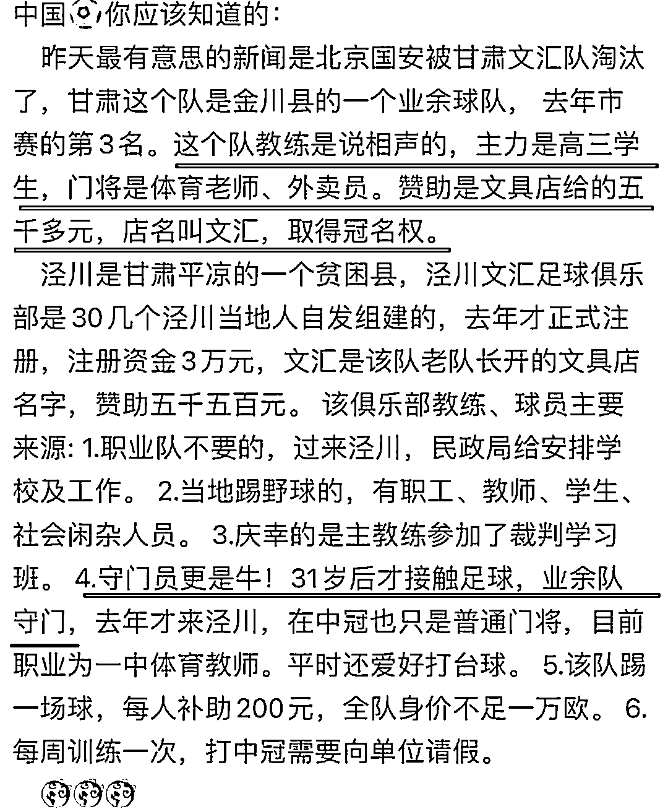

人不能想象自己没见过的东西，就像《西虹市首富》拍不出这样的剧情。

谁看了不感叹一句：不要随便拿你的兴趣爱好挑战别人的饭碗，不然你真可能会把别人饭碗砸了！

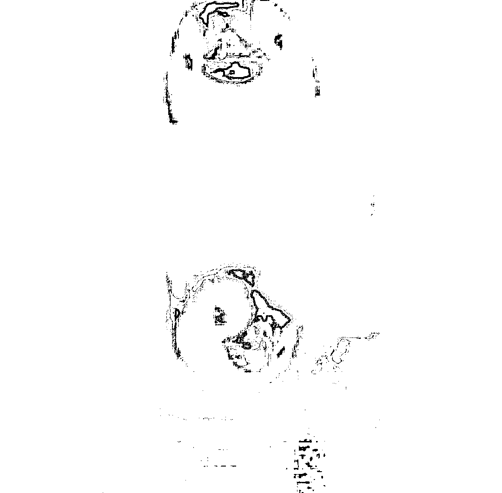

现实终究不是爽文。

很快啊，泾川文汇的负责人出来辟谣了。

先从队伍的历史说，泾川文汇并不是网传的成立长达一年拥有悠久底蕴的队伍。

虽然声名不显，但他们也有近 10 年的发展历程，前身是 2013 年在当地业余体校创立的泾川 744300 足球俱乐部，744300 是他们县的邮政编码。

这样一支球队每年的开销 5000 块肯定不够花的，赞助商文汇并不是文具店，全名泾川文汇教育科技培训学校有限责任公司，每年赞助，20！万！

20 万啊，扣除运营费用，算到每个队员身上，每个月足足得有 500 块吧。

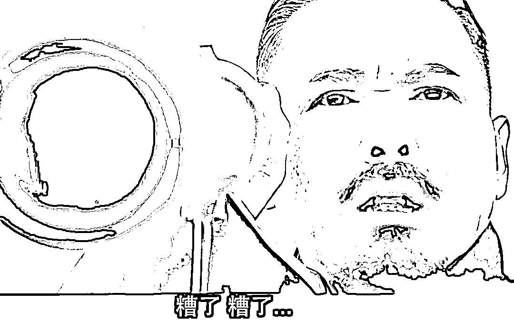

这文汇学校具体培训的项目我没查到，不过文汇集团在泾川县还有一个企业——文汇小清华幼儿园，经营范围一目了然。

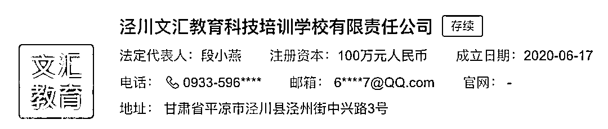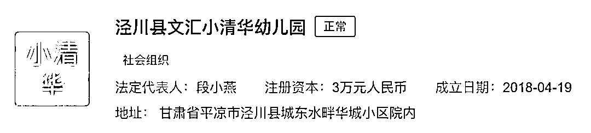

瞧这气派劲儿，在俺们泾川县，那也是一等一的实力派。

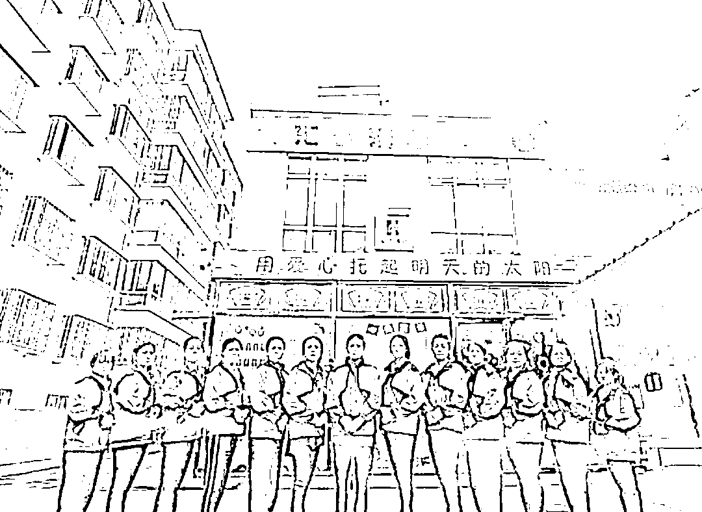

看到文汇集团此等恐怖的实力，难怪有人说出：

再说队员，那上面的传言就是纯纯的鬼扯了。

为本次赢球立下汗马功劳的 37 岁门将，曾在罗马尼亚的乙级联赛效力，是踢球多年的老将。

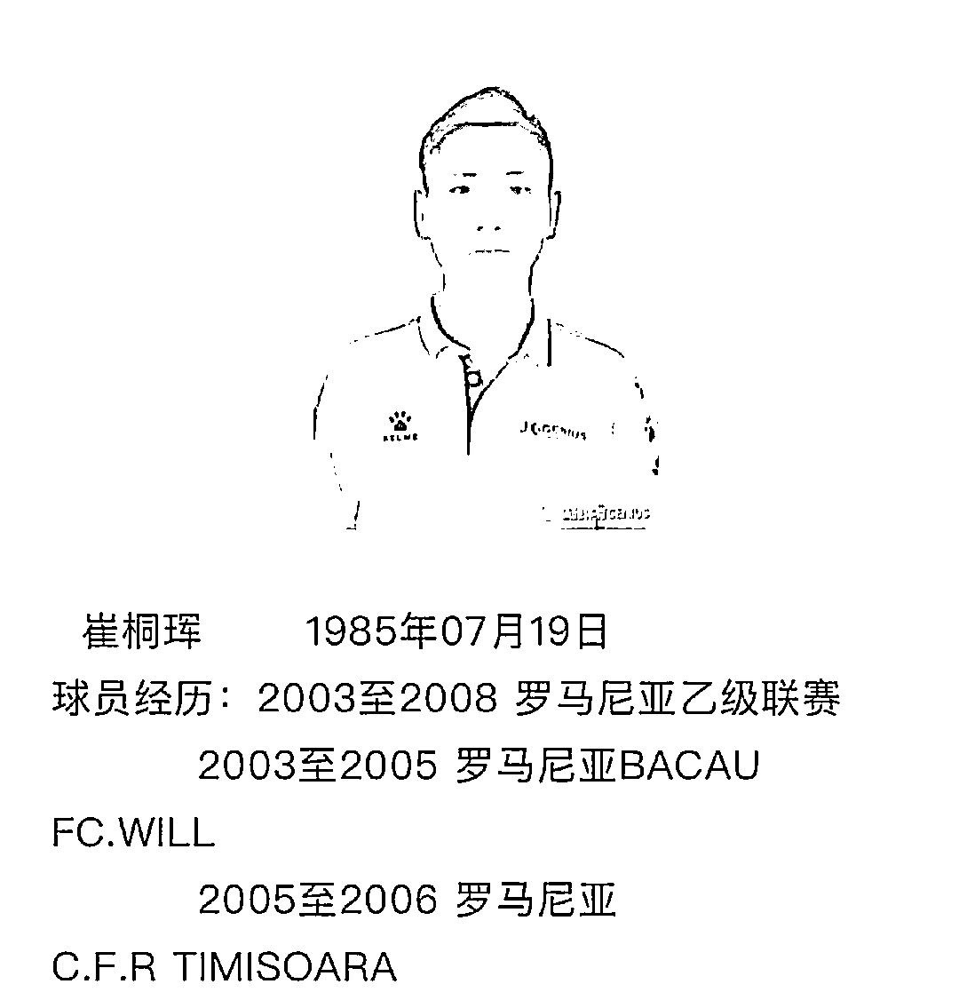

首发 11 人里，8 名球员是职业或曾经是职业球员，现在也没有中断训练，说是业余队是有点勉强。

文汇队负责人也承认，主力队员是以广西北海极驰队的球员为班底，因为广西内部的比赛竞争压力大，于是他们和泾川文汇签了合作协议。

所以队员们胸前写的并不是“文汇”，而是“极驰”。

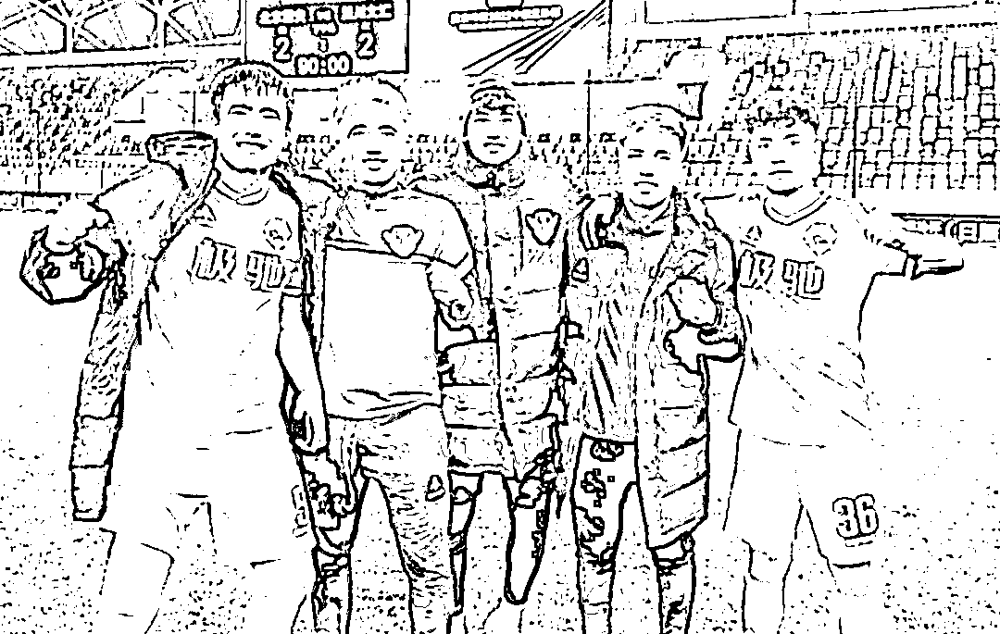

好了破案了，这是职业球队之间的对对碰，兔子尚且打盹，乌龟难免失算，一切岁月安好，明天更加灿烂，这事就算过去了谁也不准揭伤疤了嗷。

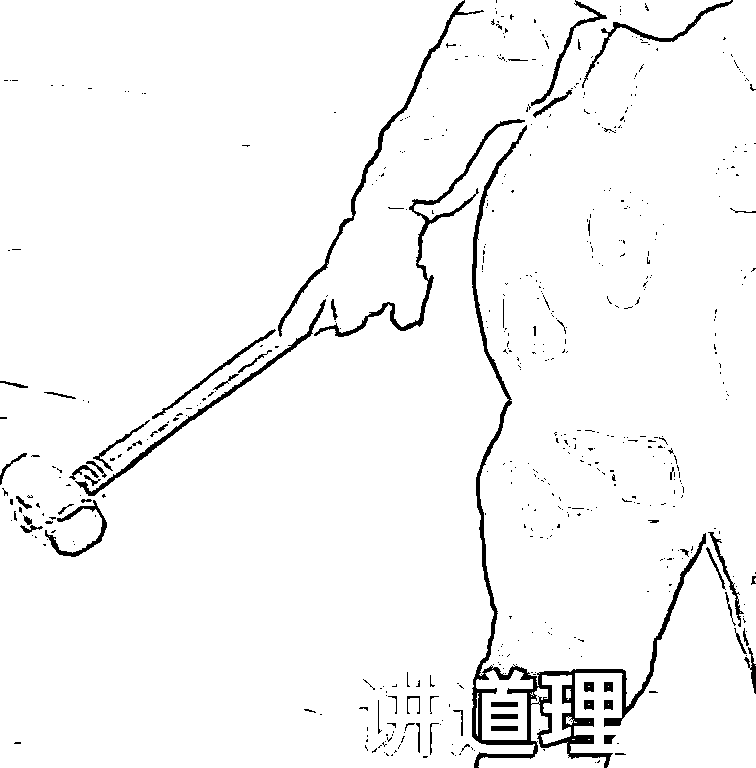

屁嘞。

清华和三本都是本科，实力能说一样吗？

我们的足球比赛体系中，中超是最顶级联赛，依次是中甲，中乙，然后才是中冠。

差了三个等级理论上是降维打击，遇上了没踢个两位数的比分，就算发挥失常。

你说是不是啊，王多鱼?

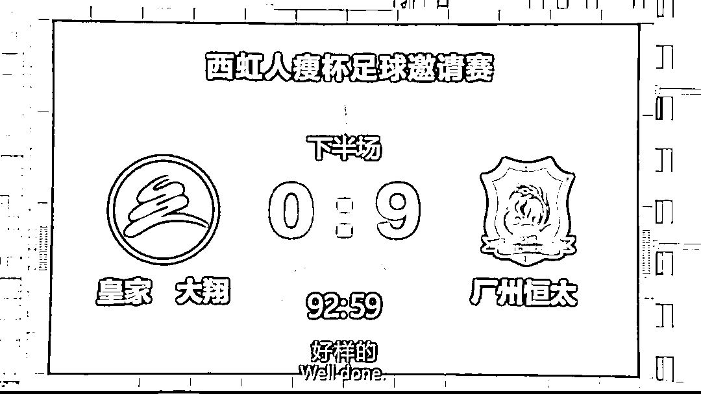

北京国安是中超豪门，和北海极驰合作后的泾川文汇是中冠第 15 名。

这场比赛中，国安虽然不是最强阵容，但也上场了现役国脚高天翼、于洋、王子铭，前国脚张呈栋、郭全博、曹永竞，现役国青梁少文、阮奇龙、田玉达、刘国博。

被一支看起来还不如王多鱼的球队干翻了。

一个 6 岁小孩把一个成年人暴打了一顿，你跟我说那个不是 6 岁小孩，是 12 岁的小孩。

不是法拉利和共享单车飙车，是法拉利和五菱宏光 battle。

那五菱宏光赢了也是够震撼人心的。

想不丢脸，估计只能说泾川文汇其实都是世界巨星化妆的，前锋是 C 罗沾了胡子，中场是梅西整了鼻子，他们不去卡塔尔来这硬刚国安只为打击我国足球的士气。

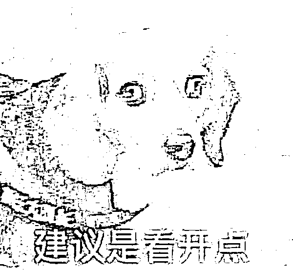

不过话说回来，小俱乐部反杀豪门强队的事情在欧洲并不少见。

比如 2000 年法国杯的加莱队——一支由教师、小职员和地摊小贩组成的第四级球队，比泾川文汇看着还差了几个档次，连克 4 支法甲豪门，一路杀到决赛，差点就捧起冠军的奖杯，一时传为励志佳话。

足球的魅力就在于它的不确定性，纸面上的实力并不能决定最终的结果，小队也有逆袭的一天。

可能是因为大家伙对我国男子足球的传统印象，这次大家都在看豪门笑话，小球队逆天改命的励志情节反倒靠边站了。

可只有这样的“县大队”越来越多，我们的足球才越来越有希望。

另外我觉得吧，国安看似输惨了，实则赢麻了，世界杯期间跟 c 罗梅西抢流量，鲁能上港赢球又如何，who cares？

要是他们不输球，谁关注这比赛啊。

只是这接下来的漫漫县大队征途，只能靠他们自己闯了。

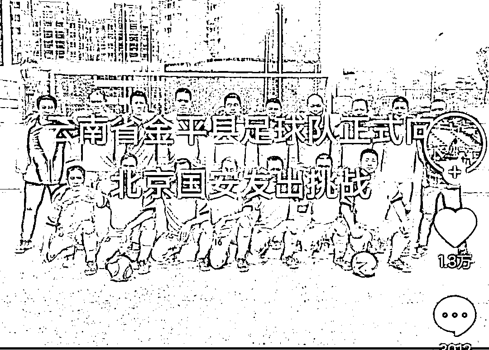

来源：新闻哥

欢迎关注灰产圈社群服务号

← 向右滑动与灰产圈互动交流 →

