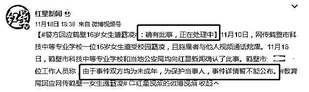
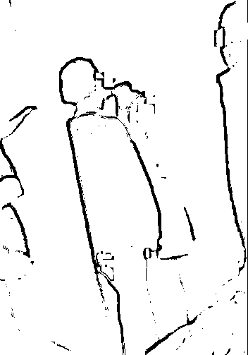

# 筷子戳下体，脱衣猛踹胸...16 岁女孩惨遭校园霸凌，画面不忍直视

> 原文：[`mp.weixin.qq.com/s?__biz=MzIyMDYwMTk0Mw==&mid=2247546454&idx=2&sn=bbfea3cf3676fe0cdcb7246b1b833326&chksm=97cbfd6ea0bc7478e465acd07ab8b35507bb36deba5581c45e6e2fdac31ec8f9a3b8c219c21f&scene=27#wechat_redirect`](http://mp.weixin.qq.com/s?__biz=MzIyMDYwMTk0Mw==&mid=2247546454&idx=2&sn=bbfea3cf3676fe0cdcb7246b1b833326&chksm=97cbfd6ea0bc7478e465acd07ab8b35507bb36deba5581c45e6e2fdac31ec8f9a3b8c219c21f&scene=27#wechat_redirect)

校园霸凌，从来都没有国界之分，

**校园暴力也一直潜伏在校园里，像一个随时都会出现的恶魔。**

电影《罪途》相信有不少人都看过，

**讲述的是一个小女孩徐囡囡被霸凌死亡的故事。**

在十年后的一场复仇中，

当年与此事件有关的人员再次聚集，

通过其中一个人的离奇死亡，从而挖掘出那场霸凌事件背后的秘密。

徐囡囡从小父母离异，父亲家暴酗酒，

母亲离家打工，却被传出**母亲在外做皮肉生意**的传闻。

从此，徐囡囡就成为校园霸凌的对象。

**嘲笑、辱骂，拳打脚踢**，后来徐囡囡因一次校园暴力昏迷，最终却因对麻醉药过敏而导致意外死亡。

**在那场事件中，没有一个人直接杀死了徐囡囡，但是每个人都是凶手。**

无论是韩国的《熔炉》，还是中国的《罪途》，

校园霸凌这个既棘手又无奈的行为，每天都在世界各地不断发生着。

河南鹤壁，一个**16 岁的女孩**某天放学后被同学带到了一个小胡同里。 

她做梦也想不到，

自己的一生，差点就葬送在这些与自己同龄的同学手中。

**16 岁的女儿被霸凌到险些精神失常后，父母才发现事情的不对。**

再三询问，女儿终于说出了自己被校园霸凌的原委。

父亲找学校讨说法无果，

不得已发文声讨，希望学校及霸凌者能给一个交代。

16 岁的女儿就读于河南鹤壁的一个中专， 

11 月 10 日，

女儿被同班的 3 名女同学拉至一处后**被逼下跪，并恐吓逼迫女儿扇自己耳光**。

可这样仍旧无法满足 3 名女同学，

她们随后要求女儿，

**脱掉衣服，开始用脚踹女儿的胸部；**

**脱掉裤子，用筷子猛戳女儿的下体；**

以此来彰显施暴者在众多姐妹中的地位，并且全程都在用手机与他人直播施暴画面。

事后施暴者威胁女儿， 

**胆敢把此事告诉老师和家长，就会再次施暴。**

所以女儿一直忍气吞声，

不敢告诉任何人，

直至自己的精神都出现问题了才被父母发现。

**有些人，或许就如大家说的那样，天生就是坏种。**

他们打你骂你，不需要任何理由，

仅仅是这样做，他们会开心。

他们为了自己开心，便对别人又打又骂，毫无人性可言。

在父亲得知了事情的原委，找到班主任后， 

**班主任却没有反应，也没有采取任何措施，施暴者就像无事发生过一样，仍旧每天正常上课。**

所以才有了父亲发文声讨，报警处理的一幕。

妈妈因为此事已经崩溃了，

即便**跪到校门前请求学校处理此事**，最终也没等到任何人的接待。

在事情被曝光后，**经警方确认，确有此事。** 

但由于牵扯到“未成年人”，所以不便透露过多的消息。

****

不过迫于“舆论压力”，事情最终还是有了新的进展。

**目前三名施暴者，已经被采取刑事强制措施，也对学校相关负责人进行了处理。**

很难想象，

如果没有互联网，没有众多网友的帮助声讨， 

这件事情会不会同大多数校园霸凌事件那样，不了了之。

**在学校眼里，可能就是学生打个架而已；** 

**在施暴者眼里，可能就是放学后，找找乐子而已；**

蚊子不叮在他们身上，他们永远不会觉得痒，

如果此事真的无人问津，谁都不敢保证最后会不会闹出人命。

学校是怕什么？怕有损名誉？

貌似每次校园暴力的发生和处理结果，

都并不是学校主导的，

**必须靠网友们的发生声讨，事儿闹大了学校才会出面解决。**

每次的校园暴力事件，

到我们这些自媒体人发出来前，已经不知道传遍多少个学校了。

****

难道偏偏把老师和学校领导屏蔽了，偏偏他们收不到？

****

校方没有第一时间制止和处理，

或许才是校园暴力事件升级的直接关系吧？ 

家长把孩子交给学校，

孩子挨打了还要家长前来跪下声讨，**甚至下跪求施暴者不要施暴。**

****

教书育人， 

除了教授知识，育人难道不更为重要吗？

校园暴力绝对不是有些人口中的**大惊小怪**，不是普通的闹着玩！

相信下面这些事情的发生，

发生在任何一个家庭里，他们都接受不了，

更不会觉得是，同学间打闹般的大惊小怪了！

**// 01.厕所逼残疾同学吃屎 //**

前几年，在北京人的朋友圈里流传着这样一条视频。

视频中一个身穿延庆二中校服的男生蹲在学校厕所坑位旁，视频中传出欺凌者逼迫他吃坑中粪便的声音。

男生不从，

他们便开始言语威胁，其中一个欺凌者说**“你连尿都喝过了”**。

可见，这已经不是这位男生第一次受凌辱了。

之后，

施暴者用一些器具击打男孩的身体，最终逼迫他吃了粪便。

后来了解到的情况就是，这位男生身有残疾，走路不方便。

**施暴者戏弄他的原因，只是觉得好玩。**

欺凌者共五人，均为延庆二中**初二**年级学生...

**// 02. 17 岁少女对在校女生揪头发、扇耳光 //**

一短发女生遭一黑色长发女子扇耳光、踹肚子和辱骂。

期间该短发女生也有反抗，但继续遭长发女子直接对其揪头发、扇耳光。

让人看过之后不寒而栗。

**// 03. 或许，没有经历过校园霸凌的人，**

**永远都无法想象那种绝望。//**

湖北嘉鱼县某个中学，几个女中学生轮流掌掴一名女生。

一边打还一边嬉笑着说：**打重一点。**

被扇耳光的那个女孩，站在原地不敢还手。

虽然脸被马赛克遮住了，但是仍然能够看出她被打得满脸通红。

对于校园霸凌者来说：一旦开始抱团，他们的恶行可能会没有下限；

一个 15 岁的女孩被自己的三名舍友打成重伤。搜索关注“不惑先生”，一个让你睡不着觉的公众号。

其手段的残忍程度，令人发指：

> 她们先打我的头，之后就用脚踢下部。让我抽烟，用皮带扇我，让我把衣服脱了，然后睡地上，舔地板，最后让我把头伸进马桶，就按那个马桶冲水。

> 安徽怀远县火星小学，13 岁的副班长因为拥有检查作业、监督背书的权力，就向其他孩子要钱。钱没给够，就逼迫他们喝尿。
> 
> 延安吴起县的一所中学，6 名高二的女生持刀威逼自己的学妹，她们脱光受害者的衣服，并拍照上传。
> 
> 2016 年 3 月，一个高三女生在网上吐露被同班的三位男生下了“春药”，并威胁她如果敢告诉老师或者报警，就用“砒霜”毒死她。

孩子的恶一次又一次超出了我们的想象，不懂分寸的年纪里，恶行太容易失去控制。

我们能想象到被打者心中的绝望，但边上却人没有一个挺身而出。

大家都变成了一个冷漠的旁观者。

隐藏在内心深处的胆怯，让他们学会了“明哲保身”。

**当时沉默的人，都成了校园霸凌的帮凶。** 

> “如果我们低估了孩子世界可能存在的残酷性，也就会低估了被霸凌者的绝望。”

没有能力保护自己的孩子，唯一能想到的就是家长、老师。

而大人们却往往低估了“校园霸凌”的后果。

> 内蒙古某中学的一个男生，因为长期遭受校园暴力，家长找到学校，校方给予的答复只是学生打闹，并声称被打的学生情绪已经稳定。
> 
> 结果，那个男生上吊自杀了。

“校园暴力”从来都不是打打闹闹的小事，它是人心中最血淋淋最不加掩饰的恶。

面对这些让人心碎的罪恶时，我们该如何杜绝？

> 1.不要给霸凌者单独接触的机会，借助伙伴系统保护自己。
> 
> 2.控制自己的怒气。因为霸凌者的挑衅行为而感到怒火上冲是非常正常的，而能左右你的情绪也正是霸凌者乐此不疲的重要原因。
> 
> 3.哪怕内心害怕也不要表露出来，表面上一定要表现的很勇敢，径直走开，无视霸凌者。
> 
> 4.告诉成人。老师、家长、校长、学校管理人员等等，他们都可以帮助你，即便只有一丝希望。

无论如何，校园霸凌都是一种不该出现的暴力。

我们要尽可能地去规避这种现象，不要觉得校园霸凌离我们很远，

其实，它就在你我身边。

希望每一个看到的人，都不要再当沉默的那一个。

**校园霸凌，从来没有任何人能置身事外！**

来源：不惑先生

欢迎关注灰产圈社群服务号

← 向右滑动与灰产圈互动交流 →

