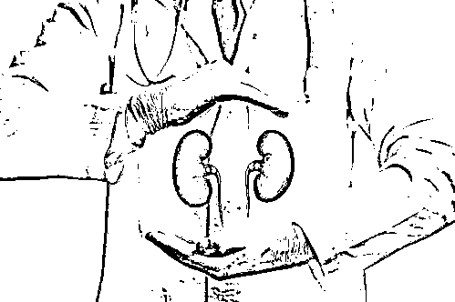

# 国内最大贩卖人体器官案：活摘 51 个肾获利千万！

> 原文：[`mp.weixin.qq.com/s?__biz=MzIyMDYwMTk0Mw==&mid=2247546454&idx=4&sn=b8a64f3086ba2ce168200354be8c30da&chksm=97cbfd6ea0bc7478090e08bf4e9097b4dd3915f63e57b65f3f9de3f4a66eff007d5613b04eae&scene=27#wechat_redirect`](http://mp.weixin.qq.com/s?__biz=MzIyMDYwMTk0Mw==&mid=2247546454&idx=4&sn=b8a64f3086ba2ce168200354be8c30da&chksm=97cbfd6ea0bc7478090e08bf4e9097b4dd3915f63e57b65f3f9de3f4a66eff007d5613b04eae&scene=27#wechat_redirect)

51 枚肾脏，涉案金额 1034 万余元，这是我国被公诉的最大一宗非法买卖人体器官案件。包括组织者、中介、掮客和医护人员在内的被告人，在出租屋内进行活体肾脏摘除，再通过北京一家有资质的三甲医院的泌尿外科主任，实施肾脏移植牟取暴利。

此案终审判决：组织者郑伟被以组织出卖人体器官罪判处有期徒刑 12 年，其他人则分别获 9 年至 3 年半不等的有期徒刑。

**1、北京某三甲医院成移植手术地点**

**46 岁的郑伟是这个团伙的组织者，2007 年年底，没有稳定工作的他在给亲戚找肾源时发现，贩卖肾脏很赚钱，便慢慢就干起这个“营生”。**

**2009 年底至 2010 年初，郑伟在了解到北京不少大医院有大量肾病患者急需实施肾脏移植手术的信息后，设法与北京某三甲医院泌尿科主任叶某取得联系。郑伟表示可以帮叶某从其他医院挖患者过来，还可以提供肾源。两人随后达成合作，叶某对外将郑伟介绍为医院工作人员，并确定该三甲医院为郑某团伙肾脏移植手术实施地点。**

****2、组建团队：扮三甲医院人员找主刀医生****

****郑伟自称是叶某所在的北京某三甲医院器官移植中心工作人员，开始组织人手寻找主刀医生。****

****郑伟通过朋友认识了安徽省萧县杨楼镇卫生院的医生周鹏，向他提出通过有偿收购肾脏的方式招募肾脏供体，非法摘除、转售人体肾脏牟利的方案。周鹏同意后，先联系上了徐州市妇幼保健院医生赵健。****

****郑伟向赵健宣称自己来自北京某三甲医院，需要和徐州方面搞技术合作，建立一家透析中心并要进行肾脏移植手术，请赵健帮他做肾脏移植手术。****

****赵健有些怀疑，提出到三甲医院看看，于是一个月后郑伟把赵健带到北京某三甲医院实地考察。“一个 40 岁左右的泌尿外科副主任接待了我。”赵健说，该副主任称肾脏的配型、患者和供体由三甲医院负责，让他只负责手术，时间到时通知他。****

****于是，赵健就答应帮郑伟做肾脏摘除手术。赵健随后又找到徐州市铜山县第二人民医院的副院长杨国忠帮忙一起做手术，称做一台手术有上千元收入，并要求对方介绍一个麻醉师。杨国忠找来了同院名叫赵辉（另案处理）的麻醉师。此后，周鹏、赵健、杨国忠及赵辉还让郑伟以三甲医院的名义给他们发了聘请赴京主刀手术的聘书。****

******3、摘取肾脏：社区医院动手术连夜开车运进京******

******2010 年 4 月至 8 月，周鹏在郑伟的授意下承租了徐州市泉山区火花社区卫生服务中心，非法实施数十例人体肾脏摘除手术。在火花社区卫生服务中心，赵健等人共进行 20 余台手术，每做一台手术每人能分 1700 元左右。赵健等人在郑伟等人的安排下有手术就做，做完手术拿钱就走，别的不多问。大约在做了 10 台手术后，郑伟给赵健涨了“工资”，每台手术直接给他 2500 元。******

******郑伟供述，一般他将手术安排在周一、周三晚上，一小时就能结束。结束后，他会带着切下的肾装入保温箱，开车回北京，并在早上七点前赶到三甲医院。此后，他向患者收取肾源费用后，联系安排患者在该三甲医院实施肾脏移植手术。******

******对此，叶某称，当时他和郑伟商定，通过合法途径找到肾源，并由其他医院进行取肾手术，再把取好的肾尽快送到叶某所在医院。叶某表示，“院方很高兴，因为医院的资质来之不易，要求每年要进行 30 例以上的肾脏移植手术，如果连续 3 年都达不到 30 例，肾脏移植手术的资质就要被取消了。”******

******然而，叶某所说的这一点，被北京朝阳医院泌尿外科主任张晓东澄清，他表示，不是 30 例手术，而是医院要自己找到 10 个死后愿意捐献器官的供体，因此器官买卖中的活体移植手术并不符合考核标准。******

********4、变本加厉：租房建黑医院摘肾脏********

********2010 年 6 月,郑伟在向北京运输肾脏的途中发生车祸，损失了三个肾。考虑到长途运输风险和肾脏保存,他开始筹划在北京建立摘肾手术室。********

********2010 年 9 月，郑伟在海淀区租下一栋 4 层小楼，并陆续买来医疗器械。这里的一层是医生宿舍和药房，二层是配药室、病房和护士宿舍，三层是手术室和观察室，四层则是餐厅生活区。据团伙中的护士长，曾在徐州多家公立、私立医院工作过的樊海雁供述，这个实施肾脏摘除手术的医院脏乱不堪，连抢救设备都没有。********

********2010 年 9 月至 12 月，郑伟等人在这个黑医院非法实施人体肾脏摘除手术 22 例。********

**********5、肾脏来源：通过 QQ 群聊天找供体**********

********团伙中负责找供体的掮客表示，他们一般通过网络聊天的方式来寻找供体，找到后就安排供体到北京进行体检，与患者进行匹配。其称，一般换两三个供体就可以找到匹配的供体了。********

********据多名被告人的供述,这个团伙在海淀区西北旺六里屯村、树村后营等地租房，提供吃穿养着供体们。最多时，能有几十个供体，大部分都是急着用钱又没有正当职业的人。当麻醉醒来之后一枚肾脏已不知去向，换来的仅仅是 2 万到 2.5 万元不等的报酬。********

********一开始，郑伟一伙人卖一个肾的价钱是 18 万或 19 万，后来是 21 万或 22 万。每个手术成功后，郑伟会给掮客 4000 元左右的“工资”。********

**********6、终审判决：团伙成员被判 3 年半至 12 年**********

******2010 年 12 月，北京市公安局海淀分局刑侦支队在侦查中发现了郑伟犯罪团伙长期在海淀区倒卖人体器官获利。12 月 10 日，警方在丰台区一洗浴中心将郑伟抓获。而就在郑伟被捕的前一天，他的黑医院还做了 6 台手术。******

******2012 年 2 月底,因组织出卖人体器官罪，郑伟及其手下被海淀检察院提起公诉。因被告人患病就医等原因,此案的审理一直延期，直至 2012 年 12 月 12 日才首次开庭审理。庭审未对外公开，主犯郑伟在庭上认罪，其他人则多数表示是在不知情或者在郑伟的描述下认为手术合法的情况下参与。******

******2014 年 3 月 14 日，海淀法院对此案作出一审判决。法院认定郑伟等人为谋取经济利益，组织他人出卖人体器官，情节严重，均已构成组织出卖人体器官罪。依据他们每个人的犯罪情节,法院判处郑伟有期徒刑 12 年、其他人 3 年半至 9 年不等的有期徒刑。******

******一审宣判后，郑伟等人上诉。北京市一中院驳回上诉，维持原判。******

******来源：京华时报******

************

******欢迎关注灰产圈社群服务号******

************************

******← 向右滑动与灰产圈互动交流 →******

************