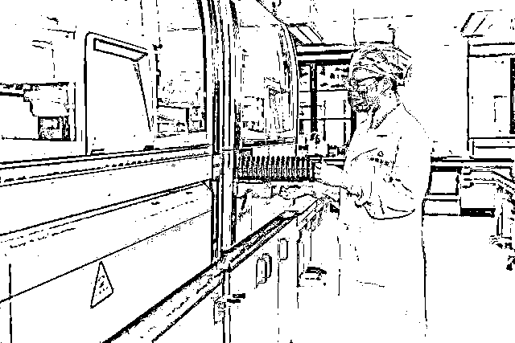
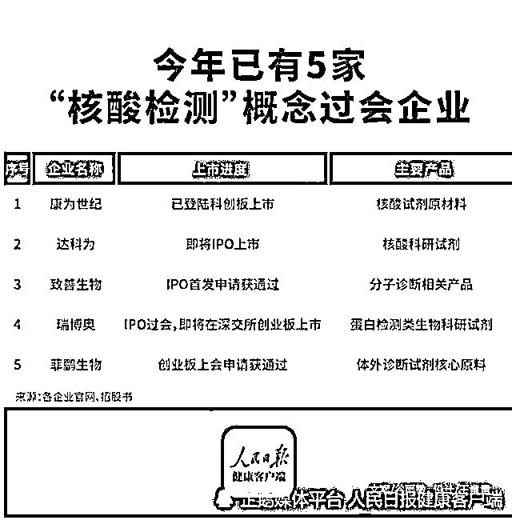

# 禁止核酸检测公司上市

> 原文：[`mp.weixin.qq.com/s?__biz=MzIyMDYwMTk0Mw==&mid=2247546454&idx=6&sn=1478523c61e1b88b20e9a2264b83356d&chksm=97cbfd6ea0bc74780f097f4018d4637dc7fdd7117643ff74c8abc1d95febc3722c2d628b2ae3&scene=27#wechat_redirect`](http://mp.weixin.qq.com/s?__biz=MzIyMDYwMTk0Mw==&mid=2247546454&idx=6&sn=1478523c61e1b88b20e9a2264b83356d&chksm=97cbfd6ea0bc74780f097f4018d4637dc7fdd7117643ff74c8abc1d95febc3722c2d628b2ae3&scene=27#wechat_redirect)

抗疫三年，民生凋敝，无数企业倒闭、艰难求生；无数人生活困顿，咬牙硬撑。

有人星夜赶考场，有人辞官归故里。在一片萧瑟中，竟然有一个行业逆风起飞，业绩一路长虹，赚得盆满钵满，而且扎堆谋求 IPO 上市。

继新冠疫苗科兴生物每年爆赚千亿之后，核酸检测公司扎堆上市被推上风尖浪口。

这个世界太魔幻了：核酸企业扎堆 IPO，有的净利润增 27728％。

当核酸检测企业开始双向收割时，投资者愤怒了。

今年，不少核酸检测机构提交了上市申请，也有企业顺利登陆科创板。单看核酸检测机构的财务数据，那真的是吊打众多看似高大上的上市公司。特别是今年这么困难的环境下，很多上市公司都步履维艰，唯独核酸检测公司，赚钱冲出了天际。

2022 年上半年，据光祥财经统计，国内 104 家（涉及相关）新冠检测上市公司营收 2500 亿元左右，同比大增 37%，远超 GDP2.5%的表现。净利润更是高达 648 亿元，同比暴增 76.6%。18 家规模较大的企业利润轻松翻倍，其中更有 277 倍、185 倍、13 倍亮瞎眼的表现。

据各公司官网显示，今年已经有 5 家核酸检测企业过会，其中包括：康为世纪、达科为、致善生物、瑞博奥、菲鹏生物。

康为世纪已经于 10 月 25 日登陆科创板，目前市值为 45 亿元。

截止到 2022 年第三季度，康为世纪营收为 3.98 亿元，毛利润为 2.943 亿元，毛利率高达 73.96%。归属净利润为 1.453 亿元，同比大涨 68.05%，净利率为 37.69%。

继康为世纪之后，主营核酸检测管子的达科为也即将上市。证监会对达科为注册环节的反馈意见已经出函，如果顺利，达科为不久之后即将成功登陆创业板。

达科为由吴庆军、何俊峰共同出资创立，1995 年出生的吴映洁成为公司第一大股东，2005 年出生年仅 17 岁的何政龙成为公司第五大大股东。

2019 年至 2021 年，主营业务收入分别为 4.3 亿元、6 亿元、8 亿元。2020 年、2021 年净利润分别增长 488%和 27 %。

疫情这三年对很多人和企业可能不好过，但对很多核酸检测企业却是千载难逢的好机会。你为这些核酸企业贡献了多少利润呢？这样的股票你会买吗？

全民核酸，天天核酸，然后我就靠核酸检测把自己的检测公司做上市了。

“达科”申请 IPO，这就是一家核酸检测公司。疑惑的是，如果这家公司如愿上市，难道准备在全国范围内长久核酸检测？假如明天就全民不做核酸，这家企业怎么办？也宣告破产或转型？

**资本市场根本要义是支持符合国家产业政策，有长远发展前景，有核心科技和强大竞争力的公司上市。**

******纵观这些核酸类检测公司，有多少科技含量呢？又有多少发展潜力呢？******

******疫情所带来的市场需求是暂时的，短暂的。所有人都相信，疫情很快就会过去，这类需求将大幅萎缩，甚至消失。******

******圈钱的意图非常明显，靠核酸检测暴富还上市，目的何在？******

********应严禁“核酸检测”企业 IPO 上市：利润虚高，发国难财，伤害老百姓的感情，不合时宜！********

********作为在应急管理下产生的核酸需求，无须赘言，大部分核酸检测企业背后都是权贵资本。********

********我们坚****决反对核酸产业链企业上市。首先，这类公司存续期都很短，通常只有 1-2 年，这就导致这类公司的治理结构和潜在风险都被隐藏。********

**********其次，核酸检测公司业务单一且不稳定，相信这类应急管理下的需求很快消失，核酸检测公司将面临生死存亡和转型问题。**********

**********再者，核酸检测公司在 A 股已经太多太多，再有类似公司上市几无意义。尽管核算公司财务报表亮丽，这里面未来会存在大量坏账。**********

**********最后，核酸检测企业上市不符合资本市场对实体经济和战略性新兴产业支持的定位。而且存在伦理和道德拷问。**********

**********核酸检测企业，你们已经赚得盆满钵满了，何故还要来资本市场套现割韭菜？你们的良心不会痛吗？**********

**********那些帮助核酸企业上市的保荐机构、会计师事务所、律师事务所以及发审委委员等，让核酸检测企业上市，你们的良心不会痛吗？**********

**********咱中国有句话，叫做“医者仁心”，在古代，药店都会挂一副对联：何愁架上药生尘，但愿世人无疾病。**********

**********如今，一旦医学，包括医学检测，如果沦为商业学、沦为资本的工具，人人都有可能上当受骗，人人都有可能成为它产业链上的一颗运转的螺丝钉。**********

**********希望疫情早日结束，希望核酸检测早日消亡。**********

**********希望康为世纪是最后一家核酸检测企业上市！**********

********       来源：爆角资讯，喻言亭阁********

****************

********欢迎关注灰产圈社群服务号********

********************************

********← 向右滑动与灰产圈互动交流 →********

****************