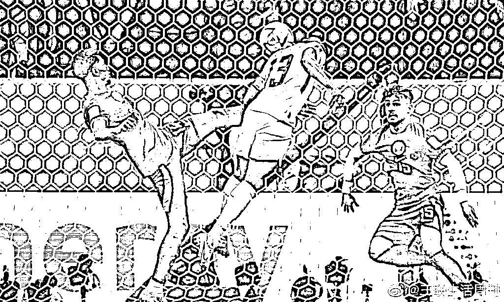

# 愁眉苦脸中东土豪，竟成卡塔尔世界杯第一天最大看点！比赛本身和“中国元素”都输了哈哈哈

> 原文：[`mp.weixin.qq.com/s?__biz=MzIyMDYwMTk0Mw==&mid=2247546454&idx=7&sn=f378c12111f7afbc1ec7cfc5d96822bb&chksm=97cbfd6ea0bc74783e0c3479aa47c00a91eb12a962580c1affb364501ed7e1ed9500c393cac4&scene=27#wechat_redirect`](http://mp.weixin.qq.com/s?__biz=MzIyMDYwMTk0Mw==&mid=2247546454&idx=7&sn=f378c12111f7afbc1ec7cfc5d96822bb&chksm=97cbfd6ea0bc74783e0c3479aa47c00a91eb12a962580c1affb364501ed7e1ed9500c393cac4&scene=27#wechat_redirect)

又到了伪球迷四年一度的看球时间！⚽️

大家说实话，昨天晚上

有多少人

为了吃夜宵才看了世界杯开幕 

而且大家的关注点

几乎都在**除了球队之外的一切**上面

连吉祥物

看着都像是一张飞翔的巨大馄饨皮

背后看是有点吓人

但是脊梁觉得从侧面看还是挺萌的呀

和这个 emoji 表情也有点像的 👻 👻 👻

世界杯开幕

热搜也是非常有意思的 

不过真的

卡塔尔世界杯里的中国元素

实在是太多了

看比赛的时候，看场边广告就知道了

不仅是赞助商和合作伙伴

卡塔尔世界杯主体育场，**卢塞尔球场**

也是中国企业以设计施工总承包身份

承建的首个世界杯体育场项目

世界杯期间的新能源发电、

安全用水、大巴客车

还有球迷村里上万套的集装箱式房屋

都有中国制造的身影

除了大的建筑和水电配套等

卡塔尔世界杯的周边

也几乎都是中国制造

也就是

足球、球衣、背包、赛事纪念品这些

中国制造的比例也很高

以及开幕式上的烟花

从设计到生产

“浏阳出品”的味儿实在是太足了！

虽然但是

到底还是个世界杯！比赛还是要看的！

本届世界杯的首场比赛

是东道主卡塔尔队 🇶🇦

对阵南美劲旅厄瓜多尔队 🇪🇨

 比赛中，卡塔尔被南美劲旅全面压制

射门次数寥寥无几

在对手面前毫无还手之力

网友说，这比赛看着看着

怎么就看到了中国男足的影子救命 

最后，卡塔尔 0 比 2 输球

赛后，卡塔尔队主教练桑切斯表示：

**“紧张打败了我们”**

这场比赛之后

**世界杯东道主首战不败定律遭遇终结**

卡塔尔成为世界杯历史上

首支在揭幕战输球的东道主

微博上热搜也挂起：

**#卡塔尔成首支揭幕战输球的东道主#**

看看看台上的球迷

**卡塔尔 VS 厄瓜多尔**

实在是耐人寻味哈哈哈哈哈哈哈

**卡塔尔：。。。。。。。**

**厄瓜多尔：！！！！！！**

中国网友看着这对比

卡塔尔土豪们一个个都沉默无言

厄瓜多尔球迷全部起立欢欣鼓舞

实在是太好笑了呀哈哈哈哈哈！

**“谢谢你卡塔尔**

**头一次让我看到有钱人不开心的模样”**

卡塔尔：

厄瓜多尔今晚睡沙漠（不是

大家调侃得很开心

不过现场的这一排背影

确实是黯然离场了

可是大家别忘了

别人的不快乐，是这样的不快乐 💎

毕竟，卡塔尔可是被称作

**“世界上唯一没有穷人的国家”**的国家！

人均年薪五十万

每天工作三小时

下午两点就算是辛苦加班

话说回来

卡塔尔世界杯的成本是真的不得了

**单届世界杯 2200 亿美元的举办费用**

**除了创下历史之最**

**更比以往所有世界杯的举办成本**

**加在一起都要高！**

在卡塔尔世界杯之前

费用支出最高的是 2014 年巴西世界杯

为 150 亿美元左右

但算算，也就是卡塔尔的 6.81%

上一届，2018 年俄罗斯世界杯的成本

约 140 亿美元

同样不到卡塔尔世界杯的 1/10

除了世界杯

2020 东京奥运会和残奥会的总成本

大约是 1.42 万亿日元，折合约 130 亿美元

换句话说

**卡塔尔世界杯所花费的资金**

**是东京奥运会的 17 倍**

不愧是你，卡塔尔！

* 图源南都大数据研究院

卡塔尔，真·砸钱届的老祖宗

可是

2200 亿也搞不到首胜呢 

来源：脊梁 in 上海 SH

欢迎关注灰产圈社群服务号

← 向右滑动与灰产圈互动交流 →

