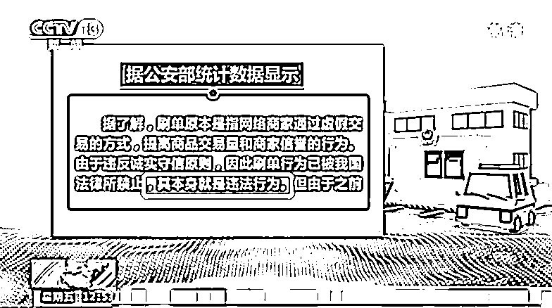

# 一个智商足够的成年人，能跟骗子过几招？

> 原文：[`mp.weixin.qq.com/s?__biz=MzIyMDYwMTk0Mw==&mid=2247546454&idx=8&sn=54a63df86a98e4aad2dc28fbdb3d3aa9&chksm=97cbfd6ea0bc747889c81f560d8f075d004099e8a5635438075d4a1bb6c0431154c2687a4af9&scene=27#wechat_redirect`](http://mp.weixin.qq.com/s?__biz=MzIyMDYwMTk0Mw==&mid=2247546454&idx=8&sn=54a63df86a98e4aad2dc28fbdb3d3aa9&chksm=97cbfd6ea0bc747889c81f560d8f075d004099e8a5635438075d4a1bb6c0431154c2687a4af9&scene=27#wechat_redirect)

“哥，救命啊！”

正在排队做核酸的守哥接到了表妹的电话。

“怎么了？你被谁威胁了？”

“我室友遇到诈骗了，生活费都没了！”

“啊？报警了吗？”

“报了，但据说钱很难追回。所以她要死要活的，咋办啊？”

电话那头伴随着隐隐传来哭声，守哥抬头看看一眼核酸长队，叹了口气：“那啥……我过去一趟吧。”

1 小时后，守哥来到咖啡馆，坐到了表妹和她的室友小鱼对面。小鱼眼睛通红，在表妹再三鼓励之下，她抽抽噎噎地开口了。

“我真傻……”

小鱼心心念念的手机做大促，她盘算了一下，还差 2000 块钱。

小鱼正在琢磨咋整的时候，一个不怎么联系的网友突然发来了一条消息，说有个做兼职的路子，只要点赞、好评就能每天领钱。

小鱼也不是没想过对方可能是骗子，也问了对方。但对方信誓旦旦地说绝对保真，还发了自己收益的截图给小鱼。

一方面是网友凿凿的证明，另一方面自己当时确实太想要那款手机，小鱼就让对方把自己**拉入了一个“赚钱内部群”**。

“刚进去的时候发现群里有 100 多人，群主动不动就发红包。第一天发了十几个，我抢了十几块钱，都够我一天的饭钱了。我看了看群里，有蓝领、有学生，还有家庭主妇，拉我进去的人说，这是他们公司的内部群，**为了激励大家，给一点小甜头**，逢年过节三位数的红包她都领到过。”

第二天，群主让群里的人去关注公司旗下的红人，给他们点赞评论，关注一个就发一个红包，小鱼也没多想，反正是赚的，这一天关注了二十多个人，领了 30 多块钱。

第三天，来了个新主管，让大家加了一个新群，这个群的**红包更大，任务也变得多了起来**，比如关注某个博主，给某个视频点赞，给某个 APP 点赞，还有做公益任务，以及给店铺刷单……小鱼挨个做下去，不知不觉就领了七八十块的红包。

“当时我心里想着，这个事还挺不错的，后来他们发了一个需要垫付 200 多块钱的刷单任务，我当时就觉得是坑，就没接……”小鱼眼泪又掉了下来。

“那后来你为啥又被骗了呢？”守哥不解。

“后来他们又发了一个需要垫付 100 块的小任务，我想着，这两天也领了 100 多块了，**做一次试试，大不了就当没领过这些红包，**再加上群里不少人都在晒自己回款的截图。”

于是小鱼就按照群里的说法，注册账号，在一个操作平台上做任务，十几分钟下来，100 元就变成了 200 元，系统显示可以提现了，小鱼就抱着见好就收的心理，选择了全部提现，按照提示绑定银行卡。

很快，卡里就多了 200 块钱，这下小鱼就稍微放心了。然后她就接了一个垫付 200 元的任务。

“我想着，这 200 也是白来的，就继续做呗，手机 8000 多，还差 2000 就够买手机了，要是这次能成，就有 400 了，多做几次我就可以买手机了。”

第二次，200 元变成了 400 元，小鱼又提现成功，这次她觉得这个平台真的很靠谱，于是赚到 800 元的时候没有操作提现，而是根据客服的指引加单冲刺 1600 元收益。

令她惊喜的是，系统显示她赚到的不是 1600 元，而是 3600 元！

“当时我开心死了，血赚 3600 啊！买完了手机还能吃一顿好的！我当时就想着提现出来，结果系统提示说出了故障，提款金额超过了目前的账户等级，需要给**账号升级**才可以，我就按提示往里面充了 2000 块，心想着这次可以提现去买手机了，哪知道……”

**至此，事情的全貌已经很清晰了，守哥来给大家总结一下：**

首先，对方早早地在网上加你为好友，而不是一开始就给你推销“赚钱”的渠道，假意掩盖其真实目的，降低你的警惕。等成为好友之后的很长时间，再拉你入局的时候，你就不会怀疑对方的初衷。何况对方还准备好了所谓的“收益”的截图，打消你的疑虑。

其次，通过发红包的方式，让你认为自己真的捡到了天上掉下来的馅饼，进一步强化你的信任度，但其实这是放长线钓大鱼。

接下来，发布小任务，让你用领到的红包来做任务，一步步培养你的捡便宜和服从心理，在你的内心种下心理暗示，再次削弱你们的警惕心。

后面加入新的群，发更大的红包，做更赚钱的任务，让你们的胃口变大，贪欲增强。

然后，重头戏就来了，他们发的垫付任务跟你前几天领的红包差不多，正好让你感觉自己可以搏一搏，反正也不亏，到了这一步，几乎只要这么想，你就会上当了。

接下来，无非就是用提现来反复减弱你的警惕心，一旦你有一次没有提现成功，那就可以收网了。

所以，咱普通人，千万不要跳进坑里去跟骗子斗智斗勇，**毕竟你面对的是一个犯罪团伙，他们用专业的心理战引导你一步步入坑。**尤其是无固定职业人群、大学生、宝妈等****，更是容易被宅家兼职刷单赚钱的招聘广告吸引，成为骗子的“目标”。

骗子抓的就是用人们贪小便宜的心理来吸引受害人。也不要有侥幸心理，觉得自己很聪明，能够只吃鱼饵不咬鱼钩。骗子非常懂得利用受害人的“趋利心理”“紧急避险”“拒绝沉没成本”等心理来实施诈骗。

切记天上不会掉馅饼！况且，**刷单是国家明令禁止的违法行为**，切勿以身试法。若需兼职，请通过正规渠道，切莫陷入“低投入、高回报”的陷阱。
*图源：央视频*

（本文根据真实事件改编）

来源：守护者计划 作者：守哥

欢迎关注灰产圈社群服务号

← 向右滑动与灰产圈互动交流 →

