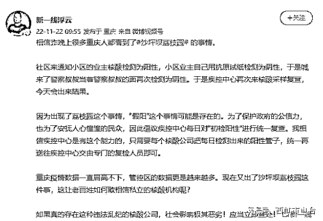
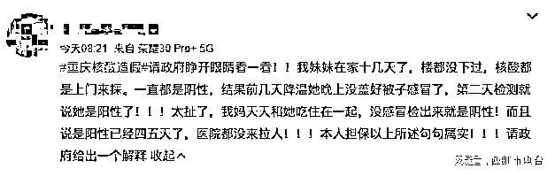
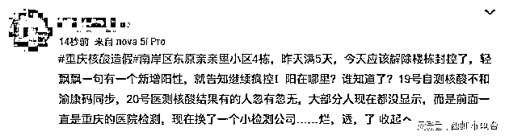
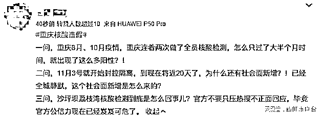

# 网传重庆市民质疑核酸造假，被通知阳性后报警，当警察面自测果然是造假

> 原文：[`mp.weixin.qq.com/s?__biz=MzIyMDYwMTk0Mw==&mid=2247546500&idx=2&sn=1bbe82d021e1711964f21e00dfa58d26&chksm=97cbfdbca0bc74aa68dbdaad1b99ee173ed0bebf72e337cbe80df486883122cb70f89832fe5d&scene=27#wechat_redirect`](http://mp.weixin.qq.com/s?__biz=MzIyMDYwMTk0Mw==&mid=2247546500&idx=2&sn=1bbe82d021e1711964f21e00dfa58d26&chksm=97cbfdbca0bc74aa68dbdaad1b99ee173ed0bebf72e337cbe80df486883122cb70f89832fe5d&scene=27#wechat_redirect)

重庆社区通知业主核酸阳性，业主当场用抗原试纸检测却为阴性

日前，据博主@新一线浮云爆料，重庆沙坪坝荔枝园社区通知小区业主核酸阳性，业主质疑核酸结果，于是报警后当着警察的面再次检测为阴性。于是，疾控中心再次来核酸采样复查，截至发稿复查结果未出。

目前，在重庆疫情造假的相关话题下，已有多位网友跟进爆料或者提出自己的质疑。

事实上，核酸实验室出问题此前已在其他城市出现过，例如：

1 月 10 日，郑州金域医学区域负责人，实施引起新型冠状病毒感染肺炎传播或者有传播严重危险的行为，被立案。

4 月 22 日，合肥两家核酸检测机构出具“假阳性”报告，被市委书记怒斥不负责任，表示要对第三方检测机构从严管理。

5 月 9 日，上海中科润达的核酸检测结果频频出现“假阳性”，最终被撤换。

同样是 5 月份，北京市连破三起核酸造假案，3 家医学检测机构被连锅端，31 名涉案人员被采取刑事强制措施。

9 月 24 日，石家庄和合医学检验实验室，阳性结果不上报，造成社区传播。

11 月 10 日，昆明寰基医学检验所，采样过程弄虚作假，出具假报告，干扰防疫工作。

11 月 13 日，内蒙古赛斯基因科技有限公司被曝光核酸检测结果“错报”，警方介入调查。第二天，公司法人署某以及信息错误录入的员工姜某被依法采取刑事强制措施，“错报”也被证实是造假。

11 月 20 日，山西省朔州市多名居民没做核酸就出结果，且记录上显示采样与出结果时间一致。当地卫健委称类似情况人数很多，系第三方平台操作失误，他们正按照要求撤回。

11 月 18 日，陕西省榆林市卫健委发布通报称：针对网民质疑陕西花香医学检验实验室在榆林市核酸检测中存在问题的举报，榆林市卫健委已暂停该机构在榆林市的执业活动，并成立联合调查组进行全面调查。

重庆的疫情数据持续居高不下，眼下又出现这种事，相关部门有必要认真检查是否有上述问题。这既是为了重庆早日控制疫情，也是维护当地防疫工作的公信力。

      来源：西虹市电台，喻言亭阁

欢迎关注灰产圈社群服务号

← 向右滑动与灰产圈互动交流 →

