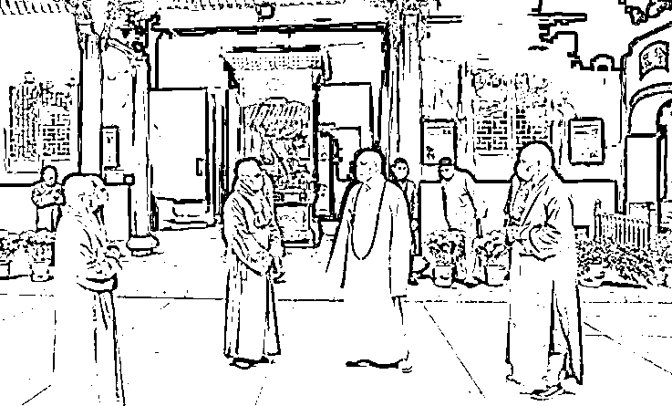
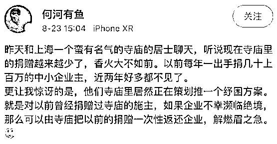

# 和尚都急了

> 原文：[`mp.weixin.qq.com/s?__biz=MzIyMDYwMTk0Mw==&mid=2247546500&idx=3&sn=26366b15790847d6b11350eee2a88d04&chksm=97cbfdbca0bc74aaf9782a53164fce389725c45ddae5d0a1f1de68acd6f7456cd159609d2400&scene=27#wechat_redirect`](http://mp.weixin.qq.com/s?__biz=MzIyMDYwMTk0Mw==&mid=2247546500&idx=3&sn=26366b15790847d6b11350eee2a88d04&chksm=97cbfdbca0bc74aaf9782a53164fce389725c45ddae5d0a1f1de68acd6f7456cd159609d2400&scene=27#wechat_redirect)

一张微博截图频频被转发，大意是：博主听说现在**寺庙里的捐赠越来越少了**，香火大不如前。以前每年**一出手捐几十上百万的中小企业主，近两年好多都不见了**。

他们寺庙里居然正在策划推一个**纾困方案**。就是对以前曾经捐赠过寺庙的施主，如果企业不幸濒临绝境、那么可以由**寺庙把以前的捐赠一次性返还企业，解燃眉之急**。

我相信博主所言非虚，中小企业的困境确实到了路人皆知的程度，大概只有“胡不食肉糜”的地主家傻儿子才会全无知晓吧。

**中国中小企业走到生死一线的边缘**不是一天两天的事了，可谓艰辛备至。最近一位朋友向我诉苦，他这几年的经历就是中国中小企业处境的缩影。

一家汽配产业的小企业，三四十个员工，前些年生意红火时确实赚了不少钱。有没有当施主，我不知道。

**赚来的钱主要投入到了生产设备更新升级上的**，甲方的要求越来越高，那就得持续投入。两千多万就这么投下去了。

本以为能够过几天岁月静好的好日子，慢慢收回投资，没想到**环保风暴**一来，麻烦事就多了。具体的不说了，**折腾一番后还是留不住，得搬迁。**

文件上写“搬迁”两个字是简单的，可是操作起来是困难的。有的问题花钱能解决，有的问题花钱也解决不了。比如说技术骨干流失，你就算是给钱，人家有家有口的也不肯去。

“花钱能解决的都不算问题”也不能说是错的，只不过钱也是个问题。**银行贷款？烧香拜佛也搞不定**。谈不上故意刁难，银行也不是吃素的，也知道各个行业的风险高低。你说你**有合同有订单**，可是明年你的买卖还在不在都不知道了，说那些有什么用呢？你说**拿生产设备抵押**，人家还看不上。

**房产倒是银行认的“硬通货”，**但是被亲友劝住，好歹还得留条安身立命的退路吧？他愁得不得了，可是我又能说什么呢？只好劝他认清现实，不要硬撑，真不行就歇了吧。

“**不要硬撑，真不行就歇了吧**”，这几年我对几个民营中小企业的朋友都说过。各有各的“圆满”。

干最大的那家**搬到东南亚去了**，本土留了一个包装车间，就是用来养老员工的。还有老东家退休，少东家主动减产，本来忙忙碌碌不照面的人，开启了盘手串、喝普洱、弹古琴的幸福生活。**工厂只留了“一口气”，等着被腾笼换鸟了**。

**最郁闷的是把买卖干没了**。过程还挺曲折，甲方是国有上市公司，发给他一张大单，他乐坏了。甲方还很仗义，帮他联系的金融机构给了贷款，他高高兴兴上马新流水线。**正准备放手大干，没想到单子没了**。资金链瞬间就断了，告甲方违约只是理论上可行，私底下去勾兑，人家倒是指了条明路——“**把****企业卖了算了**”。原来如此，但也只能如此。结果就是他净身出乎，不带走一片云彩。**二十年经营，本来挺红火的买卖，就跟了别人姓**。

这些还算圆满，**人没事，日子还能过**。并没有不信邪硬要闯关东搞得灰飞烟灭的，也没有被非法集资、偷税漏税人财两空的，也许那些都是别有用心的谣传，反正身边没有就好。

这些年，中国**中小企业不断渡劫：新劳动法**一劫；**去产能、去杠杆**银根收紧，连环劫；**环保风暴**，又一劫。然后，就是**疫情劫**了。

有意思的是，疫情的出口红火倒是给很多出口外向型的中小企业续了命。**但是，也只是续命。**最新公布的数据显示，进出口、消费等指数都在下滑，“疫情景气”还能持续多久呢？

中国中小型民营企业**为什么会陷入困境**？这是一个禅机。

那位“净身出沪”的前企业主参加了一次活动，专家谆谆教诲“中国民营企业**盲目扩张**是经营不良的主要原因”，把他气疯了。平心而论，专家的话也没错，再补充一下“**盲目踩刹车**”的次要原因就更对了。

**中国有很多专家如此天真可爱**，憨憨的笑容像极了地主家的傻儿子。你跟他们说中小企业难，他们会和你说互联网坏、房地产坏，等等。充其量也就是目光茫然地来一句“要大力支持中小企业”，说过了就算过去了……

中国四十年经济发展，最让人骄傲的是成为世界大工厂。但是，骄傲和中小民营企业无关，他们是**血汗工厂**、是**落后产能**、是**金融风险**、是万恶的资本、是**污染源**。他们造不出芯片，**进不了世界 500 强，干不翻美国、打不了台湾**。他们默默地活过，默默地死去，无人哀悼。

最后讲个故事。江湖传闻“**饿了么**”**当年创业时，上海玉佛寺投资了 10 万元**。我一直以为这是什么神仙段子，近来有个说法较近情理。

说是 2009 年经历了全球经济危机后，经济形势很不好。上海玉佛禅寺的**方丈觉醒法师**主动向上海市慈善基金会提出，出资 1000 万元成立“**觉群大学生创业基金**”，为大学生的创业提供便利。主要是以“**贴息贷款**”的方式，给大学生一笔启动资金。“饿了么”是 2009 年时首批拿到该基金 10 万块的企业。2016 年 12 月，**饿了么赚钱后，向该基金回捐了 50 万元。**

这是一个温暖的好故事，**别看人和尚是吃素的，他们可比很多人要明白**。

 来源：喻言亭阁

欢迎关注灰产圈社群服务号

← 向右滑动与灰产圈互动交流 →

