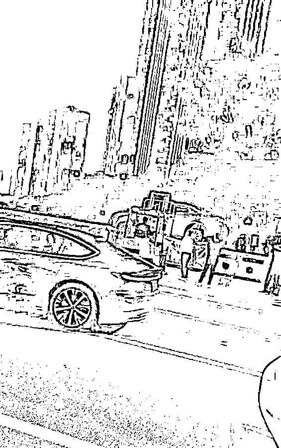
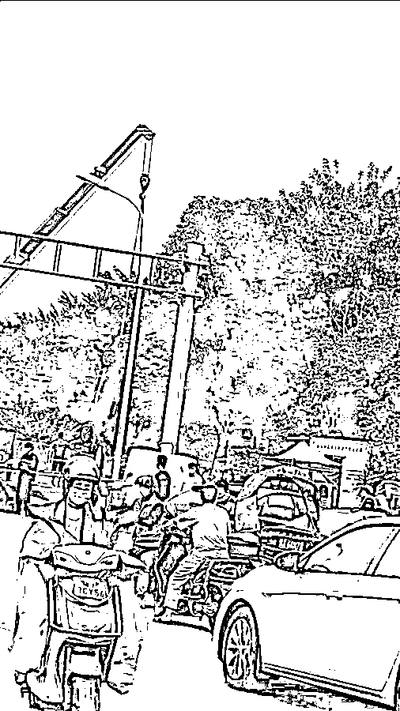
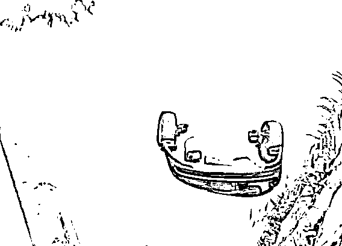
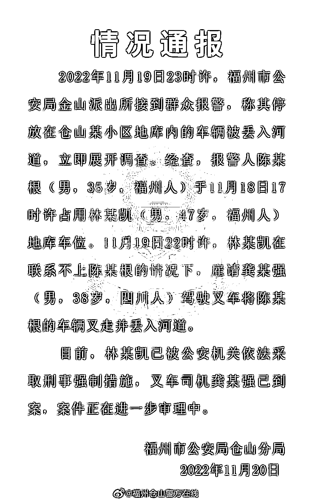

# “这破车我赔得起！”男子雇叉车将占位小车丢进河里，警方通报，律师解读

> 原文：[`mp.weixin.qq.com/s?__biz=MzIyMDYwMTk0Mw==&mid=2247546500&idx=4&sn=cbb9d9d62daf4d9f4d728fd187cbbc5b&chksm=97cbfdbca0bc74aa6a29ddf88c2065de9f1efd94038e0aef1eaf6c06715ac513225c74c2ee6c&scene=27#wechat_redirect`](http://mp.weixin.qq.com/s?__biz=MzIyMDYwMTk0Mw==&mid=2247546500&idx=4&sn=cbb9d9d62daf4d9f4d728fd187cbbc5b&chksm=97cbfdbca0bc74aa6a29ddf88c2065de9f1efd94038e0aef1eaf6c06715ac513225c74c2ee6c&scene=27#wechat_redirect)

一业主因私家车位被人占用，在联系不上对方的情况下，直接叫来叉车将占位轿车扔进河里。

这是 11 月 19 日晚发生在福建福州的一幕。有目击者称，被丢下河的车辆已打捞了上来。

对此，11 月 20 日，福州市公安局仓山分局通报称，男子因地库车位被占用，雇人驾驶叉车将他人车辆叉走并丢入河道，目前已被公安机关依法采取刑事强制措施。

[`mp.weixin.qq.com/mp/readtemplate?t=pages/video_player_tmpl&action=mpvideo&auto=0&vid=wxv_2673220080926965762`](https://mp.weixin.qq.com/mp/readtemplate?t=pages/video_player_tmpl&action=mpvideo&auto=0&vid=wxv_2673220080926965762)

**男子雇叉车将占位车丢河里**

**警方通报**

据潇湘晨报报道，11 月 19 日，网传福建省福州市仓山区一小区，业主因车位被人占用，叫来叉车将占位小车扔进当地的流花溪河道内。记者了解到，事发小区为仓山区的融信白宫小区，疑似因车位纠纷引发。

图片来源：视频截图

多个网传视频显示，某小区地下车库内，一辆叉车正在移动一辆小轿车，移到河岸边后，将小车推入河道内。“占我的车位，叫他移他说‘我感冒了’，可以啊，感冒了是吧，没事的，我直接把它丢到流花溪里去，**这破车我也赔得起。**”原车位主人说道。

丢进河里的小车已被打捞起 图片来源：视频截图

11 月 20 日，多位福州网友告诉记者，事发小区为仓山区的融信白宫小区。网友提供的视频显示，20 日上午，轿车还在河里泡着。融信白宫内一位业主告诉记者，其了解到疑似因车位纠纷引发，不过矛盾者双方的情况并不是很清楚。

11 月 20 日，潇湘晨报记者致电福州市公安局仓山分局了解情况，未获有效回应。海峡都市报现场报道，20 日上午 9 时许，一辆轿车沉在流花溪里，现场已拉起警戒线，仓山分局回应称，具体情况还在了解。

11 月 20 日下午，福州市公安局仓山分局通报称，11 月 19 日 23 时许，福州市公安局金山派出所接到群众报警，称其停放在仓山某小区地库内的车辆被丢入河道，立即展开调查。

经查，报警人陈某根（男，35 岁，福州人）于 11 月 18 日 17 时许占用林某凯（男，47 岁，福州人）地库车位。11 月 19 日 22 时许，林某凯在联系不上陈某根的情况下，雇请龚某强（男，38 岁，四川人）驾驶叉车将陈某根的车辆叉走并丢入河道。

目前，林某凯已被公安机关依法采取刑事强制措施，叉车司机龚某强已到案，案件正在进一步审理中。

**律师说法** 

这个话题引发了网友热议，网友们众说纷纭。有网友说：“这样的做法，法律上不支持，道德上很赞同。”

也有网友吐槽：“叉车司机也是狠人，什么活都敢接。”

有网友认为，虽然对方理亏在先，但这样的行为不妥当：“很刑，这次有理变没理了。”

据海峡都市报，记者就此事咨询了福建新世通律师事务所的康国俊律师。康国俊律师表示，车位如果是业主购买的，占据他人所购买的车位是侵犯了他人所有权。根据民法典第二百三十六条规定，妨害物权或者可能妨害物权的，权利人可以请求排除妨害或者消除危险。业主作为所有权人可以要求其退出车位。

但业主如果保护权利的方式失当，可能也会涉嫌故意毁坏财物，根据中华人民共和国刑法，第二百七十五条规定，故意毁坏公私财物，数额较大或者有其他严重情节的，处三年以下有期徒刑、拘役或者罚金；数额巨大或者有其他特别严重情节的，处三年以上七年以下有期徒刑。但具体是否涉嫌犯罪还需要有关部门进一步查实认定。

而该事件中，叉车司机可能存在明知将造成严重后果仍然放任或者疏忽大意的过失，具体情况要执法部门判定。

据上游新闻报道，11 月 20 日下午，浙江五联律师事务所合伙人徐利平向记者表示，车位主人的扔车行为可能涉嫌构成故意毁坏财物罪，但受害方的过错也很明显，车位主人也有不入罪的正当理由。办案机关应多调查具体情节和背景信息，斟酌考虑办案。

浙江五联律师事务所合伙人徐利平认为，车位主人的扔车行为，如果给受害者造成的经济损失超过 5000 元以上，即达到刑事立案标准，可能涉嫌构成故意毁坏财物罪，“目前还不知道车子的品牌、新旧程度和价值。”

“如果占用时间不长，留个电话还可以通融。”徐利平认为，本来大城市停车位就较为紧张，车位也属于业主的私有财产，车主抢占别人的停车位，是这场扔车事件矛盾的导火索。这类占用他人车位的行为，对公众造成的社会观感较差，容易激发矛盾。在这起事件中，办案机关应该多考虑公共道德。

他还表示，办案机关还需要酌情考虑涉案双方平日表现等细节，以及“小区车位充裕程度”、“车主是否经常占用他人车位”等背景，都需要详细了解，“如果涉事车主经常占用一个车位，那么恶性很大。”

“《刑法》规定，情节显著轻微、危害不大的，不认为犯罪。这可能属于民间纠纷。”徐利平称，他个人认为，如果受害方的过错也很明显，车位主人也有不入罪的正当理由，公安机关和司法机关应该充分利用不构成犯罪的出口，能够治安处理的，就不采取刑事措施；能民事赔偿的，就不采取治安管理措施，“不能与公众对社会道德认知出入太大。”

来源：每日经济新闻，景来律师

欢迎关注灰产圈社群服务号

← 向右滑动与灰产圈互动交流 →

