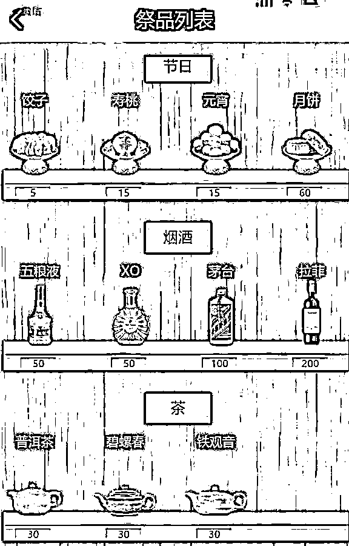

# 人还活着，却被网络祭奠 4.3 万多次？法院判了

> 原文：[`mp.weixin.qq.com/s?__biz=MzIyMDYwMTk0Mw==&mid=2247546500&idx=5&sn=aa48ef7300015604a9cff62d7f94e425&chksm=97cbfdbca0bc74aad2714c34b51a3d156da2d30f4b7495146062b3cab3ac40ad51f9a4595f9e&scene=27#wechat_redirect`](http://mp.weixin.qq.com/s?__biz=MzIyMDYwMTk0Mw==&mid=2247546500&idx=5&sn=aa48ef7300015604a9cff62d7f94e425&chksm=97cbfdbca0bc74aad2714c34b51a3d156da2d30f4b7495146062b3cab3ac40ad51f9a4595f9e&scene=27#wechat_redirect)

今天上午

“人还活着却被人网络祭奠 4.3 万次”

冲上热搜 

这到底是个什么事？

****人活着，但在网上“被死亡了”****

某日

璐璐从朋友处得知

在安息网络祭祀平台（化名）内设有

“福建厦门美丽女孩璐璐纪念馆”

**该馆建立于 2016 年 1 月**

**6 年来访问量达 4.3 万余人次**

网页上详细记载了璐璐的“生平”

包括出生日期、籍贯、悼词

“2010 年 1 月某天晚上

离校后失踪

过了好几天才在海里发现她面目全非的尸体

愿在天堂安息”

纪念馆设有灵堂、网上墓园等动画背景

都放着璐璐的头像

另外还设有“音容笑貌”模块

发布了 10 张璐璐的生活照

对此，有网友推测：

****法院判决：平台承担侵权责任****

[`mp.weixin.qq.com/mp/readtemplate?t=pages/video_player_tmpl&action=mpvideo&auto=0&vid=wxv_2674833051548123139`](https://mp.weixin.qq.com/mp/readtemplate?t=pages/video_player_tmpl&action=mpvideo&auto=0&vid=wxv_2674833051548123139)

璐璐得知此事后十分气愤

网页中记载的

个人信息均与其本人信息一致

且所有照片都是

她发布在个人社交平台的生活照

她认为安息网络祭祀平台

侵害其肖像权、名誉权

要求平台承担侵权责任

**安息网络祭祀平台也确认**

**这些情况属实**

但因这个纪念馆设立于多年前

当时还未实行实名制登记

所以目前只能找到设立用户的

IP 地址及昵称、登录名

无法提供其

真实姓名、地址、电话等信息

法院审理认为

安息网络祭祀平台应

严格审核被纪念人的相关信息

特别是对设立者与被纪念人的身份关系

及被纪念人的死亡信息

进行严格的形式审查

（如相关部门出具的死亡证明等）

防止别有用心的人利用平台

对他人人格权益进行侵害

本案中

**平台并未严格审查被纪念者璐璐的信息**

**未严格落实注册用户实名认证**

**导致实际侵权人认定难**

**依法应承担侵权责任**

****高价虚拟祭品、诱导消费……网络祭扫乱象丛生****

2021 年

张亮（化名）也遭遇过类似事件

他表示

有人在网络祭祀平台给他建了一块网墓

打开地址链接跳出来一个网页

一个墓碑形状的图片上

不仅有他的照片、真实姓名

底下还放了供品

多次联系网站后

这个网墓才被删除

随着越来越多人网络祭扫

高价虚拟祭品、诱导消费

恶意为生者创建“灵堂”等

**乱象随之而来**

民政部数据显示

今年清明节假期首日

全国共有 2304 个网络祭扫平台

网络祭扫群众 695 万人次

祭奠堂的虚拟祭品

今年 4 月

经搜索发现

不少网络祭扫平台

对逝者信息审核存在漏洞

随机下载几个网络祭祀 App

**均可乱填信息**

**随意上传照片创建纪念堂**

创建过程很顺利

平台均没有进行任何审核

今年 4 月 2 日

国家网信办下发通知

部署开展清明期间

网络祭扫规范管理工作

其中包括严防活人被祭拜

随意立网碑建网墓等情况

****网络祭扫，不能“乌烟瘴气”****

**P 遗照**

**本质是一种网络暴力**

脱离了善意娱乐的范畴

表现出显著的人身攻击

恶意丑化

传谣抹黑趋向

网络祭祀平台应加强审核

规避活人“被死亡”“被祭祀”等现象

避免给无辜者造成权益侵害

在此，法院提醒

当发现自己的民事权益

被他人利用网络服务侵害时

**应当及时留存证据**

**并将相关诉求及初步证据**

**反馈给网络平台的经营者**

**防止自身合法权益继续被侵害**

来源：央视网，利箭在行动

欢迎关注灰产圈社群服务号

← 向右滑动与灰产圈互动交流 →

