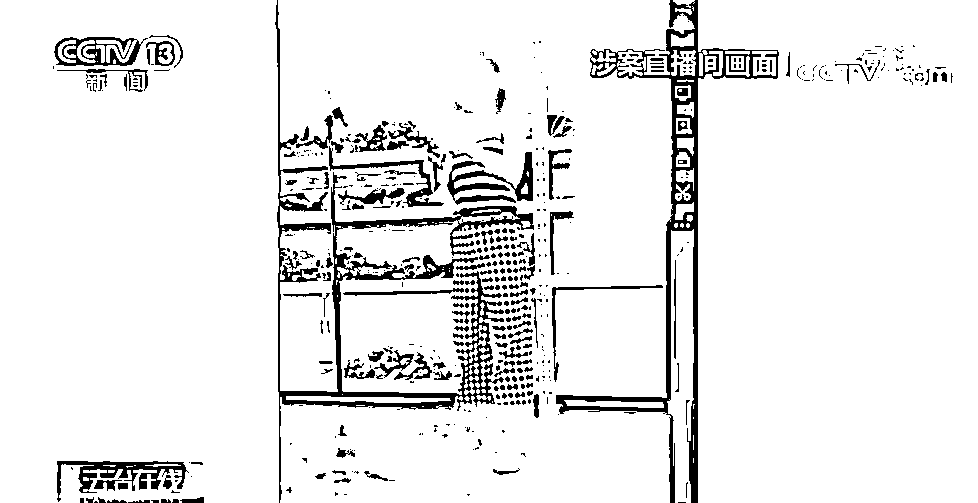
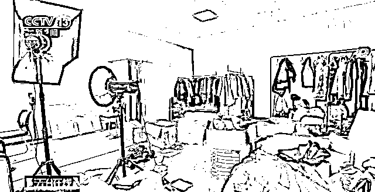
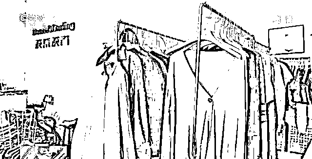
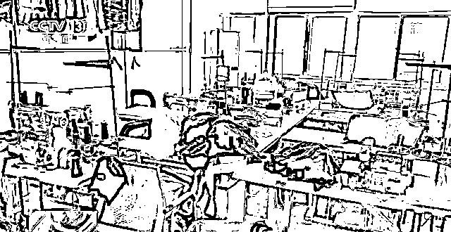
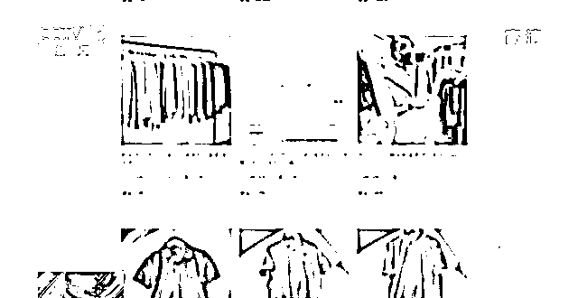
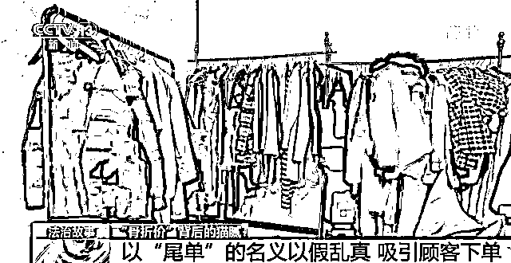
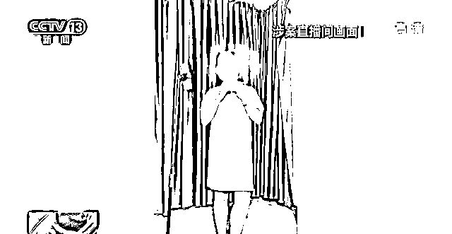

# 百万粉丝网红店被曝光！

> 原文：[`mp.weixin.qq.com/s?__biz=MzIyMDYwMTk0Mw==&mid=2247546500&idx=8&sn=af7b997fc976ac268dde4c5c2727e5a8&chksm=97cbfdbca0bc74aa57d408118b33cb9dbe0db79d5f341bdc53a6bf431ec5a1480dd27990ad75&scene=27#wechat_redirect`](http://mp.weixin.qq.com/s?__biz=MzIyMDYwMTk0Mw==&mid=2247546500&idx=8&sn=af7b997fc976ac268dde4c5c2727e5a8&chksm=97cbfdbca0bc74aa57d408118b33cb9dbe0db79d5f341bdc53a6bf431ec5a1480dd27990ad75&scene=27#wechat_redirect)

“剪标”“大牌尾货”“骨折价”……一家有百万粉丝的网店打着这些名义，通过直播带货售卖商品。店里诸多知名品牌的商品都以超低价格出售，每次直播在线观看人数达一万人。然而，这家店铺的背后暗藏猫腻。 

警方调查发现，**涉案店铺制假售假，**还在直播中通过各种话术糊弄消费者：“全部是飞艇过来的，假货我用那么麻烦？”“费力搞到货别人却不领情，这心情你懂吗？”……**售假手段环环相扣。**

[`v.qq.com/iframe/preview.html?width=500&height=375&auto=0&vid=n3364dezqbo`](https://v.qq.com/iframe/preview.html?width=500&height=375&auto=0&vid=n3364dezqbo)

**商家打着“尾货”“尾单”名义博人眼球**

**实为制假售假团伙**

这家叫“淡紫淡青外贸品牌店”的网店在店铺的介绍页面中写着“专业、专注品质、坚持性价比”，不会直接注明商品的品牌名称，而是用一些隐晦的代号来进行展示。

带货团队声称，他们销售的商品都是大牌的尾货、尾单，品质上与正品无异，但价格要低上许多，这样的说辞吸引了不少人的关注。但警方了解到，其店内销售的商品都是披着正品外衣的假冒商品。

警方针对涉案网店进行调查发现，其实际经营者是一个名叫田某的男子。经侦查，办案人员不仅摸清了涉案团伙的基本架构，还查出除了这处仓库之外的多个窝点。2021 年 6 月，山东菏泽警方抓获了田某在内的 30 余名犯罪嫌疑人，查获各类假冒品牌服装 30 余万件。办案人员顺线侦查，锁定了其上游犯罪团伙。

田某等人售假窝点的规模让办案人员感到震惊，仓库中查获的假冒商品甚至涉及几十种国内外知名品牌。

**环环相扣！**

**警方揭秘直播间售假手段** 

那么，田某是如何将正品服饰仿制出来的呢？

**先买正品服装制版后再退货**

据田某交代，他平时会关注一些品牌服装的旗舰店，每当有热门新品发布的时候，就会第一时间购买这些产品。通过对正品服装的测量和调整，田某等人在一天之内就能做出仿制品的定版。之后，他们会**采购以假乱真的布料、贴标及辅料等，尽快大量生产这批假冒商品。**

办案人员了解到，田某等人会对正品商品的材质、款式、颜色等多方面进行考量，让他们生产的冒牌货具备较高的相似度。并且，他们把样衣生产完成之后，还会把正品服装通过无理由退款的方式再退回商家。

**吸引大量粉丝关注 伺机诈骗**

民警注意到，涉案店铺在某社交网站上的账号拥有百万粉丝，该账号不仅时常展示一些服饰的广告图，还会发布直播时间和内容，吸引粉丝关注。田某等人利用公众号、社交平台进行引流，慢慢培养更多粉丝的关注度，开设的直播间几乎每次都能吸引上万人围观。

**以“尾单”名义以假乱真 吸引顾客下单**

涉案直播间内的服饰价格低廉，按常理会引起人们怀疑，但田某等人却用商品是正品厂家的**“原单”“尾单”**等理由，打消大家疑虑。

虽然田某等人声称，他们是从各个品牌的代工厂进货，但实际上经警方侦查，这种说辞只是他们为了把假货伪装得更逼真、同时掩盖自己制假售假行为的借口而已。并且，田某等人还会剪掉或是遮挡品牌商标来逃避打击。

**如遇顾客投诉 则用话术搪塞**

虽然田某等人仿制的假货具有较强的迷惑性，但也有顾客收到实物后会提出一些质疑，如投诉掉色、缩水等。发现这种情况后，售后人员会找比较专业的词语来回复消费者：“本身你从网上购买的价格就低，因为这是一部分底货，质量稍微会有些瑕疵。”

如果实在糊弄不过去，团伙成员则会直接为顾客办理退款退货，以免因为投诉影响他们的售假生意。大部分消费者因为本身衣服价格也不高，从心理上就容易接受，觉得没必要再去投诉。

田某等人被利益冲昏头脑，选择了制假售假的歧途，还采取了不少“非常手段”来遮掩自己的犯罪行为，他们最终都要为此承担法律责任。

**网络并非法外之地**

**经营网店、直播带货要遵守法律法规**

同时提醒广大消费者

购买商品应通过正规渠道

对于“骨折价”为噱头的兜售

一定要谨慎对待

来源：央视新闻

欢迎关注灰产圈社群服务号

← 向右滑动与灰产圈互动交流 →

