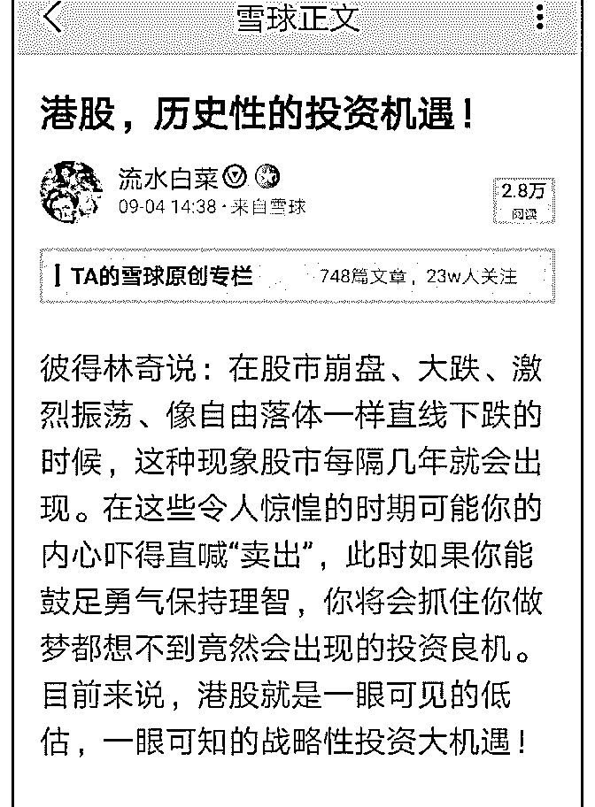
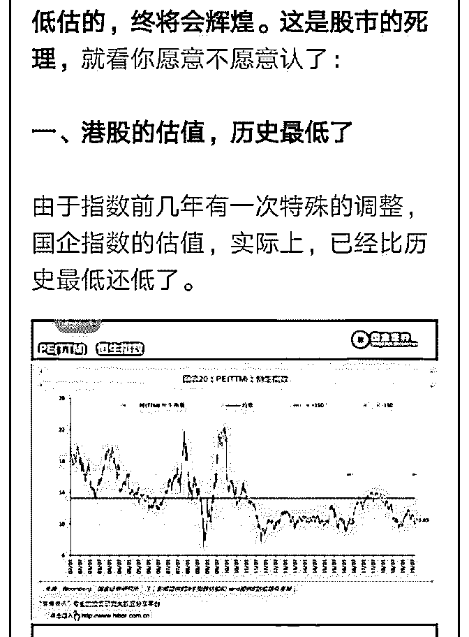
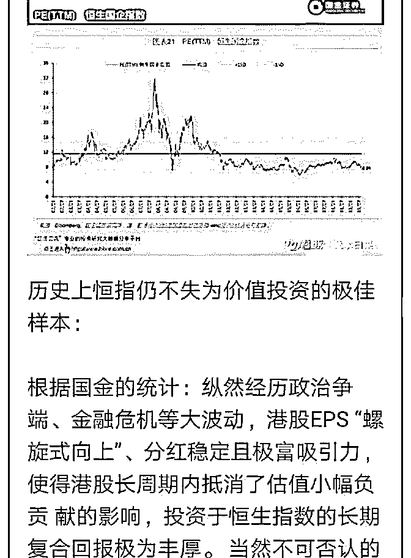
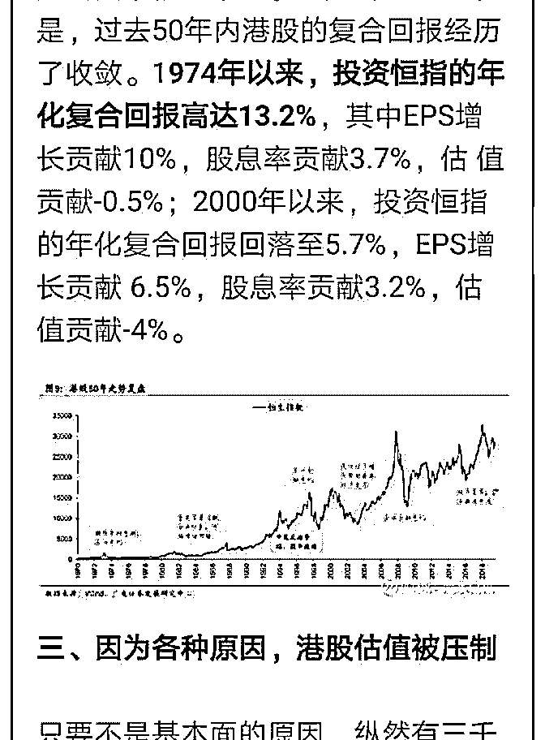
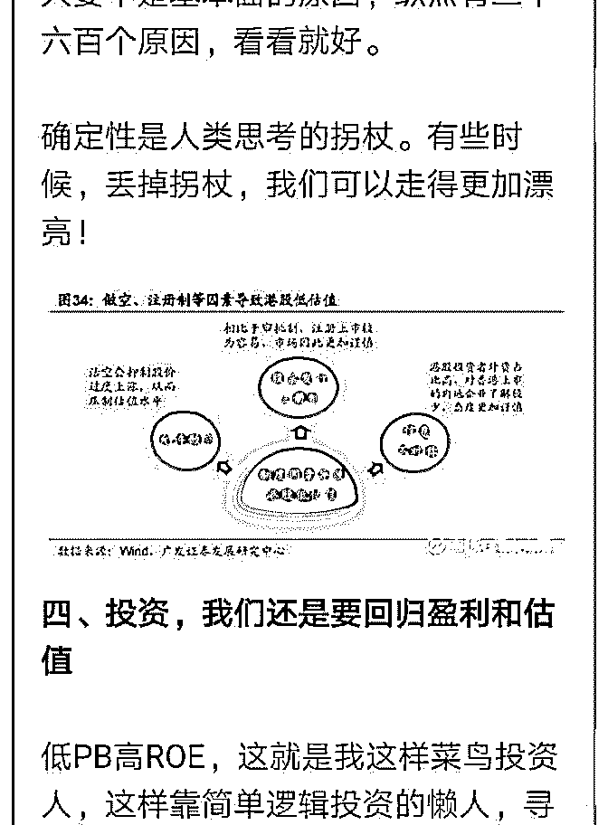
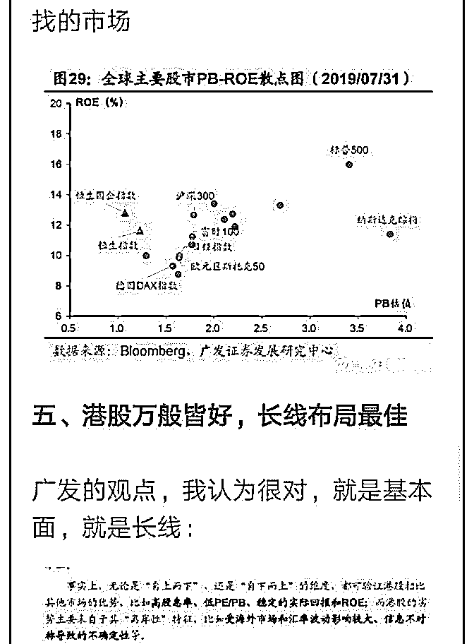
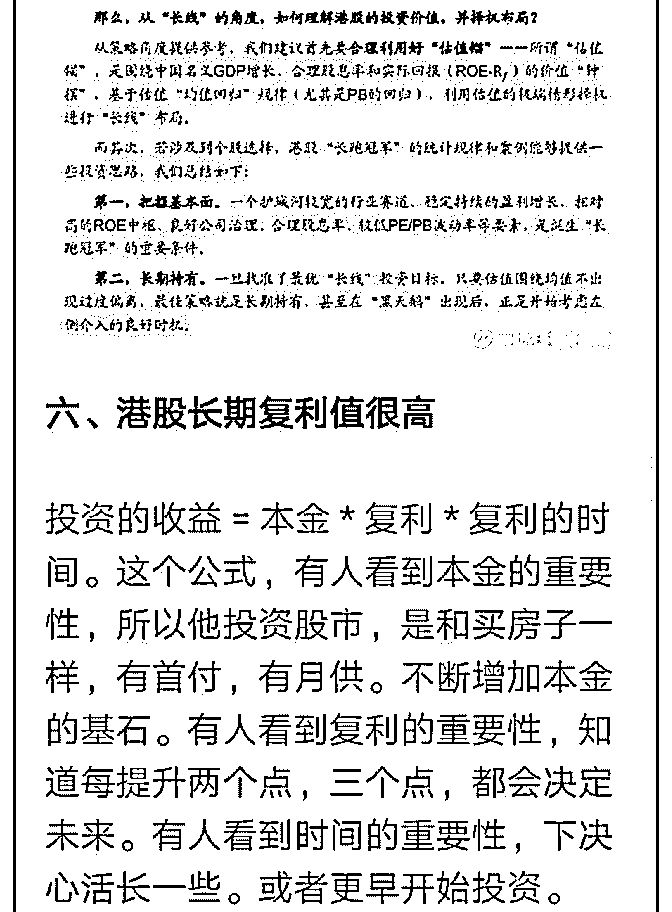
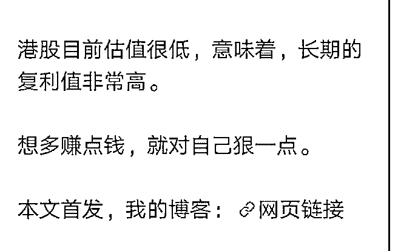

# 白菜闲聊投资 28：

流水白菜 : 白菜闲聊投资 28：港股，历史性的投资机遇

这篇文章，源于前一阵的讨论。我把这些讨论整理了，放在 一起：

（一） 根据国金的统计：纵然经历政治争端、金融危机等大波动， 港股 EPS “螺旋式向上”、分红稳定且极富吸引力，使得港股 长周期内抵消了估值小幅负贡 献的影响，投资于恒生指数的 长期复合回报极为丰厚。 当然不可否认的是，过去 50 年内港 股的复合回报经历了收敛。1974 年以来，投资恒指的年化复 合回报高达 13.2%，其中 EPS 增长贡献 10%，股息率贡献 3.7%，估 值贡献-0.5%；2000 年以来，投资恒指的年化复合回 报回落至 5.7%，EPS 增长贡献 6.5%，股息率贡献 3.2%，估值 贡献-4%。

（二） 彼得林奇说：在股市崩盘、大跌、激烈振荡、像自由落体一 样直线下跌的时候，这种现象股市每隔几年就会出现。在这 些令人惊惶的时期可能你的内心吓得直喊“卖出”，此时如果 你能鼓足勇气保持理智，你将会抓住你做梦都想不到竟然会 出现的投资良机。目前来说，港股就是一眼可见的低估，一 眼可知的战略性投资大机遇！

详细看下面这篇整理过图文的文章

2019-09-04(10 赞)

评论区：

小宏 : 感觉港股不会慢慢涨，而是会暴涨，因为弹簧压得太紧了，

关注公众号"懒人找资源"，星球资源一站式服务