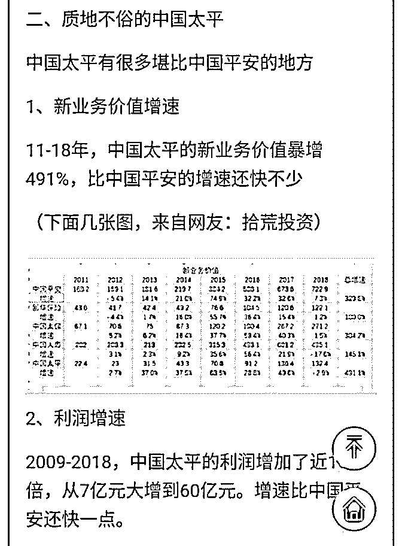

# 白菜闲聊保险 17：

流水白菜 : 白菜闲聊保险 17：中国太平，历史性的投资机遇

目前 H 股保险股都非常便宜。中国太平估值仅 0.4EV，极度低 估。过去十年，由于基数低，中国太平有四项发展优于同 业，新业务价值增速行业第一，保单继续率行业第一，盈利 增长行业第一，优质代理人增长，十倍。

2019-09-04(11 赞)

评论区：

Billy : 太平是不是资产质量不如新华，毕竟新华前几年锁定了大量的利率比较高的长期国债，可以后续很多年释放利润，而

太平这部分比较少？

流水白菜 : 太平的投资波动性极大。更依赖股市。（这是弱点，但目前股市在低位，所以，可以接受）你看他 13-15 年业绩

（当时估值不低于平安）

关注公众号"懒人找资源"，星球资源一站式服务