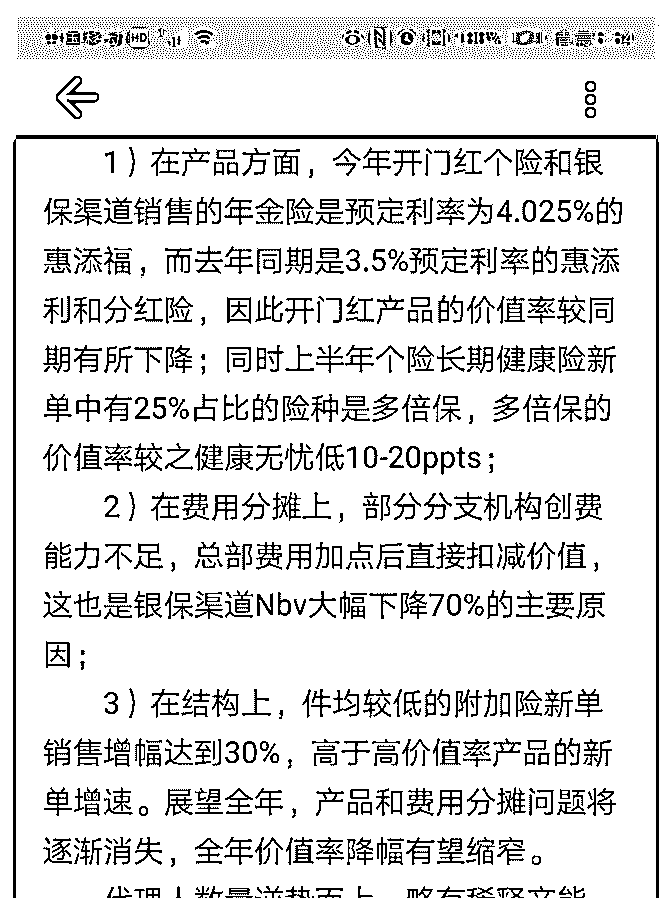
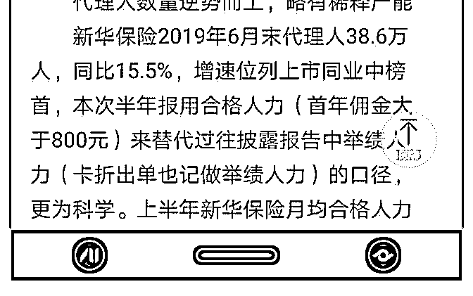

# 白菜闲聊保险 16：

流水白菜 : 白菜闲聊保险 16：谈谈新华保险的投资

（一） 如果优质企业，是 A 级。那么，中国平安是 S 级，新华保险是 B 级。这一点，在投资新华保险以前，就很容易判断出来的。 但由于新华保险是纯寿险，行业处于发展的好时期，所以可 以算 A 级。投资的角度上，H 股新华保险，比 A 便宜百分 40， 这样算一眼可见的安全边际。

（二） 18 年初，我开始投资新华保险 H 股，目前看股价表现，完全不 能看。

我当时的预期只要有，一，盈利。18 年中新华保险大增百分 50，领先同行。19 年中，暴增百分 80。这个预期预期到了， 但很遗憾，股价和每股盈利完全没有关系。 二，净资产。19 年中，净资产大升。似乎也没关系。 三，公司战略。重视代理人发展。上一届领导说了，没有实 现。这一届领导上来，代理人立刻大增 15。但市场没有一点 掌声。。保单利润率，去年，新华的保单利润率都做到超过 平安了，但。。。

总之，新华过去一年半，各项指标中，无论是哪些有好的方 向发展，甚至做得很好，市场都没有正反馈。都是无视或者 不喜欢。

即便说分红，分红率，其实新华百分 30 也算可以了。

（三）

但以前不是这样。 15 年以前，新华的估值大多时候比中国平安都高。（这明显 不合理）。13-17 年，虽然新华的内含价值增长和平安一样。 但我们知道，一样内含价值，中国平安可以释放百分 130 的利 润，但新华可能也就是 105。 但新华 H，目前只有中国平安估值的三分一。 中国平安依旧低估不少，但新华，也可以不假思索说极度低 估。

（四） 投资很多时候令人困惑。新华过去两年的业绩表现，我大体 判断是对的。新华的历史估值，我也打了折扣。投资，还加 上了 H 股这么一个安全边际。但过去两年，新华 H 股简直是如 入冰窟。

这就是市场。 突然之间，只有 S 级的公司才能被接受。

（五） 写这篇文章。是想说明，市场的几年内的“标准”是不可琢磨 的。你买的公司理由再充分，也要进行仓位管理。作为小投 资着，在这个市场只能“听天由命”。 如果公司健康运行，那么，很好盈利能力的企业，极低估值 买入，一定能带来很好的回报。但记住，这个一定能，中国 平安当年用了 5 年的时间。 新华保险会被市场煎熬几年，我会很耐心的持有。跟踪。虽 然新华保险没那么好，但其实，在这个市场，赚钱能力也算 A 级了

2019-09-03(29 赞)

评论区： 肖扬 : 早晨好 流水白菜 : 早

淡定人生 : 早[愉快]

流水白菜 : 早

龚辉 : 早上好！

流水白菜 : 早

安 di : 可能需要熬吧，跟当年的平安一样

左团右圆 : 已经开始定投新华 h，像以前定投平安 a 一样

关注公众号"懒人找资源"，星球资源一站式服务