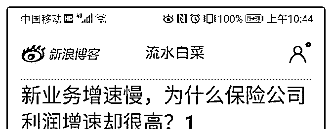
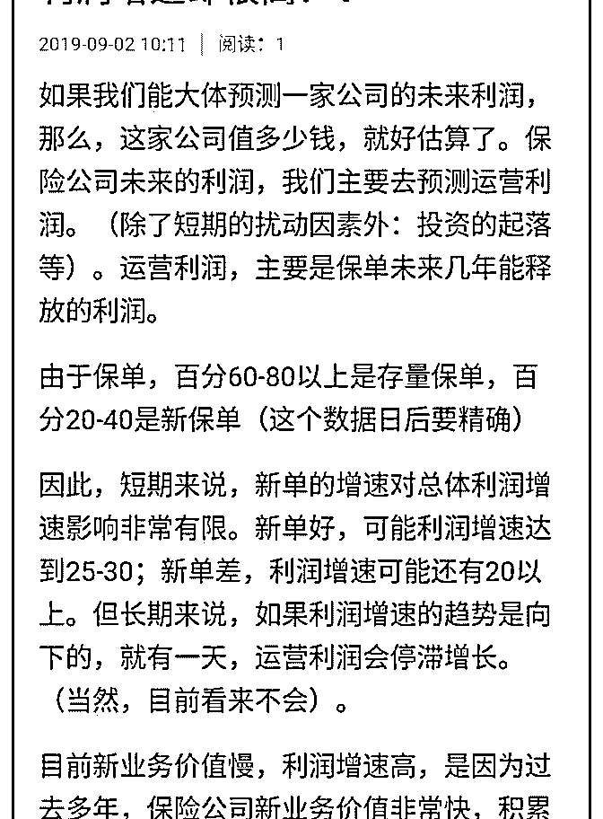
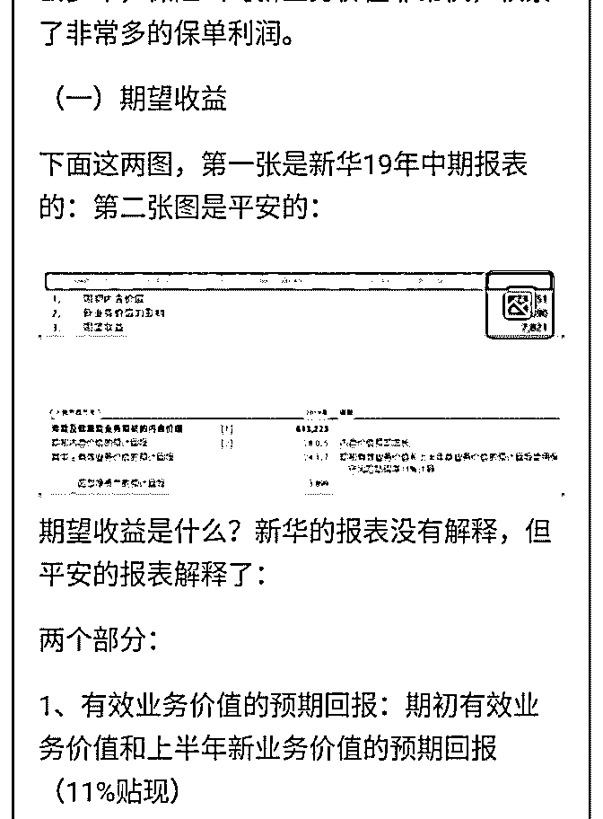
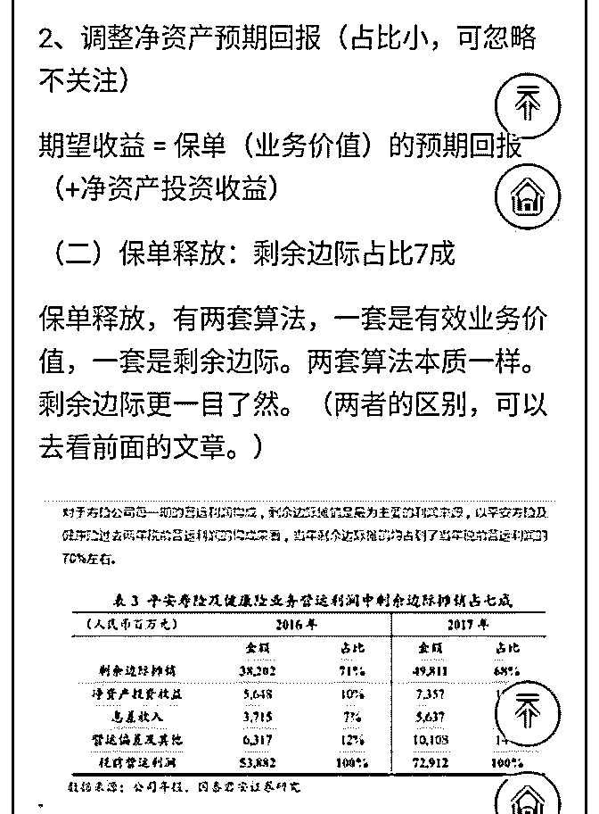
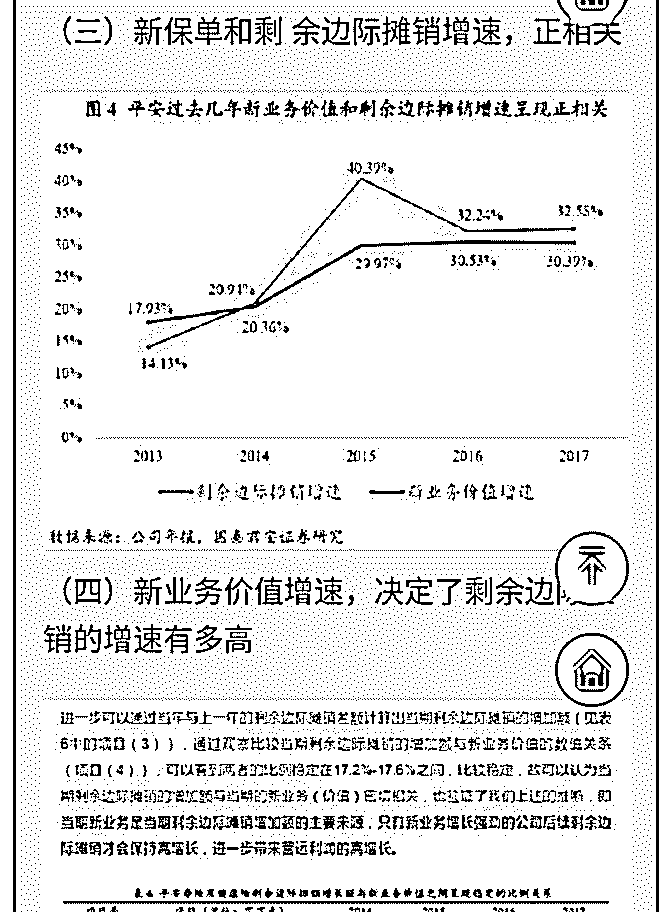
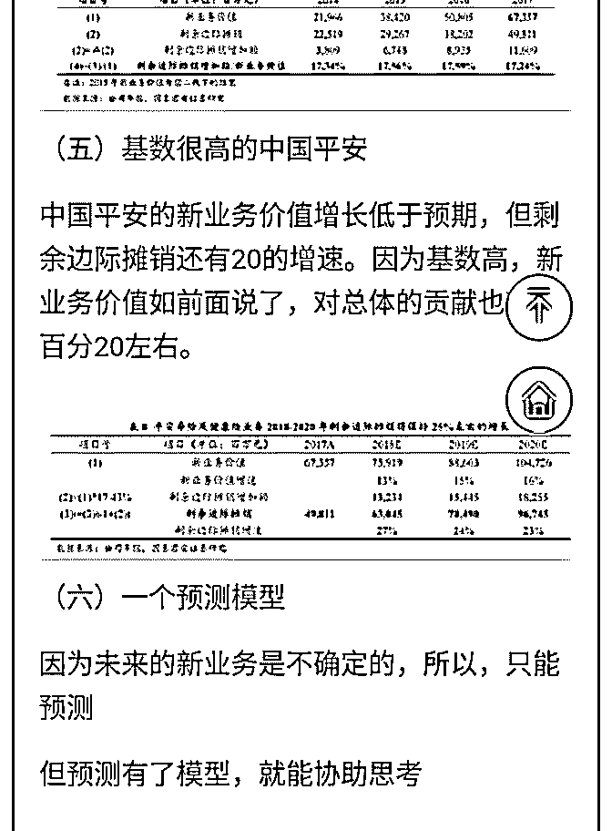
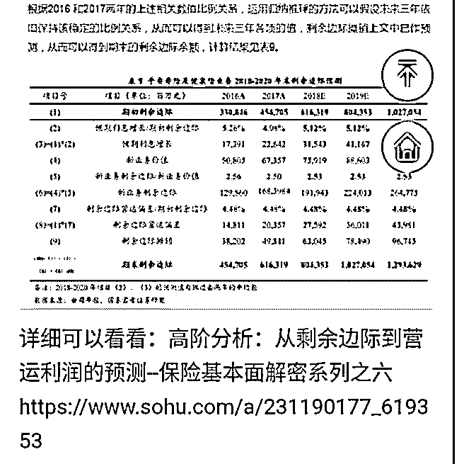

# 白菜闲聊保险 15：

流水白菜 : 白菜闲聊保险 15：新单停滞，但保险公司运营利润 依旧高增，原因何在？

如果我们能大体预测一家公司的未来利润，那么，这家公司 值多少钱，就好估算了。保险公司未来的利润，我们主要去 预测运营利润。运营利润，主要是保单能释放的利润。

由于保单，大部分是存量保单，一部分是新保单。因此，短 期来说，新单的增速对总体利润增速影响非常有限。新单 好，可能利润增速达到 25-30；新单差，利润增速可能还有 20 以上。但长期来说，如果利润增速的趋势是向下的，就有一 天，运营利润会停滞增长。（当然，目前看来不会）。 目前新业务价值慢，利润增速高，是因为过去多年，保险公 司新业务价值非常快，积累了非常多的保单利润。

2019-09-02(13 赞)

评论区：

[流水白菜](https://www.sohu.com/a/231190177_619353) [:](https://www.sohu.com/a/231190177_619353) [详细可以看看：高阶分析：从剩余边际到营运利润的预测](https://www.sohu.com/a/231190177_619353)[--](https://www.sohu.com/a/231190177_619353)[保险基本面解密系列之六](https://www.sohu.com/a/231190177_619353) [重磅深度！【国君非银刘](https://www.sohu.com/a/231190177_619353)

[欣琦团队】高阶分析：从剩余边际到营运利润的预测](https://www.sohu.com/a/231190177_619353)[--](https://www.sohu.com/a/231190177_619353)[保险基本面解密系列之六](https://www.sohu.com/a/231190177_619353)

， : 感觉息差和投资收益对利润影响不是很大，这样看来关注国债没太大意义

流水白菜 : 十年期国债，决定的是长期收益。保险的主要资产，买的是债券

小宏 : 我可以简单理解成一年、甚至两年的新单下滑，对利润影响不大，因为之前几年新单基数大，剩余边际基数小，进

水还是大于出水，但是如果 3-5 年新单都下滑，对利润影响就大了，因为剩余边际（储水池）基数已经很大了，而且出水已

经大于进水了

流水白菜 : 1-2 年影响不大。3-5 年利润增速明显慢下来，但入水依旧高于出水。因为现在是入水远高于出水

关注公众号"懒人找资源"，星球资源一站式服务