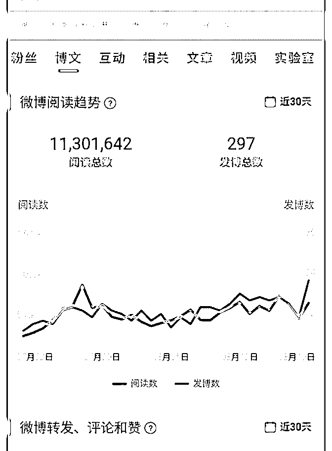
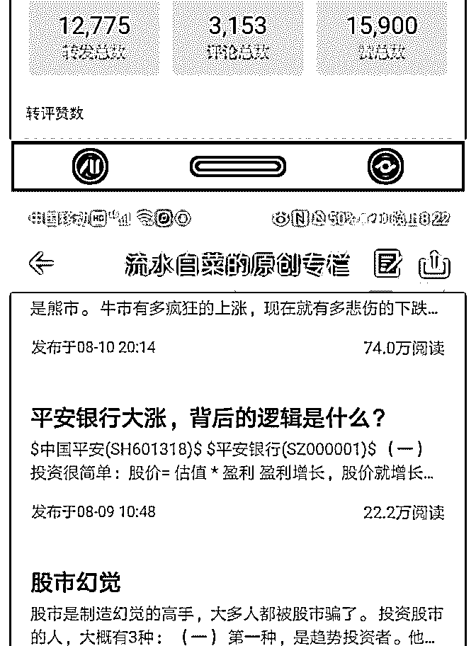
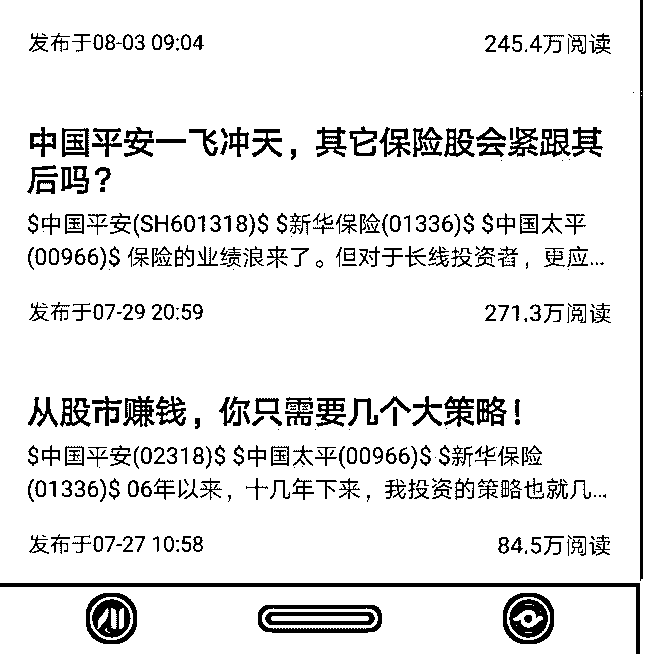

# 特别文章：寻找带来

流水白菜 : 特别文章：寻找带来丰厚回报的好公司

今天发了一条微博： 一个大学生毕业的时候，24 岁，月薪 1 万，还不错。如果每年 百分 20 的增速，那么，35 岁的时候，他的年薪就是百万了。 年增速百分 20，持续的时间长一点，就是这么厉害！

（一）预期 很多人觉得不能接受，非常超现实。觉得每年增长 20 完全逆 天。其实说逆天谈不上，现实中当然有这样的人，但大家觉 得，自己没有那个能力也没有那个运气。 但他们来到股市，觉得每年回报 20 算少的。因为以前我说 的，股市给他们制造了幻觉，以为股市赚钱很容易。因为天 天都有涨停的股票，因为媒体说有很多股神多利好。股市确 实有股神，巴菲特，巴菲特确实可以做到年 20，所以他有几 百亿。

（巴菲特的公司，40 年以前每股股价是 300 美元，目前每股股 价是 30 万美元，过去 40 年涨了 1000 倍，年均涨幅是 20%。他 有一句名言：“人生就是滚雪球，最重要的事是发现湿雪和长 长的山坡。”）

年复利 20，如果你的人生目标是几个亿几十个亿，那你确实 确实需要这个复利才好实现。

（二）好公司 这条微博，我想说的还有一点，好公司少之又少。中国平安 13-17 年，新业务价值创造，5 年复利增长近百分 50。5 年增加 的，比这个大学生 10 年增加的，还要多！所以中国平安现在 便宜不便宜，答案很明显。一个人年薪百万，和他年收入 10

万，所有人给的评价肯定不一样。 如果你找到一家公司，未来十年，年复利增长百分 20。那 么，你很便宜的时候买入，只赚一倍钱就卖了。那叫糟蹋！ 超一流的公司，之占公司总是的百分 4。市场股票，百分 80 完 全没有投资价值！ 所以，芒格说：只要做好准备，在人生中抓住几个机会，迅 速地采取适当的行动，去做简单而合乎逻辑的事情，这辈子 的财富就会得到极大的增长。上面提到的这种机会很少，它 们通常会落在不断地寻找和等待、充满求知欲望而又热衷于 对各种不同的可能性作出分析的人头上。这样的机会来临之 后，如果获胜的几率极高，那么动用过去的谨慎和耐心得来 的资源，重重地压下赌注就可以了。 所以，在股市赚钱，往往需要三步，第一步，知道什么兔子 是肥兔子（算）第二步，在它的行动路线上，守株待兔。

（等）第三步，等它躺在你的脚下，捡起来走人。（闭环）

（三）我的努力方向 明天要去外面玩几天，过几天，就满星球第二个月，这篇文 章，算是星球第二个月的文章。 过去这个月，写的文章，和第一个月一样，数量多，质量也 还行。（我的标准还是保证每周三篇）在雪球上发了部分的 内容，有两篇点击超过 200 万。在微博上，也发了一些内容， 过去一个月，在微博的总点击达到 1100 万。微博刚做，没有 什么粉丝，所以特别不容易，内容也能自己有传播力才行。 因为这个 1100 万，微博也给了我一个金 V 的标记。根据微博的 报告，粉丝量达到 50 万或者月阅读达到 1000 万的大 V，所有的 也只有不到 6 万人。 大 V 很容易做的，因为开星球，雪球不让说，我只好开了微 博。开微博两个月不到，就做大 V 了。所以大 V 说的，其实最 多就参考。毕竟，很容易做。只要花时间。

（四）

但衡量文章好坏的，我的标准，不纯粹是上面这两条。写文 章，目标是为了能对投资有帮助。我的标准，有两个： 1.对研究的公司，是否能较为准确的业绩趋势把握。2.股市剧 烈波动，不断的产生机会，是否能不迷惑，不犯大错。

保险公司，今年中报总体都很好，出一家中报，我们分析一 家。因为减税，上半年牛市，所以中期业绩都很好。因为政 策支持，中国有最大的市场，加上中国经济处于中高速发展 周期，所以保险公司长期来说，负债成本较低，投资收益不 错，杠杠率较高，税收低。所以 中低估值下，价格会不断波 动向上。（行业 3-5 年平均 ROE15。上文说了，好公司很少， 比较好的公司其实也不多。） 平安银行，我认为长期 ROE 会向上，这点讨论过了。

（五） 这篇文章，就以我微博的一段话结尾吧：

投资中国平安，期间，无论平安有多少次暴跌，但股价持续 大幅上涨。原因很简单，我刚投资平安的时候，每年利润 200 亿。18 年，它利润 1000 亿。利润增加百分 500，股价增加 500，这就是股市的天理。保险股最近下跌，但我不担心，因 为有天理。盈利在快速增长，股价就随时爆发 。

投资，对我来说，就是算公司未来的盈利。因为股市，是有 天理的地方。

2019-08-20(30 赞)

评论区：

金牛双子星 : 白菜老师，平常业余时间您都读的什么书？关于投资，您主要从哪里学习的？谢谢！

流水白菜 : 平常我什么书都看，当然，投资大师的书也是重点。投资，我最多的阅读是券商的研究报告，不看结论，看数

据等信息，看分析框架

点点.成 : 我的感觉，多数券商报告有个毛病，基本上说好的，不利的或风险，往往一笔带过，不知对否？

流水白菜 : 对。所以不看结论。看数据，看逻辑，自己判断

关注公众号"懒人找资源"，星球资源一站式服务