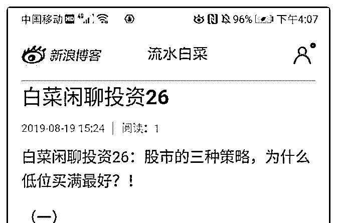
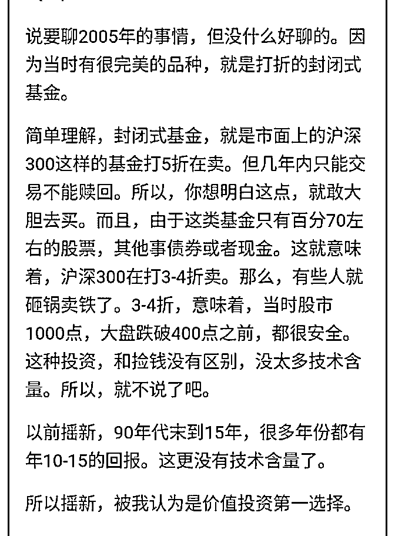
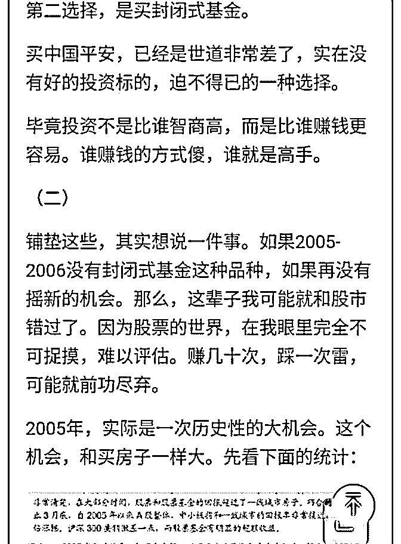
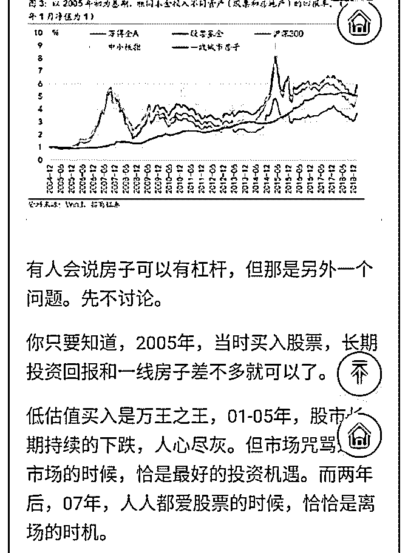
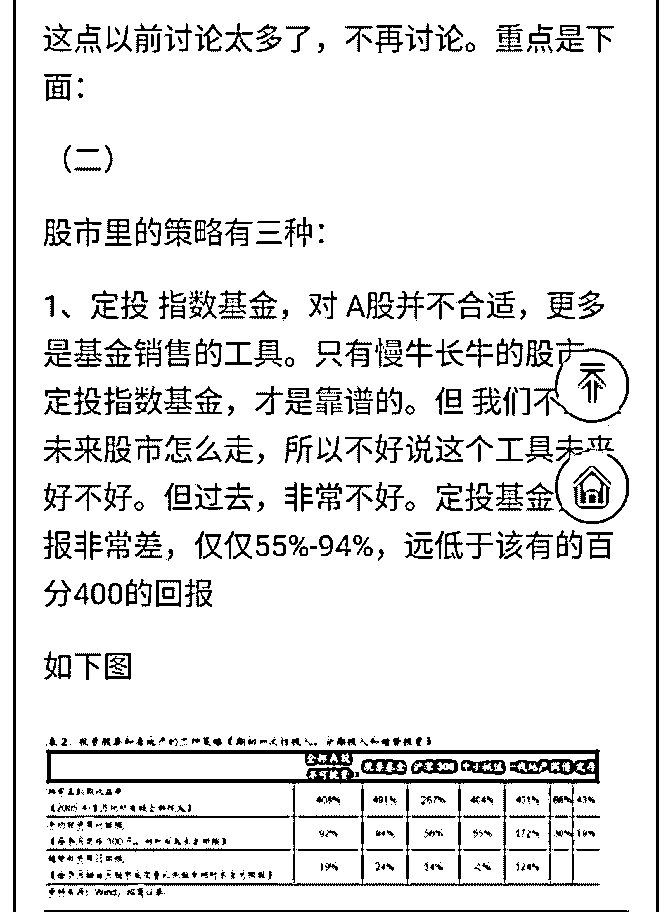
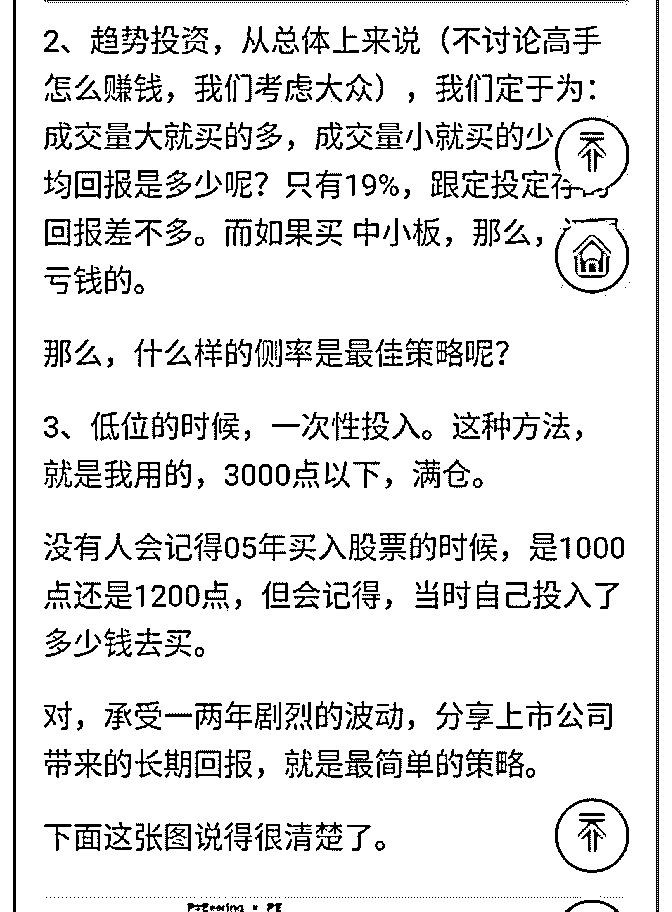
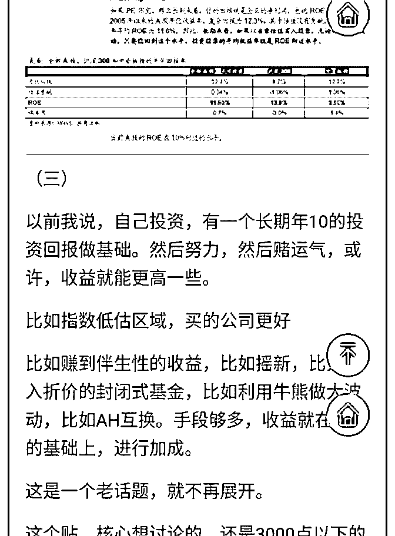
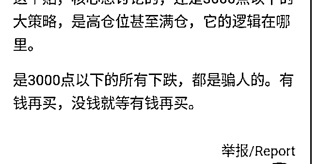

# 白菜闲聊投资 26：

流水白菜 : 白菜闲聊投资 26：股市的三种策略，为什么低位买 满最好？！

文章的概要（详见后面的图文）： 股市里的策略有三种：

1、定投 指数基金，对 A 股并不合适，更多是基金销售的工 具。只有慢牛长牛的股市，定投指数基金，才是靠谱的。但 我们不知道未来股市怎么走，所以不好说这个工具未来好不 好。但过去，非常不好。定投基金，回报非常差，仅仅 55%- 94%，远低于该有的百分 400 的回报

2、趋势投资，从总体上来说（不讨论高手怎么赚钱，我们考 虑大众），我们定于为：成交量大就买的多，成交量小就买 的少，平均回报是多少呢？只有 19%，跟定投定存的回报差 不多。而如果买 中小板，那么，还是亏钱的。

那么，什么样的侧率是最佳策略呢？

3、低位的时候，一次性投入。这种方法，就是我用的，3000 点以下，满仓。 没有人会记得 05 年买入股票的时候，是 1000 点还是 1200 点， 但会记得，当时自己投入了多少钱去买。 对，承受一两年剧烈的波动，分享上市公司带来的长期回 报，就是最简单最赚钱的策略。

以前我说，自己投资，有一个长期年 10 的投资回报做基础。 然后努力，然后赌运气，或许，收益就能更高一些。

比如指数低估区域，买的公司更好 比如赚到伴生性的收益，比如摇新，比如买入折价的封闭式 基金，比如利用牛熊做大波动，比如 AH 互换。手段够多，收 益就在 10 的基础上，进行加成。

还是老办法，看图文结合的版本

2019-08-19(16 赞)

评论区：

茶杯 : 白菜老师你自己投资回报预期是百分之 10？但看你的文章和能力，你最近十年的投资回报率是多少？[呲牙][呲牙][呲

牙]，我感觉应该在百分之二十五以上。。。

Pippo : 不要拍脑袋，年化收益是指全部资产的年化加权高手 12%。25%那都要就是 8 倍收益。进进出出任何一笔单子加仓

都会影响年化 不是股票涨了 30%你收益就是 30%。中国平安这么多翻倍持有者是自己净资产买入平安年化也才 13.55%。[微

笑]因为有钱就买有钱就买，年化会持续降低。

茶杯 : 我怎么理解的不一样，我的意思是如果白菜老师十年前开始买股票，投资 1000 万，然后股票的钱一直不拿出来，有空

仓，有买封闭基金，有打新收益，然后到现在总市值 现金有一个亿了，那就是年化百分之 26，我感觉老师达不到所以就

说百分之 25。。。我自己如果算 5 年本金来算也是百分之 25 左右，因为十年前还没买股票。。。

茶杯 : 看懂了，我们的意思是一样的，平安保险最近十年分红在买入应该达到吧。。。

Pippo : 俩码事 现实中你的净资产没有新进入而已。股市巴菲特每年百亿资金主要进入管理，空仓也要记入年化收益。

所以他的杠杆率提升到很高才弥补没用的钱。也才 17.68%

茶杯 : 这样算只能算用于投资股票的钱的时间价值，不能算自己的净资产，因为股票大跌的时候，又遇到估值特别低估的

股票就加大力度。如果遇到大涨，或者买的同类型的公司严重高估或者比同行估值高多的时候就换仓，我以前主要持有银

行。但保险我感觉优秀的公司给与更高的估值也很合理，但太高估后还是选择低估值的，股票市场我感觉便宜才是最重要

的道理。。。

宇辉 : 做股票确实很难，只能当是理财产品，然后通过努力慢慢增加收益

A 和小伙伴都惊呆了 : 已经买了百分之一百二十了

关注公众号"懒人找资源"，星球资源一站式服务