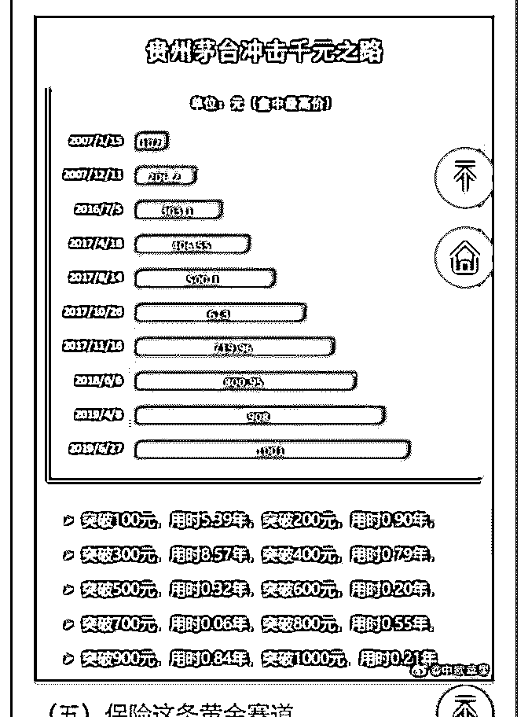

# 白菜闲聊保险 14：

流水白菜 : 白菜闲聊保险 14：保险，这条黄金赛道！

（一）恋爱的赛道 两个人，A 很普通，大学读的是一所文科院校，班上男生少， 满校都是女生； B 很优秀，就读理工科大学，但整个系只有 10 个女生。 A 的学校女生的基础比率高达 90%， 而 B 的学校女生的基础比率只有 10%。 所以，A 虽然普通，但比优秀的 B 找到漂亮女友的概率更高

（二）向上的电梯 麦肯锡一项研究，超过 70%的公司，是随着行业趋势的上升 而上升。 行业和区域是决定公司利润的两个最重要的因素，一家公司 在行业和区域的利润曲线上下移动，涨跌空间不超过 25%。 选择行业就像选择坐电梯还是爬楼梯，只要你坐上去了，大 概率就是随着电梯上上下下。 （上面的数据和例子，来自于 老喻的文章，我把他简化了一下。）

（三）选择比努力更重要 选择比努力更重要，其实有两个含义。 第一，你成功了，不是你很厉害，而是这个行业，高手不 来，你努力一下就能成功。厉害的人，在高度竞争的领域， 需要的不仅仅是努力，还包括天分，还包括运气。第二，你 的厉害，是眼光上的厉害，在战略成层面上的，你看到了风 口，看到了大趋势。你的厉害，是超越了努力，天分，以及 运气的。所以，选择比努力更重要。选择也比天分更重要。 甚至，选择比运气更重要。

（四）股市是个好赛道 做投资，我们主要选择股票，就是因为股市的这个赛道，明 显优于债券，黄金。 瑞士信贷银行每年更新的《全球投资回报年鉴》2018 版的统 计说明：美国股票从 1900—2017 年的长期收益率是每年 9.6%。 中国过去二十几年，用代表整个 A 股市场所有公司的 万得全 A 指数，然后从 1994 年底计算到 2019 年初，指数从 380 点左右增长到了 3400 点左右，算下来的年化收益率是—— 9.5%，和美股几乎一样。

（四）二八定律 但我们知道，股市这个地方很特殊，就是指数的增长，都是 有少数行业，百分 20 的公司，来贡献的。比如过去 10 年，买 白酒股的，大概率赚大钱。而买黄酒的，虽然历史更悠久， 品牌更响亮，库存的酒价值与日俱增，但回报，不如买银行 理财。投资 股票，是要选择赛道的。有些行业，你会发现特 别容易做。不需要太多天分。

（五）保险这条黄金赛道 过去这些年，保险行业的重大利好，就包括了：投资放开， 代理人资格放宽，今年，是税收大减免 这说明，保险在顶层设计上，有绿灯权。绿灯很多，行业自 然就能健康发展。行业健康发展，自然就能解决很多社会的 问题。

（六）减税有多厉害？

选择保险 2019 年中期，由于上半年股市上涨，以及减税，平

安的报表非常好看。但这个贴，我们不再讨论，利润这个指

标。因为短期扰动的指标，意义不大。比如平安寿险，今年

中期利润增 106%，这个指标也就是一次性的好看，其运营非

年化 ROE21.9 这个指标就更有价值。因为今年高，明年还会

高。 这个高，核心原因，就是商业模式利润高。 减税，我们

可以不关注一次性税收少了 86 个亿。 但我们要注意到，永久性的，未来的税收，寿险的都只有 12%左右，远远低于原先的 25%左右。这意味着什么，在原先 的高 ROA，高 ROE 的基础上，未来更高的 ROA，ROE。

产险的运营利润，也大增了百分 70。而加上一次性税收减 免，是百分 100。这百分 70 的大增，才是我们关注的。

（下面的是博客版本的，有图。最后的部分，和 13 的内容一 样）

2019-08-18(31 赞)

关注公众号"懒人找资源"，星球资源一站式服务