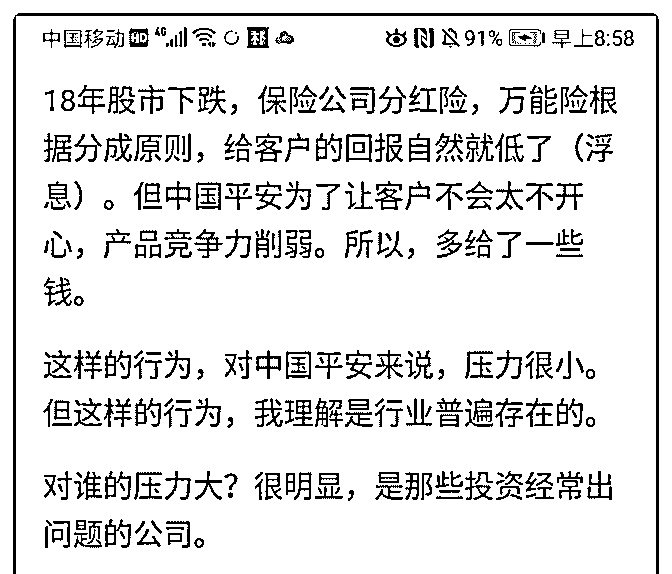
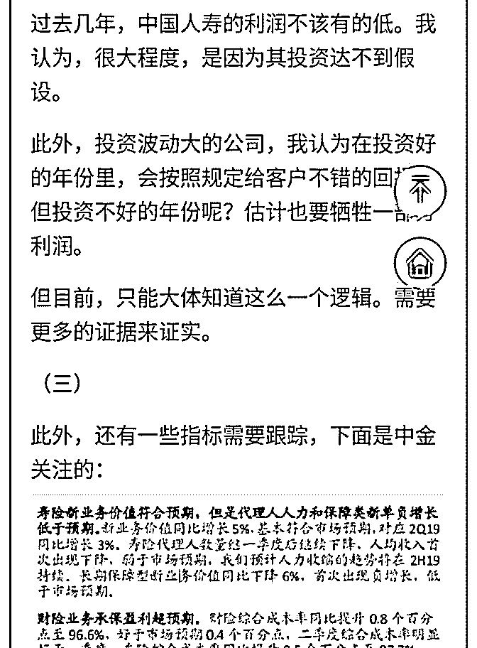
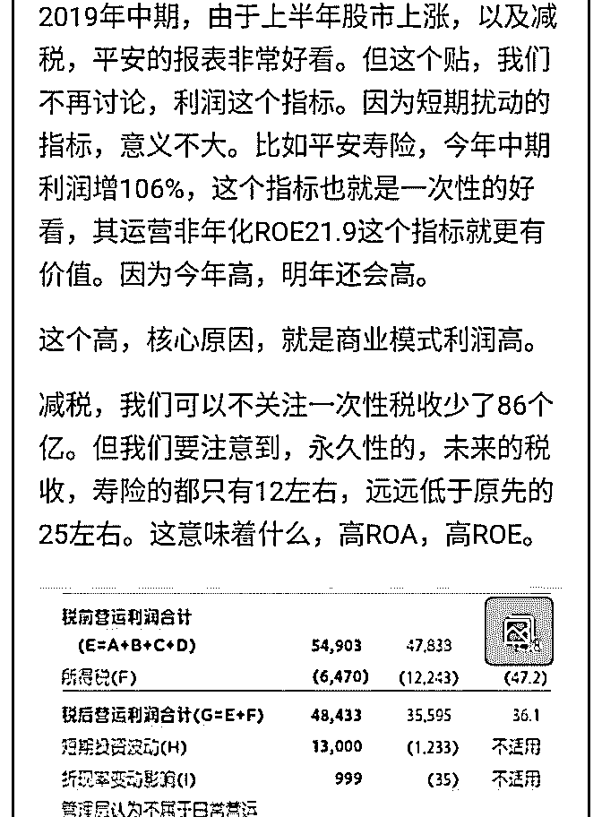
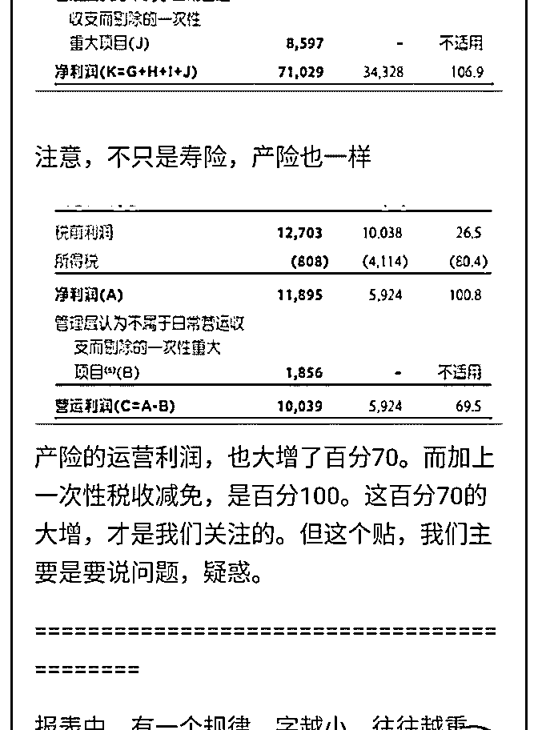
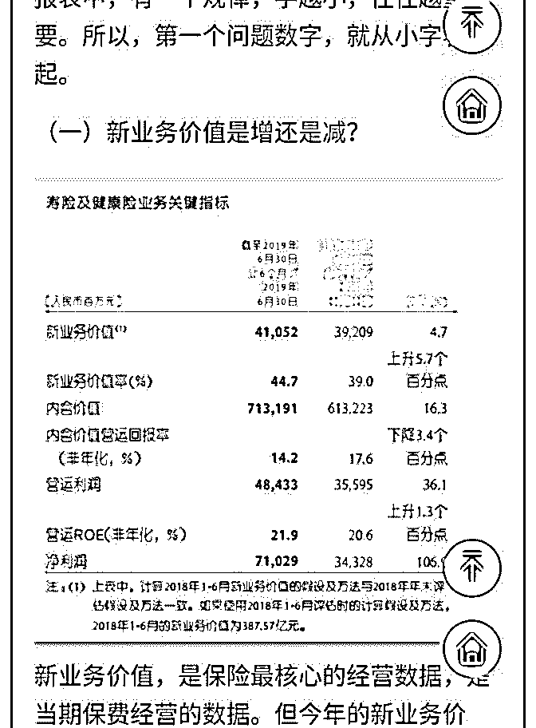
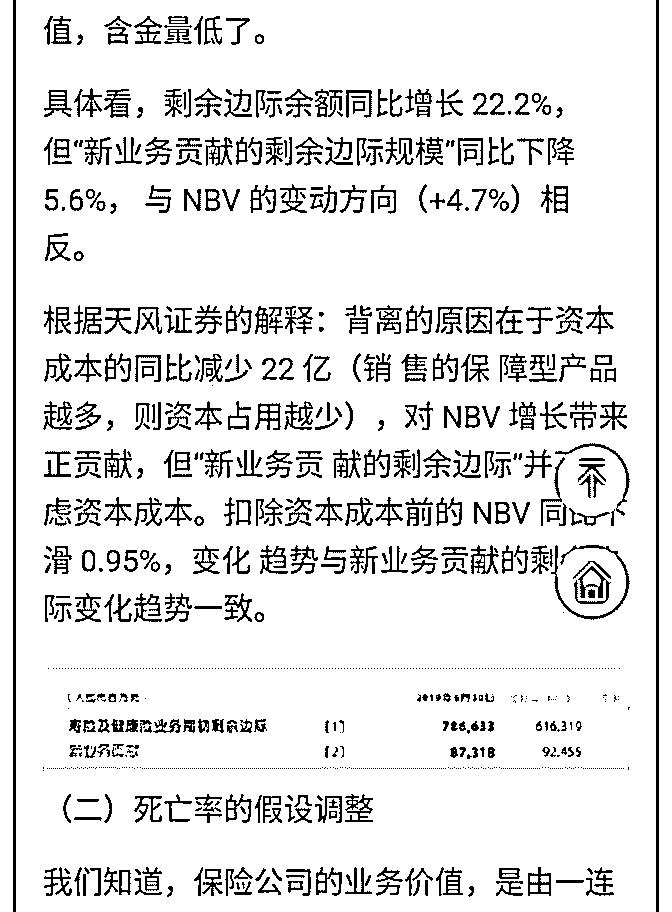
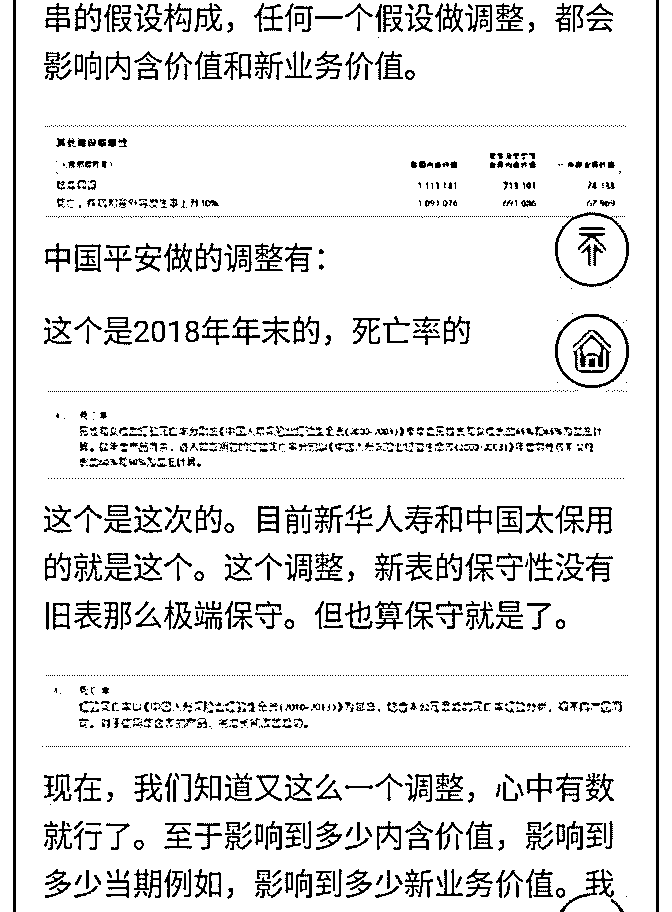
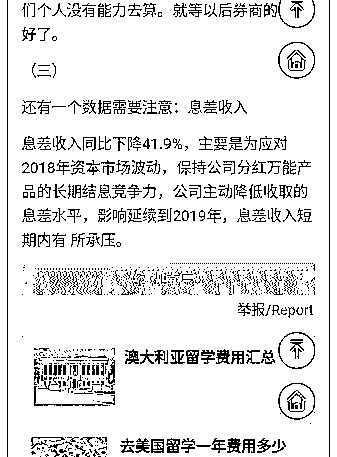
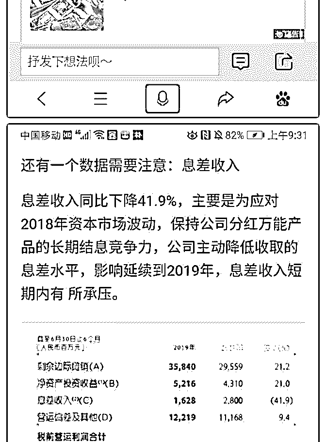
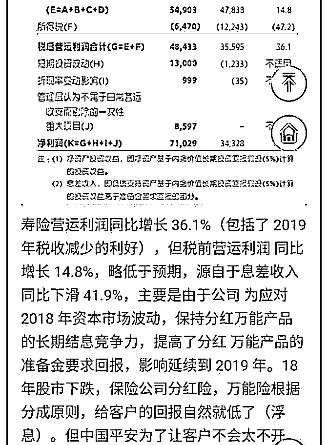

# 白菜聊保险 13：中

流水白菜 : 白菜聊保险 13：中国平安中报的几个关注点

19 年中期，由于上半年股市上涨，以及减税，平安的报表非 常好看。但这个贴，我们不再讨论，利润这个指标。因为短 期扰动的指标，意义不大。比如平安寿险，今年中期利润增 106%，这个指标也就是一次性的好看，其运营非年化 ROE21.9 这个指标就更有价值。因为今年高，明年还会高。

这个高，核心原因，就是商业模式利润高。 减税，我们可以不关注一次性税收少了 86 个亿。但我们要注 意到，永久性的，未来的税收，寿险的都只有 12 左右，远远 低于原先的 25 左右。这意味着什么，高 ROA，高 ROE。产险 的运营利润，也大增了百分 70。而加上一次性税收减免，是 百分 100。这百分 70 的大增，才是我们关注的。但这个贴，我 们主要是要说问题，疑惑。

===========================================

报表中，有一个规律，字越小，往往越重要。所以，第一个 问题数字，就从小字看起。

（一）新业务价值，含金量低于去年？

（二）死亡率的假设调整！

（三）息差收入？

总体看，保险的保费增速，上半年依旧处于调整期，需要跟 踪观察。同时，投资收益差的年份，分红险万能险占比高的 公司，（尤其是银保渠道获得的保单）可能其内含价值的实 现，要打折扣。这点也需要我们跟踪。但一白遮百丑，保险

是好赛道。政策大利好不断，从放开保险投资端，到放开代 理人资格，到大减税。顶层设计，非常利于行业健康发展

一些表格，星球不方便，我就先用博客排版了下（博客我设 私密了，外面看不到）

2019-08-18(9 赞)

评论区：

流水白菜 : 这篇文章（息差）的部分我也还不是搞得太明白。但那个地方会有一些问题，先写出来，有问题想清楚我再改

超 : 关于新业务价值这一块您理解错误了。今年中报采用的假设是 2018 年底的假设，用 2018 年底的假设计算 2018 年 1-6 月的新

业务价值是 392 亿，如果用 2018 年 1-6 月的假设来计算新业务价值那 2018 年 1-6 月的新业务价值就是 387 亿

超 : 所以应该是 2018 年底就已经调整了假设，而且无论假设有没有调整，今年上半年的新业务价值都是正的

超 : 并不是说采用 2018 年 1-6 月的假设，今年的新业务价值就变为 387 亿

流水白菜 : 嗯，这个内容我也还没想清楚。因为按照中报说，是根据 18 年底的来算。但 19 年中生命表又做了调整，这个不知

道数据对应到哪里了。这个等想明白再看。但 18 年中，相同口径，新业务同比是降的，这点是可以确定的

超 : 没错，但是今年同比已经转为正增长

流水白菜 : 嗯。你是对的。文字的意思是，2108 年的数据，已经根据年底的评估方法调整过了。所以，还是增长的

超 : 在这里也要感谢前辈，前辈是我在保险股的领路人

关注公众号"懒人找资源"，星球资源一站式服务