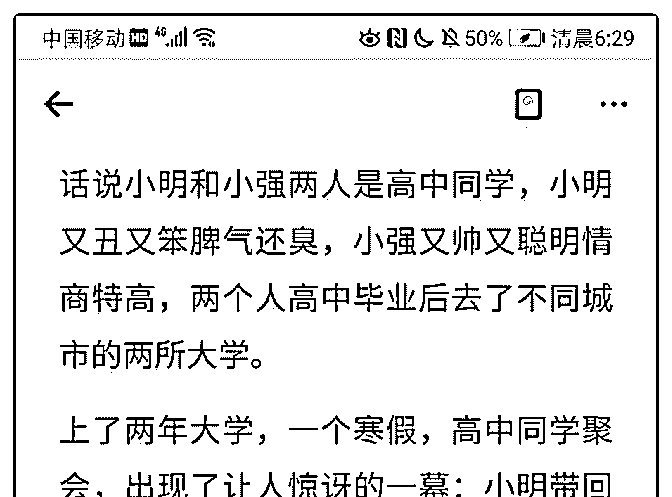
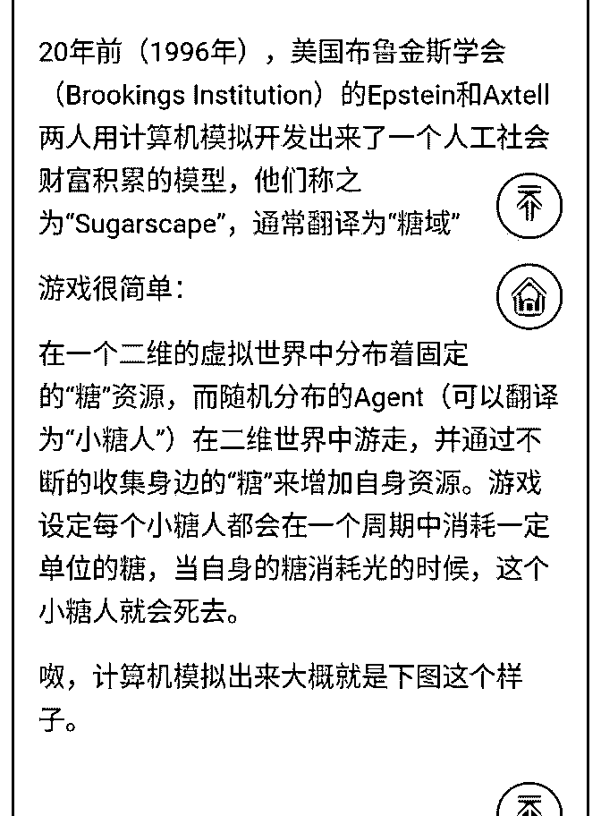
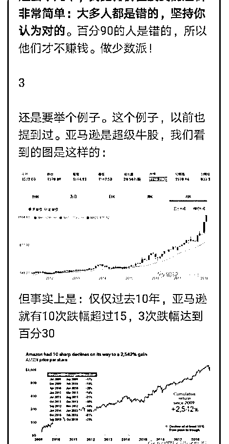
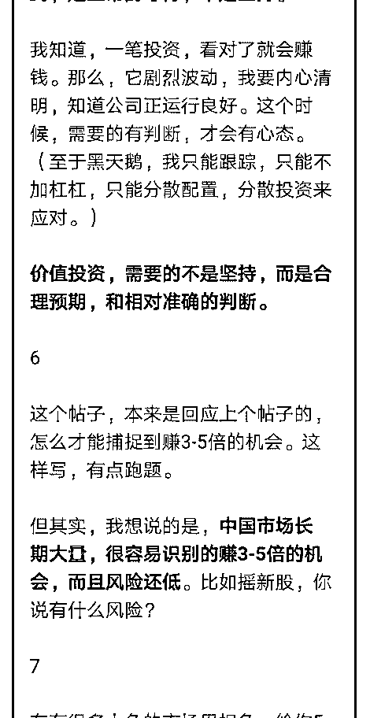
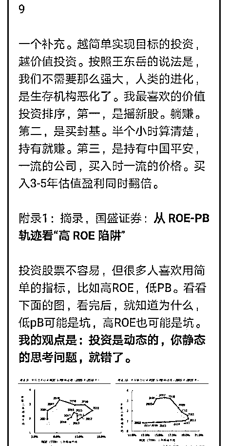

# 三篇文章，后两面篇

流水白菜 : 三篇文章，后两面篇文章是我写的，说的是一个意 思。到有鱼的地方钓鱼。

2019-08-18(16 赞)

评论区：

风林火山 : 跟着老师到有鱼的地方去钓鱼。

茶杯 : 感觉做投资还是要考虑理性和概率的问题，市场百分之 80 的人是很不理性的，他们连市盈率市净率是什么都不知

道，但他们可以研究技术分析，他们持有的股票市盈率 80 倍，也不知道哪个公司是靠什么赚钱，每股收益好多，未来发展

会怎么样。但他们会感觉根据技术分析会涨的，他们总感觉一年百分之 15 的收益很低，总想着在垃圾股里赚几个点然后在

换一支垃圾股。他们感觉买卖一次千分之 2 的手续费可以和百分之 5 的收益无法比，但常识是他们一年可以交易 100 次，然后

收益百分之 20 没有了。我在证券公司开洗脑大会认识的几个人都是这样买股票的，买股票十多年但基本不赚钱，还在坚持

的几个人。理性的人应该是看那些已经成功的人的书，巴菲特，芒格，彼得林奇，还有中国很多优秀的私募经理，还有像

白菜老师这种知识丰富，理智的人。这些人都在不断学习，都感觉自己能力圈有限，做一些自己很有把握的事情，但感觉

都还是不能很确定能不能赚钱。每年收益百分之 20 都很满足，如果长期达到百分之 15 也可以，喜欢买低估的股票，喜欢买

基本面好的股票，喜欢买成长股，最重要的是喜欢自己能力圈里的股票，然后通过三五年在来看看这支股票。我这种观点

的意思就是要在鱼塘里抓鱼，去看看抓到大鱼的人怎么抓的，他们在哪个鱼塘抓，不要去和那些在游泳池里抓鱼的人，哪

里人多在游泳但哪里基本没鱼啊。。。感觉做投资理性最重要，但又最难。。。[呲牙][呲牙][呲牙]

黄小刚 : 经过老师几次发这个理念，今天终于悟道了，明白了。克服人性，总以为自己能找到黑马，感恩！调整自己的仓

位[抱拳]

宇辉 : 讲得不错，投资是不简单的事

关注公众号"懒人找资源"，星球资源一站式服务