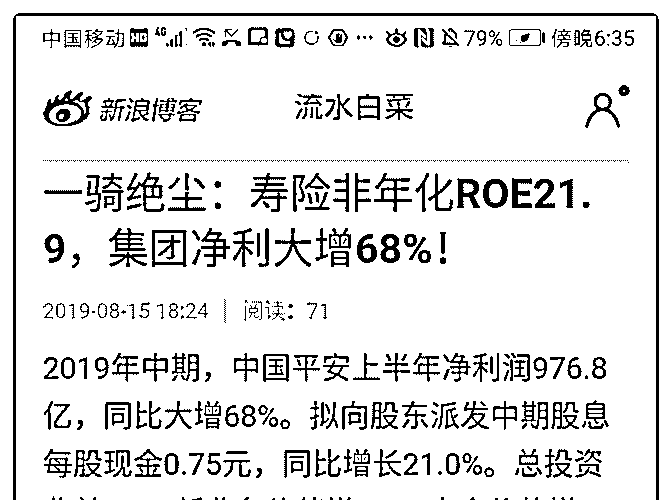
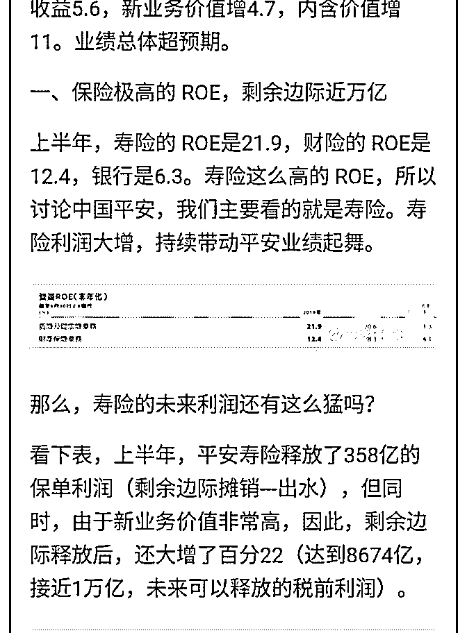
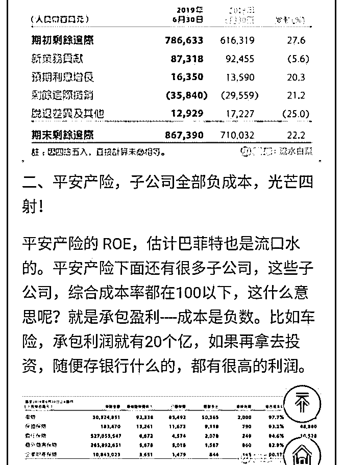
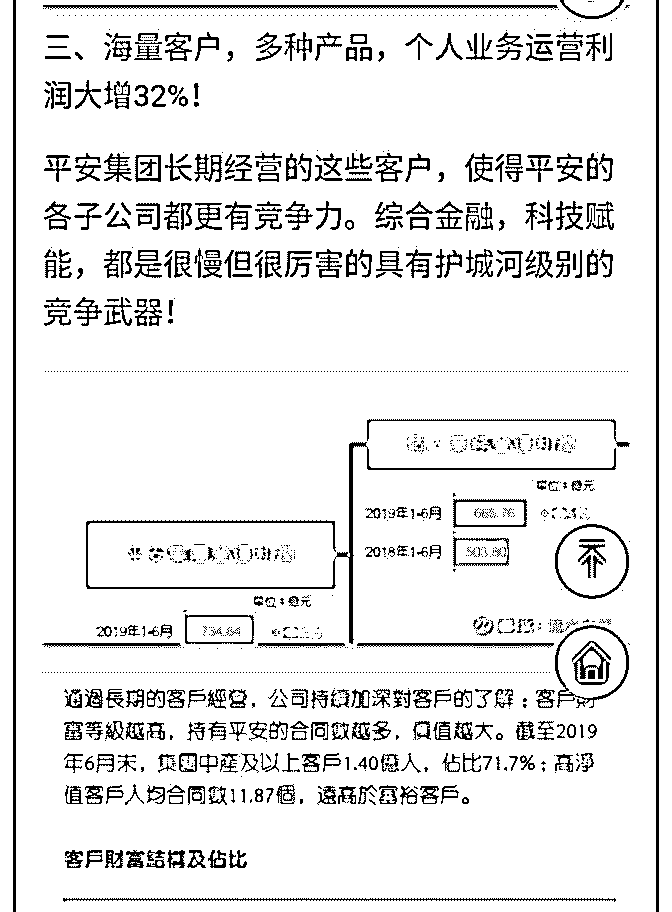
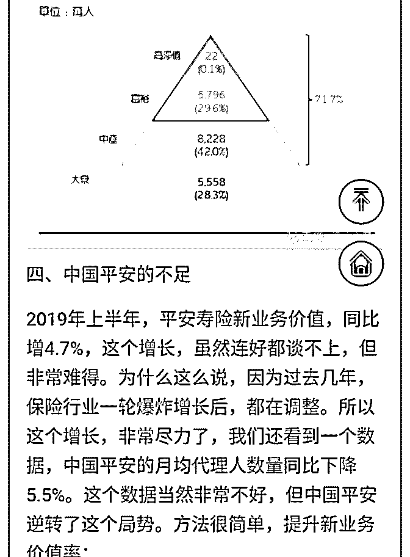
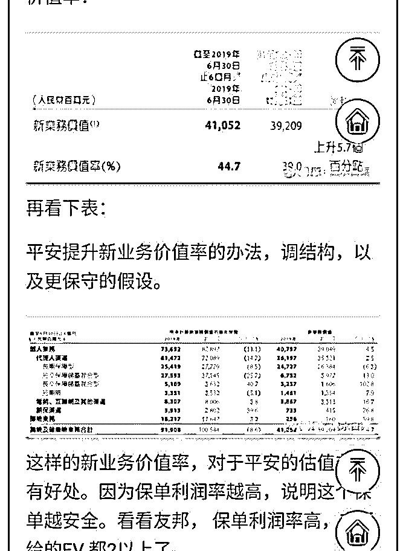
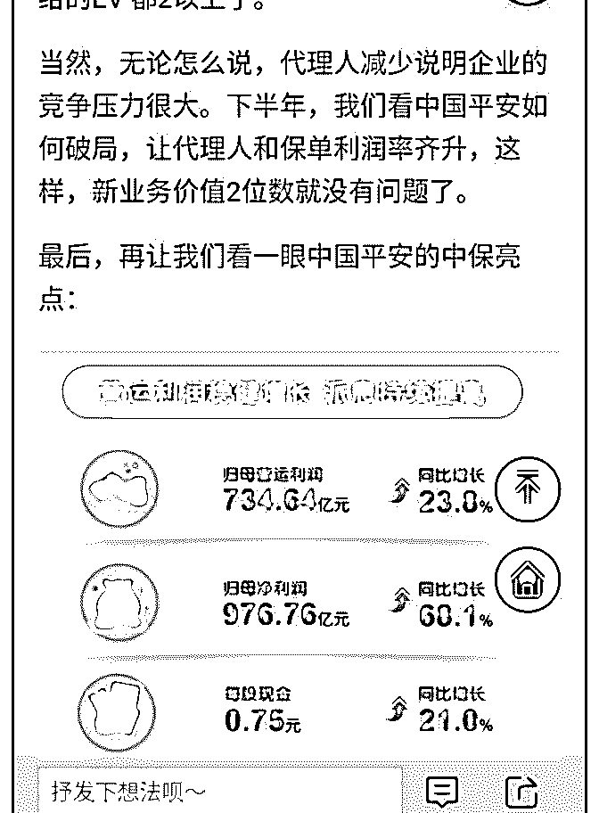

# 中国平安的中报不错

流水白菜 : 中国平安的中报不错，原先很多人担心业绩不到 50，但达到了 68，超预期。此外，新业务价值增长达到机构 预测比较高的数值 4.7，原因一是调结构，二是我认为部分保 单涨价（这点分析我没写）。平安的互联网企业盈利不如去 年，目前看不太清楚。但平安的核心是保险。科技本身少赚 点钱，可以给传统金融公司赋能

2019-08-15(14 赞)

评论区：

Zhenli : 请问那个政策减税的，有在利润中提现吗？

李腾 : 有，100 个亿左右，看扣非净利润。

流水白菜 : 潜龙兄的分析我也放这里

fanco : 为什么分红比例不跟着业绩，这样是不是分红比例下降了啊

流水白菜 : 分红跟运营利润，运营利润大概每年增百分 20

流水白菜 : 这个是大家都预期到的

Zhenli : [抱拳]

关注公众号"懒人找资源"，星球资源一站式服务