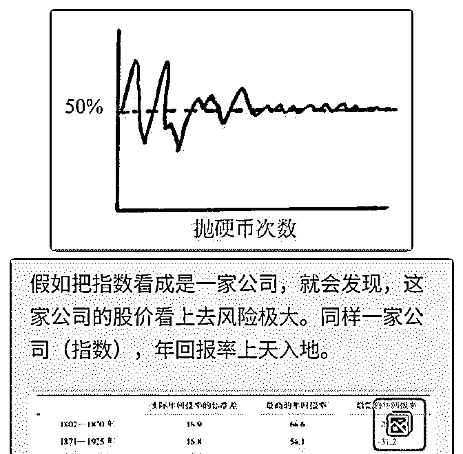
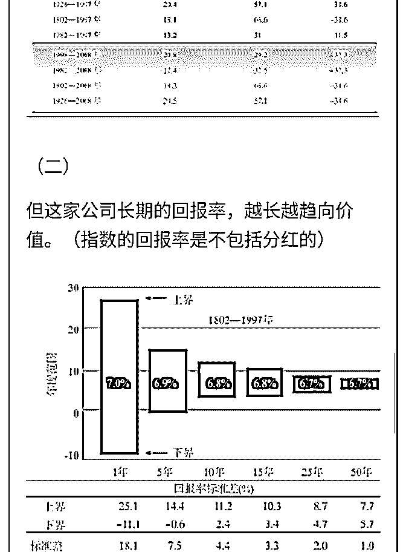

# 白菜闲聊投资 25：

流水白菜 : 白菜闲聊投资 25：高风险的股市，我们怎么守到价 值回归

我们常说：价格短期是投票机，长期是称重器。短期容易理 解，比如股民喜欢成长股的时候，成长股就涨得快。喜欢价 值股的时候，价值股就回报更多。但长期呢。长期由企业的 盈利决定。

（一）均值回归

有些人喜欢大盘股，有些人喜欢小盘 股；有些人喜欢价值 股，有些人喜欢成长股；有些人喜欢本国的股票，有些人喜 欢国外的。。。。但无论选择什么，其实总体来说，相差并 不大。以美国股市为例：

1937—1968 年间明显是赢家。价值型股票上的投资只相当于 在成长型股票上等量初始投资的 62%。 价值型股票从 1976 年开始有明显复苏，几乎正好补偿了之前 的所有损失（最近的历史表明，在截至 1997 年的 60 年时间 中，只用了 8 年就创造了价值型股票的传奇）。 从 1980 年开始，成长型股票的表现胜过价值型股票，从 1997 年开始，价值型股票又重新占据了优势。 当我们把 60 年来所有这些周期性的波动都连接起来，在价值 型股票中的最终投资大约是成长型股票的 9/10。在整个 60 年 间，总的复合回报率是：成长型，11.7%；价值型，11.5%， 仅有微小的差别。这正好是一个平局，也是均值回复的另一 明证。

（二）轮动策略

由于有均值回归，也就有轮动策略。 轮动，是一个有诱惑的策略。因为意味着大幅提高盈利的可 能。早年，有人做封机轮动多赚了不少钱。我认为这个策略 是好的策略。因为封基是基金，基金买入的是一篮子股票， 同时策略差不多。同时封机中，有百分 40 左右是存银行买债 券。每个月轮动一次，买入折价最高的封基，成功的概率很 高。

过去几年，有人做银行股的轮动。这个思路，我并不认同。 理由有二：一是银行的经营，趋势是从同质化走向差异化： 二是在境外成熟市场，银行股的估值差两三倍是常态。有人 甚至依靠过去的经验，做空目前较高估值的银行，同时做多 较低银行的估值。这是一个可怕的策略，只看盈利而忽视风 险的策略。

轮动策略，是必须建立在价值判断的基础。通过轮动，买入 价格偏离的。很多操作因为偏离了价值，看不清价值，也就 变成盲动。那么，价格如何回归价值，我们看一个实验：

（三）大数定律 有一个概率游戏很有意思：抛 10 枚硬币，正面朝上的比例范 围是 30%~90%；抛 100 枚，比例范围就缩小了，变为了 40%~60%；抛 1000 枚，比例范围就缩小 46.2%~53.7%。越来 越接近 50%。那是不是有一种神秘力量，让结果不断逼近 50% 呢？其实这靠的是，大数对小数的稀释作用。大数定律不会 对已经发生的情况进行平衡，而是利用新的数据去削弱它的 影响力，直到前面的数据从结果上看，影响力非常小，可以 忽略不计。

（四）股市风险 上面这个老喻讨论概率举的例子，让我想到股市。股市的短 期也是完全无法预测，买入后可能大赚，也可能大亏。最

终，会价值回归。 但回归，并不容易，一是可能股价会过山车。二是，你可能 判断对了。所以，我们能做的，是尽量对。然后在这个基础 上，再谈情绪管理。

附图： 图一，概率回归 图二，股市价格回归 2019-08-14(23 赞)

关注公众号"懒人找资源"，星球资源一站式服务

# 2017，2018

流水白菜 : 2017，2018 两年的中国平安开放日解析。花点时间 看，看懂了，就基本懂了

2017 平安寿险

2018[平安寿 险](http://static.sse.com.cn/disclosure/listedinfo/announcement/c/2017-11-20/601318_20171120_3.pdf)[`static.sse.com.cn/disclosure/listedinfo/announcement/c/2017-`](http://static.sse.com.cn/disclosure/listedinfo/announcement/c/2017-11-20/601318_20171120_3.pdf)

[11-20/601318_20171120_3.pdf](http://static.sse.com.cn/disclosure/listedinfo/announcement/c/2017-11-20/601318_20171120_3.pdf)

[`static.sse.com.cn/disclosure/listedinfo/announcement/c/2018-`](http://static.sse.com.cn/disclosure/listedinfo/announcement/c/2018-10-12/601318_20181012_4.pdf)

[10-12/601318_20181012_4.pdf](http://static.sse.com.cn/disclosure/listedinfo/announcement/c/2018-10-12/601318_20181012_4.pdf)

2019-08-13(15 赞)

关注公众号"懒人找资源"，星球资源一站式服务