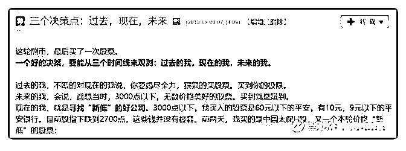

# 白菜谈投资 23：平

流水白菜 : 白菜谈投资 23：平安银行新高

今天平安银行新高了，在 2800 点，真没想到。过去一个多 月，谈过几次投资平安银行的逻辑。今天不谈。我们谈投资 本身。

（一） 首先谈银行股。银行股总体低估，这个结论不会有问题。过 去 5 年，银行股年均回报高达惊人的年 15。那么，回到 5 年 前，你会怎样决策，确保吃到这块大肥肉。 第一，你有识别能力，比如你买了招行，那就赚翻了。如果 买工行建行，其实也行。提工行建行，是因为很多人为了摇 新，买这种有国家信用，高 ROE，分红高的股票。所以，加 上摇新，买银行股，年回报 20 个点，也是有机会。操作上， 不需要操作。 第二，很多人说银行股看不清，银行股如果有问题很可怕。 那么，买银行股指数基金。看不清不是银行股不便宜，看不 清也能赚钱。

（二） 投资银行股，要获得更好的收益，方法就是挑选。有跑赢总 体银行股的，就有很多必然跑输。 股市的逻辑一直是这样。长期来说，股票市场上，最多也就 是百分 20 的股票，会跑赢银行理财产品。只有百分 5 以内的股 票，是指数增长的主要贡献者。大多股票，是来市场打酱油 的，给有钱有闲人娱乐的，不值得投资者关注。 银行股，总体回报不错，是因为总体估值一直处于很低的位 置上。但我们投资银行股，千万不要觉得银行股差不多。 差多了！

（三） 有人肯定会说，保险股和保险股，公司之间，也差多了。但 新华 H 和中国太平 H，估值只有中国平安的三分之一，而且， 保险公司目前很安全。 其它银行 0.85PB，招行 1.7PB。这个比值是否合适，不好说。 要具体分析。但招行前几年和其他银行估值一样。那么，那 个时候，看到招行的不一样，就算眼光。 平安银行是否会不一样，现在说还太早。但投资，一个思 路，就是要能找出看起来一样其实不一样的公司。

（四） 我说股市 3000 点以下，市场极度低估，便宜得不可理解，不 是指所有的股票。每次 3000 点以下，我就一定不能接受自己 不努力，寻找那些跌出来的好机会。生怕一些股票的价格再 也不见！我的博客里，记录了我去年 2700 点买入的逻辑 ，我 附录在文章后。 为什么 3000 点以下呢，因为市场跌的时候，那些看起来一 样，实际上不一样的公司，会出现极佳的买点。

（五） 但市场是市场。最后再重复说一次，平安银行，我持有两年 了。这是我第三次见到 15 元好像。如果我判断对了，我这个 赚钱的经历，也是一波三折。同时，也还被套过。套住的时 候，我只能说，公司不错，值得买入持有。也许，低位买了 还是被套，而且，被套的时间，也许不止一周，不止一月， 甚至不止一年。

投资不简单。 选股很难 一路持有

还会经历风霜雨雪

2019-08-12(17 赞)

评论区：

吴孔兴 : 请教一下关于平安银行，简单估计一下其净资产每年增长百分之 15，这样 5 年大约增长一倍，现在净资产大约为

13.5，一倍的话大概是 27。若能达到招行的估值，大约按 1.5 倍净资产，则估值可以达到约 40 元每股。能评价一下这样的计

算思路吗？谢谢

流水白菜 : 那也是 5 年后 40

吴孔兴 : 当然是 5 年后啊。不是现在

流水白菜 : ROE15 很难。现在也就 12。

吴孔兴 : 因为这是我目前计算平安银行的投资收益率的大概估计

流水白菜 : 按照 ROE12 算会比较好。预期，一般要比较保守

吴孔兴 : 若净资产收益率达不到百分之十五，还算优秀吗？特别是拥有如此多的优质资源

吴孔兴 : 你能大致计算一下 5 年后的价值吗？这 2 个变量：复合增长率、净资产倍数？原因是什么？谢谢

关注公众号"懒人找资源"，星球资源一站式服务